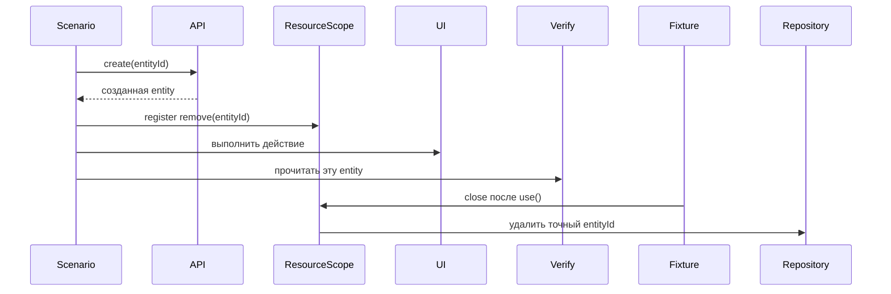

# Жизненный цикл данных в сценариях между слоями

## Связь с предыдущей главой

Глава 246 назначила области жизни clients и resources. Теперь нужно определить владельца данных, которые создаёт сам тестовый сценарий.

## Цель главы

Провести одну entity через создание, действие, проверку и cleanup, сохранив единый идентификатор и одного владельца удаления.

## Главный вопрос

> Как одна test entity проходит создание, использование, проверку и cleanup через разные слои?

## Мотивация

Cross-layer test часто падает не из-за продукта, а из-за неопределённого владения: API создаёт запись, UI изменяет её, repository удаляет слишком широкий набор, а повторный запуск видит residue.

## Теория

Сценарий заранее формирует уникальный идентификатор, но право на cleanup появляется только после успешного создания entity. Setup выполняется через самый прямой подходящий слой, действие — через слой, поведение которого проверяется, а проверка — на минимально необходимой границе. API, gRPC и database не должны подтверждать один и тот же факт без отдельной цели.

Cleanup регистрируется сразу после успешного создания owned entity. Если создание не состоялось, недействительный cleanup не планируется. Ресурсы обычно удаляются в порядке, обратном их созданию. Если setup завершился частично, уже созданные ресурсы всё равно очищаются. Исходная ошибка сценария сохраняется, а ошибки cleanup остаются наблюдаемыми и не заменяют её молча.

## Внутренний механизм



Один идентификатор связывает операции разных слоёв. Владелец cleanup знает точный ID, но не удаляет чужие данные и не очищает всё пространство имён. Идемпотентность повторного удаления является решением конкретного adapter, а не универсальным правилом для любого внешнего ресурса.

## Главная ментальная модель

Одна entity имеет один идентификатор и одного владельца cleanup; разные слои только наблюдают или изменяют её в пределах сценария.

## Практический пример

```text
examples/03-automation-qa/chapter-247/01-cross-layer-data-lifecycle.integration.ts
```

Локальный API adapter создаёт task, UI adapter закрывает её, а gRPC и database adapters подтверждают состояние. Cleanup регистрируется после успешного создания на точный ID, а ошибка повторного создания сохраняется как `cause` исходной ошибки.

## Automation QA

API setup обычно быстрее UI setup. Database verification полезна для эффекта, который не виден через публичный contract, но не должна заменять пользовательскую проверку. Один тест не обязан задействовать все слои framework.

## Компромиссы

Cross-layer scenario даёт уверенность в интеграции, но дороже и сложнее локализуется. Большую часть правил лучше проверять на ближайшем слое, оставляя межслойным тестам только критические потоки.

## Распространённые ошибки

- Регистрировать cleanup только в конце успешного теста.
- Удалять все записи с общим prefix.
- Создавать данные через UI без необходимости.
- Сравнивать transport shapes без normalization.
- Скрывать cleanup failure в `catch`.

## Краткие итоги

- Единый идентификатор связывает entity между слоями.
- Cleanup owner назначается сразу после создания.
- Verification выбирается по цели, а не по числу доступных clients.
- Исходная ошибка и ошибки cleanup должны оставаться видимыми.

## Практика

Практика встроена из соответствующего файла главы.

## Переход к следующей главе

Lifecycle данных определён. Глава 248 встроит связанную диагностику в local, parallel и CI execution без изменения результата теста.
