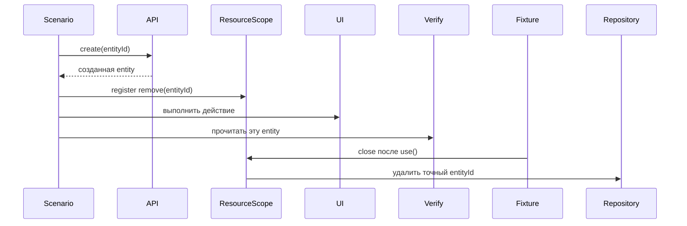

# Жизненный цикл данных в сценариях между слоями

## Связь с предыдущей главой

Глава 246 назначила области жизни clients и resources. Теперь нужно определить владельца данных, которые создаёт сам тестовый сценарий.

## Цель главы

Провести одну entity через создание, действие, проверку и cleanup, сохранив единый идентификатор и одного владельца удаления.

## Главный вопрос

> Как одна test entity проходит создание, использование, проверку и cleanup через разные слои?

## Мотивация

Cross-layer test часто падает не из-за продукта, а из-за неопределённого владения: API создаёт запись, UI изменяет её, repository удаляет слишком широкий набор, а повторный запуск видит residue.

## Теория

### Один идентификатор, один владелец

Одна entity имеет один идентификатор и одного владельца cleanup; разные слои только наблюдают или изменяют её в пределах сценария.

Сценарий заранее формирует уникальный идентификатор — по правилам из главы 220, с признаками проекта, worker и локальной последовательности. Но право на cleanup появляется только после успешного создания entity.

Это различие тонкое и важное. Идентификатор известен до вызова; обязательство убрать данные возникает после того, как сервер подтвердил создание. Регистрация очистки заранее приведёт к попытке удалить несуществующую запись и замаскирует исходную ошибку новым падением.



### Каждый слой используется по назначению

Правило распределения простое и состоит из трёх частей:

| Этап | Через какой слой |
| --- | --- |
| setup | самый прямой подходящий |
| действие | тот, поведение которого проверяется |
| проверка | минимально необходимая граница |

API setup обычно быстрее UI setup — и это единственная причина его предпочитать, когда создание не является предметом проверки.

API, gRPC и database не должны подтверждать один и тот же факт без отдельной цели. Тройная проверка одного значения не повышает уверенность: она лишь утраивает число мест, которые сломаются при изменении контракта.

Database verification полезна для эффекта, который не виден через публичный contract, но не должна заменять пользовательскую проверку. Один тест не обязан задействовать все слои framework.

### Регистрация очистки и порядок удаления

Cleanup регистрируется сразу после успешного создания owned entity. Если создание не состоялось, недействительный cleanup не планируется.

Ресурсы обычно удаляются в порядке, обратном их созданию — как стек из главы 221. Если setup завершился частично, уже созданные ресурсы всё равно очищаются: неудача на третьем шаге не отменяет обязательств по первым двум.

### Очистка знает точный идентификатор

Владелец cleanup знает точный ID, но не удаляет чужие данные и не очищает всё пространство имён.

Второе ограничение стоит проговорить: соблазн «удалю всё, что начинается с префикса теста» выглядит надёжнее точечного удаления, но при параллельном запуске префиксы соседних сценариев могут пересечься, а после смены схемы именования — удалить лишнее.

Идемпотентность повторного удаления является решением конкретного adapter, а не универсальным правилом для любого внешнего ресурса. `DELETE ... WHERE id = $1` идемпотентен по результату; вызов внешнего сервиса может вернуть ошибку на повторе — и adapter решает, считать это нормальным исходом или нет.

### Ошибки сценария и ошибки очистки

Исходная ошибка сценария сохраняется, а ошибки cleanup остаются наблюдаемыми и не заменяют её молча.

Для связанных причин удобна цепочка `cause`: ошибка повторного создания сохраняется как причина исходной, и расследование читает её сверху вниз — от симптома к механизму, как в главе 225. Глубину цепочки ограничивают, о чём говорилось в главе 226.

### Цена межслойного сценария

Cross-layer scenario даёт уверенность в интеграции, но дороже и сложнее локализуется: падение может произойти в любом из слоёв, и область расследования шире.

Большую часть правил лучше проверять на ближайшем слое, оставляя межслойным тестам только критические потоки. Практический ориентир — такие сценарии единичны и описывают ключевые бизнес-пути, а не повторяют на трёх слоях то, что уже проверено на одном.

## Внутренний механизм


Один идентификатор связывает операции разных слоёв. Владелец cleanup знает точный ID, но не удаляет чужие данные и не очищает всё пространство имён. Идемпотентность повторного удаления является решением конкретного adapter, а не универсальным правилом для любого внешнего ресурса.

## Главная ментальная модель

Одна entity имеет один идентификатор и одного владельца cleanup; разные слои только наблюдают или изменяют её в пределах сценария.

## Практический пример

```text
examples/03-automation-qa/chapter-247/01-cross-layer-data-lifecycle.integration.ts
```

Локальный API adapter создаёт task, UI adapter закрывает её, а gRPC и database adapters подтверждают состояние. Cleanup регистрируется после успешного создания на точный ID, а ошибка повторного создания сохраняется как `cause` исходной ошибки.

## Automation QA

API setup обычно быстрее UI setup. Database verification полезна для эффекта, который не виден через публичный contract, но не должна заменять пользовательскую проверку. Один тест не обязан задействовать все слои framework.

## Компромиссы

Cross-layer scenario даёт уверенность в интеграции, но дороже и сложнее локализуется. Большую часть правил лучше проверять на ближайшем слое, оставляя межслойным тестам только критические потоки.

## Распространённые мифы

**Миф: очистку можно зарегистрировать сразу после формирования идентификатора.**
Право на очистку возникает после подтверждённого создания. Иначе падение в подготовке заслонится ошибкой удаления несуществующей записи.

**Миф: чем больше слоёв подтверждает факт, тем надёжнее.**
Тройная проверка утраивает число мест, ломающихся при изменении контракта, не добавляя уверенности.

**Миф: удалить всё по префиксу безопаснее точечного удаления.**
Префиксы соседних сценариев могут пересечься, а смена схемы именования удалит лишнее.

**Миф: повторное удаление всегда безопасно.**
Для строки в базе — да; для внешнего сервиса это решение конкретного adapter.

**Миф: при частичной неудаче подготовки очищать нечего.**
Уже созданные ресурсы остаются обязательством независимо от того, где остановилась подготовка.

## Частые вопросы

**Через какой слой готовить данные?**
Через самый прямой подходящий — обычно API, если создание не является предметом проверки.

**Когда проверка в базе оправдана?**
Когда эффект не виден через публичный контракт. Заменять ею пользовательскую проверку нельзя.

**Как связать операции разных слоёв?**
Одним идентификатором сущности: он и связывает, и определяет, что именно удалять.

**Где хранится исходная ошибка при связанных сбоях?**
Она остаётся основной, а связанные причины присоединяются через `cause`.

**Сколько межслойных сценариев держать в наборе?**
Единицы — только критические потоки. Остальное проверяется на ближайшем слое.

## Проверьте себя

1. Почему идентификатор известен раньше, чем возникает право на очистку?
2. Какие три этапа сценария и какой слой подходит каждому?
3. Почему удаление по префиксу опаснее точечного?
4. Что делать, если подготовка завершилась частично?
5. Чем межслойный сценарий платит за уверенность в интеграции?

## Распространённые ошибки

- Регистрировать cleanup только в конце успешного теста.
- Удалять все записи с общим prefix.
- Создавать данные через UI без необходимости.
- Сравнивать transport shapes без normalization.
- Скрывать cleanup failure в `catch`.

## Краткие итоги

- Единый идентификатор связывает entity между слоями.
- Cleanup owner назначается сразу после создания.
- Verification выбирается по цели, а не по числу доступных clients.
- Исходная ошибка и ошибки cleanup должны оставаться видимыми.

## Практика

Практика встроена из соответствующего файла главы.

## Переход к следующей главе

Lifecycle данных определён. Глава 248 встроит связанную диагностику в local, parallel и CI execution без изменения результата теста.
