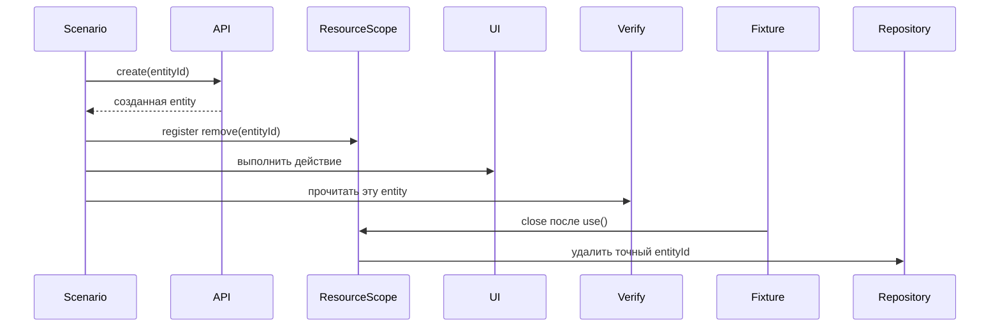

# Жизненный цикл данных в сценариях между слоями

## Связь с предыдущей главой

Глава 246 назначила области жизни clients и resources. Теперь нужно определить владельца данных, которые создаёт сам тестовый сценарий.

## Цель главы

Провести одну entity через создание, действие, проверку и cleanup, сохранив единый идентификатор и одного владельца удаления.

## Главный вопрос

> Как одна тестовая сущность проходит создание, использование, проверку и очистку через разные слои?

## Мотивация

Cross-layer test часто падает не из-за продукта, а из-за неопределённого владения: API создаёт запись, UI изменяет её, repository удаляет слишком широкий набор, а повторный запуск видит residue.

## Теория

### Один идентификатор, один владелец

Одна сущность имеет один идентификатор и одного владельца очистки; разные слои только наблюдают или изменяют её в пределах сценария.

Сценарий заранее формирует уникальный идентификатор — по правилам из главы 220, с признаками проекта, рабочего процесса и локальной последовательности. Но право на очистку появляется только после успешного создания сущности.

Это различие тонкое и важное. Идентификатор известен до вызова; обязательство убрать данные возникает после того, как сервер подтвердил создание. Регистрация очистки заранее приведёт к попытке удалить несуществующую запись и замаскирует исходную ошибку новым падением.


```mermaid
sequenceDiagram
    participant Scenario
    participant API
    participant Scope as ResourceScope
    participant UI
    participant Verify
    participant Fixture
    participant Repository
    Scenario->>API: create(entityId)
    API-->>Scenario: созданная entity
    Scenario->>Scope: register remove(entityId)
    Scenario->>UI: выполнить действие
    Scenario->>Verify: прочитать эту entity
    Fixture->>Scope: close после use()
    Scope->>Repository: удалить точный entityId
```

### Каждый слой используется по назначению

Правило распределения простое и состоит из трёх частей:

| Этап | Через какой слой |
| --- | --- |
| подготовка | самый прямой подходящий |
| действие | тот, поведение которого проверяется |
| проверка | минимально необходимая граница |

Подготовка через API обычно быстрее подготовки через интерфейс — и это единственная причина её предпочитать, когда создание не является предметом проверки.

API, gRPC и база данных не должны подтверждать один и тот же факт без отдельной цели. Тройная проверка одного значения не повышает уверенность: она лишь утраивает число мест, которые сломаются при изменении контракта.

Проверка в базе данных полезна для эффекта, который не виден через публичный контракт, но не должна заменять пользовательскую проверку. Один тест не обязан задействовать все слои фреймворка.

### Регистрация очистки и порядок удаления

Очистка регистрируется сразу после успешного создания принадлежащей тесту сущности. Если создание не состоялось, недействительная очистка не планируется.

Ресурсы обычно удаляются в порядке, обратном их созданию — как стек из главы 221. Если подготовка завершилась частично, уже созданные ресурсы всё равно очищаются: неудача на третьем шаге не отменяет обязательств по первым двум.

### Очистка знает точный идентификатор

Владелец очистки знает точный идентификатор, но не удаляет чужие данные и не очищает всё пространство имён.

Второе ограничение стоит проговорить: соблазн «удалю всё, что начинается с префикса теста» выглядит надёжнее точечного удаления, но при параллельном запуске префиксы соседних сценариев могут пересечься, а после смены схемы именования — удалить лишнее.

Идемпотентность повторного удаления является решением конкретного адаптера, а не универсальным правилом для любого внешнего ресурса. `DELETE ... WHERE id = $1` идемпотентен по результату; вызов внешнего сервиса может вернуть ошибку на повторе — и адаптер решает, считать это нормальным исходом или нет.

### Ошибки сценария и ошибки очистки

Исходная ошибка сценария сохраняется, а ошибки очистки остаются наблюдаемыми и не заменяют её молча.

Для связанных причин удобна цепочка `cause`: ошибка повторного создания сохраняется как причина исходной, и расследование читает её сверху вниз — от симптома к механизму, как в главе 225. Глубину цепочки ограничивают, о чём говорилось в главе 226.

### Цена межслойного сценария

Межслойный сценарий даёт уверенность в интеграции, но дороже и сложнее локализуется: падение может произойти в любом из слоёв, и область расследования шире.

Большую часть правил лучше проверять на ближайшем слое, оставляя межслойным тестам только критические потоки. Практический ориентир — такие сценарии единичны и описывают ключевые бизнес-пути, а не повторяют на трёх слоях то, что уже проверено на одном.

## Внутренний механизм


```mermaid
sequenceDiagram
    participant Scenario
    participant API
    participant Scope as ResourceScope
    participant UI
    participant Verify
    participant Fixture
    participant Repository
    Scenario->>API: create(entityId)
    API-->>Scenario: созданная entity
    Scenario->>Scope: register remove(entityId)
    Scenario->>UI: выполнить действие
    Scenario->>Verify: прочитать эту entity
    Fixture->>Scope: close после use()
    Scope->>Repository: удалить точный entityId
```

Один идентификатор связывает операции разных слоёв. Владелец очистки знает точный идентификатор, но не удаляет чужие данные и не очищает всё пространство имён. Идемпотентность повторного удаления является решением конкретного адаптера, а не универсальным правилом для любого внешнего ресурса.

### Один идентификатор проходит через все слои

```text
создание через API   → entityId
регистрация очистки  → удалить ИМЕННО этот entityId
действие в UI        → находим запись по этому же идентификатору
проверка в базе      → читаем строку по нему
очистка              → удаляем его, ничего кроме
```

Идентификатор — единственное, что связывает слои: клиентские состояния у них
разные, а серверные данные общие. Сопоставление по названию работает до первого
параллельного прогона.

### Очистка знает адрес, а не пространство имён

| Форма очистки | Что удалит |
| --- | --- |
| по точному идентификатору | только свою запись |
| по префиксу прогона | свои записи этого прогона |
| по общему префиксу проекта | **данные соседних прогонов** |

Третья строка — самая частая причина падений, причину которых ищут не в том
тесте: упадёт тот, чьи данные удалил кто-то другой.

### Идемпотентность повторного удаления — решение адаптера

```text
REST:     DELETE отсутствующего → 404 или 204, зависит от сервиса
база:     DELETE отсутствующей строки → rowCount: 0, ошибки нет
gRPC:     NOT_FOUND
```

Универсального правила нет, поэтому каждый адаптер сам решает, считать ли
отсутствие ресурса успехом очистки. Решение стоит записать явно: от него зависит,
падает ли освобождение ресурсов при повторном запуске.

## Главная ментальная модель

Одна сущность имеет один идентификатор и одного владельца очистки; разные слои только наблюдают или изменяют её в пределах сценария.

## Практический пример

```text
examples/03-automation-qa/chapter-247/01-cross-layer-data-lifecycle.integration.ts
```

Локальный адаптер API создаёт задачу, адаптер интерфейса закрывает её, а адаптеры gRPC и базы данных подтверждают состояние. Очистка регистрируется после успешного создания на точный идентификатор, а ошибка повторного создания сохраняется как `cause` исходной ошибки.

## Automation QA

Подготовка через API обычно быстрее подготовки через интерфейс. Проверка в базе данных полезна для эффекта, который не виден через публичный контракт, но не должна заменять пользовательскую проверку. Один тест не обязан задействовать все слои фреймворка.

## Компромиссы

Межслойный сценарий даёт уверенность в интеграции, но дороже и сложнее локализуется. Большую часть правил лучше проверять на ближайшем слое, оставляя межслойным тестам только критические потоки.

## Распространённые мифы

**Миф: очистку можно зарегистрировать сразу после формирования идентификатора.**
Право на очистку возникает после подтверждённого создания. Иначе падение в подготовке заслонится ошибкой удаления несуществующей записи.

**Миф: чем больше слоёв подтверждает факт, тем надёжнее.**
Тройная проверка утраивает число мест, ломающихся при изменении контракта, не добавляя уверенности.

**Миф: удалить всё по префиксу безопаснее точечного удаления.**
Префиксы соседних сценариев могут пересечься, а смена схемы именования удалит лишнее.

**Миф: повторное удаление всегда безопасно.**
Для строки в базе — да; для внешнего сервиса это решение конкретного адаптера.

**Миф: при частичной неудаче подготовки очищать нечего.**
Уже созданные ресурсы остаются обязательством независимо от того, где остановилась подготовка.

## Частые вопросы

**Через какой слой готовить данные?**
Через самый прямой подходящий — обычно API, если создание не является предметом проверки.

**Когда проверка в базе оправдана?**
Когда эффект не виден через публичный контракт. Заменять ею пользовательскую проверку нельзя.

**Как связать операции разных слоёв?**
Одним идентификатором сущности: он и связывает, и определяет, что именно удалять.

**Где хранится исходная ошибка при связанных сбоях?**
Она остаётся основной, а связанные причины присоединяются через `cause`.

**Сколько межслойных сценариев держать в наборе?**
Единицы — только критические потоки. Остальное проверяется на ближайшем слое.

## Проверьте себя

1. Почему идентификатор известен раньше, чем возникает право на очистку?
2. Какие три этапа сценария и какой слой подходит каждому?
3. Почему удаление по префиксу опаснее точечного?
4. Что делать, если подготовка завершилась частично?
5. Чем межслойный сценарий платит за уверенность в интеграции?

### Ответы

1. Идентификатор формируется до отправки запроса, а право на очистку появляется только после подтверждения создания. Между этими моментами ресурс может не возникнуть.
2. Подготовка — слой API или базы, действие — тот слой, который проверяется, проверка результата — тот слой, где результат виден пользователю или потребителю.
3. Префикс захватывает данные параллельных тестов и прошлых прогонов. Точечное удаление по идентификатору затрагивает только своё.
4. Удалить то, что уже создано, и сообщить об отказе подготовки как об ошибке, а не запускать тест на неполных данных.
5. Скоростью и хрупкостью: он зависит от нескольких слоёв сразу, поэтому падает чаще и разбирается дольше. Поэтому таких сценариев делают немного.

## Распространённые ошибки

- Регистрировать очистку только в конце успешного теста — упавший тест как раз и оставляет данные, а до конца тела он не доходит. Регистрируют сразу после создания.

- Удалять все записи с общим префиксом — под удаление попадают данные параллельных прогонов, и упадёт чужой тест. Признак владения включает идентификатор прогона.

- Создавать данные через UI без необходимости — подготовка становится медленной и зависит от вёрстки. Через интерфейс проверяют, а готовят данными слоя API или базы.

- Сравнивать транспортные представления без нормализации — REST отдаёт строку ISO, база `Date`, gRPC — своё представление по умолчанию. Сравнение выполняют после приведения к одной модели.

- Скрывать ошибку очистки в `catch` — проблема удаления перестаёт быть видимой, и стенд накапливает данные прогон за прогоном. Ошибку собирают и сообщают, не заменяя ею причину падения.

## Краткие итоги

- Единый идентификатор связывает сущность между слоями.
- Владелец очистки назначается сразу после создания.
- Способ проверки выбирается по цели, а не по числу доступных клиентов.
- Исходная ошибка и ошибки очистки должны оставаться видимыми.

## Практика

Практика встроена из соответствующего файла главы.

## Переход к следующей главе

Жизненный цикл данных определён. Глава 248 встроит связанную диагностику в локальное, параллельное выполнение и выполнение в CI без изменения результата теста.
