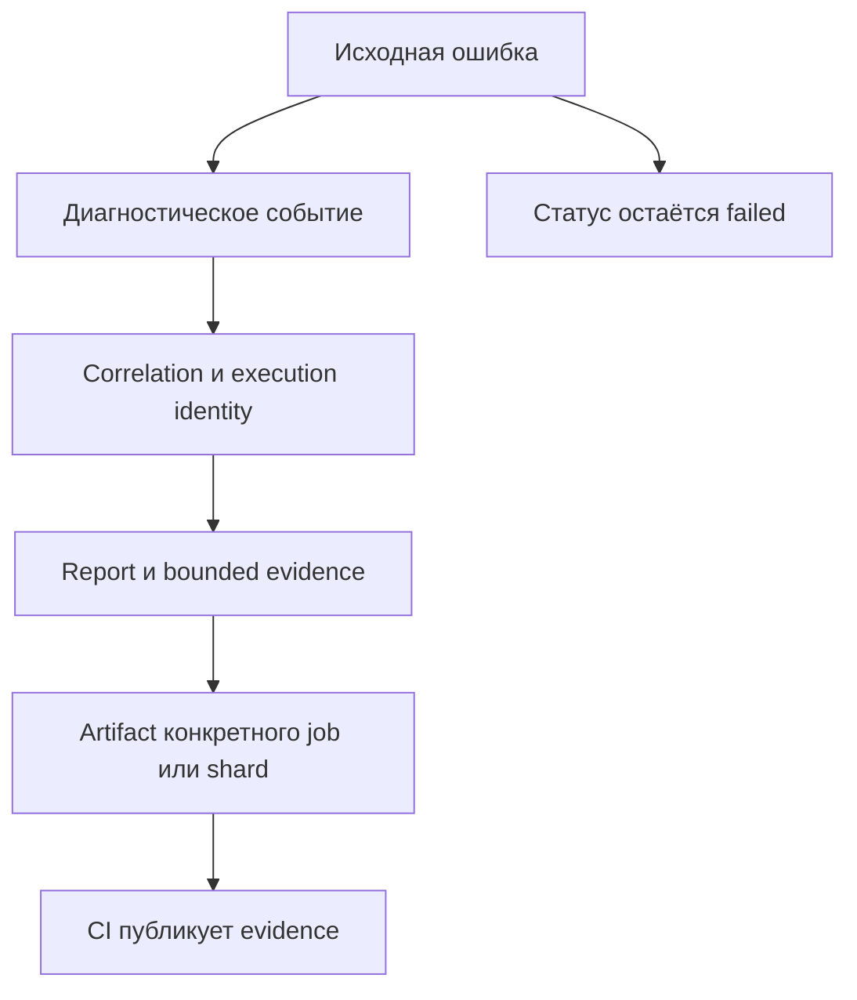

# Диагностика, стабильность и CI в общей архитектуре

## Связь с предыдущей главой

Глава 247 связала операции одной entity. При падении эту связь нужно сохранить в logs, runtime evidence и CI artifacts для конкретного worker и shard.

## Цель главы

Провести единый correlation ID через сценарий, diagnostics и execution metadata, сохранив исходный статус failed.

## Главный вопрос

> Как framework сохраняет диагностический сигнал при локальном, parallel и CI execution?

## Мотивация

Разрозненные logs без идентификатора нельзя связать с конкретным test attempt. Общий каталог artifacts создаёт конфликты между workers, а ошибка diagnostic sink может случайно заменить исходную ошибку.

## Теория

### Три вида идентичности

Их путают, а задачи у них разные:

| Идентичность | Что описывает | Пример составляющих |
| --- | --- | --- |
| execution | условия конкретного выполнения | project, shard, parallel index, worker, repeat, retry |
| domain | сущность предметной области | идентификатор созданной задачи |
| correlation | события одной попытки | идентификатор сценария |

Эти идентификаторы решают разные задачи и не должны заменять друг друга. Попытка использовать domain ID как correlation ID ломается сразу: один сценарий создаёт несколько сущностей, а correlation должен быть один. Обратная подмена ломается при retry: execution identity меняется, а сущность остаётся той же.

### Распределение выполнения не создаёт изоляцию

Workers и sharding помогают распределять выполнение, но сами по себе не создают изоляцию данных и не исправляют нарушения dependency flow.

Это итог линии, проходящей через главы 215, 238 и 244: параллельность — механизм распределения, а независимость данных обеспечивается уникальными пространствами имён. Увеличение числа workers на наборе с общими данными не ускоряет прогон, а превращает редкие конфликты в постоянные.

### Диагностика идёт рядом с ошибкой, а не вместо неё

Сценарий создаёт структурированное событие с безопасными полями. Ошибка распространяется по основному пути, а diagnostic sink получает безопасное представление отдельно.



Diagnostics сопровождает ошибку доказательствами, но не управляет её результатом и не заменяет assertion. Две границы, нарушение которых обесценивает всю схему:

- diagnostics **не превращает failed test в passed** — иначе доказательства собираются для дефекта, о котором никто не узнает;
- diagnostics **не объявляет повторный запуск исправлением** flaky behavior — повтор остаётся наблюдением, а не выводом.

Если diagnostics тоже падает, `AggregateError` сохраняет scenario error первой, а ошибку diagnostics — следующей. Порядок здесь не косметика: отчёт показывает первую ошибку как причину, и ею должна быть ошибка сценария.

### Ограниченные доказательства

Reporter и `testInfo.attach()` сохраняют ограниченный объём evidence без полного environment dump, secrets и лишних абсолютных путей.

Каждое из трёх исключений имеет причину. Полный дамп окружения почти всегда содержит лишнее и однажды — секрет. Абсолютные пути раскрывают структуру машины сборки и бесполезны при чтении отчёта с другой машины. Секреты не попадают в артефакты по правилам главы 243, и маскирование на уровне CI эти файлы не покрывает.

Больше контекста ускоряет расследование, но увеличивает объём и риск sensitive evidence. Поэтому payload ограничивается, поля редактируются, а retention остаётся конечным.

### Границы ответственности с CI

CI загружает каталог конкретного job или shard как artifact. Публикация report и artifact остаётся отдельной обязанностью CI и не переносится в сервис сценария.

Разделение простое: фреймворк производит сигналы и доказательства, CI их потребляет и публикует. CI потребляет сигналы framework, но не владеет внутренней orchestration policy — он не решает, сколько workers запускать и как распределять тесты.

Имя artifact указывает shard-владельца — без этого при sharding из главы 244 артефакты конфликтуют за одно имя.

### Одна модель для локального запуска и CI

Локальный запуск использует ту же модель идентификации, что parallel и CI.

Это требование делает расследование воспроизводимым: инженер, получивший красный прогон в CI, видит те же поля, что и у себя, и может сравнить их напрямую.

Расследование сравнивает commit, project, worker и environment до вывода о flaky test. Порядок именно такой: сначала убеждаемся, что сравниваем сопоставимые запуски, и только потом говорим о нестабильности. Тест, упавший в другом окружении и на другом commit, — не доказательство нестабильности, а другой запуск.

## Внутренний механизм


Ошибка распространяется по основному пути. Diagnostic sink получает безопасное представление отдельно. Если diagnostics тоже падает, `AggregateError` сохраняет scenario error первой, а ошибку diagnostics — следующей. Публикация report и artifact остаётся отдельной обязанностью CI и не переносится в сервис сценария.

## Главная ментальная модель

Diagnostics сопровождает ошибку доказательствами, но не управляет её результатом и не заменяет assertion.

## Практический пример

```text
examples/03-automation-qa/chapter-248/01-integrated-diagnostics.integration.ts
```

Повторное создание entity вызывает исходную ошибку, сервис добавляет `cause` и записывает redacted bounded event. Тест подтверждает, что secret отсутствует, а ошибка operation не была скрыта. Отдельная ветвь показывает порядок ошибок при одновременном падении scenario и diagnostic sink.

## Automation QA

Локальный запуск использует ту же модель идентификации, что parallel и CI. Имя artifact указывает shard-владельца, а расследование сравнивает commit, project, worker и environment до вывода о flaky test. CI потребляет сигналы framework, но не владеет внутренней orchestration policy.

## Компромиссы

Больше контекста ускоряет расследование, но увеличивает объём и риск sensitive evidence. Поэтому payload ограничивается, поля редактируются, а retention остаётся конечным.

## Распространённые мифы

**Миф: один идентификатор может служить всем целям.**
Domain ID не годится как correlation (сущностей несколько), correlation не заменяет execution identity (она меняется при retry).

**Миф: больше workers — быстрее прогон.**
На наборе с общими данными это превращает редкие конфликты в постоянные. Изоляцию даёт пространство имён.

**Миф: диагностика может смягчить результат.**
Она сопровождает ошибку доказательствами. Failed остаётся failed.

**Миф: успешный повтор — доказательство flaky-поведения.**
Это наблюдение. Вывод делается после сравнения commit, project, worker и окружения.

**Миф: полный дамп окружения — лучшее доказательство.**
Он содержит лишнее, раскрывает пути машины сборки и однажды приносит секрет в артефакт.

## Частые вопросы

**Зачем нужны три разных идентификатора?**
Они отвечают на разные вопросы: в каких условиях выполнялось, какая сущность участвовала, какие события относятся к одной попытке.

**Что должно быть первым в `AggregateError`?**
Ошибка сценария: именно она объясняет падение, а ошибка диагностики — сопутствующая.

**Кто публикует отчёты и артефакты?**
CI. Сервис сценария их только производит.

**Почему в артефакты не кладут абсолютные пути?**
Они раскрывают структуру машины сборки и бесполезны при чтении отчёта с другой машины.

**Что сравнить перед выводом о нестабильности?**
Commit, project, worker и окружение — иначе сравниваются разные запуски.

## Проверьте себя

1. Какие три вида идентичности существуют и почему они не заменяют друг друга?
2. Почему увеличение числа workers не решает проблему общих данных?
3. Какие две границы нельзя переходить диагностике?
4. Что исключается из сохраняемых доказательств и почему?
5. Что нужно сравнить до вывода о flaky-поведении?

## Распространённые ошибки

- Использовать один correlation id для всего worker.
- Логировать весь config вместе с secret.
- Считать retry успешным исправлением причины.
- Заменять assertion записью в log.
- Давать всем shards одинаковое имя artifact.

## Краткие итоги

- Domain identity, correlation ID и execution identity различаются.
- Diagnostics сохраняет bounded evidence и исходный failure.
- Владение на уровне worker и shard предотвращает конфликты имён.
- CI artifacts продолжают локальный diagnostic contract.

## Практика

Практика встроена из соответствующего файла главы.

## Переход к следующей главе

Framework теперь собран и наблюдаем. Глава 249 определит, как оценивать его архитектуру по фактическим сигналам и выбирать следующий ограниченный рефакторинг.
