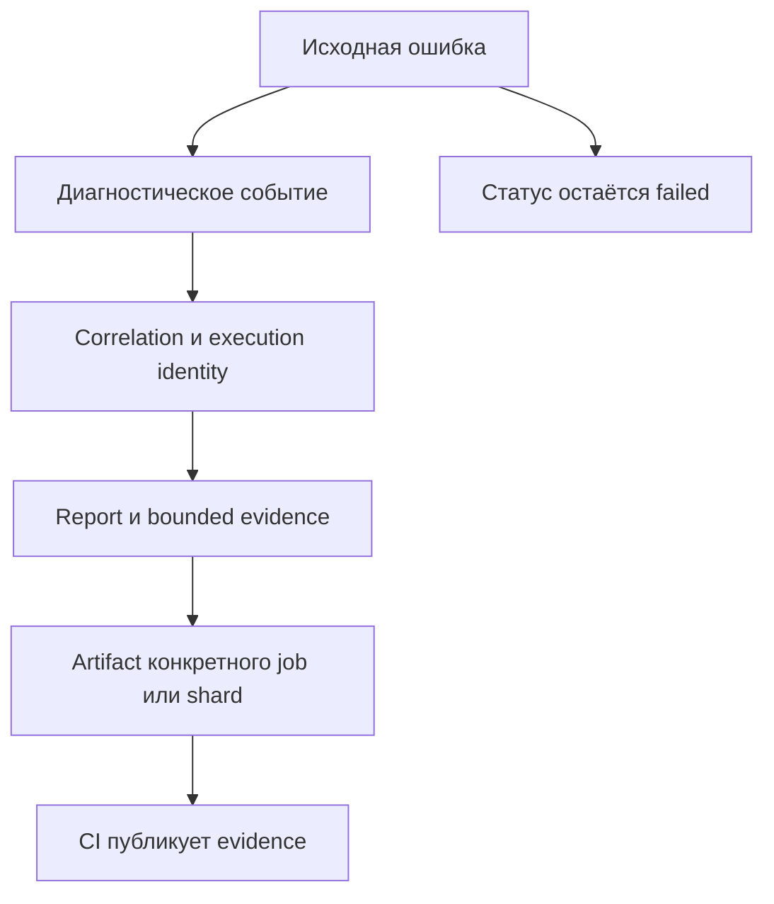

# Диагностика, стабильность и CI в общей архитектуре

## Связь с предыдущей главой

Глава 247 связала операции одной entity. При падении эту связь нужно сохранить в logs, runtime evidence и CI artifacts для конкретного worker и shard.

## Цель главы

Провести единый correlation ID через сценарий, diagnostics и execution metadata, сохранив исходный статус failed.

## Главный вопрос

> Как framework сохраняет диагностический сигнал при локальном, parallel и CI execution?

## Мотивация

Разрозненные logs без идентификатора нельзя связать с конкретным test attempt. Общий каталог artifacts создаёт конфликты между workers, а ошибка diagnostic sink может случайно заменить исходную ошибку.

## Теория

Execution identity включает project, shard, parallel index, worker, repeat и retry. Domain identity описывает test entity. Correlation ID связывает события одного attempt. Эти идентификаторы решают разные задачи и не должны заменять друг друга. Workers и sharding помогают распределять выполнение, но сами по себе не создают изоляцию данных и не исправляют нарушения dependency flow.

Сценарий создаёт структурированное событие с безопасными полями. Reporter и `testInfo.attach()` сохраняют ограниченный объём evidence без полного environment dump, secrets и лишних абсолютных путей. CI загружает каталог конкретного job или shard как artifact. Diagnostics выполняется после возникновения ошибки, но не превращает failed test в passed и не объявляет повторный запуск исправлением flaky behavior.

## Внутренний механизм



Ошибка распространяется по основному пути. Diagnostic sink получает безопасное представление отдельно. Если diagnostics тоже падает, `AggregateError` сохраняет scenario error первой, а ошибку diagnostics — следующей. Публикация report и artifact остаётся отдельной обязанностью CI и не переносится в сервис сценария.

## Главная ментальная модель

Diagnostics сопровождает ошибку доказательствами, но не управляет её результатом и не заменяет assertion.

## Практический пример

```text
examples/03-automation-qa/chapter-248/01-integrated-diagnostics.integration.ts
```

Повторное создание entity вызывает исходную ошибку, сервис добавляет `cause` и записывает redacted bounded event. Тест подтверждает, что secret отсутствует, а ошибка operation не была скрыта. Отдельная ветвь показывает порядок ошибок при одновременном падении scenario и diagnostic sink.

## Automation QA

Локальный запуск использует ту же модель идентификации, что parallel и CI. Имя artifact указывает shard-владельца, а расследование сравнивает commit, project, worker и environment до вывода о flaky test. CI потребляет сигналы framework, но не владеет внутренней orchestration policy.

## Компромиссы

Больше контекста ускоряет расследование, но увеличивает объём и риск sensitive evidence. Поэтому payload ограничивается, поля редактируются, а retention остаётся конечным.

## Распространённые ошибки

- Использовать один correlation id для всего worker.
- Логировать весь config вместе с secret.
- Считать retry успешным исправлением причины.
- Заменять assertion записью в log.
- Давать всем shards одинаковое имя artifact.

## Краткие итоги

- Domain identity, correlation ID и execution identity различаются.
- Diagnostics сохраняет bounded evidence и исходный failure.
- Владение на уровне worker и shard предотвращает конфликты имён.
- CI artifacts продолжают локальный diagnostic contract.

## Практика

Практика встроена из соответствующего файла главы.

## Переход к следующей главе

Framework теперь собран и наблюдаем. Глава 249 определит, как оценивать его архитектуру по фактическим сигналам и выбирать следующий ограниченный рефакторинг.
