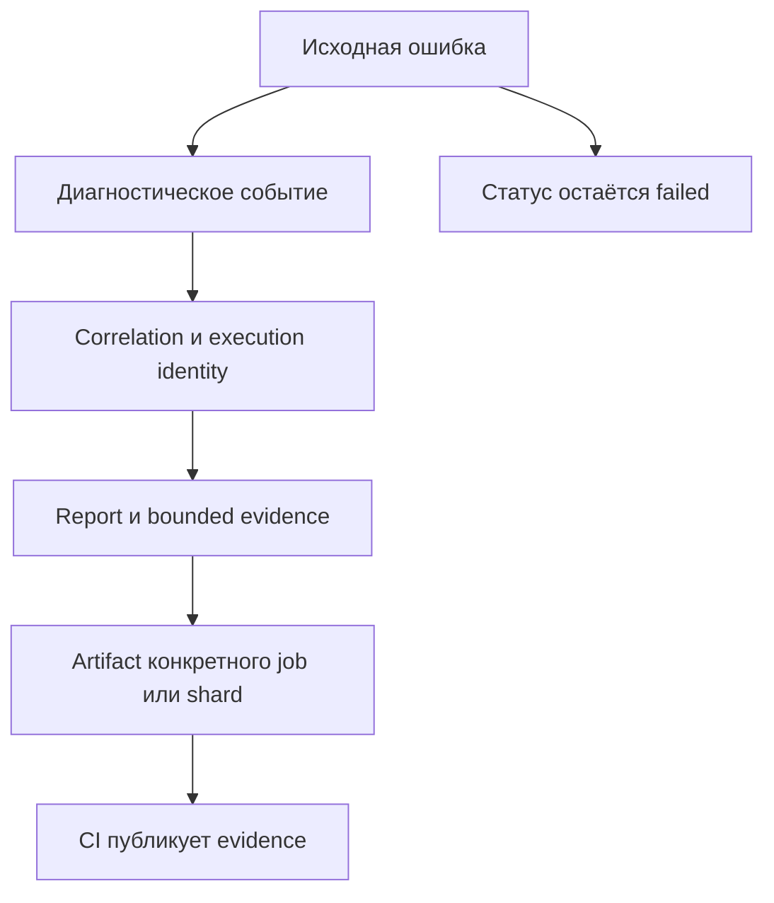

# Диагностика, стабильность и CI в общей архитектуре

## Связь с предыдущей главой

Глава 247 связала операции одной entity. При падении эту связь нужно сохранить в logs, runtime evidence и CI artifacts для конкретного worker и shard.

## Цель главы

Провести единый correlation ID через сценарий, diagnostics и execution metadata, сохранив исходный статус failed.

## Главный вопрос

> Как фреймворк сохраняет диагностический сигнал при локальном, параллельном выполнении и выполнении в CI?

## Мотивация

Разрозненные logs без идентификатора нельзя связать с конкретным test attempt. Общий каталог artifacts создаёт конфликты между workers, а ошибка diagnostic sink может случайно заменить исходную ошибку.

## Теория

### Три вида идентичности

Их путают, а задачи у них разные:

| Идентичность | Что описывает | Пример составляющих |
| --- | --- | --- |
| выполнение | условия конкретного запуска | проект, сегмент, индекс параллельности, рабочий процесс, прогон, повтор |
| предметная область | сущность предметной области | идентификатор созданной задачи |
| связывание | события одной попытки | идентификатор сценария |

Эти идентификаторы решают разные задачи и не должны заменять друг друга. Попытка использовать идентификатор сущности как связывающий ломается сразу: один сценарий создаёт несколько сущностей, а связывающий должен быть один. Обратная подмена ломается при повторе: идентичность запуска меняется, а сущность остаётся той же.

### Распределение выполнения не создаёт изоляцию

Рабочие процессы и сегментирование помогают распределять выполнение, но сами по себе не создают изоляцию данных и не исправляют нарушения потока зависимостей.

Это итог линии, проходящей через главы 215, 238 и 244: параллельность — механизм распределения, а независимость данных обеспечивается уникальными пространствами имён. Увеличение числа рабочих процессов на наборе с общими данными не ускоряет прогон, а превращает редкие конфликты в постоянные.

### Диагностика идёт рядом с ошибкой, а не вместо неё

Сценарий создаёт структурированное событие с безопасными полями. Ошибка распространяется по основному пути, а приёмник диагностики получает безопасное представление отдельно.


```mermaid
flowchart TD
    F[Исходная ошибка] --> E[Диагностическое событие]
    E --> I[Correlation и execution identity]
    I --> R[Report и bounded evidence]
    R --> A[Artifact конкретного job или shard]
    A --> C[CI публикует evidence]
    F --> S[Статус остаётся failed]
```

Диагностика сопровождает ошибку доказательствами, но не управляет её результатом и не заменяет проверку. Две границы, нарушение которых обесценивает всю схему:

- диагностика **не превращает упавший тест в пройденный** — иначе доказательства собираются для дефекта, о котором никто не узнает;
- диагностика **не объявляет повторный запуск исправлением** нестабильности — повтор остаётся наблюдением, а не выводом.

Если диагностика тоже падает, `AggregateError` сохраняет ошибку сценария первой, а ошибку диагностики — следующей. Порядок здесь не косметика: отчёт показывает первую ошибку как причину, и ею должна быть ошибка сценария.

### Ограниченные доказательства

Средство отчёта и `testInfo.attach()` сохраняют ограниченный объём доказательств без полного дампа окружения, секретов и лишних абсолютных путей.

Каждое из трёх исключений имеет причину. Полный дамп окружения почти всегда содержит лишнее и однажды — секрет. Абсолютные пути раскрывают структуру машины сборки и бесполезны при чтении отчёта с другой машины. Секреты не попадают в артефакты по правилам главы 243, и маскирование на уровне CI эти файлы не покрывает.

Больше контекста ускоряет расследование, но увеличивает объём и риск сохранить чувствительные данные. Поэтому тело события ограничивается, поля редактируются, а срок хранения остаётся конечным.

### Границы ответственности с CI

CI загружает каталог конкретной задачи или сегмента как артефакт. Публикация отчёта и артефакта остаётся отдельной обязанностью CI и не переносится в сервис сценария.

Разделение простое: фреймворк производит сигналы и доказательства, CI их потребляет и публикует. CI потребляет сигналы фреймворка, но не владеет его внутренними правилами распределения работы — он не решает, сколько рабочих процессов запускать и как распределять тесты.

Имя артефакта указывает сегмент-владелец — без этого при сегментировании из главы 244 артефакты конфликтуют за одно имя.

### Одна модель для локального запуска и CI

Локальный запуск использует ту же модель идентификации, что параллельный запуск и CI.

Это требование делает расследование воспроизводимым: инженер, получивший красный прогон в CI, видит те же поля, что и у себя, и может сравнить их напрямую.

Расследование сравнивает коммит, проект, рабочий процесс и окружение до вывода о нестабильности теста. Порядок именно такой: сначала убеждаемся, что сравниваем сопоставимые запуски, и только потом говорим о нестабильности. Тест, упавший в другом окружении и на другом коммите, — не доказательство нестабильности, а другой запуск.

## Внутренний механизм


```mermaid
flowchart TD
    F[Исходная ошибка] --> E[Диагностическое событие]
    E --> I[Correlation и execution identity]
    I --> R[Report и bounded evidence]
    R --> A[Artifact конкретного job или shard]
    A --> C[CI публикует evidence]
    F --> S[Статус остаётся failed]
```

Ошибка распространяется по основному пути. Приёмник диагностики получает безопасное представление отдельно. Если диагностика тоже падает, `AggregateError` сохраняет ошибку сценария первой, а ошибку диагностики — следующей. Публикация отчёта и артефакта остаётся отдельной обязанностью CI и не переносится в сервис сценария.

### Ошибка и её описание идут разными путями

```text
основной путь:   ошибка сценария → наверх → статус теста failed
                                              │
диагностика:     безопасное представление ────┘ (только читает)
```

Приёмник диагностики не участвует в судьбе ошибки: он получает копию для записи.
Поэтому отключение диагностики не меняет результат тестов, а её падение не должно
подменять причину.

Когда падает и то и другое, порядок фиксирован: в `AggregateError` **первой идёт
ошибка сценария**, ошибка диагностики — следующей.

### Что связывает записи и где они оседают

| Уровень | Идентификатор | Где хранится |
| --- | --- | --- |
| сценарий | идентификатор прогона сценария | журнал, метаданные, заголовки |
| выполнение | проект, сегмент, процесс, попытка | имена артефактов |
| прогон CI | номер запуска сценария сборки | хранилище артефактов |

Один идентификатор на весь рабочий процесс не годится: записи разных тестов
сливаются, и сопоставить журнал сервиса с конкретным падением нельзя.

Публикация же остаётся обязанностью CI. Сервис сценария не знает ни про
хранилище артефактов, ни про сроки хранения — иначе тесты перестают запускаться
локально.

## Главная ментальная модель

Диагностика сопровождает ошибку доказательствами, но не управляет её результатом и не заменяет проверку.

## Практический пример

```text
examples/03-automation-qa/chapter-248/01-integrated-diagnostics.integration.ts
```

Повторное создание сущности вызывает исходную ошибку, сервис добавляет `cause` и записывает отредактированное ограниченное событие. Тест подтверждает, что секрет отсутствует, а ошибка операции не была скрыта. Отдельная ветвь показывает порядок ошибок при одновременном падении сценария и приёмника диагностики.

## Automation QA

Локальный запуск использует ту же модель идентификации, что параллельный запуск и CI. Имя артефакта указывает сегмент-владелец, а расследование сравнивает коммит, проект, рабочий процесс и окружение до вывода о нестабильности теста. CI потребляет сигналы фреймворка, но не владеет его внутренними правилами распределения работы.

## Компромиссы

Больше контекста ускоряет расследование, но увеличивает объём и риск сохранить чувствительные данные. Поэтому тело события ограничивается, поля редактируются, а срок хранения остаётся конечным.

## Распространённые мифы

**Миф: один идентификатор может служить всем целям.**
Идентификатор сущности не годится как связывающий (сущностей несколько), связывающий не заменяет идентичность запуска (она меняется при повторе).

**Миф: больше рабочих процессов — быстрее прогон.**
На наборе с общими данными это превращает редкие конфликты в постоянные. Изоляцию даёт пространство имён.

**Миф: диагностика может смягчить результат.**
Она сопровождает ошибку доказательствами. Упавший тест остаётся упавшим.

**Миф: успешный повтор — доказательство нестабильности.**
Это наблюдение. Вывод делается после сравнения коммита, проекта, рабочего процесса и окружения.

**Миф: полный дамп окружения — лучшее доказательство.**
Он содержит лишнее, раскрывает пути машины сборки и однажды приносит секрет в артефакт.

## Частые вопросы

**Зачем нужны три разных идентификатора?**
Они отвечают на разные вопросы: в каких условиях выполнялось, какая сущность участвовала, какие события относятся к одной попытке.

**Что должно быть первым в `AggregateError`?**
Ошибка сценария: именно она объясняет падение, а ошибка диагностики — сопутствующая.

**Кто публикует отчёты и артефакты?**
CI. Сервис сценария их только производит.

**Почему в артефакты не кладут абсолютные пути?**
Они раскрывают структуру машины сборки и бесполезны при чтении отчёта с другой машины.

**Что сравнить перед выводом о нестабильности?**
Коммит, проект, рабочий процесс и окружение — иначе сравниваются разные запуски.

## Проверьте себя

1. Какие три вида идентичности существуют и почему они не заменяют друг друга?
2. Почему увеличение числа рабочих процессов не решает проблему общих данных?
3. Какие две границы нельзя переходить диагностике?
4. Что исключается из сохраняемых доказательств и почему?
5. Что нужно сравнить до вывода о нестабильности?

### Ответы

1. Идентичность теста — для истории и отбора. Идентичность прогона — для сопоставления записей одного запуска. Идентичность данных — для поиска своих записей. Каждая отвечает на свой вопрос при разборе.
2. Общие данные конфликтуют тем сильнее, чем больше одновременных прогонов. Увеличение числа процессов обостряет проблему, а не решает её.
3. Диагностика не должна менять состояние системы и не должна сохранять секреты и персональные данные.
4. Секреты, персональные данные и содержимое, попавшее на снимки и в трассировки. Доказательства хранятся долго и доступны шире, чем стенд.
5. Историю запусков того же теста, версию приложения и тестов, состояние данных и состав параллельного прогона. Без этого нестабильность неотличима от плавающего дефекта.

## Распространённые ошибки

- Использовать один связывающий идентификатор для всего рабочего процесса — записи разных тестов сливаются, и сопоставить журнал сервиса с конкретным падением нельзя. Идентификатор принадлежит сценарию.

- Записывать в журнал всю конфигурацию вместе с секретом — журнал уходит в артефакты и доступен всем, кто открывает сборку.

- Считать повтор успешным исправлением причины — повтор меняет отчёт, а не поведение. В архитектуре он допустимая мера, но учитывается как долг.

- Заменять проверку записью в журнал — запись не роняет тест, поэтому нарушение превращается в строку, которую никто не читает.

- Давать всем сегментам одинаковое имя артефакта — материалы перезаписываются, и диагностика остаётся от одного сегмента.

## Краткие итоги

- Идентичность сущности, связывающий идентификатор и идентичность запуска различаются.
- Диагностика сохраняет ограниченные доказательства и исходное падение.
- Владение на уровне рабочего процесса и сегмента предотвращает конфликты имён.
- Артефакты CI продолжают локальный диагностический контракт.

## Практика

Практика встроена из соответствующего файла главы.

## Переход к следующей главе

Фреймворк теперь собран и наблюдаем. Глава 249 определит, как оценивать его архитектуру по фактическим сигналам и выбирать следующий ограниченный рефакторинг.
