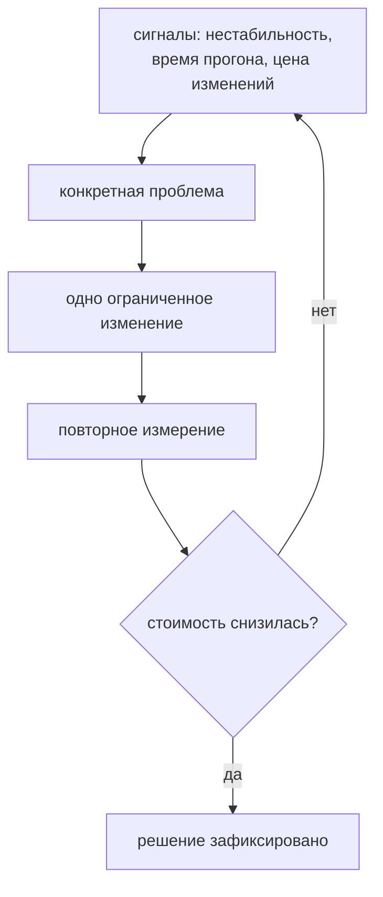

# Разбор архитектуры и эволюция фреймворка

## Связь с предыдущей главой

Глава 248 завершила общий execution и diagnostic flow. Перед финальным проектом нужно проверить, какие архитектурные решения действительно выдерживают изменения и где накопилась измеримая стоимость поддержки.

## Цель главы

Провести architecture review границ, связности и владения, затем выбрать следующий рефакторинг по наблюдаемой проблеме.

## Главный вопрос

> Как оценить готовность фреймворка к росту и выбрать следующий рефакторинг по фактической проблеме?

## Мотивация

Рефакторинг без сигнала создаёт speculative abstractions. Framework получает interfaces, factories и containers, которые никто не использует, а реальные циклы, shared state и слишком широкий cleanup остаются.

## Теория

### Разбор начинается с сигналов, а не с шаблона

Разбор начинается не с желаемого шаблона, а с доказательств. Без доказательств цикл изменений не начинается.

Наблюдаемые сигналы, каждый из которых указывает на конкретную проблему:

| Сигнал | На что указывает |
| --- | --- |
| изменение транспорта затрагивает тесты | граница протекла в сценарии |
| фикстура создаёт клиент в нескольких местах | нет единого Composition Root |
| очистка оставляет остаточное состояние | владение данными не определено |
| диагностика теряет `cause` | цепочка причин обрывается |
| граф импортов содержит цикл | направление зависимостей нарушено |

Обратный порядок — «нам нужен шаблон «Репозиторий»» — даёт изменение без подтверждённой проблемы: архитектура меняется, стоимость поддержки остаётся прежней.

### Что проверяется после сбора сигналов

Затем проверяются публичные границы, направление зависимостей, связность внутри модулей и связанность между ними.

Применительно к тестовому фреймворку это конкретные вопросы:

- можно ли заменить адаптер API без изменения тестов;
- имеют ли данные одного владельца очистки;
- разделены ли области теста и рабочего процесса;
- сохраняется ли `cause` ошибки;
- диагностируется ли сегмент независимо.

Цикл, обратный импорт, глобальное состояние, разрозненное чтение конфигурации и фикстура со слишком широкой ответственностью являются наблюдаемыми сигналами, но не требуют одинакового исправления: цикл чинится разрывом зависимости, широкая фикстура — разделением по владению.

### Стоимость поддержки измеряется

Стоимость поддержки включает сложность изменения, время локализации падения, стоимость подготовки и число владельцев одного ресурса.

Эти величины наблюдаемы, и в этом смысл: «код стал лучше» проверить нельзя, а «изменение транспорта теперь затрагивает один файл вместо семи» — можно.

Следующий рефакторинг должен уменьшать конкретную стоимость небольшим шагом. После изменения те же сигналы измеряются снова: доказательства превращаются в конкретную проблему, проблема — в ограниченный рефакторинг, а повторная проверка показывает, уменьшилась ли исходная стоимость.

### Выбор одного изменения

Разбор собирает доказательства, ранжирует проблемы по риску, выбирает одно ограниченное изменение и проверяет результат.

Слово «одно» существенно. Несколько одновременных изменений архитектуры дают ту же проблему, что несколько одновременных изменений при расследовании из главы 225: результат есть, а причина неизвестна.

Отсутствие подтверждённой проблемы является допустимым решением ничего не рефакторить — и это самый недооценённый исход разбора.

### Когда абстракция преждевременна

Узкие границы требуют дисциплины, но уменьшают область влияния изменения. Слишком раннее выделение интерфейса увеличивает стоимость чтения.

Решение зависит от подтверждённой изменчивости, а не от универсального шаблона. Практический критерий: интерфейс оправдан, когда реализация уже менялась или точно будет заменена, — а не когда «может понадобиться вторая».

Это то же правило, что для вспомогательных функций в главе 222: абстракция оправдывается наблюдаемой причиной изменения, а не предположением о будущем.

### Контрольный список фиксирует решения, а не истину

Контрольный список не объявляет архитектуру навсегда правильной. Он фиксирует текущие ограничения, владельца решения и критерий повторной оценки.

Три части здесь одинаково важны. Ограничения объясняют, почему выбран этот вариант при известных условиях. Владелец отвечает на вопрос, к кому идти с предложением изменить. Критерий повторной оценки задаёт момент, когда решение пересматривают: рост набора, новый протокол, смена стенда.

Без последней части список превращается в догму: условия изменились, а правило продолжает действовать, потому что когда-то было записано.

### Куда это ведёт дальше

Финальный проект использует эти правила, но его реализация начинается в следующей части курса.

Накопленное к этому моменту — границы слоёв, композиция, жизненный цикл данных, диагностика, стабильность и CI — и есть материал, из которого собирается работающий фреймворк. Разбор же остаётся регулярной практикой: архитектура не «достигается», а поддерживается в состоянии, соответствующем текущим задачам.

Обзор идёт от наблюдений к одному изменению:



## Внутренний механизм

Разбор собирает доказательства, ранжирует проблемы по риску, выбирает одно ограниченное изменение и проверяет результат. Детерминированный выбор использует важность и не зависящее от языковых настроек сравнение имени. Отсутствие подтверждённой проблемы является допустимым решением ничего не рефакторить.

### Порядок разбора и решение «ничего не менять»

```text
1. собрать доказательства     время прогона, частота падений, цена правок
2. назвать проблемы           каждая — с наблюдением, а не с ощущением
3. упорядочить по риску       важность × частота
4. выбрать ОДНО изменение     ограниченное по объёму
5. проверить результат        та же метрика, что в пункте 1
```

Пункт 5 замыкает цикл: без него неизвестно, помогло ли изменение. А пустой
результат пункта 2 — законный исход: если подтверждённой проблемы нет, правильным
решением будет не менять ничего.

### Чем измерять, а чем не стоит

| Показатель | Что говорит |
| --- | --- |
| время прогона и его разброс | стоимость обратной связи |
| доля нестабильных тестов | доверие к прогону |
| время от падения до причины | качество диагностики |
| стоимость добавления сценария | качество границ слоёв |
| число классов и интерфейсов | почти ничего |

Последняя строка — типичная подмена: интерфейс без второй реализации ничего не
развязывает, а уровень вызова добавляет.

Упорядочивание при этом должно быть воспроизводимым: сравнение по важности и по
имени, не зависящее от языковых настроек среды. Иначе один и тот же список
проблем выглядит по-разному у двух участников разбора.

## Главная ментальная модель

Доказательства превращаются в конкретную проблему, проблема — в ограниченный рефакторинг, а повторная проверка показывает, уменьшилась ли исходная стоимость. Без доказательств цикл изменений не начинается.

## Практический пример

```text
examples/03-automation-qa/chapter-249/01-architecture-review.integration.ts
```

Детерминированная функция выбирает проблему с наибольшей важностью, разрешает равенство без зависимости от языковых настроек и сохраняет доказательства как причину решения. При отсутствии сигналов она не предлагает абстракцию на будущее.

## Automation QA

Разбор проверяет, можно ли заменить адаптер API без изменения тестов, имеют ли данные одного владельца очистки, разделены ли области теста и рабочего процесса, сохраняется ли `cause` ошибки и диагностируется ли сегмент независимо. Цикл, обратный импорт, глобальное состояние, разрозненное чтение конфигурации и фикстура со слишком широкой ответственностью являются наблюдаемыми сигналами, но не требуют одинакового исправления.

## Компромиссы

Узкие границы требуют дисциплины, но уменьшают область влияния изменения. Слишком раннее выделение интерфейса увеличивает стоимость чтения. Решение зависит от подтверждённой изменчивости, а не от универсального шаблона.

## Распространённые мифы

**Миф: разбор начинается с выбора подходящего шаблона.**
Он начинается с наблюдаемых сигналов. Шаблон без подтверждённой проблемы меняет код, но не стоимость.

**Миф: качество архитектуры нельзя измерить.**
Наблюдаемы сложность изменения, время локализации падения, стоимость подготовки и число владельцев ресурса.

**Миф: найденные проблемы нужно чинить все сразу.**
Несколько одновременных изменений скрывают, какое из них помогло.

**Миф: «ничего не менять» — признак плохого разбора.**
Отсутствие подтверждённой проблемы — допустимый и честный исход.

**Миф: интерфейс стоит выделить заранее, на будущее.**
Он оправдан подтверждённой изменчивостью, а не предположением о второй реализации.

## Частые вопросы

**С чего начать ревью фреймворка?**
С сигналов: протекающие границы, дублирование создания клиентов, остаточные данные, потерянный `cause`, циклы в графе.

**Как понять, что рефакторинг помог?**
Измерить те же величины повторно: стало ли изменение дешевле, а локализация падения быстрее.

**Почему одно изменение за раз?**
Иначе неизвестно, что именно дало эффект — та же логика, что при расследовании падений.

**Что входит в контрольный список?**
Текущие ограничения, владелец решения и критерий повторной оценки.

**Когда пересматривать решения?**
По заранее заданному критерию: рост набора, новый протокол, смена стенда.

## Проверьте себя

1. Какие сигналы служат основанием для ревью архитектуры?
2. Какие четыре величины описывают стоимость поддержки?
3. Почему рефакторинг делается по одному ограниченному шагу?
4. Когда выделение интерфейса преждевременно?
5. Из каких трёх частей состоит контрольный список и зачем нужна каждая?

### Ответы

1. Рост времени на добавление сценария, правка одного изменения во многих местах, повторяющиеся расследования одного класса падений и появление обходных решений в тестах.
2. Время на добавление сценария, время на разбор падения, число мест, которые нужно изменить при одном изменении приложения, и доля нестабильных прогонов.
3. Ограниченный шаг можно проверить прогоном и откатить. Большая перестройка меняет всё сразу, и при падении непонятно, что именно сломалось.
4. Когда реализация одна и подменять её не требуется. Интерфейс тогда добавляет файл и уровень косвенности, не давая ни гибкости, ни проверяемости.
5. Что проверяется, как это устроено и что будет при изменении. Первое описывает покрытие, второе — структуру, третье — стоимость сопровождения.

## Распространённые ошибки

- Рефакторить ради названия шаблона — «сделать как объект страницы» не является целью. Изменение оправдано тем, что после него дешевеет конкретная работа: правка вёрстки, добавление окружения, поиск причины падения.

- Измерять качество числом интерфейсов — интерфейс без второй реализации ничего не развязывает, а уровень вызова добавляет.

- Игнорировать стоимость подготовки фикстур — автоматическая фикстура выполняется для каждого теста файла, и лишние секунды умножаются на весь набор.

- Делать один объект фреймворка владельцем всех обязанностей — класс, знающий про UI, API, базу и отчёт, меняется от любой правки и не может использоваться по частям.

- Переносить финальный проект в разбор архитектуры — ревью отвечает на вопрос «что менять и зачем», а проект собирается по решениям, которые ревью уже приняло.

## Краткие итоги

- Разбор архитектуры начинается с доказательств.
- Связанность и связность оцениваются относительно изменений.
- Рефакторинг решает одну подтверждённую проблему.
- Абстракции на будущее не добавляются без необходимости.

## Практика

Практика встроена из соответствующего файла главы.

## Переход к следующей главе

Раздел Automation QA завершён общей архитектурной моделью. Глава 250 начнёт финальный проект с требований и критериев готовности; его реализация в текущей главе не рассматривается.
