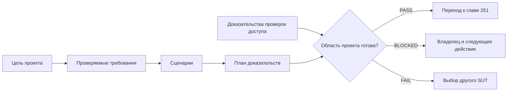
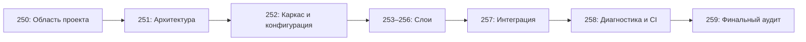

# Требования и критерии готовности проекта

## Предпосылки

Перед началом главы читатель должен завершить главы 160–249 и понимать границы слоёв Automation Framework, жизненный цикл ресурсов, диагностику, параллельное выполнение и CI.

## Связь с предыдущей главой

Глава 249 завершила часть III проверкой архитектурных границ и выбором рефакторинга по фактическим сигналам. Теперь эти знания нужно применить к одному финальному проекту. Однако реализацию нельзя начинать, пока не определено, что именно требуется построить и как будет доказана готовность.

## Цель главы

Выбрать подходящую учебную тестируемую систему (System Under Test, SUT), ограничить обязательную область проекта и связать каждое требование с проверяемым сценарием и ожидаемым доказательством.

## Главный вопрос

> Как ограничить scope финального проекта и превратить цели в проверяемые критерии?

## Контекст финального проекта

Финальный проект — один TypeScript Automation QA Framework для заранее существующей учебной тестируемой системы, далее — SUT. Он объединит UI, REST, unary gRPC и PostgreSQL в одном бизнес-домене. Главы 250–259 реализуют проект последовательно: от требований до финального аудита.

Курс не предоставляет готовый SUT. Ученик выбирает систему, получает разрешённый доступ и предоставляет адреса сервисов, `.proto`, тестовые учётные записи и данные подключения. Курс предоставляет обязательную область проекта, этапы, Definition of Done и критерии итоговой оценки.

Глава 250 не создаёт framework. Её результат — обоснованное решение, можно ли безопасно начинать проект и впоследствии доказать его готовность.



## Проверка пригодности SUT

Проверка пригодности SUT выполняется до реализации. Она отвечает не на вопрос «интересен ли продукт», а на вопрос «позволяет ли система выполнить замороженную спецификацию проекта».

SUT должен предоставлять разрешённый доступ к следующим возможностям:

| Возможность | Обязательное условие |
| --- | --- |
| UI | Доступен в браузере и позволяет выполнить показательный сценарий с изменением состояния |
| REST API | Поддерживает успешные и негативные запросы, аутентификацию, подготовку либо очистку данных |
| unary gRPC | Предоставляет `.proto`, возможность подключить сгенерированный клиент и получить ожидаемый non-OK status |
| PostgreSQL | Разрешает чтение сохранённого состояния и согласованную подготовку либо очистку данных |
| Среда CI | UI, REST, gRPC и PostgreSQL доступны из GitHub Actions |

Помимо доступа к транспортному протоколу, проверка подтверждает один общий бизнес-домен, аутентификацию минимум для UI и одного сервисного слоя, сущность с разрешённым изменением состояния и детерминированную очистку созданных данных.

Доступ должен быть законным, разрешённым владельцем системы и ограниченным учебной или тестовой средой. Рабочая система и рабочие данные для проекта не требуются. Изменение рабочих данных находится вне области проекта. Наличие рабочих учётных данных не считается преимуществом и не заменяет разрешённую учебную среду.

Адаптеры в памяти из части III объясняли архитектурные границы, но не подтверждают реальную интеграцию финального проекта. Обязательные UI, REST, gRPC и PostgreSQL нельзя заменить имитациями. Имитация допустима только для необязательной сторонней зависимости.

Docker остаётся опциональным: он нужен только тогда, когда выбранный SUT уже использует его для локального запуска. Работа без сети не является обязательным свойством. В последующих главах потребуются браузер и сетевой доступ, но в главе 250 выполняются только безопасные проверки доступа.

### Итоговое решение по SUT

| Решение | Условие |
| --- | --- |
| `PASS` | Для всех обязательных возможностей доказаны их существование, разрешённый доступ, необходимые права на изменение, очистка данных и доступность из CI |
| `BLOCKED` | Решение пока нельзя завершить: указаны причина, владелец и следующее действие |
| `FAIL` | Доказано, что выбранный SUT не способен выполнить хотя бы одно обязательное требование |

Неизвестное состояние не считается успешным: оно переводит итоговое решение в `BLOCKED`. Частичный локальный доступ не доказывает готовность, а опциональная возможность не компенсирует невыполненную обязательную. При `BLOCKED` реализация не начинается до получения доказательств. При `FAIL` предпочтительное действие — выбрать другой SUT; обязательную область нельзя уменьшить с помощью исключений.

> **Важно.** Решение получает `FAIL` только при доказанной невозможности выполнить обязательную область проекта. Непроверенная очистка или доступность из CI дают `BLOCKED`, но также запрещают переход к реализации.

## Матрица области проекта

Матрица области проекта собирает условия доступа в одном месте и делает блокирующие условия видимыми до появления кода. Наличие возможности и авторизованный доступ записываются отдельно: существующий сервис может быть недоступен ученику или запрещён для автоматизации.

| Возможность | Тип | Доступна | Доступ разрешён | Среда и способ доступа | Владелец и источник учётных данных | CI | Изменение и очистка | Доказательство | Статус | Блокирующее условие / следующее действие |
| --- | --- | --- | --- | --- | --- | --- | --- | --- | --- | --- |
| UI | Обязательная | Да | Да | Учебная среда, браузер | Команда SUT, хранилище секретов | Да | Тестовые данные; очистка через UI или API | Запись проверки доступа | PASS | Нет |
| REST | Обязательная | Да | Да | Учебная среда, базовый URL | Команда SUT, хранилище секретов | Да | Создание и удаление разрешены | Запись проверки доступа | PASS | Нет |
| unary gRPC | Обязательная | Не подтверждено | Не подтверждено | Учебная среда, ожидается `.proto` | Команда сервиса, хранилище секретов | Не проверено | Неизвестно | Отсутствует | BLOCKED | Владелец подтверждает контракт и разрешения |
| PostgreSQL | Обязательная | Да | Да | Учебная среда, подключение только для чтения | Команда данных, хранилище секретов | Да | Запись запрещена; очистка через API | Запись проверки подключения | PASS | Нет |
| Docker | Опциональная | Нет | Не требуется | Локальная среда | Ученик, учётные данные не нужны | Не применяется | Не применяется | Обоснование | NOT APPLICABLE | Нет |

Таблица иллюстративна: она не содержит настоящих адресов, учётных данных или сведений о рабочей среде. Итоговое решение по такому примеру — `BLOCKED`, потому что обязательный доступ к gRPC ещё не доказан.

> **Типичная ошибка.** Отмечать возможность как доступную только потому, что она описана в документации. Готовность подтверждает фактическая разрешённая проверка доступа, а не предположение.

## Портфель из девяти сценариев

Область проекта фиксируется девятью отдельными записями сценариев:

| ID | Слой | Обязательное поведение |
| --- | --- | --- |
| `UI-01` | UI | Аутентифицированный успешный сценарий с изменением состояния |
| `UI-02` | UI | UI-валидация или негативный сценарий |
| `REST-01` | REST | Успешный запрос с изменением состояния |
| `REST-02` | REST | Негативный запрос с ожидаемым ответом об ошибке |
| `GRPC-01` | gRPC | Успешный unary-вызов |
| `GRPC-02` | gRPC | Unary-вызов с ожидаемым non-OK status |
| `XL-01` | Межслойный | Подготовка через API → проверка через UI |
| `XL-02` | Межслойный | Действие в UI → проверка в PostgreSQL |
| `XL-03` | Межслойный | Вызов gRPC → сравнение с PostgreSQL или REST |

Один сценарий не заменяет две записи портфеля. Он может дополнительно подтверждать аутентификацию, негативное поведение, изменение состояния или требование к базе данных.

Два сценария одного слоя должны отвечать на разные бизнес-вопросы, а не отличаться только тестовыми данными. Межслойный сценарий оправдан, когда сравнение отвечает реальному вопросу о согласованности; запись «проверить всё через все слои» недопустима. Один сценарий может быть связан с несколькими требованиями.

Любой сценарий с изменением данных утверждается только после подтверждения владельца и способа очистки. Сценарий только для чтения всё равно фиксирует среду, разрешения, доказательство и возможность запуска в CI. Эта возможность оценивается для каждой записи отдельно, потому что сценарии могут зависеть от разных сервисов.

### Структура записи сценария

Каждая запись сценария содержит:

- ID и короткое название;
- бизнес-цель;
- исходный слой и слой проверки;
- предусловия;
- владельца настройки;
- входные и тестовые данные;
- действие;
- точный ожидаемый результат;
- владельца очистки и способ очистки;
- ожидаемое диагностическое доказательство;
- возможность выполнения в CI;
- риск и статус.

Пример плановой записи:

| Поле | Значение |
| --- | --- |
| ID | `XL-01` |
| Название | Entity, созданная через REST, видна в UI |
| Бизнес-цель | Подтвердить видимость созданной test entity для пользователя |
| Слои | Настройка через REST → проверка через UI |
| Предусловия | Разрешённая тестовая учётная запись и доступная учебная среда |
| Владелец настройки | Сценарий `XL-01`, данные принадлежат тесту |
| Тестовые данные | Уникальный идентификатор, принадлежащий тесту |
| Действие | Создать сущность через REST и найти её через UI |
| Ожидаемый результат | UI показывает тот же бизнес-идентификатор и ожидаемый статус |
| Владелец очистки | Сценарий `XL-01`, владеющий тестовыми данными |
| Способ очистки | Разрешённая операция удаления через REST |
| Доказательство | Статус REST, очищенный идентификатор, снимок экрана UI при ошибке |
| Возможность запуска в CI | Все участвующие сервисы доступны среде выполнения |
| Риск | Согласованность данных между REST и UI достигается с задержкой |
| Статус | NOT STARTED |

Запись сценария определяет область проекта и ожидаемый результат. Она не выбирает Page Object, API Client, граф fixtures или реализацию повторных проверок.

## Модель требований

Требование описывает наблюдаемое обязательство проекта. Для компактной системы достаточно устойчивого ID и нескольких проверяемых полей.

| Префикс | Назначение |
| --- | --- |
| `CAP-*` | Возможность и доступность SUT |
| `FUN-*` | Проверяемое бизнес-поведение |
| `ARC-*` | Архитектурное ограничение |
| `CFG-*` | Конфигурация и секреты |
| `DATA-*` | Владение, изоляция и очистка |
| `DIAG-*` | Диагностика и доказательства |
| `STAB-*` | Параллельное выполнение и стабильность |
| `CI-*` | Выполнение в CI |
| `DOC-*` | Документация и воспроизводимость |
| `VAL-*` | Валидация и проверки готовности |

Каждое требование содержит:

- ID;
- краткую формулировку;
- обоснование;
- способ проверки;
- главу-владельца;
- связанные ID сценариев;
- ожидаемое доказательство;
- признак обязательности;
- статус.

Обязательность является отдельным полем, а не параллельной категорией ID. Например, необязательное диагностическое расширение сохраняет префикс `DIAG-*` и получает значение «опциональное». Категория описывает предмет требования, а не его приоритет.

Одно требование описывает одно проверяемое обязательство. Если формулировка соединяет независимые результаты, её разделяют, чтобы `PASS` не скрывал невыполненную часть.

### Чем отличаются типы записей

| Понятие | Вопрос |
| --- | --- |
| Требование | Что система или проект обязаны доказуемо обеспечить? |
| Деталь реализации | Каким техническим способом это может быть построено? |
| Архитектурное решение | Какой структурный подход выбран и почему? |
| Критерий приёмки | При каком наблюдаемом условии требование принято? |
| Задача | Какую работу и кому нужно выполнить? |
| Доказательство | Какой наблюдаемый результат подтверждает критерий? |

Фраза «тесты должны быть стабильными» не проверяема. Требование `STAB-01` может звучать так: «Полный обязательный набор проходит три раза подряд с двумя workers и `retries: 0`, включая как минимум один запуск в GitHub Actions». Способ проверки — три последовательных запуска; доказательства — их идентификаторы и отчёты.

Фраза «создавать клиенты через фабрику» описывает деталь реализации или архитектурное решение, а не требование. Глава 251 выберет конкретную структуру после фиксации ограничений.

> **Полезно знать.** Чем раньше формулировка указывает способ проверки и доказательство, тем меньше вероятность, что команда по-разному поймёт слово «готово».

### Один пример в шести формах

Рассмотрим проверку доступности PostgreSQL из CI:

| Тип записи | Пример |
| --- | --- |
| Требование | `CAP-DB-01`: PostgreSQL доступен из CI с разрешёнными правами чтения |
| Деталь реализации | Проверку можно выполнить выбранным клиентом PostgreSQL |
| Архитектурное решение | В главе 251 будет решено, где проходит граница доступа к базе данных |
| Критерий приёмки | В профиле CI разрешённое подключение и безопасная проверка чтения завершаются успешно |
| Задача | Владелец среды предоставляет доступ из CI и выполняет проверку доступа |
| Доказательство | Запись проверки с датой, средой, результатом и очищенным описанием ошибки |

Все шесть записей относятся к одной цели, но отвечают на разные вопросы. Подмена одной другой делает план либо непроверяемым, либо преждевременно привязанным к реализации.

## Критерии приёмки

Критерий приёмки определяет, как наблюдаемо решить, выполнено ли связанное требование. Он содержит:

- ID требования;
- среду и предусловия;
- выполняемое действие или проверку;
- точный ожидаемый результат;
- ожидаемое доказательство;
- блокирующую серьёзность невыполнения.

Критерий должен быть бинарным либо иметь заранее установленный порог. Формулировки «работает правильно», «выглядит хорошо», «достаточно покрыто» и «почти не падает» не дают объективного решения. Не каждый критерий обязан быть автоматизирован уже в главе 250: допустима воспроизводимая проверка или инспекция с зафиксированным результатом.

Пример для `STAB-01`: «Полный обязательный набор три раза подряд завершается с exit code `0`, двумя workers и `retries: 0`; минимум один запуск выполнен в GitHub Actions; доказательства — три записи запуска и отчёты; любое необъяснённое падение оставляет требование невыполненным». Это критерий, а не доказательство: конкретные записи появятся позже.

Критерий приёмки не назначает итоговую оценку проекта. Серьёзность нарушения берётся из замороженной спецификации, а взвешенная оценка выполняется только в главе 259.

## Трассируемость

Трассируемость показывает путь от причины работы до доказательства результата:

`требование → глава-владелец → сценарий → результат реализации → доказательство → статус`

В главе 250 заполняются требование, глава-владелец и связи со сценариями. Результаты реализации и фактические доказательства появятся в главах 251–258. Глава 259 проверит всю цепочку и присвоит итоговый статус.

Трассируемость предотвращает две ошибки:

- создан результат, который не отвечает ни одному требованию;
- требование объявлено обязательным, но никогда не проверяется.

Один результат реализации может подтверждать несколько требований, однако каждое обязательное требование должно иметь понятную связь с доказательством. Опциональная работа не компенсирует невыполненное обязательное требование.

Связь является двусторонней и множественной: одно требование может подтверждаться несколькими сценариями, а один сценарий — несколькими требованиями. Требование уровня всего проекта может иметь отдельный путь проверки. Сценарий без требования требует пересмотра области, а обязательное требование без сценария или другого пути проверки остаётся неполным. Статус меняется только после появления фактического доказательства.

Трассируемость нужна не ради таблицы: она останавливает работу, которая не входит в область проекта, и показывает обязательства, для которых никто не запланировал проверку.

## Функциональные требования

Функциональное требование описывает бизнес-поведение выбранного домена без привязки к конкретным селекторам, адресам сервисов, методам gRPC или таблицам.

Минимальный набор поведения охватывает:

- успешный аутентифицированный поток;
- негативный поток с ожидаемой ошибкой;
- поведение при ошибке валидации;
- изменение состояния с явно указанными исходным и конечным состояниями;
- чтение после записи там, где оно отражает бизнес-процесс;
- согласованность между слоями только там, где она имеет смысл;
- точный ожидаемый результат;
- детерминированную очистку созданных данных.

Хорошая формулировка:

> После разрешённого создания тестовой сущности через REST UI показывает ту же сущность с ожидаемым бизнес-статусом; созданные данные удаляются владельцем подготовки независимо от результата проверки.

Плохая формулировка:

> Проверить, что API и UI работают правильно.

Негативное требование также указывает ожидаемую категорию отказа и отсутствие запрещённого побочного эффекта, а не ограничивается словами «возвращается ошибка».

## Требования к качеству

Требования к качеству определяют свойства framework, которые будут реализованы позже:

| Область | Проверяемое ожидание | Владелец реализации |
| --- | --- | --- |
| Архитектура | Направление зависимостей документировано, циклы отсутствуют | 251 и 259 |
| Конфигурация | Внешняя конфигурация типизирована и проверяется во время выполнения | 252 |
| Секреты | Реальные секреты отсутствуют в исходном коде, логах и артефактах | 252, 258 и 259 |
| Изоляция | Данные и ресурсы имеют область жизни и уникальную идентичность для каждого worker | 252 и 257 |
| Очистка | Принадлежащие проекту данные удаляются после успеха и ошибки | 253–257 |
| Идентичность | Изменяемые данные получают детерминированный идентификатор, уникальный для каждого worker | 257–258 |
| Ошибки | Исходная ошибка и ошибки очистки остаются доступными для расследования | 252–258 |
| Диагностика | Падение слоя создаёт очищенное доказательство | 253–258 |
| Политика повторов | Успешность обязательного набора не зависит от retry | 258 |
| Параллельное выполнение | Полный обязательный набор проходит с двумя workers | 258 |
| CI | GitHub Actions выполняет полный обязательный набор | 258 |
| Отчётность | Результаты Allure и артефакты CI сохраняются | 258 |
| Документация | Другой QA-инженер воспроизводит настройку и запуск | 259 |

Глава 250 фиксирует ожидания, но не выбирает точные интерфейсы, Composition Root, библиотеку конфигурации, Page Objects, клиенты, repository или workflow.

## Начальное Definition of Done

Начальное Definition of Done превращает требования в общий список готовности. Каждый пункт содержит тип, владельца, доказательство и статус.

Допустимые статусы:

| Статус | Значение |
| --- | --- |
| `NOT STARTED` | Работа ещё не началась |
| `IN PROGRESS` | Назначен владелец, работа выполняется |
| `PASS` | Критерий выполнен и приложено доказательство |
| `FAIL` | Критерий проверен и не выполнен |
| `BLOCKED` | Критерий пока нельзя проверить или выполнить до указанного внешнего действия |
| `NOT APPLICABLE` | Пункт обоснованно не относится к опциональной области |

Правила начального DoD:

- обязательный пункт нельзя закрыть как `NOT APPLICABLE`;
- опциональный `NOT APPLICABLE` требует обоснования;
- `PASS` без доказательства не считается готовностью;
- `BLOCKED` требует владельца, следующего действия и условия снятия блокировки;
- `FAIL` означает подтверждённое невыполнение и требует исправления или смены SUT, а `BLOCKED` означает незавершённое решение из-за известной зависимости;
- `NOT STARTED` и `IN PROGRESS` не означают готовность;
- один успешный локальный запуск не доказывает итоговую готовность;
- начальное DoD уточняется фактическими доказательствами, но не может ослабить замороженные обязательные требования;
- итоговая оценка и аудит принадлежат главе 259.

Замороженная шкала проверки требует взвешенной оценки не ниже 80%, отсутствия блокирующих условий, не более двух существенных замечаний, минимум 6/10 по каждой обязательной категории слоя и `PASS` для всех обязательных пунктов DoD. В главе 250 эти пороги фиксируются как будущие условия; итоговая оценка не выставляется.

## Явные исключения

Исключения ограничивают работу, но не отменяют обязательную область. Для проекта явно исключены:

- разработка и развёртывание SUT в рабочей среде;
- полное покрытие продукта;
- изменение рабочих данных;
- нагрузочное тестирование и тестирование на проникновение;
- мобильная автоматизация;
- обязательный Docker;
- gRPC streaming;
- администрирование базы данных и перепроектирование рабочей схемы;
- публичное размещение отчёта;
- собственный test runner, библиотека assertions или система отчётности;
- monorepo, публикация пакетов и полноценный DevOps pipeline.

Дополнительные исключения зависят от выбранного SUT: например, неподдерживаемые браузеры или несвязанные бизнес-потоки. Они не должны противоречить требованиям и пересматриваются при изменении области проекта.

Исключение не может уменьшить обязательное количество `UI 2 + REST 2 + gRPC 2 + cross-layer 3`, скрыть невозможную очистку или объявить обязательный слой опциональным.

## Реестр рисков

Реестр рисков фиксирует возможную угрозу до того, как она превратится в реальную проблему.

| Риск | Вероятность | Влияние | Триггер | Снижение риска | Владелец | Блокирует | Статус |
| --- | --- | --- | --- | --- | --- | --- | --- |
| CI может не достичь сервиса gRPC | Средняя | Высокое | Проверка из среды выполнения не проходит | Согласовать маршрут или выбрать другой SUT | Владелец сервиса | Да при срабатывании | OPEN |
| Очистка может оказаться невозможной | Средняя | Критическое | Нет разрешённой операции удаления или сброса | Согласовать очистку через API или другую тестовую среду | Владелец SUT | Да при срабатывании | OPEN |
| Общие тестовые данные могут конфликтовать | Высокая | Высокое | Повторный запуск меняет чужую сущность | Зафиксировать требование к уникальным данным | Ученик | Да при срабатывании | OPEN |

Обязательные группы рисков: недоступность SUT, доступность из CI, учётные данные, очистка, общие данные, разрушительные операции, нестабильная среда, отсутствующий `.proto`, неизвестная схема базы данных, недостаточные разрешения, время выполнения, утечка секретов и расширение области проекта.

Способ снижения риска в главе 250 формулируется как требуемое действие. Конкретная техническая реализация остаётся владельцу соответствующей главы.

Риск описывает неопределённое будущее событие. Когда триггер уже сработал, запись становится текущей проблемой или блокирующим условием и отражается также в решении по SUT. Высокое влияние само по себе не делает риск текущим блокером: решение зависит от вероятности, имеющихся доказательств и влияния на обязательную область. Запланированное снижение риска не считается доказательством выполнения.

Для реестра рисков достаточно статусов `OPEN`, `MITIGATED` и `CLOSED`. `BLOCKED` остаётся решением по SUT или DoD, а не заменяет статус самого риска.

## План трудозатрат

План строится по этапам, а не как универсальное обещание сроков. Замороженный ориентир всего проекта — 30–45 часов после главы 249 без разработки или развёртывания самого SUT, но фактическая оценка зависит от доступа, выбранной системы и опыта ученика.



Для каждого этапа фиксируются результат, зависимость, условие входа, условие выхода, доказательство и главный риск. Оценка времени содержит диапазон и явно отмеченную неопределённость, а не ложную точность.

| Этап | Результат | Зависимость и условие входа | Условие выхода | Доказательство | Главный риск |
| --- | --- | --- | --- | --- | --- |
| 251 | Архитектурный контракт | Утверждённые область проекта и риски | Границы, направление зависимостей и ADR проверены | Диаграмма и запись проверки | Неясное владение |
| 252 | Компилируемый каркас и проверенная конфигурация | Архитектурный контракт | Чистая установка и начальные проверки проходят | Записи компиляции и проверки конфигурации | Утечка секрета или расхождение конфигурации |
| 253 | Слой UI и два UI-сценария | Каркас и доступ к UI | Оба сценария независимы и диагностируемы | Записи запусков UI | Нестабильный локатор или сессия |
| 254 | Слой REST и два REST-сценария | Контракт REST и потребности в данных | Успешные, негативные и runtime-проверки проходят | Записи запусков REST | Внешние данные без валидации |
| 255 | Слой gRPC и два unary-сценария | `.proto` и граница сгенерированного кода | Успешный и non-OK status доказаны | Записи запусков gRPC | Не указаны deadline или детали статуса |
| 256 | Слой базы данных и проверка сохранённого состояния | Разрешения базы данных и контракт данных | Освобождение соединений и очистка доказаны | Записи запросов и остаточного состояния | Небезопасный запрос или неосвобождённый ресурс |
| 257 | Три межслойных сценария | Публичные API всех слоёв | Независимые запуски без принадлежащего тестам остаточного состояния | Записи межслойных запусков | Обход слоя или зависимость от порядка |
| 258 | Диагностика, параллельный запуск и CI | Полный обязательный портфель | Получены доказательства стабильности и контролируемых ошибок | Отчёты, артефакты и запуски CI | Успех, зависящий от retry |
| 259 | Финальный аудит DoD | Кандидат на выпуск и пакет доказательств | Шкала применена без исключения обязательных пунктов | Отчёт аудита | Незадокументированное блокирующее условие |

Глава 251 не начинается без утверждённой области проекта. Глава 252 не начинается без архитектурного контракта. Межслойные сценарии не начинаются до появления публичных API всех обязательных слоёв. Работу над слоями 253–256 можно распараллеливать только с учётом контрактов выбранного SUT и уже утверждённых границ.

## Проверки доступа

Проверки доступа подтверждают возможность работы, не создавая framework:

- UI открывается в разрешённом браузере;
- REST endpoint отвечает на безопасный запрос;
- unary-сервис gRPC достижим и `.proto` доступен;
- аутентификация PostgreSQL работает;
- подтверждены разрешённая операция чтения и стратегия настройки и очистки;
- среда выполнения GitHub Actions может достичь обязательных сервисов.

Локальный доступ и доступ из CI проверяются независимо: успешное подключение с ноутбука не подтверждает сетевой маршрут, учётные данные или разрешения среды выполнения.

Запись доказательства содержит дату и время, среду, проверяемую возможность, результат, очищенное описание ошибки, владельца и следующее действие. Настоящие адреса, имена пользователей, пароли, токены и строки подключения в учебные материалы и публичные артефакты не записываются.

Проверка доступа не должна выполнять разрушительный SQL, обходить средства защиты или изменять рабочие данные. Успешная проверка подтверждает только доступ, а не полную пригодность всех будущих сценариев.

## Граница безопасности и данных

- Используются только разрешённые учебные или тестовые среды.
- Реальные секреты не попадают в repository, теорию, практику или решения.
- `.env`, storage state, токены, учётные данные базы данных и закрытые ключи считаются чувствительными данными и не коммитятся.
- Логи, снимки экрана, traces и отчёты могут содержать чувствительные данные и требуют очистки.
- Изменение рабочих данных запрещено.
- Очистка затрагивает только данные, которыми владеет тест или fixture.
- Администрирование схемы находится вне области проекта без отдельного явного разрешения.
- Публичная публикация отчёта не является обязательным требованием.
- Настройка GitHub Secrets принадлежит последующей главе 258; глава 250 записывает только источник учётных данных, а не их значения.

## Архитектурные ограничения и граница главы 251

Глава 250 может зафиксировать ограничения:

- направление зависимостей должно быть видимым;
- нижние слои не импортируют тесты;
- скрытое изменяемое глобальное состояние запрещено;
- конфигурация имеет одну границу;
- владение очисткой выражено явно;
- assertions остаются в тестах;
- секреты остаются вне исходного кода;
- произвольные ожидания запрещены;
- успешность, зависящая от retry, запрещена;
- CI выполняет обязательный набор.

Глава 251 выберет структуру папок, точные интерфейсы, Composition Root, границы адаптеров, ADR, граф зависимостей, порядок реализации и политику сгенерированного кода. Эти решения не являются результатами главы 250.

## Распространённые ошибки

- Начать писать тесты до подтверждения пригодности SUT.
- Назвать деталь реализации требованием.
- Использовать расплывчатые критерии без способа проверки.
- Не назначить владельцев настройки и очистки.
- Считать локальный успех доказательством готовности CI.
- Поместить обязательную возможность в исключения.
- Принять адаптер в памяти за реальную интеграцию.
- Хранить endpoint или секрет внутри матрицы области проекта.
- Планировать все этапы независимо от их условий входа.

## Практический список проверки перед главой 251

- [ ] Выбран один SUT и один бизнес-домен.
- [ ] UI, REST, unary gRPC, PostgreSQL и доступность из CI получили `PASS`.
- [ ] Разрешение владельца среды подтверждено.
- [ ] Заполнена матрица области проекта без значений секретов.
- [ ] Созданы записи `UI-01`–`UI-02`, `REST-01`–`REST-02`, `GRPC-01`–`GRPC-02`, `XL-01`–`XL-03`.
- [ ] Для каждого сценария назначены владельцы настройки и очистки.
- [ ] Требования имеют способ проверки и ожидаемое доказательство.
- [ ] Обязательная и опциональная области разделены.
- [ ] Начальное DoD содержит владельца и статус для каждого пункта.
- [ ] Исключения не отменяют обязательные требования.
- [ ] Блокирующие условия и риски имеют следующее действие.
- [ ] Этапы 251–259 имеют условия входа и выхода.

## Краткие итоги

Глава 250 превращает идею финального framework в проверяемый контракт. Проект может перейти к архитектуре только после подтверждения пригодности SUT, фиксации девяти сценариев, требований, трассируемости, начального DoD, исключений, рисков и плана трудозатрат.

## Что нужно запомнить

✓ Глава 250 определяет область проекта, но не реализует framework.

✓ UI, REST, unary gRPC, PostgreSQL и CI reachability обязательны.

✓ Портфель содержит девять отдельных записей сценариев.

✓ Требование должно иметь способ проверки и доказательство.

✓ Настройка и очистка всегда имеют владельца.

✓ Обязательный пункт нельзя закрыть как `NOT APPLICABLE`.

✓ Исключение не отменяет обязательную возможность.

✓ При `BLOCKED` или `FAIL` реализация не начинается.

## Быстрая проверка

1. Почему существование документации API ещё не доказывает пригодность SUT?
2. Какие пять возможностей проверяются обязательно?
3. Почему один сценарий не должен заменять две записи обязательного портфеля?
4. Чем требование отличается от архитектурного решения?
5. Что делает критерий приёмки проверяемым?
6. Почему `PASS` требует доказательства?
7. Кто должен владеть очисткой созданной сущности?
8. Почему Docker не является обязательной возможностью?

## Практика

```text
practice/04-final-project/250-project-requirements-and-readiness-criteria.md
```

## Переход к следующей главе

Область проекта, требования и решение о готовности определены. Глава 251 превратит их в архитектурный контракт: границы ответственности, направление зависимостей, ADR и последовательность реализации.
