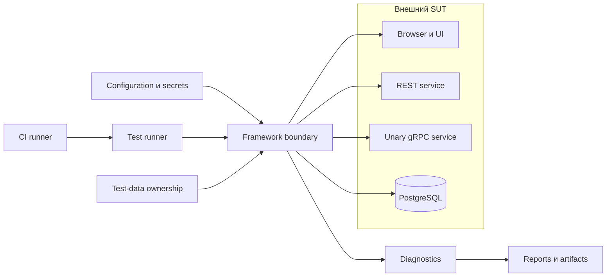
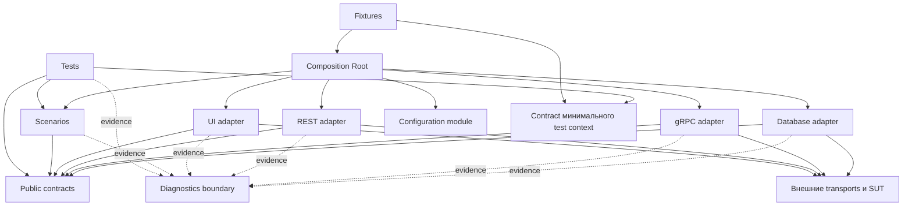
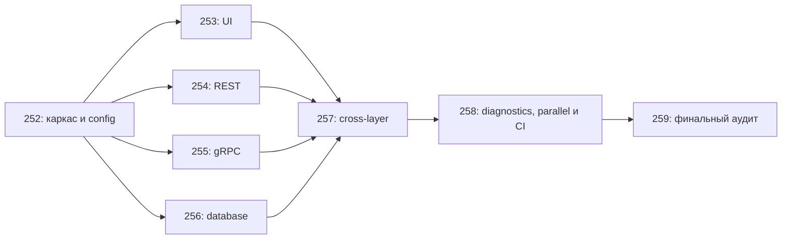

# Архитектурные решения и план реализации

## Предпосылки

Перед началом главы читатель должен завершить главу 250, получить `PASS` по пригодности выбранного SUT и утвердить область проекта, девять записей сценариев, требования, риски и начальный Definition of Done.

## Связь с предыдущей главой

Глава 250 определила, **что** должен доказать финальный проект и при каких условиях его можно начинать. Теперь необходимо решить, **какие границы** сохранят эти требования при реализации и **в каком порядке** строить framework. Архитектура не изменяет утверждённую область: она превращает её в проверяемый план.

## Цель главы

Преобразовать утверждённые требования, сценарии, риски и ограничения в явные архитектурные решения, границы ответственности и безопасную последовательность этапов 252–259 без реализации runtime-кода.

## Главный вопрос

> Какие решения нужно принять до создания слоёв и в каком порядке их реализовывать?

## Входные данные из главы 250

Архитектурное планирование начинается не с любимой структуры папок и не с выбора pattern. Его входами служат утверждённые записи:

- выбранный SUT и доказательства mandatory capabilities;
- девять записей сценариев;
- функциональные требования и требования к качеству;
- критерии приёмки и начальный Definition of Done;
- exclusions и внешние ограничения;
- риски, трудозатраты и границы безопасности;
- владельцы данных, setup, cleanup и ожидаемые доказательства.

Каждый архитектурный элемент должен быть связан хотя бы с требованием, сценарием, риском или явным ограничением. Элемент без такой связи подозрителен: возможно, он появился из-за архитектурной моды, а не потребности проекта.

> **Важно.** Архитектура приспосабливается к утверждённой области главы 250. Нельзя менять scope только для того, чтобы оправдать удобную структуру framework.

Статус главы 250 `REVIEWED BASELINE` подтверждает пройденные проверки, но не означает `CONTENT FROZEN`. Глава 251 использует этот baseline как вход и не пересматривает его скрыто.

## Запись архитектурного решения (ADR)

Architecture Decision Record, или ADR, фиксирует одно значимое решение и его причины. Одна запись отвечает на один архитектурный вопрос. ADR нужен там, где выбор влияет на несколько компонентов, имеет заметные последствия или должен быть пересмотрен при изменении внешнего условия.

Лёгкая запись ADR содержит:

| Поле | Назначение |
| --- | --- |
| ID | Стабильный идентификатор решения |
| Название | Короткий вопрос, который решает запись |
| Статус | `PROPOSED`, `ACCEPTED` или `SUPERSEDED` |
| Контекст | Требования, ограничения и факты, создающие проблему |
| Решение | Выбранный подход и его граница |
| Рассмотренные альтернативы | Реальные варианты, а не заведомо плохие противопоставления |
| Последствия | Польза, стоимость, ограничения и новые риски |
| Связанные требования | ID требований главы 250 |
| Связанные сценарии | ID сценариев главы 250 |
| Связанные риски | ID или точные названия рисков |
| Владелец | Кто отвечает за решение и его актуальность |
| Триггер пересмотра | Наблюдаемое условие, при котором ADR проверяется снова |

Статус `PROPOSED` означает, что решение ещё обсуждается. `ACCEPTED` разрешает зависимым этапам опираться на него. `SUPERSEDED` сохраняет историю, но указывает, что действует новая запись. Изменение решения требует трассируемой причины; старую запись не переписывают так, будто другого выбора не существовало.

ADR не является учебной статьёй, списком задач или доказательством реализации и не хранит детали каждой функции. Формулировка «такова best practice» также недостаточна: она не связывает решение с данным проектом. Изменение требований главы 250 не оформляется как ADR, потому что это изменение scope, а не архитектурный выбор.

### Начальные ADR проекта

Минимальный комплект до главы 252 включает три записи.

#### ADR-001. Направление исходных зависимостей

| Поле | Запись |
| --- | --- |
| Статус | `ACCEPTED` |
| Контекст | Сценарии используют UI, REST, gRPC и PostgreSQL; риск transport details в tests и циклических imports |
| Решение | Tests и orchestration зависят от публичных contracts; adapters реализуют contracts и зависят от внешних transports; contracts не импортируют реализации |
| Альтернативы | Tests напрямую вызывают transports; все слои импортируют общий mutable container |
| Последствия | Слои заменяемы и граф проверяем; появляются явные contracts и Composition Root |
| Связи | Девять сценариев; architecture acceptance; риск циклических зависимостей |
| Владелец | Автор архитектуры проекта |
| Триггер пересмотра | Новый transport требует обратного import или test получает infrastructure detail |

#### ADR-002. Единственная граница композиции и конфигурации

| Поле | Запись |
| --- | --- |
| Статус | `ACCEPTED` |
| Контекст | Local и CI profiles, secrets, controlled lifecycle и требование ранней runtime validation |
| Решение | Raw configuration читается и валидируется на одной границе; Composition Root получает immutable config, строит зависимости и выдаёт минимальный test context |
| Альтернативы | Каждый слой читает `process.env`; зависимости создаются при import; service locator выдаёт любой объект по имени |
| Последствия | Ошибки configuration видны до tests, secrets легче защитить; Composition Root необходимо удерживать узким |
| Связи | Configuration and secrets acceptance; `CI-01`; риск scattered environment reads |
| Владелец | Владелец каркаса главы 252 |
| Триггер пересмотра | Слой вынужден читать raw environment или test context раскрывает внутренности framework |

#### ADR-003. Политика generated gRPC code

| Поле | Запись |
| --- | --- |
| Статус | `PROPOSED` |
| Контекст | Generated client обязателен, но способ получения зависит от доступности `.proto`, правил выбранного SUT и CI |
| Решение | Выбор между commit, generation during setup и isolated generation step завершается до фиксации commands главы 252; до решения generated code считается внешней infrastructure dependency |
| Альтернативы | Commit generated files; generation during setup/build; отдельный изолированный generation step |
| Последствия | Отложенный выбор не блокирует моделирование слоёв, но блокирует завершение каркаса без pinned tool versions и drift policy |
| Связи | `GRPC-01`, `GRPC-02`; reproducibility и CI requirements; риск generated-code drift |
| Владелец | Владелец gRPC integration совместно с владельцем каркаса |
| Триггер пересмотра | Получены правила распространения `.proto` или изменился generator/toolchain |

> **Полезно знать.** Не каждой реализации нужен interface и не каждой детали нужен ADR. Запись оправдана реальной границей, альтернативами и последствиями.

## Контекст системы

Контекстная схема показывает внешние системы и границы ответственности, но не обещает конкретные классы.



Схема показывает логические границы интеграции, а не обязательную топологию развёртывания SUT. Framework не владеет SUT, его database schema или сетевой инфраструктурой. CI — среда выполнения, а не business layer. Reporting хранит доказательства, но не определяет результат сценария. Generated gRPC code остаётся infrastructure dependency. Credentials, endpoints и network access являются внешними preconditions; tests не администрируют production infrastructure и не изменяют рабочие данные.

## Модель слоёв и ответственности

| Область | Ответственность | Потребители | Разрешённые зависимости | Запрещённые зависимости | Входы и выходы | Ошибки и lifecycle | Глава реализации |
| --- | --- | --- | --- | --- | --- | --- | ---: |
| Tests | Выражают business expectation и итоговые assertions | Test runner | Scenarios и public layer contracts | Raw selectors, SQL, transport setup | Test case → проверенный результат | Не скрывают первичную ошибку; test scope | 253–257 |
| Scenarios | Координируют business operation между public boundaries | Tests | Contracts, test-data и evidence boundary | Конкретные transports и fixtures | Business input → business result | Сохраняют причинную цепочку; не владеют process resources | 257 |
| Contracts | Описывают нужное потребителю поведение | Tests, scenarios, adapters | Domain models | Реализации, fixtures, tests | Conceptual request/result | Явные absence и failure semantics; lifecycle не создают | 252–257 |
| UI layer | Владеет locators и browser actions | Tests, scenarios | UI contracts, Playwright transport | REST, gRPC, SQL, tests | UI operation → observable state | Browser/page lifecycle приходит извне | 253 |
| REST layer | Владеет HTTP setup, requests и runtime response checking | Tests, scenarios, setup/cleanup | REST contracts, API transport | UI, database implementation, tests | Business request → validated result | Transport и contract failures различимы | 254 |
| gRPC layer | Владеет channel, metadata, deadline и generated client boundary | Tests, scenarios | gRPC contracts, generated code | UI, fixtures, tests | Unary request → result/status | Channel ownership явный; status не теряется | 255 |
| Database layer | Владеет pool и parameterized operations | Tests, scenarios, cleanup | Database contracts, PostgreSQL driver | UI behavior, tests, raw environment | Query intent → normalized data | Pool owner закрывает ресурс; SQL failures наблюдаемы | 256 |
| Configuration | Преобразует raw inputs в validated immutable config | Composition Root | Raw input boundary и validator | Business scenarios и transports | Raw values → validated config | Invalid input останавливает startup | 252 |
| Fixtures | Связывают resource scope с test context и teardown | Tests | Composition Root и Playwright fixture model | Adapter internals как service locator | Options → bounded test context | Регистрируют cleanup сразу после успешного получения ownership | 252–257 |
| Diagnostics | Собирает sanitized evidence | Все исполняемые области | Evidence contracts и safe metadata | Secrets и управление test outcome | Events/errors → logs и attachments | Не заменяет исходную ошибку | 258 |
| Test-data lifecycle | Создаёт unique data, фиксирует owner и cleanup | Scenarios, fixtures | Public setup/cleanup contracts | Случайные shared records | Data request → owned identifiers | Reverse cleanup; residue observable | 257 |
| Composition Root | Строит graph из validated config | Fixtures | Config и concrete constructors | Assertions, test selection, business logic | Config → minimal test context | Construction failures видимы; регистрирует owners | 252 |

Таблица определяет conceptual public boundaries. Точные TypeScript types, constructors и validation library принадлежат следующим главам.

Ментальная модель слоёв: тесты формулируют ожидания, сценарии координируют бизнес-намерение, адаптеры взаимодействуют с транспортами, контракты стабилизируют границы, Composition Root собирает граф, а fixtures управляют областью жизни ресурсов теста.

## Направление зависимостей



Эта схема описывает **зависимости исходного кода**: стрелка направлена от потребителя к модулю или контракту, который он импортирует. Поэтому fixture зависит от Composition Root, а Composition Root — от модуля конфигурации, сценариев и конкретных конструкторов. Во время запуска проверенное значение конфигурации движется в обратном направлении: из модуля конфигурации в Composition Root, после чего собранный контекст передаётся fixture. Поток вызовов во время выполнения может идти от теста через сценарий к адаптеру и затем к SUT, а ответ — обратно. Поток данных может дополнительно пройти от REST setup к UI verification. Поток очистки идёт в обратном порядке владения. Эти потоки не разрешают обратные импорты.

Запрещены следующие направления:

- contracts импортируют реализации;
- adapters импортируют fixtures;
- нижние слои импортируют tests;
- Page Objects координируют несвязанные transports;
- repositories владеют UI behavior;
- service locator скрывает произвольное получение dependency;
- mutable global container хранит состояние tests;
- object graph создаётся скрыто при import;
- циклические зависимости маскируются общим helper module.

## План концептуальных контрактов

| Граница | Потребитель и ответственность | Входы и выходы | Отсутствие и поведение при ошибке | Владение и область жизни | Чувствительность | Предположения о SUT |
| --- | --- | --- | --- | --- | --- | --- |
| Authentication/session | UI и service scenarios получают разрешённую session capability | Credential reference → session result | Отсутствие credentials — startup failure; отказ SUT — observable auth failure | Session owner определяет scope и teardown | Credentials не входят в result и evidence | SUT предоставляет authentication для UI и минимум одного service layer |
| UI business operation | Test или scenario выполняет одно business action | Business data → observable UI result | Отсутствующий элемент не превращается в `undefined` без контекста | Page/browser приходит от fixture owner | URL и identifiers очищаются при необходимости | UI доступен в разрешённой среде и поддерживает выбранное business action |
| REST business operation | Scenario выполняет request без знания HTTP construction | Business request → runtime-validated result | `404` как ожидаемое отсутствие отличается от network failure | API context закрывает создавший его owner | Tokens и sensitive payload redacted | REST contract и status semantics подтверждены для выбранного SUT |
| gRPC business operation | Scenario вызывает unary method | Business request → result либо typed status semantics | Non-OK status сохраняет code и safe details | Channel/client owner определён при construction | Metadata summary sanitized | Доступны разрешённый `.proto` и unary service |
| Database verification | Scenario читает persisted state через query intent | Business identifier → normalized row/absence | Expected absence — явный result; query failure не маскируется | Pool закрывает fixture/Composition Root owner | Connection data и sensitive columns не выводятся | Согласованы read access, schema boundary и разрешённые operations |
| Business scenario | Test запускает межслойную business operation | Scenario input → result и owned identifiers | Частичный успех запускает cleanup и сохраняет обе ошибки | Scenario регистрирует created data у lifecycle owner | Evidence получает только safe fields | Слои относятся к одному business domain; consistency behavior известен или измерим |
| Test-data cleanup | Fixtures/scenarios удаляют только принадлежащие им records | Owned identifier → cleanup result | Already absent рассматривается по contract; residue — failure evidence | Owner назначается при создании данных | SQL, tokens и raw payload не раскрываются | Для каждой изменяемой entity подтверждён разрешённый cleanup path |
| Diagnostics evidence | Исполняемые области добавляют безопасный контекст | Event/error + safe metadata → evidence | Ошибка evidence не должна стирать primary failure | Artifact lifecycle принадлежит execution layer | Redaction обязательна | SUT и transports позволяют получить обязательное безопасное evidence |

Interface оправдан, когда существует реальный потребитель, граница transport или потребность в замене. Правило «один class — один interface» создаёт лишний слой без новой ответственности. Contracts не должны без необходимости раскрывать HTTP headers, Playwright locators, generated gRPC request types или SQL rows. Assertions остаются в tests, а ошибки сохраняют наблюдаемую причину. Само наличие контракта не доказывает качество архитектуры: важны его потребитель и скрываемая граница.

Например, контракт database verification полезен: он скрывает SQL и schema от сценария, которому нужен только нормализованный результат. Напротив, interface для простого formatter с одним потребителем и без архитектурной границы лишь повторит реализацию.

## План Composition Root

Будущий Composition Root получает validated immutable config и создаёт object graph в явном порядке:

1. низкоуровневые clients и database pool;
2. UI abstractions и adapters;
3. diagnostics dependencies;
4. business scenarios;
5. cleanup registration;
6. минимальный test context.

Он может связывать implementations с contracts и сохранять construction failure. При partial construction каждый успешно полученный ресурс сначала регистрируется у владельца; если следующий шаг завершается ошибкой, зарегистрированные ресурсы освобождаются в обратном порядке. Ошибка освобождения не скрывает construction failure. Composition Root не содержит assertions, не реализует business scenarios, не выбирает tests, не управляет CI и не раскрывает все внутренние dependencies.

Минимальный context содержит только то, что действительно использует test suite. Получение любого объекта по строковому имени превратило бы Composition Root в service locator и скрыло граф зависимостей.

## Стратегия конфигурации

План configuration охватывает:

- UI base URL;
- REST base URL;
- gRPC target;
- PostgreSQL connection reference;
- references на credentials;
- local или CI profile;
- deadlines и timeouts;
- non-secret CI metadata;
- artifact paths, если они требуются execution environment.

Raw values читаются в одной точке. После runtime validation остальная система получает immutable config. Отсутствующее mandatory value завершает startup явно. Secrets не имеют production defaults, не записываются в logs и не путешествуют по слоям без необходимости. Local и CI profiles имеют один conceptual contract, но разные внешние источники. Выбор профиля происходит на входной границе и не должен размножать условные ветвления по слоям.

Точная schema, validation library, environment loader и implementation откладываются до главы 252. До неё запрещены scattered `process.env` и скрытое чтение environment при import.

## План fixtures и областей жизни ресурсов

Scope выбирается по владению, mutation, стоимости construction, concurrency safety, внешним лимитам и требованиям isolation.

| Ресурс | Возможный scope | Владелец | Условие безопасного sharing | Закрытие и cleanup |
| --- | --- | --- | --- | --- |
| Browser | Worker либо предоставленный Playwright lifecycle | Playwright fixture | Browser process не хранит mutable state отдельного test | Закрывает fixture, создавшая ресурс |
| Browser context/page | Test | Test-scoped fixture | Не разделяется между независимыми tests | Закрывается после test, включая failure |
| API context | Test или worker | Создавшая fixture | Worker scope допустим только без mutable per-test auth/data | Закрывает создавший owner |
| gRPC channel/client | Test или worker | Composition/fixture owner | Channel concurrency-safe, metadata и mutable state не shared | Закрывается один раз владельцем |
| Database pool | Worker/process-independent instance | Composition/fixture owner | Pool не хранит test-owned transaction или mutable record | Закрывается после последнего consumer |
| Business data | Test либо fixture | Создатель записи | Mutable data не sharing по умолчанию | Cleanup exact owned identifiers |

Worker scope экономит construction, но не создаёт data isolation. Cleanup регистрируется сразу после успешного получения ownership, выполняется в обратном порядке и срабатывает после test failure и partial setup failure. Проверка residue подтверждает, что owned data не осталось.

Primary failure и cleanup failure должны оставаться видимыми одновременно. Cleanup не должен заменить исходную причину и не должен молча проглотить собственную ошибку.

Process-independent external resources, например SUT и environment-owned accounts, не закрываются framework: он освобождает только то, чем действительно владеет. Повторный `close` или cleanup нельзя считать безопасным по умолчанию; idempotency должна быть свойством конкретного contract, а каждый resource закрывает ровно один назначенный owner.

> **Типичная ошибка.** Выбирать worker scope только потому, что ресурс дорогой. Сначала проверяются mutation, isolation и concurrency safety.

## Политика сгенерированного кода

| Вариант | Reproducibility | CI и onboarding | Reviewability и размер | Drift control |
| --- | --- | --- | --- | --- |
| Commit generated files | Высока при зафиксированном generator; clean install не требует generation | Проще startup, но обновление требует дисциплины | Diff видим, repository растёт | CI может повторно генерировать и сравнивать |
| Generate during setup/build | Зависит от pinned tool и доступного `.proto` | CI и новый участник обязаны иметь toolchain | Generated diff не хранится | Generation failure и version drift видны в build |
| Isolated generation step | Граница toolchain явная | Нужен отдельный документированный step | Основной runtime чище | Output и versions проверяются отдельно |

Выбор зависит от правил распространения `.proto`, доступности generator в CI и требований выбранного SUT. ADR-003 остаётся `PROPOSED`: owner обязан получить эти данные и принять либо обоснованно отложить решение до завершения главы 252. Независимо от варианта фиксируются tool versions, source contract, команда воспроизведения и drift check. Generated files и scripts в этой главе не создаются.

## План структуры директорий

Структура является предложением, а не универсальным стандартом:

```text
examples/04-final-project/
  src/
    config/
    fixtures/
    scenarios/
    contracts/
    ui/
    api/
    grpc/
      generated/
      client/
    database/
    diagnostics/
    test-data/
  tests/
    ui/
    rest/
    grpc/
    database/
    cross-layer/
  docs/
    adr/
```

| Директория | Ответственность | Владелец-глава | Запрещённая зависимость |
| --- | --- | ---: | --- |
| `config/` | Validated immutable configuration | 252 | Tests и business decisions |
| `fixtures/` | Scope, construction и teardown | 252–257 | Скрытый service locator |
| `contracts/` | Consumer-facing boundaries | 252–257 | Concrete adapters и tests |
| `scenarios/` | Business orchestration | 257 | Raw transports и selectors |
| `ui/` | Locators и browser actions | 253 | REST, SQL и tests |
| `api/` | REST transport и runtime checking | 254 | UI и tests |
| `grpc/` | Unary transport и generated boundary | 255 | Fixtures и tests |
| `grpc/generated/` | Изолированный generated output, если выбранная policy материализует его в project tree | 252/255 | Handwritten business logic |
| `grpc/client/` | Handwritten adapter над generated boundary | 255 | Tests и fixtures |
| `database/` | Pool и parameterized operations | 256 | UI behavior и tests |
| `diagnostics/` | Sanitized evidence | 258 | Secrets и CI orchestration |
| `test-data/` | Unique data, owner и cleanup registry | 257 | Shared mutable test state |
| `tests/` | Business expectations | 253–257 | Raw transport setup |
| `docs/adr/` | Decision history | 251–259 | Runtime behavior |

Папки в этой главе не создаются. Само наличие папок не доказывает соблюдение архитектурных границ. `grpc/generated/` обозначает границу generated source, а не решение хранить output в Git: окончательное расположение и способ materialization следуют ADR-003. Если выбранная структура изменится, responsibility и dependency direction должны остаться явными.

## План этапов 252–259



Условие входа описывает состояние, необходимое до начала этапа, а зависимость указывает, на какие утверждённые границы он опирается. Проверка подтверждает поведение результата, а доказательство сохраняет наблюдаемый итог этой проверки.

| Глава | Условие входа | Зависимость | Результат | Проверка | Доказательство | Главный риск | Условие выхода |
| ---: | --- | --- | --- | --- | --- | --- | --- |
| 252 | Architecture gate имеет `PASS` | Architecture contract и SUT config contract | Compiling skeleton, commands, validated profiles, secrets boundary, base fixtures | Clean install, compilation, invalid-config failure, dry startup | Logs команд и sanitized validation error | Scattered config или premature clients | Runtime composition готова для первого layer |
| 253 | Skeleton и shared boundaries стабильны | Config, UI contracts и lifecycle plan | UI layer, auth state, UI fixtures, два UI scenarios | Независимые runs и controlled UI failure | Results, screenshot и Trace | Shared session или unstable locator | UI public API и data needs зафиксированы |
| 254 | Skeleton и REST data needs утверждены | Config, REST contracts и cleanup plan | REST client, auth, runtime checks, setup/cleanup, два REST scenarios | Positive, negative и invalid-response checks | Sanitized request/response и validation result | Type annotation вместо runtime validation | REST setup/cleanup API стабилен |
| 255 | `.proto` и generated policy готовы | Config, gRPC contracts и generated boundary | Client integration, metadata, deadlines, status handling, два unary scenarios | Successful и expected non-OK calls | Sanitized status, metadata summary и deadline | Drift или потеря status/deadline | gRPC public API и comparison data готовы |
| 256 | Database access boundary подтверждена | Config, database contract и verification needs | Pool lifecycle, parameterized DAL, cleanup operation, persisted-state verification | Connection release, parameterization и residue query | Safe query ID и normalized comparison | Leaked connection или unsafe SQL | Database public API и normalized model готовы |
| 257 | Public APIs слоёв устойчивы | Scenario records, contracts и ownership map | Три cross-layer scenarios, canonical model, unique data, failure-safe cleanup | Independent runs, no residue, polling deadline | Scenario results, cleanup log и residue checks | Layer bypass и ambiguous cleanup | Mandatory portfolio завершён |
| 258 | Mandatory portfolio завершён | Diagnostics requirements и execution model | Logs, Allure, attachments, two-worker execution и GitHub Actions | Три stability runs, включая CI, и controlled failure | Allure results, CI artifacts и failed workflow | Retry-dependent passing или secret leak | Release candidate и evidence package готовы |
| 259 | Release candidate и evidence package готовы | Initial DoD и frozen review rubric | Final audits, README, limitations и refactoring report | DoD classification и independent reproduction | Audit records и reproduced command result | Новая feature вместо закрытия finding | Blockers отсутствуют, итог доказан |

Последовательность следует зависимостям. Главы 253–256 могут частично выполняться параллельно только после стабилизации общих contracts и composition boundary. Integration feedback собирается на каждом этапе, а глава 257 завершает три обязательных cross-layer scenarios. Глава 259 не должна случайно добавлять отсутствующую архитектуру: она проверяет готовность и закрывает findings.

## Трассируемость решений

Глава 251 расширяет цепочку главы 250:

Цепочка трассируемости: `requirement → scenario → ADR → planned component → implementation chapter → future evidence`.

Связи many-to-many: один ADR может обслуживать несколько требований, а одно требование может требовать нескольких решений. На этом этапе заполняются ADR, planned component и owner chapter. Реализации и фактические evidence появятся позже.

Проверка orphan records задаёт два вопроса:

1. Есть ли у каждого planned component связанное требование, scenario, risk или constraint?
2. Есть ли у каждого mandatory requirement владелец-этап и план доказательства?

Компонент без причины может быть лишней abstraction. ADR без alternatives и consequences неполон. Требование без этапа реализации потеряется между планом и CI.

## Журнал отложенных решений

| Решение | Причина отсрочки | Владелец | Блокирующее условие | Последний момент | Нужное evidence | Риск задержки | Статус |
| --- | --- | --- | --- | --- | --- | --- | --- |
| Runtime-validation library для config | Нужна совместимость с выбранным toolchain | Глава 252 | Блокирует completion 252 | До реализации config schema | Сравнение API, errors и CI support | Unvalidated startup | `PROPOSED` |
| Granularity Page Objects | Нужны фактические UI boundaries | Глава 253 | Не блокирует start 252 | До второго UI scenario | Повторяющиеся behavior и locators | God Page Object | `PROPOSED` |
| REST runtime-schema library | Зависит от OpenAPI/JSON Schema SUT | Глава 254 | Блокирует REST completion | До first response validator | Contract availability | Annotation вместо runtime check | `PROPOSED` |
| Generated-code storage | Нужны `.proto` policy и CI facts | 252/255 | Блокирует completion 252, если влияет на commands | До фиксации clean-install command | License, generator и drift check | Невоспроизводимая generation | `PROPOSED` |
| Database cleanup mechanism | Зависит от write access и entity ownership | 256/257 | Блокирует state-changing scenario | До first persisted mutation | Allowed cleanup proof | Residual data | `PROPOSED` |
| Report retention | Зависит от CI constraints | Глава 258 | Не блокирует start 252 | До workflow artifacts | Storage and policy limits | Потеря evidence | `PROPOSED` |
| Sharding | Optional и нужен только при фактической длительности | Глава 258 | Не блокирует mandatory scope | После stability proof | Execution timing | Premature complexity | `PROPOSED` |

Отсрочка — это явное управляемое решение, а не способ избежать выбора. Отложенная запись содержит owner и последний момент решения. Нельзя откладывать dependency direction, configuration boundary, resource ownership или блокирующий риск, необходимые для начала главы 252.

## Архитектурные риски

Следующие записи описывают возможные будущие риски и их наблюдаемые сигналы, а не утверждают, что defects уже существуют. Риск может реализоваться в будущем, проблема уже существует, а сигнал помогает заметить переход от возможности к факту.

| Риск | Сигнал | Влияние | Предотвращение | Владелец | Триггер / blocker |
| --- | --- | --- | --- | --- | --- |
| Архитектура без requirements | Компонент не связан с traceability | Лишняя сложность | Orphan audit | Автор архитектуры | Blocker при mandatory component без причины |
| Premature abstraction | Один consumer и только гипотетическая замена | Высокая стоимость изменений | Вводить boundary по evidence | Владелец слоя | Review при второй реализации |
| Interface для каждого class | Contracts повторяют implementations | Шум и скрытая ответственность | Consumer-first contract plan | Владелец слоя | Review при росте passthrough APIs |
| Копирование учебной реализации | Названия и структура не соответствуют SUT | Неверные assumptions | Связывать решения с главой 250 | Автор проекта | Blocker при конфликте с SUT |
| Service locator | Dependency получается по имени в runtime | Скрытый graph | Bounded Composition Root | Глава 252 | Blocker для architecture evidence |
| Global mutable state | Tests влияют друг на друга | Flakiness | Explicit scope и owners | Fixtures owner | Blocker для parallel proof |
| Cycle | Два слоя импортируют друг друга | Невозможная замена и startup risk | Direction matrix | Автор архитектуры | Blocker до 252 |
| Raw selectors или SQL в tests | Transport detail виден в scenario | Coupling | Public layer APIs | Владелец слоя | Major review signal |
| SUT details в scenarios | Business flow принимает transport DTO | Слабая replaceability | Normalized domain boundary | Глава 257 | Review при втором transport |
| Scattered environment reads | Layers сами читают environment | Невоспроизводимый startup | One raw-input boundary | Глава 252 | Blocker до layer implementation |
| Cross-layer test для каждого behavior | Простые проверки требуют всех services | Медленный и хрупкий suite | Только три representative scenarios | Глава 257 | Review при расширении portfolio |
| Worker-shared mutable data | Один test меняет данные другого | Нестабильность | Test ownership и unique identifiers | Data owner | Blocker для two-worker run |
| Неясный cleanup owner | Никто не удаляет partial setup | Residue | Register cleanup at ownership | Глава 257 | Blocker для state-changing work |
| Generated-code drift | Local и CI clients различаются | Compile/runtime failure | Pinned generator и drift policy | gRPC owner | Blocker для gRPC completion |
| Diagnostics coupled to CI | Локальный failure не имеет evidence | Трудное расследование | Evidence boundary отдельно от environment | Глава 258 | Review при первом controlled failure |
| Overexposed test context | Test получает все internals | Обход boundaries | Минимальный context | Глава 252 | Review при каждом новом exposure |

## Проверка готовности главы 252

| Статус | Условие |
| --- | --- |
| `PASS` | Review evidence подтверждает: scope главы 250 остаётся valid; SUT имеет `PASS`; девять mandatory scenarios определены; context diagram, responsibilities, dependency direction, config boundary, lifecycle owners, directory plan и milestones утверждены; generated-code policy принята или валидно отложена; unresolved blocking ADR и blocking risks отсутствуют |
| `BLOCKED` | Условие неизвестно либо не хватает evidence для решения, но указаны owner, следующее действие и deadline; semantic change главы 250 не предложено |
| `FAIL` | Архитектура противоречит mandatory scope, не назначает resource owner, создаёт cycle либо требует изменить утверждённые requirements для своей реализации |

При `BLOCKED` и `FAIL` runtime implementation не начинается. Проверка не становится `PASS` только по заявлению автора или из-за наличия диаграмм: обязательны review evidence и проверяемые входные записи. Если план выявил настоящий semantic defect в главе 250, глава 251 не исправляет baseline: необходим отдельный controlled change и повтор соответствующих reviews.

## Распространённые ошибки

- Начинать с folder structure вместо requirements и scenarios.
- Записывать «использовать clean architecture» без context, alternatives и consequences.
- Путать зависимость исходного кода с потоком вызовов во время выполнения.
- Создавать interface для каждого будущего class.
- Выбирать один fixture scope для всех resources.
- Делать Composition Root доступным как global service locator.
- Откладывать ownership и cleanup до главы 257.
- Считать generated code обычным handwritten module без version и drift policy.
- Планировать интеграцию только после завершения всех отдельных слоёв.
- Использовать главу 259 для добавления обязательных частей, которых нет в milestone plan.

## Практический список проверки

- [ ] Каждый planned component связан с requirement, scenario, risk или constraint.
- [ ] Минимум три ADR содержат alternatives, consequences, owner и review trigger.
- [ ] Context diagram отделяет framework от SUT и execution environment.
- [ ] Для каждого слоя определены allowed и forbidden dependencies.
- [ ] Зависимости исходного кода, потоки вызовов, данных и очистки не смешаны.
- [ ] Contracts вводятся по реальной границе, а не по числу classes.
- [ ] Composition Root ограничен construction и ownership.
- [ ] Raw configuration имеет одну validation boundary.
- [ ] Каждый resource и created record имеет owner и close/cleanup rule.
- [ ] Generated-code policy принята или имеет корректную deferred record.
- [ ] Milestones 252–259 имеют entry и exit conditions.
- [ ] Blocking architecture risks отсутствуют.

## Краткие итоги

Архитектура финального проекта — это набор проверяемых решений, связанных с утверждённой областью. ADR сохраняет причины и последствия выбора. Таблица ответственности и направление зависимостей защищают границы. Composition Root, конфигурация и план областей жизни назначают владельцев до появления кода. План этапов превращает архитектуру в последовательность доказуемых результатов.

## Что нужно запомнить

Основная последовательность: `утверждённое требование → архитектурное решение → граница ответственности → этап реализации → будущее доказательство`.

- Архитектура не меняет scope главы 250.
- Зависимость исходного кода не равна потоку вызовов во время выполнения.
- Contract нужен потребителю, а не каждому class.
- Область жизни ресурса следует из владения и требований изоляции.
- Отложенное решение обязано иметь владельца и последний момент принятия.
- Глава 252 начинается только при `PASS` архитектурной проверки готовности.

## Быстрая проверка

1. Почему «best practice» недостаточно для ADR?
2. Чем зависимость исходного кода отличается от потока вызовов во время выполнения?
3. Когда interface создаёт границу, а когда только дублирует implementation?
4. Почему worker-scoped resource не гарантирует data isolation?
5. Что делает отложенное решение управляемым?
6. Какие условия блокируют начало главы 252?

## Практика

Практика продолжает архитектурное планирование: нужно классифицировать решения, проверить dependency graph, улучшить ADR, назначить resource scopes, сравнить generated-code policies и собрать milestone plan.

## Переход к следующей главе

Архитектурный контракт готовит вход для главы 252. Далее план превратится в минимальный компилируемый каркас с проверенной конфигурацией, local/CI profiles, secrets boundary, base fixtures и первой CI-compatible command. Реализация business layers всё ещё останется за пределами этого этапа.
