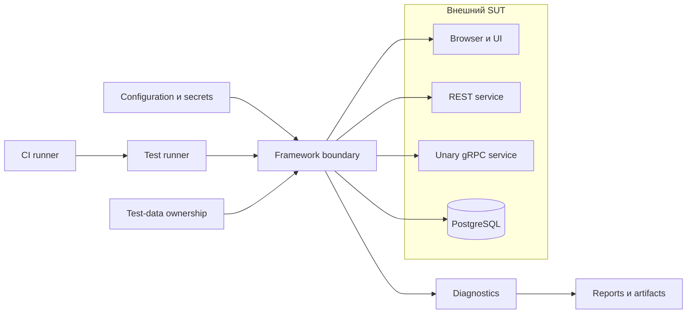
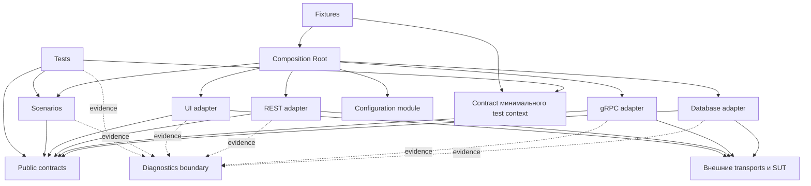
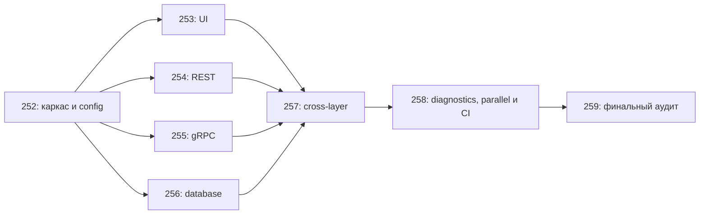

# Архитектурные решения и план реализации

## Предпосылки

Перед началом главы читатель должен завершить главу 250, получить `PASS` по пригодности выбранного SUT и утвердить область проекта, девять записей сценариев, требования, риски и начальный Definition of Done.

## Связь с предыдущей главой

Глава 250 определила, **что** должен доказать финальный проект и при каких условиях его можно начинать. Теперь необходимо решить, **какие границы** сохранят эти требования при реализации и **в каком порядке** строить framework. Архитектура не изменяет утверждённую область: она превращает её в проверяемый план.

## Цель главы

Преобразовать утверждённые требования, сценарии, риски и ограничения в явные архитектурные решения, границы ответственности и безопасную последовательность этапов 252–259 без реализации runtime-кода.

## Главный вопрос

> Какие решения нужно принять до создания слоёв и в каком порядке их реализовывать?

## Входные данные из главы 250

Архитектурное планирование начинается не с любимой структуры папок и не с выбора шаблона. Его входами служат утверждённые записи:

- выбранный SUT и доказательства обязательных возможностей;
- девять записей сценариев;
- функциональные требования и требования к качеству;
- критерии приёмки и начальный Definition of Done;
- исключения из области и внешние ограничения;
- риски, трудозатраты и границы безопасности;
- владельцы данных, подготовки, очистки и ожидаемые доказательства.

Каждый архитектурный элемент должен быть связан хотя бы с требованием, сценарием, риском или явным ограничением. Элемент без такой связи подозрителен: возможно, он появился из-за архитектурной моды, а не потребности проекта.

> **Важно.** Архитектура приспосабливается к утверждённой области главы 250. Нельзя менять область только для того, чтобы оправдать удобную структуру фреймворка.

Статус главы 250 «базовая версия проверена» подтверждает пройденные проверки, но не означает, что содержимое заморожено. Глава 251 использует эту базовую версию как вход и не пересматривает её скрыто.

## Запись архитектурного решения (ADR)

Запись архитектурного решения, или ADR, фиксирует одно значимое решение и его причины. Одна запись отвечает на один архитектурный вопрос. ADR нужен там, где выбор влияет на несколько компонентов, имеет заметные последствия или должен быть пересмотрен при изменении внешнего условия.

Лёгкая запись ADR содержит:

| Поле | Назначение |
| --- | --- |
| Идентификатор | Устойчивый идентификатор решения |
| Название | Короткий вопрос, который решает запись |
| Статус | `PROPOSED`, `ACCEPTED` или `SUPERSEDED` |
| Контекст | Требования, ограничения и факты, создающие проблему |
| Решение | Выбранный подход и его граница |
| Рассмотренные альтернативы | Реальные варианты, а не заведомо плохие противопоставления |
| Последствия | Польза, стоимость, ограничения и новые риски |
| Связанные требования | Идентификаторы требований главы 250 |
| Связанные сценарии | Идентификаторы сценариев главы 250 |
| Связанные риски | Идентификаторы или точные названия рисков |
| Владелец | Кто отвечает за решение и его актуальность |
| Триггер пересмотра | Наблюдаемое условие, при котором ADR проверяется снова |

Статус `PROPOSED` означает, что решение ещё обсуждается. `ACCEPTED` разрешает зависимым этапам опираться на него. `SUPERSEDED` сохраняет историю, но указывает, что действует новая запись. Изменение решения требует трассируемой причины; старую запись не переписывают так, будто другого выбора не существовало.

ADR не является учебной статьёй, списком задач или доказательством реализации и не хранит детали каждой функции. Формулировка «так принято» тоже недостаточна: она не связывает решение с этим проектом. Изменение требований главы 250 не оформляется как ADR, потому что это изменение области, а не архитектурный выбор.

### Начальные ADR проекта

Минимальный комплект до главы 252 включает три записи.

#### ADR-001. Направление исходных зависимостей

| Поле | Запись |
| --- | --- |
| Статус | `ACCEPTED` |
| Контекст | Сценарии используют UI, REST, gRPC и PostgreSQL; есть риск попадания деталей транспорта в тесты и появления циклических импортов |
| Решение | Тесты и сценарии зависят от публичных контрактов; адаптеры реализуют контракты и зависят от внешних транспортов; контракты не импортируют реализации |
| Альтернативы | Тесты напрямую вызывают транспорты; все слои импортируют общий изменяемый контейнер |
| Последствия | Слои заменяемы и граф проверяем; появляются явные контракты и Composition Root |
| Связи | Девять сценариев; приёмка архитектуры; риск циклических зависимостей |
| Владелец | Автор архитектуры проекта |
| Триггер пересмотра | Новый транспорт требует обратного импорта или тест получает деталь инфраструктуры |

#### ADR-002. Единственная граница композиции и конфигурации

| Поле | Запись |
| --- | --- |
| Статус | `ACCEPTED` |
| Контекст | Локальный профиль и профиль CI, секреты, управляемый жизненный цикл и требование ранней проверки во время выполнения |
| Решение | Сырая конфигурация читается и проверяется на одной границе; Composition Root получает неизменяемую конфигурацию, строит зависимости и выдаёт минимальный контекст теста |
| Альтернативы | Каждый слой читает `process.env`; зависимости создаются при импорте; поиск службы выдаёт любой объект по имени |
| Последствия | Ошибки конфигурации видны до тестов, секреты легче защитить; Composition Root нужно удерживать узким |
| Связи | Приёмка конфигурации и секретов; `CI-01`; риск разбросанного чтения окружения |
| Владелец | Владелец каркаса главы 252 |
| Триггер пересмотра | Слой вынужден читать сырое окружение или контекст теста раскрывает внутренности фреймворка |

#### ADR-003. Политика сгенерированного кода gRPC

| Поле | Запись |
| --- | --- |
| Статус | `PROPOSED` |
| Контекст | Сгенерированный клиент обязателен, но способ получения зависит от доступности `.proto`, правил выбранного SUT и CI |
| Решение | Выбор между хранением в репозитории, генерацией при подготовке и отдельным шагом генерации завершается до фиксации команд главы 252; до решения сгенерированный код считается внешней зависимостью инфраструктуры |
| Альтернативы | Хранить сгенерированные файлы в репозитории; генерировать при подготовке или сборке; выделить отдельный изолированный шаг генерации |
| Последствия | Отложенный выбор не блокирует моделирование слоёв, но блокирует завершение каркаса без закреплённых версий инструментов и политики расхождений |
| Связи | `GRPC-01`, `GRPC-02`; требования воспроизводимости и CI; риск расхождения сгенерированного кода |
| Владелец | Владелец интеграции gRPC совместно с владельцем каркаса |
| Триггер пересмотра | Получены правила распространения `.proto` или изменился генератор либо набор инструментов |

> **Полезно знать.** Не каждой реализации нужен интерфейс и не каждой детали нужен ADR. Запись оправдана реальной границей, альтернативами и последствиями.

## Контекст системы

Контекстная схема показывает внешние системы и границы ответственности, но не обещает конкретные классы.


```mermaid
flowchart LR
    CI[CI runner] --> TR[Test runner]
    CFG[Configuration и secrets] --> FW[Framework boundary]
    TR --> FW
    FW --> DIAG[Diagnostics]
    DIAG --> ART[Reports и artifacts]
    DATA[Test-data ownership] --> FW
    subgraph SUT[Внешний SUT]
        UI[Browser и UI]
        REST[REST service]
        GRPC[Unary gRPC service]
        DB[(PostgreSQL)]
    end
    FW --> UI
    FW --> REST
    FW --> GRPC
    FW --> DB
```

Схема показывает логические границы интеграции, а не обязательную топологию развёртывания SUT. Фреймворк не владеет SUT, его схемой базы данных и сетевой инфраструктурой. CI — среда выполнения, а не слой бизнес-логики. Отчётность хранит доказательства, но не определяет результат сценария. Сгенерированный код gRPC остаётся зависимостью инфраструктуры. Учётные данные, адреса и сетевой доступ являются внешними предусловиями; тесты не администрируют рабочую инфраструктуру и не изменяют рабочие данные.

## Модель слоёв и ответственности

| Область | Ответственность | Потребители | Разрешённые зависимости | Запрещённые зависимости | Входы и выходы | Ошибки и жизненный цикл | Глава реализации |
| --- | --- | --- | --- | --- | --- | --- | ---: |
| Тесты | Выражают бизнес-ожидание и итоговые проверки | Раннер | Сценарии и публичные контракты слоёв | Сырые селекторы, SQL, настройка транспорта | Тестовый случай → проверенный результат | Не скрывают первичную ошибку; область теста | 253–257 |
| Сценарии | Координируют бизнес-операцию между публичными границами | Тесты | Контракты, тестовые данные и граница доказательств | Конкретные транспорты и фикстуры | Бизнес-вход → бизнес-результат | Сохраняют причинную цепочку; не владеют ресурсами процесса | 257 |
| Контракты | Описывают нужное потребителю поведение | Тесты, сценарии, адаптеры | Модели предметной области | Реализации, фикстуры, тесты | Смысловой запрос и результат | Явная семантика отсутствия и отказа; жизненный цикл не создают | 252–257 |
| Слой UI | Владеет локаторами и действиями в браузере | Тесты, сценарии | Контракты UI, транспорт Playwright | REST, gRPC, SQL, тесты | Операция в интерфейсе → наблюдаемое состояние | Жизненный цикл браузера и страницы приходит извне | 253 |
| Слой REST | Владеет настройкой HTTP, запросами и проверкой ответа во время выполнения | Тесты, сценарии, подготовка и очистка | Контракты REST, транспорт API | UI, реализация базы данных, тесты | Бизнес-запрос → проверенный результат | Отказы транспорта и контракта различимы | 254 |
| Слой gRPC | Владеет соединением, метаданными, сроком и границей сгенерированного клиента | Тесты, сценарии | Контракты gRPC, сгенерированный код | UI, фикстуры, тесты | Унарный запрос → результат или статус | Владение соединением явное; статус не теряется | 255 |
| Слой базы данных | Владеет пулом и параметризованными операциями | Тесты, сценарии, очистка | Контракты базы, драйвер PostgreSQL | Поведение UI, тесты, сырое окружение | Намерение запроса → нормализованные данные | Владелец пула закрывает ресурс; отказы SQL наблюдаемы | 256 |
| Конфигурация | Превращает сырые входные данные в проверенную неизменяемую конфигурацию | Composition Root | Граница сырого входа и проверка | Бизнес-сценарии и транспорты | Сырые значения → проверенная конфигурация | Неверный вход останавливает запуск | 252 |
| Фикстуры | Связывают область жизни ресурса с контекстом теста и завершением | Тесты | Composition Root и модель фикстур Playwright | Внутренности адаптеров как поиск службы | Параметры → ограниченный контекст теста | Регистрируют очистку сразу после получения владения | 252–257 |
| Диагностика | Собирает очищенные доказательства | Все исполняемые области | Контракты доказательств и безопасные метаданные | Секреты и управление результатом теста | События и ошибки → журналы и вложения | Не заменяет исходную ошибку | 258 |
| Жизненный цикл тестовых данных | Создаёт уникальные данные, фиксирует владельца и очистку | Сценарии, фикстуры | Публичные контракты подготовки и очистки | Случайные общие записи | Запрос данных → собственные идентификаторы | Очистка в обратном порядке; остатки наблюдаемы | 257 |
| Composition Root | Строит граф из проверенной конфигурации | Фикстуры | Конфигурация и конкретные конструкторы | Проверки, отбор тестов, бизнес-логика | Конфигурация → минимальный контекст теста | Отказы сборки видимы; регистрирует владельцев | 252 |

Таблица определяет смысловые публичные границы. Точные типы TypeScript, конструкторы и библиотека проверки принадлежат следующим главам.

Мысленная модель слоёв: тесты формулируют ожидания, сценарии координируют бизнес-намерение, адаптеры взаимодействуют с транспортами, контракты стабилизируют границы, Composition Root собирает граф, а фикстуры управляют областью жизни ресурсов теста.

## Направление зависимостей


```mermaid
flowchart TD
    T[Tests] --> S[Scenarios]
    T --> C[Public contracts]
    S --> C
    UIA[UI adapter] --> C
    RA[REST adapter] --> C
    GA[gRPC adapter] --> C
    DA[Database adapter] --> C
    UIA --> EXT[Внешние transports и SUT]
    RA --> EXT
    GA --> EXT
    DA --> EXT
    FIX[Fixtures] --> ROOT[Composition Root]
    ROOT --> CFG[Configuration module]
    ROOT --> S
    ROOT --> UIA
    ROOT --> RA
    ROOT --> GA
    ROOT --> DA
    FIX --> CTX[Contract минимального test context]
    T --> CTX
    T -. evidence .-> E[Diagnostics boundary]
    S -. evidence .-> E
    UIA -. evidence .-> E
    RA -. evidence .-> E
    GA -. evidence .-> E
    DA -. evidence .-> E
```

Эта схема описывает **зависимости исходного кода**: стрелка направлена от потребителя к модулю или контракту, который он импортирует. Поэтому фикстура зависит от Composition Root, а тот — от модуля конфигурации, сценариев и конкретных конструкторов. Во время запуска проверенное значение конфигурации движется в обратном направлении: из модуля конфигурации в Composition Root, после чего собранный контекст передаётся фикстуре. Поток вызовов во время выполнения может идти от теста через сценарий к адаптеру и затем к SUT, а ответ — обратно. Поток данных может дополнительно пройти от подготовки через REST к проверке в интерфейсе. Очистка идёт в обратном порядке владения. Эти потоки не разрешают обратных импортов.

Запрещены следующие направления:

- контракты импортируют реализации;
- адаптеры импортируют фикстуры;
- нижние слои импортируют тесты;
- объекты страниц координируют несвязанные транспорты;
- репозитории владеют поведением интерфейса;
- поиск службы скрывает произвольное получение зависимости;
- изменяемый глобальный контейнер хранит состояние тестов;
- граф объектов создаётся скрыто при импорте;
- циклические зависимости маскируются общим вспомогательным модулем.

## План концептуальных контрактов

| Граница | Потребитель и ответственность | Входы и выходы | Отсутствие и поведение при ошибке | Владение и область жизни | Чувствительность | Предположения о SUT |
| --- | --- | --- | --- | --- | --- | --- |
| Аутентификация и сессия | Сценарии интерфейса и сервисов получают разрешённую сессию | Ссылка на учётные данные → результат сессии | Отсутствие учётных данных — отказ при запуске; отказ SUT — наблюдаемый отказ аутентификации | Владелец сессии определяет область и завершение | Учётные данные не входят в результат и доказательства | SUT предоставляет аутентификацию для интерфейса и минимум одного слоя сервисов |
| Бизнес-операция в интерфейсе | Тест или сценарий выполняет одно бизнес-действие | Бизнес-данные → наблюдаемый результат в интерфейсе | Отсутствующий элемент не превращается в `undefined` без контекста | Страница и браузер приходят от владельца фикстуры | Адреса и идентификаторы при необходимости маскируются | Интерфейс доступен в разрешённой среде и поддерживает выбранное действие |
| Бизнес-операция REST | Сценарий выполняет запрос, не зная, как собран HTTP | Бизнес-запрос → результат, проверенный во время выполнения | `404` как ожидаемое отсутствие отличается от отказа сети | Контекст API закрывает тот, кто его создал | Токены и чувствительные тела маскируются | Контракт REST и семантика кодов подтверждены для выбранного SUT |
| Бизнес-операция gRPC | Сценарий вызывает унарный метод | Бизнес-запрос → результат либо типизированная семантика статуса | Статус, отличный от `OK`, сохраняет код и безопасные детали | Владелец соединения и клиента определён при сборке | Сводка метаданных очищается | Доступны разрешённый `.proto` и унарный сервис |
| Проверка в базе данных | Сценарий читает сохранённое состояние через намерение запроса | Бизнес-идентификатор → нормализованная строка или её отсутствие | Ожидаемое отсутствие — явный результат; отказ запроса не маскируется | Пул закрывает владелец: фикстура или Composition Root | Данные подключения и чувствительные колонки не выводятся | Согласованы доступ на чтение, граница схемы и разрешённые операции |
| Бизнес-сценарий | Тест запускает межслойную бизнес-операцию | Вход сценария → результат и собственные идентификаторы | Частичный успех запускает очистку и сохраняет обе ошибки | Сценарий регистрирует созданные данные у владельца жизненного цикла | В доказательства попадают только безопасные поля | Слои относятся к одной предметной области; поведение согласованности известно или измеримо |
| Очистка тестовых данных | Фикстуры и сценарии удаляют только свои записи | Собственный идентификатор → результат очистки | Уже отсутствующая запись обрабатывается по контракту; остатки — доказательство отказа | Владелец назначается при создании данных | SQL, токены и сырые тела не раскрываются | Для каждой изменяемой сущности подтверждён разрешённый путь очистки |
| Доказательства диагностики | Исполняемые области добавляют безопасный контекст | Событие или ошибка плюс безопасные метаданные → доказательство | Ошибка в сборе доказательств не должна стирать первичный отказ | Жизненный цикл артефактов принадлежит слою выполнения | Маскирование обязательно | SUT и транспорты позволяют получить обязательные безопасные доказательства |

Интерфейс оправдан, когда существует реальный потребитель, граница транспорта или потребность в замене. Правило «один класс — один интерфейс» создаёт лишний слой без новой ответственности. Контракты не должны без необходимости раскрывать заголовки HTTP, локаторы Playwright, сгенерированные типы запросов gRPC или строки SQL. Проверки остаются в тестах, а ошибки сохраняют наблюдаемую причину. Само наличие контракта не доказывает качества архитектуры: важны его потребитель и скрываемая граница.

Например, контракт проверки в базе данных полезен: он скрывает SQL и схему от сценария, которому нужен только нормализованный результат. Напротив, интерфейс для простого форматировщика с одним потребителем и без архитектурной границы лишь повторит реализацию.

## План Composition Root

Будущий Composition Root получает проверенную неизменяемую конфигурацию и создаёт граф объектов в явном порядке:

1. низкоуровневые клиенты и пул базы данных;
2. абстракции интерфейса и адаптеры;
3. зависимости диагностики;
4. бизнес-сценарии;
5. регистрация очистки;
6. минимальный контекст теста.

Он может связывать реализации с контрактами и сохранять ошибку сборки. При частичной сборке каждый успешно полученный ресурс сначала регистрируется у владельца; если следующий шаг завершается ошибкой, зарегистрированные ресурсы освобождаются в обратном порядке. Ошибка освобождения не скрывает ошибку сборки. Composition Root не содержит проверок, не реализует бизнес-сценарии, не выбирает тесты, не управляет CI и не раскрывает все внутренние зависимости.

Минимальный контекст содержит только то, что действительно использует набор тестов. Получение любого объекта по строковому имени превратило бы Composition Root в поиск службы и скрыло граф зависимостей.

## Стратегия конфигурации

План конфигурации охватывает:

- базовый адрес интерфейса;
- базовый адрес REST;
- адрес сервиса gRPC;
- ссылка на подключение к PostgreSQL;
- ссылки на учётные данные;
- локальный профиль или профиль CI;
- крайние сроки и сроки ожидания;
- несекретные метаданные CI;
- пути к артефактам, если они требуются среде выполнения.

Сырые значения читаются в одной точке. После проверки во время выполнения остальная система получает неизменяемую конфигурацию. Отсутствующее обязательное значение явно прекращает запуск. У секретов нет значений по умолчанию для рабочей среды, они не пишутся в журналы и не путешествуют по слоям без необходимости. Локальный профиль и профиль CI имеют один смысловой контракт, но разные внешние источники. Выбор профиля происходит на входной границе и не должен размножать условные ветвления по слоям.

Точная схема, библиотека проверки, загрузчик окружения и реализация откладываются до главы 252. До неё запрещены разбросанные обращения к `process.env` и скрытое чтение окружения при импорте.

## План фикстур и областей жизни ресурсов

Область выбирается по владению, изменяемости, стоимости создания, безопасности при параллельном доступе, внешним лимитам и требованиям изоляции.

| Ресурс | Возможная область | Владелец | Условие безопасного разделения | Закрытие и очистка |
| --- | --- | --- | --- | --- |
| Браузер | Рабочий процесс либо предоставленный Playwright жизненный цикл | Фикстура Playwright | Процесс браузера не хранит изменяемого состояния отдельного теста | Закрывает та фикстура, что создала ресурс |
| Контекст браузера и страница | Тест | Фикстура области теста | Не разделяется между независимыми тестами | Закрывается после теста, в том числе при падении |
| Контекст API | Тест или рабочий процесс | Создавшая фикстура | Область процесса допустима только без изменяемых данных и авторизации на тест | Закрывает создавший владелец |
| Соединение и клиент gRPC | Тест или рабочий процесс | Владелец сборки или фикстуры | Соединение безопасно при параллельном доступе, метаданные и изменяемое состояние не общие | Закрывается один раз владельцем |
| Пул базы данных | Отдельный экземпляр на рабочий процесс | Владелец сборки или фикстуры | Пул не хранит принадлежащую тесту транзакцию или изменяемую запись | Закрывается после последнего потребителя |
| Бизнес-данные | Тест либо фикстура | Создатель записи | Изменяемые данные по умолчанию не разделяются | Очистка ровно своих идентификаторов |

Область рабочего процесса экономит на создании, но не создаёт изоляции данных. Очистка регистрируется сразу после получения владения, выполняется в обратном порядке и срабатывает после падения теста и при частичной неудаче подготовки. Проверка остатков подтверждает, что собственных данных не осталось.

Первичный отказ и отказ очистки должны оставаться видимыми одновременно. Очистка не должна заменить исходную причину и не должна молча проглотить собственную ошибку.

Внешние ресурсы, не принадлежащие процессу, например SUT и учётные записи окружения, фреймворк не закрывает: он освобождает только то, чем действительно владеет. Повторное закрытие или очистку нельзя считать безопасными по умолчанию; идемпотентность должна быть свойством конкретного контракта, а каждый ресурс закрывает ровно один назначенный владелец.

> **Типичная ошибка.** Выбирать область рабочего процесса только потому, что ресурс дорогой. Сначала проверяются изменяемость, изоляция и безопасность при параллельном доступе.

## Политика сгенерированного кода

| Вариант | Воспроизводимость | CI и подключение новых участников | Обозримость и размер | Контроль расхождений |
| --- | --- | --- | --- | --- |
| Хранить сгенерированные файлы в репозитории | Высокая при закреплённом генераторе; чистая установка не требует генерации | Проще старт, но обновление требует дисциплины | Изменения видны, репозиторий растёт | CI может перегенерировать и сравнить |
| Генерировать при подготовке или сборке | Зависит от закреплённого инструмента и доступного `.proto` | CI и новый участник обязаны иметь набор инструментов | Изменения сгенерированного кода не хранятся | Отказ генерации и расхождение версий видны при сборке |
| Отдельный шаг генерации | Граница набора инструментов явная | Нужен отдельный описанный шаг | Основной код чище | Результат и версии проверяются отдельно |

Выбор зависит от правил распространения `.proto`, доступности генератора в CI и требований выбранного SUT. ADR-003 остаётся в состоянии «предложено»: владелец обязан получить эти данные и принять либо обоснованно отложить решение до завершения главы 252. Независимо от варианта фиксируются версии инструментов, исходный контракт, команда воспроизведения и проверка расхождений. Сгенерированные файлы и сценарии в этой главе не создаются.

## План структуры директорий

Структура является предложением, а не универсальным стандартом:

```text
examples/04-final-project/
  src/
    config/
    fixtures/
    scenarios/
    contracts/
    ui/
    api/
    grpc/
      generated/
      client/
    database/
    diagnostics/
    test-data/
  tests/
    ui/
    rest/
    grpc/
    database/
    cross-layer/
  docs/
    adr/
```

| Директория | Ответственность | Владелец-глава | Запрещённая зависимость |
| --- | --- | ---: | --- |
| `config/` | Проверенная неизменяемая конфигурация | 252 | Тесты и бизнес-решения |
| `fixtures/` | Область, создание и завершение | 252–257 | Скрытый поиск службы |
| `contracts/` | Границы, обращённые к потребителю | 252–257 | Конкретные адаптеры и тесты |
| `scenarios/` | Координация бизнес-операций | 257 | Сырые транспорты и селекторы |
| `ui/` | Локаторы и действия в браузере | 253 | REST, SQL и тесты |
| `api/` | Транспорт REST и проверка во время выполнения | 254 | Интерфейс и тесты |
| `grpc/` | Унарный транспорт и граница сгенерированного кода | 255 | Фикстуры и тесты |
| `grpc/generated/` | Изолированный сгенерированный результат, если выбранная политика размещает его в дереве проекта | 252/255 | Написанная вручную бизнес-логика |
| `grpc/client/` | Написанный вручную адаптер над границей сгенерированного кода | 255 | Тесты и фикстуры |
| `database/` | Пул и параметризованные операции | 256 | Поведение интерфейса и тесты |
| `diagnostics/` | Очищенные доказательства | 258 | Секреты и управление CI |
| `test-data/` | Уникальные данные, владелец и реестр очистки | 257 | Общее изменяемое состояние тестов |
| `tests/` | Бизнес-ожидания | 253–257 | Сырая настройка транспорта |
| `docs/adr/` | История решений | 251–259 | Поведение во время выполнения |

Папки в этой главе не создаются. Само наличие папок не доказывает соблюдения архитектурных границ. `grpc/generated/` обозначает границу сгенерированного кода, а не решение хранить его в Git: окончательное расположение и способ размещения следуют ADR-003. Если выбранная структура изменится, ответственность и направление зависимостей должны остаться явными.

## План этапов 252–259


```mermaid
flowchart LR
    C252[252: каркас и config] --> C253[253: UI]
    C252 --> C254[254: REST]
    C252 --> C255[255: gRPC]
    C252 --> C256[256: database]
    C253 --> C257[257: cross-layer]
    C254 --> C257
    C255 --> C257
    C256 --> C257
    C257 --> C258[258: diagnostics, parallel и CI]
    C258 --> C259[259: финальный аудит]
```

Условие входа описывает состояние, необходимое до начала этапа, а зависимость указывает, на какие утверждённые границы он опирается. Проверка подтверждает поведение результата, а доказательство сохраняет наблюдаемый итог этой проверки.

| Глава | Условие входа | Зависимость | Результат | Проверка | Доказательство | Главный риск | Условие выхода |
| ---: | --- | --- | --- | --- | --- | --- | --- |
| 252 | Архитектурная проверка имеет `PASS` | Архитектурный контракт и контракт настройки SUT | Компилируемый каркас, команды, проверенные профили, граница секретов, базовые фикстуры | Чистая установка, компиляция, отказ при неверной конфигурации, холостой запуск | Журналы команд и очищенная ошибка проверки | Разбросанная конфигурация или преждевременные клиенты | Сборка графа готова для первого слоя |
| 253 | Каркас и общие границы устойчивы | Конфигурация, контракты интерфейса и план жизненного цикла | Слой интерфейса, состояние входа, фикстуры, два сценария | Независимые прогоны и контролируемое падение в интерфейсе | Результаты, снимок экрана и трасса | Общая сессия или неустойчивый локатор | Публичный интерфейс слоя и потребности в данных зафиксированы |
| 254 | Каркас и потребности REST в данных утверждены | Конфигурация, контракты REST и план очистки | Клиент REST, авторизация, проверки во время выполнения, подготовка и очистка, два сценария | Положительные, отрицательные и проверки неверного ответа | Очищенные запрос и ответ, результат проверки | Аннотация типа вместо проверки во время выполнения | Интерфейс подготовки и очистки REST стабилен |
| 255 | `.proto` и политика сгенерированного кода готовы | Конфигурация, контракты gRPC и граница сгенерированного кода | Интеграция клиента, метаданные, сроки, обработка статусов, два унарных сценария | Успешные вызовы и ожидаемые отказы | Очищенный статус, сводка метаданных и срок | Расхождение либо потеря статуса и срока | Публичный интерфейс gRPC и данные для сравнения готовы |
| 256 | Граница доступа к базе данных подтверждена | Конфигурация, контракт базы и потребности проверки | Жизненный цикл пула, параметризованный слой доступа, операция очистки, проверка сохранённого состояния | Освобождение подключений, параметризация и запрос остатков | Безопасный идентификатор запроса и нормализованное сравнение | Утечка подключения или небезопасный SQL | Публичный интерфейс базы и нормализованная модель готовы |
| 257 | Публичные интерфейсы слоёв устойчивы | Записи сценариев, контракты и карта владения | Три межслойных сценария, каноническая модель, уникальные данные, очистка при отказе | Независимые прогоны, отсутствие остатков, срок опроса | Результаты сценариев, журнал очистки и проверки остатков | Обход слоёв и неясная очистка | Обязательный портфель завершён |
| 258 | Обязательный портфель завершён | Требования к диагностике и модель выполнения | Журналы, Allure, вложения, запуск в два процесса и GitHub Actions | Три прогона на устойчивость, включая CI, и контролируемое падение | Результаты Allure, артефакты CI и упавший прогон | Прохождение только за счёт повторов или утечка секрета | Кандидат на выпуск и пакет доказательств готовы |
| 259 | Кандидат на выпуск и пакет доказательств готовы | Начальный критерий готовности и замороженная схема проверки | Итоговые аудиты, описание проекта, ограничения и отчёт о переработке | Классификация по критерию готовности и независимое воспроизведение | Записи аудита и воспроизведённый результат команды | Новая возможность вместо закрытия замечания | Блокеров нет, итог доказан |

Последовательность следует зависимостям. Главы 253–256 могут частично выполняться параллельно только после стабилизации общих контрактов и границы сборки. Обратная связь от интеграции собирается на каждом этапе, а глава 257 завершает три обязательных межслойных сценария. Глава 259 не должна случайно добавлять недостающую архитектуру: она проверяет готовность и закрывает замечания.

## Трассируемость решений

Глава 251 расширяет цепочку главы 250:

Цепочка трассируемости: `requirement → scenario → ADR → planned component → implementation chapter → future evidence`.

Связи «многие ко многим»: один ADR может обслуживать несколько требований, а одно требование может требовать нескольких решений. На этом этапе заполняются ADR, планируемый компонент и глава-владелец. Реализации и фактические доказательства появятся позже.

Проверка «сирот» задаёт два вопроса:

1. Есть ли у каждого планируемого компонента связанное требование, сценарий, риск или ограничение?
2. Есть ли у каждого обязательного требования владелец-этап и план доказательства?

Компонент без причины может быть лишней абстракцией. ADR без альтернатив и последствий неполон. Требование без этапа реализации потеряется между планом и CI.

## Журнал отложенных решений

| Решение | Причина отсрочки | Владелец | Блокирующее условие | Последний момент | Нужные доказательства | Риск задержки | Статус |
| --- | --- | --- | --- | --- | --- | --- | --- |
| Библиотека проверки конфигурации во время выполнения | Нужна совместимость с выбранным набором инструментов | Глава 252 | Блокирует завершение 252 | До реализации схемы конфигурации | Сравнение интерфейсов, ошибок и поддержки в CI | Запуск без проверки | `PROPOSED` |
| Дробность объектов страниц | Нужны фактические границы интерфейса | Глава 253 | Не блокирует начало 252 | До второго сценария интерфейса | Повторяющиеся поведение и локаторы | Разросшийся объект страницы | `PROPOSED` |
| Библиотека проверки схемы REST | Зависит от описания OpenAPI или схемы JSON у SUT | Глава 254 | Блокирует завершение REST | До первой проверки ответа | Доступность контракта | Аннотация вместо проверки во время выполнения | `PROPOSED` |
| Хранение сгенерированного кода | Нужны политика по `.proto` и факты о CI | 252/255 | Блокирует завершение 252, если влияет на команды | До фиксации команды чистой установки | Лицензия, генератор и проверка расхождений | Невоспроизводимая генерация | `PROPOSED` |
| Механизм очистки базы данных | Зависит от прав на запись и владения сущностями | 256/257 | Блокирует сценарий с изменением состояния | До первого изменения сохранённых данных | Доказательство разрешённой очистки | Остаточные данные | `PROPOSED` |
| Срок хранения отчётов | Зависит от ограничений CI | Глава 258 | Не блокирует начало 252 | До артефактов прогона | Лимиты хранилища и политики | Потеря доказательств | `PROPOSED` |
| Разбиение прогона | Необязательно и нужно только при реальной длительности | Глава 258 | Не блокирует обязательную область | После доказательства устойчивости | Замер времени выполнения | Преждевременное усложнение | `PROPOSED` |

Отсрочка — это явное управляемое решение, а не способ избежать выбора. Отложенная запись содержит владельца и последний момент решения. Нельзя откладывать направление зависимостей, границу конфигурации, владение ресурсами и блокирующий риск, необходимые для начала главы 252.

## Архитектурные риски

Следующие записи описывают возможные будущие риски и их наблюдаемые признаки, а не утверждают, что дефекты уже существуют. Риск может реализоваться в будущем, проблема уже существует, а признак помогает заметить переход от возможности к факту.

| Риск | Признак | Влияние | Предотвращение | Владелец | Триггер или блокер |
| --- | --- | --- | --- | --- | --- |
| Архитектура без требований | Компонент не связан с прослеживаемостью | Лишняя сложность | Проверка «сирот» | Автор архитектуры | Блокер при обязательном компоненте без причины |
| Преждевременная абстракция | Один потребитель и только гипотетическая замена | Высокая стоимость изменений | Вводить границу по доказательствам | Владелец слоя | Пересмотр при второй реализации |
| Интерфейс для каждого класса | Контракты повторяют реализации | Шум и скрытая ответственность | План контрактов от потребителя | Владелец слоя | Пересмотр при росте сквозных интерфейсов |
| Копирование учебной реализации | Названия и структура не соответствуют SUT | Неверные допущения | Связывать решения с главой 250 | Автор проекта | Блокер при конфликте с SUT |
| Поиск службы | Зависимость получается по имени во время выполнения | Скрытый граф | Ограниченный Composition Root | Глава 252 | Блокер для доказательства архитектуры |
| Общее изменяемое состояние | Тесты влияют друг на друга | Нестабильность | Явные области и владельцы | Владелец фикстур | Блокер для доказательства параллельности |
| Цикл | Два слоя импортируют друг друга | Невозможная замена и риск при запуске | Матрица направлений | Автор архитектуры | Блокер до 252 |
| Сырые селекторы или SQL в тестах | Деталь транспорта видна в сценарии | Жёсткая связанность | Публичные интерфейсы слоёв | Владелец слоя | Серьёзный повод для пересмотра |
| Детали SUT в сценариях | Бизнес-поток принимает объект транспорта | Слабая заменяемость | Нормализованная граница предметной области | Глава 257 | Пересмотр при втором транспорте |
| Разбросанное чтение окружения | Слои сами читают окружение | Невоспроизводимый запуск | Одна граница сырого входа | Глава 252 | Блокер до реализации слоёв |
| Межслойный тест на каждое поведение | Простые проверки требуют всех сервисов | Медленный и хрупкий набор | Только три представительных сценария | Глава 257 | Пересмотр при расширении портфеля |
| Общие изменяемые данные процессов | Один тест меняет данные другого | Нестабильность | Владение данными и уникальные идентификаторы | Владелец данных | Блокер для прогона в два процесса |
| Неясный владелец очистки | Никто не удаляет частичную подготовку | Остатки | Регистрировать очистку при получении владения | Глава 257 | Блокер для работ с изменением состояния |
| Расхождение сгенерированного кода | Локальный и CI-клиенты различаются | Отказ при компиляции или выполнении | Закреплённый генератор и политика расхождений | Владелец gRPC | Блокер для завершения gRPC |
| Диагностика, привязанная к CI | У локального падения нет доказательств | Трудное расследование | Граница доказательств отдельно от среды | Глава 258 | Пересмотр при первом контролируемом падении |
| Чрезмерно открытый контекст теста | Тест получает все внутренности | Обход границ | Минимальный контекст | Глава 252 | Пересмотр при каждом новом раскрытии |

## Проверка готовности главы 252

| Статус | Условие |
| --- | --- |
| `PASS` | Доказательства проверки подтверждают: область главы 250 остаётся в силе; SUT имеет `PASS`; девять обязательных сценариев определены; контекстная схема, зоны ответственности, направление зависимостей, граница конфигурации, владельцы жизненного цикла, план каталогов и этапы утверждены; политика сгенерированного кода принята или обоснованно отложена; нерешённых блокирующих ADR и рисков нет |
| `BLOCKED` | Условие неизвестно либо не хватает доказательств для решения, но указаны владелец, следующее действие и срок; смысловое изменение главы 250 не предложено |
| `FAIL` | Архитектура противоречит обязательной области, не назначает владельца ресурса, создаёт цикл либо требует изменить утверждённые требования ради своей реализации |

При `BLOCKED` и `FAIL` реализация не начинается. Проверка не становится `PASS` только по заявлению автора или из-за наличия диаграмм: обязательны доказательства проверки и проверяемые входные записи. Если план выявил настоящий смысловой дефект в главе 250, глава 251 не исправляет базовую версию: нужно отдельное управляемое изменение и повтор соответствующих проверок.

## Распространённые мифы

**Миф: архитектуру можно не записывать, она видна из кода.**
Из кода видно решение, но не причина. ADR фиксирует, почему выбран этот вариант и при каких условиях его пересматривают.

**Миф: слои — это структура каталогов.**
Слои задаются направлением зависимостей. Каталоги лишь отражают его.

**Миф: чем больше контрактов, тем гибче проект.**
Контракт оправдан подтверждённой изменчивостью. Лишний увеличивает стоимость чтения.

**Миф: Composition Root можно завести позже.**
Без него зависимости создаются в произвольных местах, и заменить реализацию становится нечем.

**Миф: сгенерированный код можно немного поправить руками.**
Правка исчезнет при следующей генерации, и расхождение обнаружится не сразу.

## Частые вопросы

**Что должно попасть в ADR?**
Контекст, рассмотренные варианты, выбранное решение и его последствия.

**Как проверить направление зависимостей?**
Нижние слои не должны импортировать верхние. Это проверяется механически.

**Когда выделять контракт?**
Когда реализация уже менялась или точно будет заменена.

**Где создаются клиенты и адаптеры?**
В Composition Root; тесты получают готовый контекст.

**Что делать с изменением схемы генерации?**
Перегенерировать и проверить сборку — ручные правки не вносятся.

## Распространённые ошибки

- Начинать со структуры папок вместо требований и сценариев.
- Записывать «использовать чистую архитектуру» без контекста, альтернатив и последствий.
- Путать зависимость исходного кода с потоком вызовов во время выполнения.
- Создавать интерфейс для каждого будущего класса.
- Выбирать одну область жизни фикстур для всех ресурсов.
- Делать Composition Root доступным как глобальный поиск службы.
- Откладывать владение и очистку до главы 257.
- Считать сгенерированный код обычным написанным вручную модулем без версии и политики расхождений.
- Планировать интеграцию только после завершения всех отдельных слоёв.
- Использовать главу 259 для добавления обязательных частей, которых нет в плане этапов.

## Практический список проверки

- [ ] Каждый планируемый компонент связан с требованием, сценарием, риском или ограничением.
- [ ] Минимум три ADR содержат альтернативы, последствия, владельца и триггер пересмотра.
- [ ] Контекстная схема отделяет фреймворк от SUT и среды выполнения.
- [ ] Для каждого слоя определены разрешённые и запрещённые зависимости.
- [ ] Зависимости исходного кода, потоки вызовов, данных и очистки не смешаны.
- [ ] Контракты вводятся по реальной границе, а не по числу классов.
- [ ] Composition Root ограничен сборкой и владением.
- [ ] У сырой конфигурации одна граница проверки.
- [ ] У каждого ресурса и созданной записи есть владелец и правило закрытия или очистки.
- [ ] Политика сгенерированного кода принята или корректно отложена.
- [ ] У этапов 252–259 есть условия входа и выхода.
- [ ] Блокирующих архитектурных рисков нет.

## Краткие итоги

Архитектура финального проекта — это набор проверяемых решений, связанных с утверждённой областью. ADR сохраняет причины и последствия выбора. Таблица ответственности и направление зависимостей защищают границы. Composition Root, конфигурация и план областей жизни назначают владельцев до появления кода. План этапов превращает архитектуру в последовательность доказуемых результатов.

## Что нужно запомнить

Основная последовательность: `утверждённое требование → архитектурное решение → граница ответственности → этап реализации → будущее доказательство`.

- Архитектура не меняет область главы 250.
- Зависимость исходного кода не равна потоку вызовов во время выполнения.
- Контракт нужен потребителю, а не каждому классу.
- Область жизни ресурса следует из владения и требований изоляции.
- Отложенное решение обязано иметь владельца и последний момент принятия.
- Глава 252 начинается только при `PASS` архитектурной проверки готовности.

## Быстрая проверка

1. Почему «так принято» недостаточно для ADR?
2. Чем зависимость исходного кода отличается от потока вызовов во время выполнения?
3. Когда интерфейс создаёт границу, а когда только дублирует реализацию?
4. Почему ресурс уровня рабочего процесса не гарантирует изоляции данных?
5. Что делает отложенное решение управляемым?
6. Какие условия блокируют начало главы 252?

### Ответы

1. «Лучшая практика» не называет ни контекста, ни альтернатив, ни последствий. Через полгода по такой записи нельзя понять, остаётся ли решение верным.
2. Зависимость исходного кода — кто кого импортирует, она видна статически. Поток вызовов — кто кого вызывает во время выполнения. Через переданную зависимость они могут быть направлены в разные стороны.
3. Интерфейс создаёт границу, когда у него есть или будет несколько реализаций либо его подменяют в тестах. Если реализация одна и подмены нет, он лишь повторяет её форму.
4. Ресурс уровня процесса изолирует память, но не данные на стенде. Несколько процессов обращаются к одной базе, и записи остаются общими.
5. Записанная причина отсрочки, признак, по которому к решению нужно вернуться, и владелец. Без этого отложенное решение превращается в забытое.
6. Незакрытые обязательные возможности стенда, отсутствие проверенных критериев приёмки и нерешённые вопросы, от которых зависит структура проекта.

## Практика

Практика продолжает архитектурное планирование: нужно классифицировать решения, проверить граф зависимостей, улучшить ADR, назначить области жизни ресурсов, сравнить политики сгенерированного кода и собрать план этапов.

## Переход к следующей главе

Архитектурный контракт готовит вход для главы 252. Далее план превратится в минимальный компилируемый каркас с проверенной конфигурацией, локальным профилем и профилем CI, границей секретов, базовыми фикстурами и первой командой, пригодной для CI. Реализация бизнес-слоёв всё ещё останется за пределами этого этапа.
