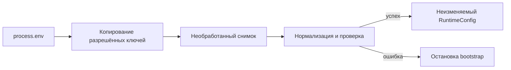
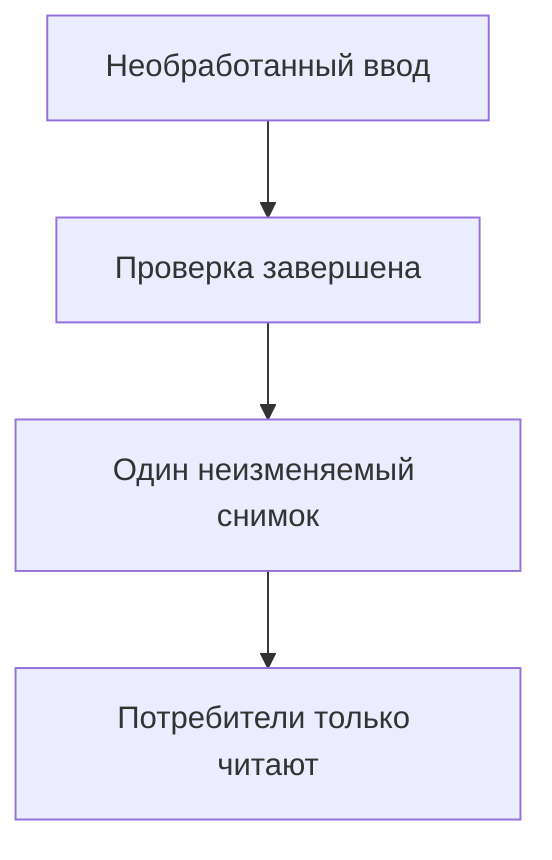
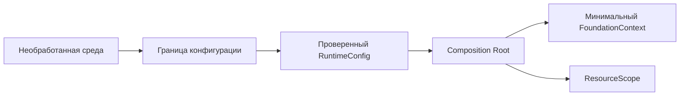
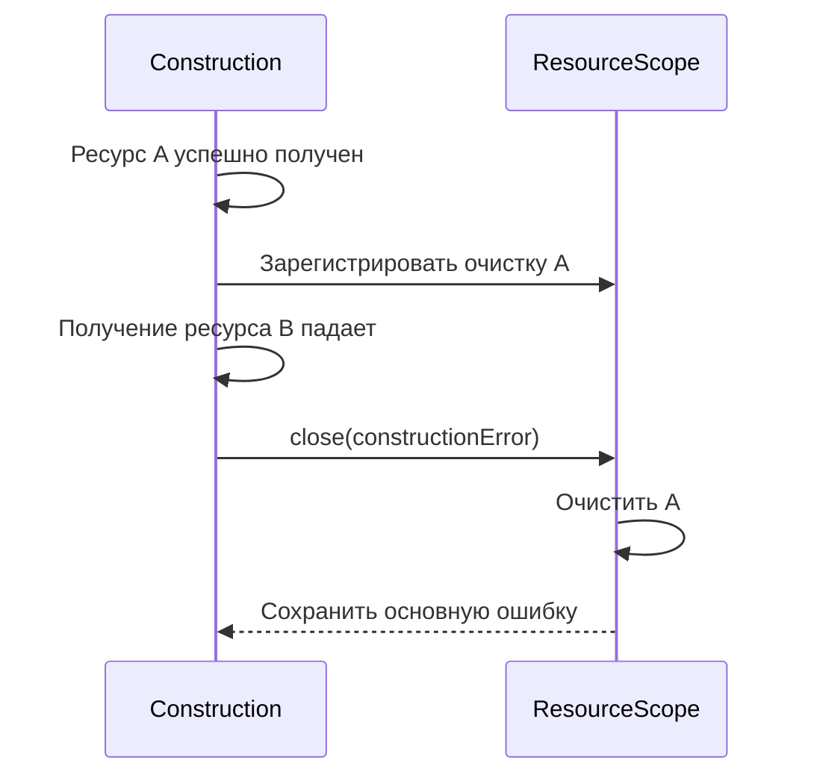

# Каркас, configuration и environments

## Предпосылки

Перед началом главы читатель должен завершить главы 250–251, получить `PASS` архитектурной проверки и понимать утверждённые границы конфигурации, Composition Root, fixtures и областей жизни ресурсов.

## Связь с предыдущей главой

Глава 251 превратила требования проекта в архитектурный контракт. Теперь этот контракт впервые становится исполняемым кодом: появляется минимальный TypeScript/Playwright-каркас, который проверяет внешнюю конфигурацию до создания будущих слоёв.

Глава не пересматривает утверждённый scope. UI, REST, gRPC и PostgreSQL по-прежнему являются внешними возможностями SUT, но их клиенты здесь ещё не создаются.

Реализация следует ADR-002 из главы 251: конфигурация создаётся на одной границе, fixtures зависят от Composition Root, а Composition Root строит только объекты текущего этапа. ADR-003 о generated gRPC code остаётся в статусе `PROPOSED`, потому что команды главы 252 не выполняют генерацию; решение понадобится до интеграции реального gRPC client в главе 255.

## Цель главы

Создать минимальный компилируемый каркас с одной границей чтения внешней среды, проверяемыми профилями `local` и `ci`, неизменяемой конфигурацией, ограниченным Composition Root, базовой fixture и автономными smoke-проверками.

## Главный вопрос

> Как создать минимальный запускаемый каркас с валидируемой конфигурацией?

## Граница исполняемого каркаса

Каркас главы 252 доказывает только готовность своей внутренней основы:

- TypeScript компилирует созданный код в строгом режиме;
- Playwright Test обнаруживает и выполняет smoke-тесты;
- внешние строки превращаются в проверенную конфигурацию;
- ошибки конфигурации останавливают bootstrap до тестовых действий;
- Composition Root получает готовую конфигурацию и выдаёт минимальный контекст;
- fixture владеет созданным runtime и закрывает его после теста;
- проверки не требуют браузера, сети, Docker или доступного SUT.

Каркас **не доказывает** доступность UI, REST, gRPC или PostgreSQL. Проверки возможностей SUT принадлежат утверждённым входам главы 250, а конкретные клиенты появятся в главах 253–256.

> **Важно.** Успешный smoke-тест каркаса означает, что framework способен безопасно начать построение. Он не означает, что внешняя учебная система доступна.

## Стратегия зависимостей

Финальный проект использует корневой package репозитория. TypeScript `7.0.2` и Playwright `1.61.1` уже установлены, а их версии зафиксированы общим `package-lock.json`.

Отдельный `package.json` внутри `examples/04-final-project/` создал бы вторую границу управления зависимостями без практической пользы. Вместо этого проект получает собственные конфигурационные файлы и четыре целевые команды:

```bash
npm run final-project:typecheck
npm run final-project:startup
npm run final-project:test
npm run final-project:check
```

`final-project:check` является первой командой, совместимой с CI: она компилирует каркас и выполняет весь автономный набор тестов с ненулевым exit code при ошибке.

## Созданная структура

```text
examples/04-final-project/
├── .env.example
├── playwright.config.ts
├── tsconfig.json
├── src/
│   ├── config/
│   ├── composition/
│   ├── fixtures/
│   └── index.ts
└── tests/
    └── smoke/
```

Директории `ui/`, `api/`, `grpc/`, `database/`, `diagnostics/` и `cross-layer/` не созданы. Пустая папка не является архитектурным достижением, поэтому будущие слои появятся только вместе с работающей реализацией. Политика generated gRPC code из главы 251 также остаётся отложенным решением: в текущем каркасе нет `.proto`, генератора или сгенерированного бизнес-кода.

Основные исполняемые файлы:

```text
examples/04-final-project/src/config/environment-source.ts
examples/04-final-project/src/config/validate-config.ts
examples/04-final-project/src/composition/create-foundation.ts
examples/04-final-project/src/composition/resource-scope.ts
examples/04-final-project/src/fixtures/foundation-fixture.ts
```

## От необработанного ввода к проверенной конфигурации

Значения `process.env` имеют тип `string | undefined`. TypeScript не может подтвердить, что обязательная переменная существует, URL корректен, timeout находится в диапазоне, а профиль поддерживается.

Различие нужно провести до знакомства с реализацией:

| Свойство | Необработанный ввод | Проверенная конфигурация |
| --- | --- | --- |
| Форма | Строка либо отсутствие значения | Нормализованное типизированное поле |
| Доверие | Не считается корректным | Соответствует правилам текущего проекта |
| Изменяемость | Копируется из внешнего источника | Выдаётся как неизменяемый объект |
| Потребитель | Только граница конфигурации | Composition Root и созданные им объекты |

Копирование и замораживание необработанного ввода защищает снимок от случайной мутации, но не делает значения корректными. Доверие появляется только после проверки каждого правила.

Каркас использует последовательность:



`environment-source.ts` — единственный исполняемый файл главы, который обращается к `process.env`. Он копирует только разрешённые ключи и не передаёт изменяемую среду дальше.

`validate-config.ts` получает `RawEnvironment`, проверяет его и возвращает полный `RuntimeConfig`. Частично проверенный объект не покидает функцию.

## Модель конфигурации

Проверенная конфигурация содержит:

| Поле | Назначение |
| --- | --- |
| `profile` | Профиль `local` или `ci` |
| `uiBaseUrl` | Проверенная ссылка на UI |
| `restBaseUrl` | Проверенная ссылка на REST |
| `grpcTarget` | Нормализованный `host:port` |
| `postgresConnectionReference` | Ссылка на секрет во внешнем хранилище |
| `credentialReference` | Ссылка на учётные данные |
| `operationTimeoutMs` | Общий timeout операций каркаса |
| `artifactDirectory` | Безопасный относительный путь |
| `isCi` | Признак CI, согласованный с профилем |
| `ciRunId` | Необязательные несекретные метаданные |

URL, target и ссылки на секреты описывают будущие границы, но не создают соединения. `postgresConnectionReference` хранит ссылку вида `secret://source/key`, а не строку подключения; глава 252 не разрешает её и не открывает PostgreSQL pool.

### Ссылка на секрет и значение секрета

В ссылке `secret://source/key` часть `source` обозначает внешнее хранилище, а `key` — имя секрета в нём. Например, `secret://local/qa-credentials` сообщает будущей авторизованной границе, где искать учётные данные, но не содержит их значение.

Глава 252 только проверяет грамматику ссылки и сохраняет её в конфигурации. Получение значения появится у владельца соответствующего слоя. Даже корректная ссылка не доказывает существование секрета или право доступа к нему; полную ссылку также не следует без необходимости выводить в журналы и ошибки.

### Обязательные и необязательные значения

Обязательны:

- `QA_PROFILE`;
- `QA_UI_BASE_URL`;
- `QA_REST_BASE_URL`;
- `QA_GRPC_TARGET`;
- `QA_POSTGRES_CONNECTION_REF`;
- `QA_CREDENTIALS_REF`.

`QA_OPERATION_TIMEOUT_MS` и `QA_ARTIFACT_DIR` имеют безопасные несекретные значения по умолчанию. Для `local` timeout равен `5000`, для `ci` — `10000`. Профиль `production` и production-адрес по умолчанию отсутствуют.

`GITHUB_RUN_ID` необязателен и используется только как несекретные метаданные CI.

## Профили и среды выполнения

Профиль выбирает согласованный режим запуска и несекретные значения по умолчанию. Благодаря этому условие `if (profile === ...)` не приходится разбрасывать по всем слоям.

| Профиль | Источник | Разрешённые значения по умолчанию | Секреты |
| --- | --- | --- | --- |
| `local` | Переменные локального процесса | Timeout и каталог артефактов | Внешнее локальное хранилище |
| `ci` | Переменные среды CI | Увеличенный timeout и каталог артефактов | Защищённое хранилище CI |

Значение `CI` должно соответствовать `QA_PROFILE`. Комбинация `QA_PROFILE=ci` и `CI=false` считается противоречивой и останавливает запуск.

Профиль `ci` сам по себе не доказывает запуск в GitHub Actions: он только выбирает поведение конфигурации. `GITHUB_RUN_ID` остаётся необязательными метаданными, а согласованность профиля и признака `CI` проверяется отдельно.

Файл `.env.example` содержит только имена ключей и адреса в зарезервированной зоне `.invalid`. Реальный `.env` игнорируется Git. Каркас не добавляет библиотеку dotenv и не скрывает момент чтения внешней среды.

Ограниченные правила `.gitignore` также закрывают локальные варианты `.env.*`, но явно сохраняют `.env.example`. Необязательный `GITHUB_RUN_ID` присутствует в шаблоне как пустое несекретное поле.

> **Типичная ошибка.** Считать профиль хранилищем секретов. Профиль выбирает режим и несекретные значения по умолчанию; значение секрета остаётся во внешнем защищённом источнике.

## Проверка во время выполнения

Для текущего плоского контракта используется небольшая проверяющая функция. Новая зависимость не нужна: проверок немного, а каждая имеет ясное правило.

Проверяющая функция:

- отклоняет отсутствующие обязательные ключи;
- разрешает только `local` и `ci`;
- принимает только `http` и `https` для URL;
- запрещает учётные данные внутри URL;
- запрещает query и fragment в base URL;
- проверяет gRPC target как DNS/IPv4-подобный `host:port` с десятичным port;
- проверяет timeout в диапазоне `100–120000`;
- принимает только полную ссылку `secret://source/key`, но не раскрывает необработанное значение;
- запрещает POSIX, Windows и UNC absolute artifact paths, а также сегмент `..`;
- проверяет согласованность профиля и `CI`.

Нормализация удаляет внешние пробелы, приводит hostname gRPC к нижнему регистру и сохраняет URL как строку. Внутренние потребители не получают изменяемый объект `URL`.

Эти правила намеренно узкие и принадлежат текущему проекту, а не всем JavaScript-приложениям. Например, base URL здесь не содержит query и fragment, а gRPC target ограничен формой `host:port` без IPv6. Принятый формат не доказывает доступность endpoint, корректность учётных данных, совместимость протокола, доступ к PostgreSQL или здоровье SUT. Расширять контракт следует вместе с реальным потребителем в соответствующей главе.

## Неизменяемый результат

`readonly` защищает модель во время проверки TypeScript, а `Object.freeze()` запрещает изменение самого объекта во время выполнения. `RuntimeConfig` состоит только из примитивов, поэтому поверхностной заморозки достаточно именно для его текущей плоской формы. Это не универсальная замена глубокой неизменяемости для будущих вложенных объектов.

Ментальная модель:



Ни `process.env`, ни промежуточный частичный объект не передаются в Composition Root. Проверяющая функция создаёт новый объект и не сохраняет ссылку на исходную карту.

## Безопасная модель ошибок

`ConfigurationError` хранит стабильную категорию, имя проблемного ключа и понятную причину:

```text
Ошибка конфигурации QA_OPERATION_TIMEOUT_MS:
ожидалось целое число от 100 до 120000
```

Ошибка различает:

- `missing` — отсутствующее значение;
- `unsupported` — неизвестный профиль;
- `invalid_format` — неправильный формат;
- `invalid_range` — недопустимый числовой диапазон;
- `inconsistent` — противоречивые `QA_PROFILE` и `CI`.

`cause` поддерживается только для безопасных внутренних причин. Ошибка встроенного парсера `URL` не прикрепляется: Node.js сохраняет недоверенный ввод в её свойствах. Ни сообщение, ни `cause` ошибки конфигурации не должны раскрывать проверяемое значение.

> **Важно.** Полезная ошибка называет ключ и нарушенное правило, а не значение секрета. Стабильный `code` позволяет вызывающему коду классифицировать сбой без сравнения полного текста.

## Минимальный Composition Root

Composition Root получает только `RuntimeConfig`:



В этой главе он создаёт:

- `ResourceScope`;
- неизменяемый `FoundationContext`;
- закрываемый `FoundationRuntime`.

Контекст содержит только `config`, `profile` и `isCi`. В нём нет Page Objects, REST/gRPC clients, репозиториев или произвольного метода `get(name)`. Такой малый состав делает фактический граф зависимостей видимым и не создаёт преждевременных абстракций.

Composition Root:

- не читает `process.env`;
- не выполняет сценарии;
- не содержит проверок;
- не выбирает тесты;
- не управляет CI;
- не разрешает зависимости динамически и не является service locator.

## ResourceScope и частичное построение

`ResourceScope` представляет область владения ресурсами. Владелец регистрирует функцию очистки сразу после успешного получения ресурса; функции образуют стек и выполняются в обратном порядке.



Если следующий шаг построения завершается ошибкой, `ResourceScope` закрывает уже полученные ресурсы. Если очистка также завершается ошибкой, `AggregateError` сохраняет отдельно основную ошибку и ошибки очистки.

`ResourceScope` пытается выполнить все зарегистрированные функции, даже если синхронная или асинхронная очистка завершилась ошибкой. Ссылки удаляются из внутреннего массива до выполнения очистки.

Повторный `close()` и регистрация после закрытия явно отклоняются: область имеет одного владельца и не заявляет идемпотентность. Отсутствие основной ошибки отличается от явно переданного `undefined`, поэтому даже некорректное `throw undefined` не будет молча потеряно. В главе 252 владельцем является fixture каркаса. `ResourceScope` управляет жизненным циклом, но не хранит произвольные зависимости и не является глобальным контейнером.

| Ситуация | Результат закрытия |
| --- | --- |
| Тест прошёл, очистка прошла | Ошибки нет |
| Тест прошёл, очистка упала | Наблюдаема ошибка очистки |
| Тест упал, очистка прошла | Повторно выбрасывается основная ошибка |
| Тест и очистка упали | `AggregateError` содержит обе категории |
| Построение упало после получения ресурса | Уже зарегистрированные ресурсы очищаются |

Очистка выполняется до повторного выброса или агрегации. Поэтому fixture не выбирает одну ошибку ценой потери другой.

## Fixture каркаса

Базовая fixture выполняет шесть шагов:

1. получает необработанные значения;
2. проверяет их до создания контекста;
3. вызывает Composition Root;
4. передаёт контекст в `use()`;
5. закрывает принадлежащие ей ресурсы;
6. сохраняет основную ошибку и ошибки очистки.

Если построение будущего runtime остановится после частичного получения ресурсов, зарегистрированная очистка должна выполниться до выхода из setup. Smoke-fixture использует безопасные значения `.invalid`, поэтому тесты детерминированы и не требуют внешнего SUT. Реальный будущий запуск сможет вызвать `loadRuntimeConfig()` на явной границе bootstrap.

Fixture имеет test scope. Это решение относится к текущему минимальному контексту и не является правилом для каждого ресурса. Общих между workers бизнес-данных здесь нет; область жизни будущих дорогих ресурсов будет выбрана в главах-владельцах после проверки безопасности конкурентного доступа и изоляции.

## Основа Playwright

`playwright.config.ts` задаёт:

- `tests/smoke` как единственный каталог тестов;
- один проект `foundation`, не использующий браузер;
- одного worker для детерминированной проверки каркаса;
- `retries: 0`;
- timeout теста `5000`;
- reporter `line`;
- отдельный каталог результатов.

Smoke-тесты не запрашивают fixture `page`, поэтому Playwright не запускает браузер и не требует установки его бинарных файлов.

Конфигурация не содержит `baseURL`, учётных данных, UI-проектов, Allure или CI workflow. Эти решения принадлежат будущим главам. Один worker здесь упрощает проверку основы, а не задаёт будущую стратегию параллельного выполнения.

## Smoke- и негативные тесты

Набор содержит двадцать автономных проверок, сгруппированных по назначению:

| Группа | Проверяемое поведение | Количество |
| --- | --- | ---: |
| Успешный bootstrap | Минимальный контекст, `local`/`ci`, нормализация и неизменяемость | 3 |
| Обязательные значения и профиль | Отсутствующий ключ, неизвестный профиль, согласованность `CI` | 3 |
| Форматы и диапазоны | URL, gRPC target, timeout, безопасный путь | 4 |
| Секреты и ошибки | Грамматика ссылки, отсутствие утечки, безопасный `cause` | 2 |
| Граница ввода | Копирование только разрешённых ключей | 1 |
| Жизненный цикл | LIFO, частичное построение, все очистки, повторное закрытие, двойные ошибки и `undefined` | 7 |

Точные файлы тестов:

```text
examples/04-final-project/tests/smoke/bootstrap.spec.ts
examples/04-final-project/tests/smoke/config.spec.ts
examples/04-final-project/tests/smoke/composition.spec.ts
```

Все проверки выполняются офлайн и детерминированы. Повторные запуски с одним и двумя workers подтверждают изоляцию текущего каркаса, но не доказывают стратегию полного параллельного набора из главы 258.

## Команды и ожидаемый результат

### Компиляция

```bash
npm run final-project:typecheck
```

Ожидаемый результат: exit code `0`, diagnostics TypeScript отсутствуют. Команда доказывает согласованность типов текущего каркаса, но не выполняет проверки во время выполнения.

### Dry startup

```bash
npm run final-project:startup
```

Ожидаемый результат: один bootstrap-тест проходит без браузера и внешней сети. Команда доказывает только возможность создать и закрыть минимальный runtime.

### Автономные тесты

```bash
npm run final-project:test
```

Ожидаемый результат: все двадцать smoke- и негативных тестов проходят. Успех не подтверждает доступность SUT или корректность будущих клиентов.

### Полная проверка каркаса

```bash
npm run final-project:check
```

Ожидаемый результат: строгая компиляция и все двадцать smoke- и негативных тестов завершаются успешно. Команда подходит для будущего CI, но сама не создаёт CI workflow и не проверяет внешние сервисы.

## Работа с `.env.example`

Шаблон можно использовать как список необходимых ключей. Он не является production-конфигурацией и не содержит секретов.

Локальные значения передаются процессу выбранным пользователем способом. Каркас намеренно не загружает `.env` автоматически: граница необработанного ввода остаётся видимой, а выбор конкретного загрузчика не маскирует источник данных.

## Распространённые мифы

**Миф: каркас должен сразу включать все слои.**
Исполняемый каркас — это минимум, который запускается. Слои добавляются по мере появления сценариев.

**Миф: конфигурацию можно читать там, где она понадобилась.**
Тогда ошибка настройки проявится в середине сценария. Чтение и проверка выполняются на границе.

**Миф: значение по умолчанию для адреса стенда — удобство.**
Это риск запуска против неверного окружения. Обязательное значение останавливает запуск.

**Миф: профили окружений — это просто разные адреса.**
Они задают согласованный набор настроек, а не одно значение.

**Миф: после проверки конфигурацию можно менять по ходу.**
Проверенный результат делается неизменяемым — иначе гарантии проверки теряются.

## Частые вопросы

**Что входит в исполняемый каркас?**
Минимальный запуск, проверенная конфигурация и точка сборки зависимостей.

**Где проверять переменные окружения?**
В загрузчике, до начала дорогих операций.

**Зачем `.env.example`?**
Он документирует требуемый набор переменных без раскрытия значений.

**Что делать при отсутствии обязательной переменной?**
Останавливать запуск с понятным сообщением об имени настройки.

**Почему результат загрузки замораживается?**
Чтобы проверенные значения нельзя было изменить после проверки.

## Распространённые ошибки

- Читать `process.env` внутри fixtures, адаптеров и тестов.
- Считать тип TypeScript проверкой внешней строки во время выполнения.
- Возвращать частичную конфигурацию после первой ошибки.
- Печатать значение секрета в сообщении проверяющей функции.
- Выбирать профиль `production` по умолчанию.
- Создавать клиенты при импорте модуля.
- Превращать Composition Root в `get(name)`.
- Добавлять будущие клиенты в контекст «на всякий случай».
- Регистрировать очистку до успешного получения ресурса.
- Использовать retries для маскировки ошибки bootstrap.

## Практический список проверки

- [ ] `process.env` читается в одном файле.
- [ ] Конфигурация создаётся только после проверки во время выполнения.
- [ ] Конфигурация неизменяема и не содержит вложенных изменяемых объектов.
- [ ] Профиль не используется как хранилище секретов.
- [ ] Ошибки называют ключ, но не раскрывают значение.
- [ ] Composition Root получает готовую конфигурацию.
- [ ] Контекст содержит только возможности текущего каркаса.
- [ ] Fixture владеет жизненным циклом runtime.
- [ ] Очистка идёт в обратном порядке.
- [ ] Smoke-тесты не требуют браузера или сети.
- [ ] Будущие слои отсутствуют.
- [ ] `final-project:check` имеет ненулевой exit code при ошибке.

## Что нужно запомнить

Основная последовательность:


- Необработанный ввод не является конфигурацией.
- Профиль не является хранилищем секретов.
- Проверка завершается до построения объектов.
- Composition Root строит граф, но не скрывает его.
- Fixture владеет областью жизни каркаса.
- Smoke-тест доказывает готовность основы, а не доступность SUT.

## Быстрая проверка

1. Почему TypeScript не может подтвердить корректность `process.env`?
2. Почему профиль и источник секретов являются разными понятиями?
3. Почему чтение внешней среды нельзя распределять по слоям?
4. Почему Composition Root получает проверенную конфигурацию?
5. Когда регистрируется очистка?
6. Что именно доказывает smoke-тест без браузера?

## Практика

Практика закрепляет классификацию значений конфигурации, поиск распределённого чтения внешней среды, проверку во время выполнения, частичное построение, область жизни fixture и автономную smoke-проверку.

## Краткие итоги

Глава создала первый исполняемый этап финального проекта. Корневой package запускает отдельный строгий TypeScript/Playwright-каркас. Единая граница необработанного ввода выдаёт неизменяемую конфигурацию или безопасную ошибку. Composition Root и fixture образуют минимальный жизненный цикл, а тесты без браузера доказывают работу bootstrap без реализации прикладных слоёв.

## Переход к следующей главе

Исполняемый каркас готов принять первый прикладной слой. Глава 253 добавит UI Layer, Page Objects, components и UI fixtures, сохранив созданную границу конфигурации и расширяя контекст только ради фактических потребителей UI.
