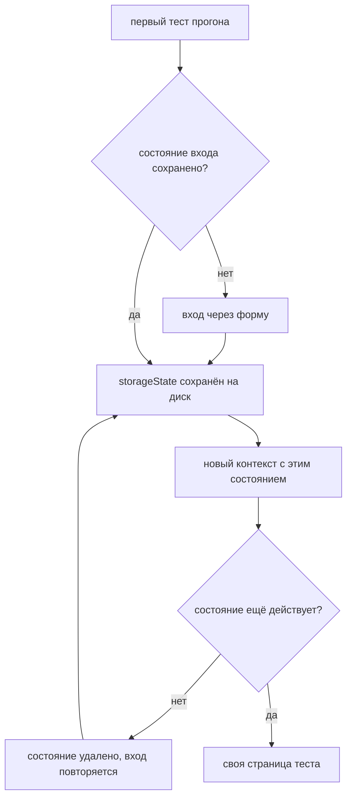

# UI Layer, Page Objects и fixtures

## Предпосылки

Перед началом главы читатель должен завершить главу 252, получить компилируемый каркас с проверенной конфигурацией и уметь поднимать учебный стенд локально.

## Связь с предыдущей главой

Глава 252 создала исполняемый каркас: одну границу чтения внешней среды, неизменяемую конфигурацию, Composition Root и область владения ресурсами. Прикладных слоёв в нём не было — и это было намеренно.

Теперь появляется первый слой. Он опирается на уже утверждённые границы и ничего в них не меняет: конфигурация по-прежнему читается один раз, ресурсы по-прежнему освобождает владелец, а fixture по-прежнему получает готовый контекст, а не собирает его сама.

## Цель главы

Создать слой интерфейса: page objects и компонент, переиспользуемое состояние входа, fixtures для UI и два сценария, которые выполняются независимо друг от друга и оставляют пригодные доказательства при падении.

## Главный вопрос

> Как добавить первый прикладной слой, не размыв границы каркаса?

Короткий ответ: слой публикует шаги предметной области, прячет селекторы и получает всё внешнее из контекста, созданного каркасом.

## Что входит в слой интерфейса

Слой отвечает за три вещи и ни за что больше:

* **шаги** — открыть список, применить фильтр, перейти в карточку;
* **знание о разметке** — какие элементы стоят за этими шагами;
* **жизненный цикл браузерного состояния** — контекст, страница, состояние входа.

Чего в слое нет: ожиданий теста, подготовки данных, обращений к REST, gRPC и базе. Проверка принадлежит сценарию, подготовка данных — слоям, которые появятся в главах 254–256.

Граница проверяется вопросом: если завтра у списка задач изменится вёрстка, сколько файлов придётся тронуть? В правильном слое — один.

## Созданная структура

```text
src/
├── ui/
│   ├── authenticated-session.ts
│   ├── login-page.ts
│   ├── work-items-page.ts
│   ├── work-items-filter.ts
│   ├── work-item-card-page.ts
│   └── index.ts
├── fixtures/
│   ├── foundation-fixture.ts
│   └── ui-fixture.ts
└── tests/
    └── ui/
```

Каталоги `api/`, `grpc/`, `database/` и `cross-layer/` по-прежнему не созданы: пустая директория ничего не доказывает.

## Page Object публикует шаги, а не элементы

Page object — это граница между сценарием и разметкой. Наружу он отдаёт действия предметной области, внутрь прячет способ их выполнить.

```typescript
class LoginPage {
  readonly #page: Page;

  constructor(page: Page) {
    this.#page = page;
  }

  async open(): Promise<void> {
    await this.#page.goto('/login');
  }

  async signIn(credentials: Credentials): Promise<void> {
    await this.#page.getByLabel('Логин').fill(credentials.login);
    await this.#page.getByLabel('Пароль').fill(credentials.password);
    await this.#page.getByRole('button', { name: 'Войти' }).click();
    await this.#page.waitForURL(/\/work-items/);
  }
}
```

Три решения здесь важнее синтаксиса.

**Ожидание перехода внутри шага.** `signIn` заканчивается не нажатием кнопки, а состоянием «вход произошёл». Иначе каждый сценарий дописывал бы ожидание сам, и рано или поздно кто-то забыл бы.

**Поиск по доступному имени.** `getByLabel` и `getByRole` опираются на пользовательский контракт страницы. Селектор по классу сломался бы от правки вёрстки, не меняющей поведение.

**Поле `#page` недоступно снаружи.** Сценарий не может обойти границу и дотянуться до элементов напрямую — не по договорённости, а технически.

## Компонент ограничивает область поиска

Форма фильтра — самостоятельная область DOM, и её объект получает не страницу, а корневой локатор:

```typescript
class WorkItemsFilter {
  readonly #root: Locator;

  constructor(root: Locator) {
    this.#root = root;
  }

  async selectStatus(status: string): Promise<void> {
    await this.#root.getByLabel('Статус').selectOption(status);
  }

  async apply(): Promise<void> {
    await this.#root.getByRole('button', { name: 'Применить фильтр' }).click();
  }
}
```

Все поиски идут от корня. Это даёт два следствия: тот же компонент работает в любом месте, где встречается форма, и поиск не может случайно найти похожий элемент за её пределами.

Страница собирается из компонентов композицией, а не наследованием:

```typescript
class WorkItemsPage {
  readonly filter: WorkItemsFilter;

  constructor(page: Page) {
    this.filter = new WorkItemsFilter(
      page.getByRole('form', { name: 'Фильтр задач' })
    );
  }
}
```

Наследование здесь выглядело бы экономнее, но связало бы страницы общим предком ради переиспользования нескольких строк. Композиция оставляет каждую страницу независимой.

## Состояние входа: один раз на прогон, свой контекст на тест

Проходить форму входа в каждом сценарии — значит проверять вход десятки раз вместо одного и платить за это временем прогона.

Решение разделяет две разные вещи: **аутентификацию** и **изоляцию**.



Вход выполняется один раз и сохраняется. Каждый тест открывает **свой** контекст с этим состоянием: сессия не общая, поэтому один сценарий не может испортить состояние другому.

Отдельного внимания заслуживает проверка «состояние ещё действует». Сохранённая сессия живёт ограниченное время, и без проверки первый прогон после её истечения падал бы не по своей причине: тест увидел бы форму входа и сообщил о пропавшем элементе списка. Проверка превращает непонятное падение в самовосстановление.

## Fixture соединяет каркас и слой

Fixture слоя не создаёт конфигурацию и не читает окружение — она берёт готовый контекст каркаса и добавляет к нему браузерное состояние:

```typescript
uiPage: async ({ browser, foundation, credentials }, use, testInfo) => {
  const context = await createAuthenticatedContext({
    browser,
    baseUrl: foundation.config.uiBaseUrl,
    credentials,
    statePath: path.join(foundation.config.artifactDirectory, 'ui-auth-state.json')
  });

  await context.tracing.start({ screenshots: true, snapshots: true });

  const page = await context.newPage();

  await use(page);

  const failed = testInfo.status !== testInfo.expectedStatus;

  if (failed) {
    const tracePath = testInfo.outputPath('ui-trace.zip');

    await context.tracing.stop({ path: tracePath });
    await testInfo.attach('ui-trace', { path: tracePath, contentType: 'application/zip' });
  } else {
    await context.tracing.stop();
  }

  await context.close();
}
```

Адрес стенда приходит из конфигурации, а не из константы в тесте. Каталог артефактов — оттуда же. Слой не знает, откуда взялись эти значения, и это правильно: знание живёт на границе конфигурации.

Трасса записывается всегда, но **сохраняется только у упавшего теста**. У зелёного она никому не нужна, а место и время прогона стоят дорого.

## Сценарии

Первый проверяет поведение фильтра действиями пользователя:

```typescript
test('фильтр по статусу оставляет в списке только выбранные задачи', async ({
  uiPage,
  workItemsPage
}) => {
  await workItemsPage.open();
  await expect(workItemsPage.heading()).toBeVisible();

  await workItemsPage.filter.selectStatus('DONE');
  await workItemsPage.filter.apply();
  await uiPage.waitForURL(/status=DONE/);

  const statuses = await workItemsPage.statusCells().allInnerTexts();

  expect(statuses.length).toBeGreaterThan(0);
  expect(statuses.every((value) => value.trim() === 'DONE')).toBe(true);
});
```

Фильтр применяется формой, а не переходом по адресу с параметрами: иначе проверялся бы маршрут, а не интерфейс.

Второй проверяет связь между экранами: заголовок карточки принадлежит той записи, которую выбрали в списке.

Третий сценарий устроен иначе — он проверяет, что происходит **при несовпадении**:

```typescript
let message = '';

try {
  await expect(missing).toBeVisible({ timeout: 700 });
} catch (error) {
  message = error instanceof Error ? error.message : String(error);
}

expect(message).toContain('Timeout');
```

Тест не падает: он выполняет заведомо неуспешную проверку в контролируемых условиях и убеждается, что диагностика доступна и объясняет причину. Так поведение при падении проверено, а итог набора остаётся честно зелёным.

## Команды и ожидаемый результат

### Автономные тесты каркаса

```bash
npm run final-project:test
```

Ожидаемый результат: двадцать smoke- и негативных тестов проходят без браузера и без стенда. Слой интерфейса эту команду не затрагивает.

### Сценарии интерфейса

```bash
npm run sut:up
npm run final-project:ui
```

Ожидаемый результат: четыре сценария проходят, форма входа открывается один раз за прогон. Команда требует поднятого стенда: без него слой проверять нечем.

## Распространённые мифы

**Миф: page object должен покрывать всю страницу.**
Он должен покрывать то, что используют сценарии. Метод, написанный «на будущее», устаревает раньше, чем понадобится.

**Миф: общий контекст ускоряет прогон, и это достаточная причина.**
Ускоряет. И связывает тесты общим состоянием: падение одного начинает зависеть от порядка запуска. Экономия секунд не стоит потери независимости.

**Миф: состояние входа можно сохранить один раз и забыть.**
Сессия истекает. Без проверки годности первый прогон после истечения падает с сообщением, не имеющим отношения к причине.

**Миф: трассу нужно писать всегда — вдруг пригодится.**
Трасса пригождается там, где что-то пошло не так. У зелёных тестов она только занимает место и время.

**Миф: если тест проверяет падение, он должен падать.**
Проверять нужно поведение при несовпадении, а не наличие красного результата. Контролируемая неуспешная проверка внутри теста даёт то же знание без ложной тревоги.

## Частые вопросы

**Почему компонент принимает локатор, а не страницу?**
Локатор задаёт границу поиска. Компонент с целой страницей может найти элемент где угодно, и тогда он уже не компонент.

**Где проверять, что вход выполнен?**
В сценарии, если это его тема, и в проверке годности состояния — потому что от неё зависит, начинать ли прогон вообще. В page object проверок нет.

**Куда девать ожидания?**
Ожидание перехода принадлежит шагу, который этот переход вызывает. Ожидание нужного состояния данных принадлежит сценарию.

**Почему сценарии интерфейса вынесены в отдельный проект Playwright?**
У них другие требования: поднятый стенд, большие границы времени, включённые доказательства. Смешение с автономными тестами каркаса сделало бы невозможным быстрый прогон без Docker.

## Распространённые ошибки

### Ошибка 1. Селекторы в сценарии

Как только в тесте появляется `page.locator`, граница слоя нарушена: правка вёрстки начинает задевать сценарии.

### Ошибка 2. Проверки внутри page object

Page object, который сам делает `expect`, перестаёт быть переиспользуемым: он навязывает всем сценариям одно ожидание.

### Ошибка 3. Общий контекст ради скорости

Тесты перестают быть независимыми, и первое же падение потребует выяснять, кто испортил состояние.

### Ошибка 4. Адрес стенда прямо в тесте

Конфигурация размывается: запуск против другого окружения потребует правок в сценариях вместо переменной окружения.

## Быстрая проверка

1. Почему компонент получает корневой локатор, а не страницу?
2. Что произойдёт при истёкшем состоянии входа без проверки годности?
3. Почему трасса сохраняется только у упавшего теста?
4. Чем контролируемая неуспешная проверка отличается от падающего теста?
5. Почему сценарии интерфейса вынесены в отдельный проект Playwright?

## Практика

Добавьте в слой третий сценарий: переход по страницам списка. Соблюдайте границы — новые селекторы должны появиться только в page object, а сценарий обязан остаться читаемым как последовательность шагов.

## Краткие итоги

Главное:

* слой интерфейса публикует шаги и прячет разметку;
* компонент ограничен корневым локатором, страница собирается композицией;
* вход выполняется один раз за прогон, а контекст создаётся свой на каждый тест;
* состояние входа проверяется на годность, иначе прогон падает не по своей причине;
* доказательства сохраняются у падений, а не у всех подряд.

## Переход к следующей главе

Слой интерфейса зафиксировал публичный API и показал, какие данные сценариям нужны. Глава 254 добавит REST-слой: клиент, аутентификацию, проверки ответа во время выполнения и подготовку данных, которую интерфейс делать не должен.
