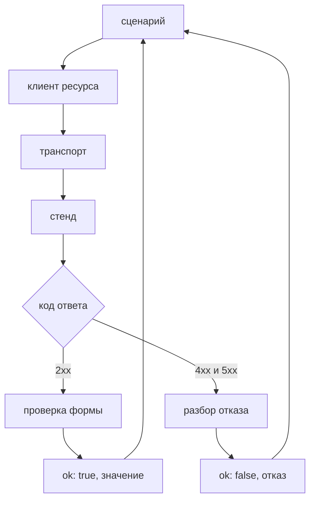

# Слой REST, клиент и подготовка данных

## Предпосылки

Перед началом главы читатель должен завершить главу 253, иметь работающий слой интерфейса и уметь поднимать учебный стенд локально.

## Связь с предыдущей главой

Глава 253 добавила первый прикладной слой и показала правило: слой публикует шаги предметной области, прячет способ их выполнить и получает всё внешнее из контекста каркаса.

Слой REST строится по тому же правилу, но решает другую задачу. Интерфейс отвечает на вопрос «что видит пользователь», REST — «что известно системе». Поэтому именно он становится основным способом готовить и убирать данные: через него это быстрее и надёжнее, чем кликами.

## Цель главы

Создать слой REST: транспорт с авторизацией, клиент ресурса, проверку ответа во время выполнения, владение созданными данными и два сценария — успешный жизненный цикл записи и два контролируемых отказа.

## Главный вопрос

> Как сделать REST-слой, который одинаково пригоден и для проверки, и для подготовки данных?

Короткий ответ: разделить транспорт и предметную область, вернуть отказ как результат, а владение данными закрепить в момент создания.

## Что входит в слой REST

Слой отвечает за четыре вещи:

* **транспорт** — адреса, заголовки, разбор тела;
* **доступ** — получение токена и его подстановка в запрос;
* **контракт** — проверка формы ответа во время выполнения;
* **операции предметной области** — создать задачу, прочитать, перевести в другой статус, удалить.

Чего в слое нет: ожиданий теста. Проверка `expect` принадлежит сценарию — иначе отчёт о падении будет говорить о подготовке, а не о нарушенном требовании.



Обе ветки возвращаются сценарию как результат. Исключение возникает только там, где продолжать нечего: не получен токен или ответ не соответствует контракту.

## Созданная структура

```text
src/
├── api/
│   ├── types.ts
│   ├── validate-response.ts
│   ├── rest-client.ts
│   ├── work-items-client.ts
│   ├── authenticate.ts
│   └── index.ts
├── fixtures/
│   └── api-fixture.ts
└── tests/
    └── api/
```

Каталоги `grpc/`, `database/` и `cross-layer/` по-прежнему не созданы.

## Транспорт и клиент ресурса — разные файлы

`RestClient` знает про заголовки, адреса и разбор тела. Он не знает ни одной сущности предметной области.

```typescript
class RestClient {
  async get(path: string, query?: Record<string, string>): Promise<ApiResponsePair> { /* … */ }
  async post(path: string, body: unknown): Promise<ApiResponsePair> { /* … */ }
}
```

`WorkItemsClient` знает про задачи и не знает про заголовки:

```typescript
class WorkItemsClient {
  async create(input: CreateWorkItemInput): Promise<ApiResult<WorkItem>> {
    return toResult(await this.#rest.post("/work-items", input), assertWorkItem);
  }
}
```

Проверка границы простая: смена способа авторизации меняет один файл, а добавление операции над задачами — другой. Если правка задевает оба, слои перепутаны.

## Отказ — это результат, а не исключение

Клиент не превращает 4xx в исключение. Он возвращает размеченное объединение:

```typescript
type ApiResult<Value> =
  | Readonly<{ ok: true; value: Value }>
  | Readonly<{ ok: false; failure: ApiFailure }>;
```

Причина практическая. Негативный сценарий обязан увидеть код и тело отказа — это и есть предмет его проверки. Если клиент бросает исключение, сценарий вынужден оборачивать каждый вызов в `try/catch` и разбирать сообщение строкой.

Исключение остаётся ровно для двух случаев: не удалось получить токен и ответ не соответствует контракту. Оба означают, что дальше проверять нечего.

## Проверка ответа во время выполнения

Тело ответа приходит из сети, и аннотация на нём — обещание. Проверка стоит на границе слоя:

```typescript
export function assertWorkItem(value: unknown): WorkItem {
  const item = asRecord(value);

  if (typeof item["id"] !== "string" || item["id"] === "") {
    throw new ContractError("поле id должно быть непустой строкой", value);
  }
  // … остальные поля
}
```

Сообщение называет нарушенное правило и показывает полученную форму. С приведением через `as` тест упал бы позже — на сравнении — и рассказал бы про `undefined` вместо нарушенного контракта.

После проверки тип соответствует действительности, и дальше по коду проверять нечего.

## Токен получается один раз на прогон

Получение токена вынесено из клиента ресурса:

```typescript
export async function issueToken(
  request: APIRequestContext,
  baseUrl: string,
  credentials: ApiCredentials,
): Promise<IssuedToken> { /* … */ }
```

Если бы каждый клиент получал токен сам, стенд видел бы лишние входы, а у тестов появилась бы лишняя точка отказа. Токен живёт в заголовке и не попадает ни в адрес, ни в журнал, ни во вложение отчёта.

## Владение данными закрепляется при создании

Фикстура `createOwnedWorkItem` создаёт запись и сразу берёт на себя её удаление:

```typescript
createOwnedWorkItem: async ({ workItems }, use) => {
  const created: string[] = [];

  await use(async (input) => {
    const result = await workItems.create(input);

    if (!result.ok) {
      throw new Error(`Подготовка не удалась: ${result.failure.status} ${result.failure.code}`);
    }

    created.push(result.value.id);

    return result.value;
  });

  for (const id of created.reverse()) {
    await workItems.remove(id);
  }
},
```

Три решения в этих строках:

1. **Регистрация идёт сразу после успешного создания**, а не в конце теста: между этими точками может произойти что угодно.
2. **Удаление идёт в обратном порядке** — так же, как освобождение ресурсов в каркасе.
3. **Неуспешная подготовка падает с названной причиной.** Сообщение `Подготовка не удалась: 400 VALIDATION_FAILED` сразу отделяет дефект подготовки от дефекта сценария.

Сверх этого фикстура клиента вызывает удаление всех записей текущего прогона — страховка на случай, если тест создал запись в обход `createOwnedWorkItem`.

## Сценарии

Первый проходит жизненный цикл записи:

```typescript
test('созданная задача доступна по идентификатору и переходит в DONE', async ({
  workItems,
  createOwnedWorkItem
}) => {
  const created = await createOwnedWorkItem({
    title: `final-project-${Date.now()}`,
    description: 'Создано сценарием финального проекта',
    priority: 'HIGH'
  });

  expect(created.status).toBe('NEW');

  const started = await workItems.transition(created.id, 'IN_PROGRESS', created.version);
  const finished = await workItems.transition(created.id, 'DONE', started.value.version);

  expect(finished.value.status).toBe('DONE');
  expect(finished.value.version).toBeGreaterThan(started.value.version);
});
```

Два нюанса, которые проект узнаёт только у стенда:

* **из `NEW` нельзя попасть сразу в `DONE`** — между ними обязателен `IN_PROGRESS`. Сценарий следует правилам предметной области, а не удобству;
* **версия приходит из предыдущего ответа**, а не придумывается. Проверка роста версии подтверждает, что стенд действительно защищает от затирания чужого изменения.

Второй сценарий проверяет отказы:

```typescript
const stale = await workItems.transition(created.id, 'DONE', created.version);

expect(stale.ok).toBe(false);
expect(stale.failure.status).toBe(409);

const actual = await workItems.getById(created.id);

expect(actual.value.status).toBe('IN_PROGRESS');
```

Последние две строки важнее первых. Отклонённая операция не должна оставлять следов, и убедиться в этом можно только отдельным чтением: код ответа говорит о решении сервиса, а не о состоянии данных.

## Команды и ожидаемый результат

### Автономные тесты каркаса

```bash
npm run final-project:test
```

Ожидаемый результат: двадцать тестов проходят без браузера и без стенда. Слой REST эту команду не затрагивает.

### Сценарии REST

```bash
npm run sut:up
npm run final-project:api
```

Ожидаемый результат: три сценария проходят примерно за полсекунды — браузер здесь не нужен, и границы времени у проекта `api` жёстче, чем у `ui`.

После прогона в списке задач не должно остаться ни одной записи с префиксом `final-project`. Это и есть проверка владения данными.

## Распространённые мифы

**Миф: клиент должен бросать исключение на любой код, кроме 2xx.**
Тогда негативный сценарий превращается в разбор сообщений. Отказ — такой же результат работы сервиса, как успех.

**Миф: раз есть типы, проверять ответ не нужно.**
Тип описывает ожидание, а тело приходит из сети. Без проверки первая же смена контракта даст падение в непредсказуемом месте.

**Миф: подготовку данных можно делать через интерфейс — он ближе к пользователю.**
Подготовка через интерфейс медленнее, хрупче и смешивает предмет проверки с её условиями. Через интерфейс проверяют то, что проверяют; готовят — самым прямым способом.

**Миф: очистку достаточно сделать в конце теста.**
Между созданием и концом теста находится сам сценарий. Если он упадёт, до очистки дело не дойдёт — поэтому владение закрепляется в момент создания.

## Частые вопросы

**Почему не встроенная фикстура `request`?**
Ей нельзя задать базовый адрес из проверенной конфигурации, и её куки общие для контекста. Свой контекст на тест даёт изоляцию и берёт адрес оттуда, где он уже проверен.

**Зачем удалять записи, если есть удаление всего прогона?**
Точечное удаление — обязательство сценария, массовое — страховка. Полагаться только на страховку значит оставлять данные живыми до конца прогона и мешать соседним тестам.

**Почему `description` и `priority` обязательны в типе?**
Потому что они обязательны в контракте стенда. Необязательными их сделал бы тип, а не сервис, и ошибка всплыла бы во время выполнения.

**Что делать, если стенд вернул нечитаемое тело?**
Клиент превращает его в отказ с кодом `NOT_JSON` и первыми двумя сотнями символов ответа. Общая ошибка разбора JSON не сказала бы, что именно пришло.

## Распространённые ошибки

### Ошибка 1. Проверка внутри клиента

`expect` в клиенте делает его непригодным для подготовки данных: подготовка начинает валить тест по чужому поводу.

### Ошибка 2. Токен в адресе или в журнале

Адрес попадает в трассировку и в отчёт. Токен принадлежит заголовку.

### Ошибка 3. Версия из воздуха

`expectedVersion: 1` работает ровно до первого изменения записи. Версия берётся из ответа на предыдущую операцию.

### Ошибка 4. Общий клиент на весь набор

Общий клиент несёт общий токен и общие куки. При параллельном запуске это связывает тесты.

## Быстрая проверка

1. Почему отказ возвращается как результат, а не как исключение?
2. Где стоит проверка формы ответа и почему именно там?
3. Что произойдёт, если зарегистрировать очистку в конце теста?
4. Откуда сценарий берёт значение `expectedVersion`?
5. Зачем после отклонённой операции читать состояние отдельным запросом?

### Ответы

1. Код и тело отказа — предмет проверки негативного сценария. Исключение заставило бы разбирать сообщение строкой.
2. На границе слоя, сразу после разбора тела. Дальше по коду тип уже соответствует действительности, и повторять проверки не нужно.
3. Упавший сценарий до очистки не дойдёт, и запись останется на стенде до конца прогона.
4. Из ответа на предыдущую операцию с этой записью.
5. Код ответа говорит о решении сервиса, а не о состоянии данных: отклонённая операция всё равно могла что-то изменить.

## Практика

Добавьте третий сценарий: поиск по статусу с ограничением выборки. Подготовьте
через клиент две задачи с разными статусами, убедитесь, что выборка по одному
статусу возвращает только его, и проверьте, что `total` не меньше числа
возвращённых элементов.

Соблюдайте границы: новые параметры запроса должны появиться в
`WorkItemsClient`, а сценарий обязан остаться списком операций предметной
области. Подготовленные записи должны исчезнуть после прогона.

## Краткие итоги

* Слой REST разделён на транспорт и клиент ресурса: у них разные причины меняться.
* Отказ возвращается как результат; исключение остаётся для невозможности продолжать.
* Форма ответа проверяется на границе слоя и называет нарушенное правило.
* Токен получается один раз на прогон и живёт только в заголовке.
* Владение созданной записью закрепляется сразу после успешного создания.
* Сценарий следует правилам предметной области стенда, а не удобству записи.
* Отклонённая операция проверяется отдельным чтением состояния.

## Переход к следующей главе

Слой REST даёт быструю подготовку данных и проверку состояния. Следующая граница — другой транспорт с другими правилами: глава 255 добавит унарный gRPC, где вместо кодов HTTP используются коды состояния gRPC, а вместо заголовков — метаданные.
