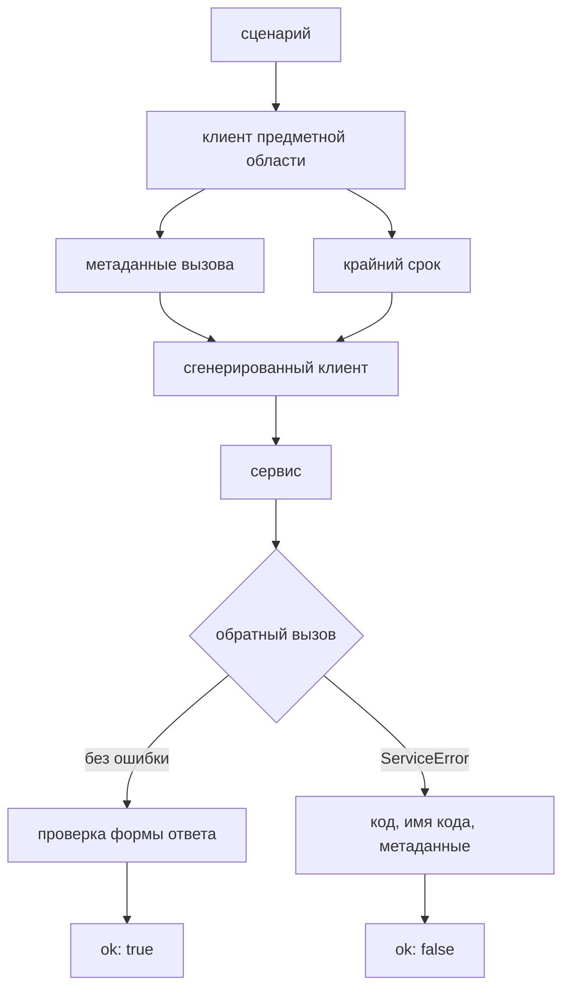

# Слой gRPC, унарные вызовы и коды состояния

## Предпосылки

Перед началом главы читатель должен завершить главу 254, иметь работающий слой REST и уметь поднимать учебный стенд локально.

## Связь с предыдущей главой

Слой REST дал проекту первый способ готовить данные и проверять состояние системы. Он же задал три решения, которые теперь повторяются: транспорт отделён от клиента ресурса, отказ возвращается как результат, а форма ответа проверяется на границе слоя.

gRPC — другой транспорт с другими правилами. Вместо заголовков — метаданные, вместо кодов HTTP — коды состояния gRPC, вместо свободной формы тела — сгенерированный из контракта код. Задача главы — показать, что архитектурные решения от смены транспорта не меняются, а меняются только детали, которые слой обязан скрыть.

## Цель главы

Создать слой gRPC: границу сгенерированного кода, метаданные и крайний срок на каждый вызов, клиент предметной области поверх сгенерированного и пять сценариев — чтение, переход и три контролируемых отказа.

## Главный вопрос

> Как добавить второй транспорт, не заводя вторую архитектуру?

Короткий ответ: повторить границы слоя REST и запереть всё, что специфично для gRPC, внутри слоя.

## Что входит в слой gRPC

* **граница сгенерированного кода** — загрузка `.proto` и создание типизированного клиента;
* **контекст вызова** — метаданные, крайний срок, сквозной идентификатор;
* **операции предметной области** — прочитать задачу, перевести в другой статус;
* **разбор отказа** — числовой код, имя кода и диагностические метаданные.

Чего в слое нет: подготовки данных. Контракт стенда не содержит операции создания по gRPC, поэтому записи готовит слой REST. Это нормальная ситуация: слой проверяет то, что умеет его транспорт, и не изобретает недостающее.



Обратный вызов срабатывает ровно один раз — и при успехе, и при отказе. Именно это свойство делает безопасным перевод унарного вызова в промис.

## Созданная структура

```text
src/
├── grpc/
│   ├── types.ts
│   ├── generated-boundary.ts
│   ├── call.ts
│   ├── work-items-grpc-client.ts
│   └── index.ts
├── fixtures/
│   └── grpc-fixture.ts
└── tests/
    └── grpc/
```

## Граница сгенерированного кода — один файл

Загрузчик `.proto` возвращает нетипизированный объект, а генератор даёт типы. Связать одно с другим можно только утверждением о типе — и это единственное место проекта, где `as` появляется осознанно.

```typescript
const loaded = grpc.loadPackageDefinition(definition) as unknown as ProtoGrpcType;

const Service = loaded.qa.educational.workitems.v1
  .WorkItemService as unknown as grpc.ServiceClientConstructor;
```

Если `as` встречается в тестах или в клиенте ресурса, граница проведена неверно: приведение расползлось по проекту.

Настройки загрузчика — тоже часть контракта тестового кода:

```typescript
const LOADER_OPTIONS = {
  keepCase: false,
  longs: String,
  enums: String,      // 'DONE' вместо 3
  defaults: true,
  oneofs: true
};
```

Строковое представление перечислений выбрано не для красоты. Проверка `expect(status).toBe('DONE')` читается в отчёте, а `toBe(3)` требует открыть `.proto`, чтобы понять, что произошло.

## Метаданные создаются заново на каждый вызов

```typescript
export function metadataFor(context: CallContext): grpc.Metadata {
  const metadata = new grpc.Metadata();

  metadata.set('authorization', `Bearer ${context.token}`);
  metadata.set('correlation-id', context.correlationId);

  return metadata;
}
```

Общий объект `Metadata` на весь прогон сэкономил бы несколько строк и связал бы тесты общим изменяемым состоянием — ровно то, от чего глава 202 предостерегает. Функция создаёт новый объект, и параллельные вызовы друг другу не мешают.

Сквозной идентификатор собирается из идентификатора теста, поэтому записи журнала стенда можно связать с конкретным сценарием.

## Крайний срок задаётся всегда

```typescript
export function deadlineAfter(milliseconds: number): grpc.CallOptions {
  return { deadline: new Date(Date.now() + milliseconds) };
}
```

Крайний срок — абсолютный момент, а не длительность. Вызов без него при зависшем сервисе будет ждать до срока теста, и падение произойдёт без кода состояния: вместо `DEADLINE_EXCEEDED` тест сообщит только о превышении общего времени.

Граница вызова обязана быть меньше границы теста. Для проекта `grpc` срок теста — 20 секунд, крайний срок вызова — 5.

## Отказ — результат, как и в REST

```typescript
export function callUnary<Response>(
  invoke: (callback: grpc.requestCallback<Response>) => grpc.ClientUnaryCall
): Promise<GrpcResult<Response>> {
  return new Promise((resolve) => {
    invoke((error, response) => {
      if (error) {
        resolve({ ok: false, failure: toFailure(error) });

        return;
      }

      resolve({ ok: true, value: response as Response });
    });
  });
}
```

Обратный вызов срабатывает ровно один раз — и при успехе, и при ошибке. Это проверяемое свойство унарного вызова, и именно оно делает безопасным перевод в промис.

Разбор отказа сохраняет три вещи:

```typescript
export function toFailure(error: grpc.ServiceError): GrpcFailure {
  return Object.freeze({
    code: error.code,
    codeName: grpc.status[error.code] ?? 'UNKNOWN',
    details: error.details,
    correlationId: readCorrelationId(error.metadata)
  });
}
```

Имя кода нужно в отчёте: `5` читателю ничего не говорит, `NOT_FOUND` говорит. Метаданные сохраняются отдельно, потому что сервис прикладывает диагностический заголовок именно к отказу — это ближайший аналог кода ошибки в теле ответа REST.

## Клиент предметной области поверх сгенерированного

Сценарий не собирает запрос и не читает `callback`:

```typescript
const read = await workItemsGrpc.getById(created.id);
const moved = await workItemsGrpc.transition(created.id, 'IN_PROGRESS', created.version);
```

Внутри клиента остаются метаданные, крайний срок, разбор ответа и знание о том, что ответ перехода оборачивает запись в поле `item`, а ответ чтения — нет. Эта асимметрия принадлежит контракту стенда, и сценарий о ней знать не должен.

Форма ответа проверяется и здесь. Сгенерированные типы описывают контракт, но не доказывают, что пришло именно это: во время выполнения от них ничего не остаётся.

## Владение каналом

Канал создаёт фикстура, она же его закрывает:

```typescript
workItemsGrpc: async ({ apiRequest, foundation, grpcCredentials }, use, testInfo) => {
  let client: WorkItemServiceClient | undefined;

  try {
    client = createGeneratedClient(foundation.config.grpcTarget);

    await waitForReady(client, 5_000);

    await use(new WorkItemsGrpcClient(client, { /* … */ }));
  } finally {
    client?.close();
  }
}
```

Две детали важнее остальных:

1. **Ожидание готовности канала.** Без него первый вызов уходит в ещё не открытое соединение и падает по крайнему сроку — с сообщением, не имеющим отношения к причине.
2. **Закрытие в `finally`.** Незакрытый канал держит соединение, и процесс запускающего инструмента может не завершиться после прохождения всех тестов. Симптом — зелёный отчёт и зависший процесс в CI.

## Сценарии

Чтение подтверждает, что оба транспорта видят одну систему:

```typescript
const created = await createOwnedWorkItem({ /* через REST */ });
const read = await workItemsGrpc.getById(created.id);

expect(read.value.title).toBe(created.title);
expect(read.value.status).toBe('NEW');
expect(read.value.version).toBe(created.version);
```

Подготовка идёт через REST, проверка — через gRPC. Связь между слоями — только явный идентификатор: это то же правило, что в главе 196.

Три сценария проверяют отказы:

```typescript
expect(result.failure.code).toBe(grpc.status.NOT_FOUND);
expect(stale.failure.code).toBe(grpc.status.FAILED_PRECONDITION);
expect(expired.failure.code).toBe(grpc.status.DEADLINE_EXCEEDED);
```

Код сверяется с константой, а не с числом. Конфликт версий здесь — `FAILED_PRECONDITION`, а не `409`: у gRPC своя нумерация, и механически переносить коды HTTP нельзя.

Проверка крайнего срока устроена честно: срок в одну миллисекунду заведомо недостижим, поэтому сценарий проверяет **механизм**, а не скорость стенда. Тест с реалистичным сроком был бы нестабильным.

После отклонённого перехода состояние читается отдельным вызовом — код отказа говорит о решении сервиса, а не о состоянии данных.

## Команды и ожидаемый результат

```bash
npm run sut:up
npm run final-project:grpc
```

Ожидаемый результат: пять сценариев проходят примерно за семьсот миллисекунд. После прогона в списке задач не остаётся записей с префиксом `final-project`: подготовленные через REST данные убирает та же фикстура, что их создала.

## Распространённые мифы

**Миф: код состояния gRPC — это код HTTP.**
Нумерация своя. Конфликт версий даёт `FAILED_PRECONDITION` (9), а не `409`; отсутствие записи — `NOT_FOUND` (5), а не `404`.

**Миф: сгенерированные типы проверяют ответ.**
После компиляции от них ничего не остаётся. Проверка формы нужна на той же границе, что и в слое REST.

**Миф: крайний срок нужен только медленным вызовам.**
Он нужен всем: без него зависший сервис превращает понятный отказ в падение по сроку теста.

**Миф: канал можно не закрывать — процесс всё равно завершится.**
Не всегда. Открытое соединение способно пережить прогон, и в CI это выглядит как зависшая задача при зелёном отчёте.

## Частые вопросы

**Почему подготовка идёт через REST, а не через gRPC?**
Контракт стенда не содержит операции создания по gRPC. Слой проверяет то, что умеет его транспорт.

**Зачем два клиента на один домен?**
Это разные границы системы. Один проверяет контракт REST, другой — контракт gRPC; общая у них только сама система, и связывает их идентификатор записи.

**Где брать имя кода состояния?**
В объекте `grpc.status`: он существует во время выполнения и даёт обратное отображение числа в имя.

**Почему в проекте `grpc` срок теста больше, чем в `api`?**
Открытие канала занимает время, и оно не относится к самому вызову. Крайний срок вызова при этом остаётся коротким.

## Распространённые ошибки

### Ошибка 1. Приведение типа за пределами границы

`as` в клиенте ресурса или в тесте означает, что граница сгенерированного кода протекла.

### Ошибка 2. Общий объект метаданных

Один `Metadata` на прогон связывает тесты и ломает изоляцию при параллельном запуске.

### Ошибка 3. Проверка отказа по тексту

`details` может меняться. Проверяется код состояния.

### Ошибка 4. Вызов без ожидания готовности канала

Первый вызов уходит в неоткрытое соединение и падает по крайнему сроку — причина в сообщении не названа.

## Быстрая проверка

1. Почему в проекте ровно одно место с приведением типа?
2. Зачем перечисления загружаются строками, а не числами?
3. Что произойдёт при вызове без крайнего срока, если сервис завис?
4. Почему метаданные создаются на каждый вызов?
5. Какой код состояния даёт устаревшая версия и почему не `409`?

### Ответы

1. Загрузчик `.proto` не типизирован, а генератор даёт типы: связать их можно только утверждением. Заперев его в одном файле, проект не даёт приведению расползтись.
2. Строка читается в отчёте и в сравнении; число требует открыть контракт, чтобы понять результат.
3. Вызов будет ждать до срока теста, и падение произойдёт без кода состояния — причина останется неизвестной.
4. Общий объект метаданных — изменяемое состояние, разделяемое тестами; при параллельном запуске это даёт гонку.
5. `FAILED_PRECONDITION`. У gRPC собственная нумерация, и соответствие кодам HTTP не является частью протокола.

## Практика

Добавьте сценарий с недействительным токеном: подставьте заведомо неверное значение в метаданные и убедитесь, что вызов даёт `UNAUTHENTICATED`, а не `PERMISSION_DENIED`.

Соблюдайте границы: подстановка токена должна остаться внутри слоя, а сценарий — проверять только код состояния и отсутствие изменений в данных.

## Краткие итоги

* Архитектура слоя повторяет слой REST: транспорт отдельно, предметная область отдельно, отказ как результат.
* Приведение типа заперто в одном файле — на границе сгенерированного кода.
* Метаданные и крайний срок задаются на каждый вызов и создаются заново.
* Имя кода состояния сохраняется рядом с числом: отчёт читают люди.
* Подготовка идёт через REST, связь между слоями — только идентификатор записи.
* Канал закрывает тот, кто его создал, и обязательно при любом исходе.

## Переход к следующей главе

Два транспорта проверяют систему снаружи. Следующая граница смотрит внутрь: глава 256 добавит слой PostgreSQL — пул подключений, параметризованные запросы и проверку состояния, которое не видно ни через интерфейс, ни через API.
