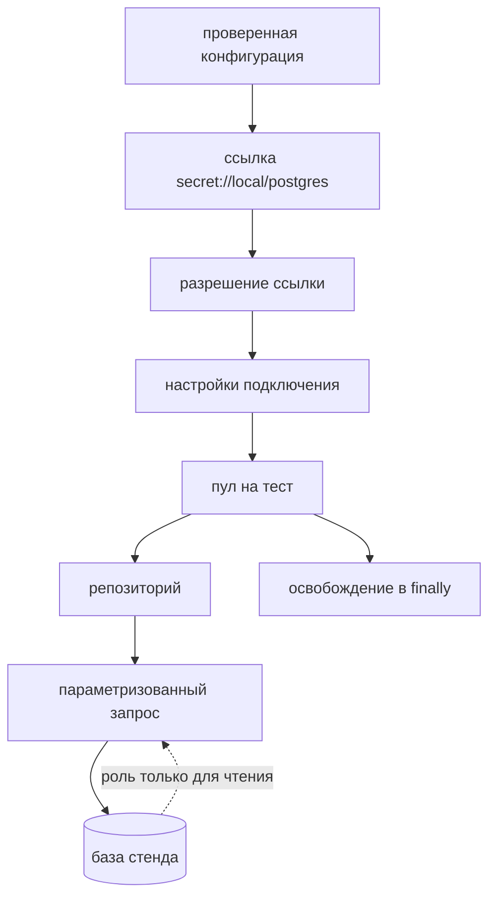

# Слой базы данных, пул и проверка состояния

## Предпосылки

Перед началом главы читатель должен завершить главу 255, иметь работающие слои REST и gRPC и поднятый локально стенд вместе с его базой данных.

## Связь с предыдущей главой

Слои REST и gRPC смотрят на систему снаружи: они видят то, что она соглашается показать. Этого достаточно для большинства проверок и недостаточно для одного класса вопросов — что система записала на самом деле.

Третий слой смотрит внутрь. Он не заменяет предыдущие два и не становится основным способом проверки: у него узкая задача — подтвердить сохранённое состояние там, где публичный контракт его не показывает.

## Цель главы

Создать слой доступа к базе: границу разрешения секрета, жизненный цикл пула, параметризованный слой запросов и шесть сценариев, проверяющих сохранённое состояние и принадлежность данных прогону.

## Главный вопрос

> Когда прямой доступ к базе оправдан и как не превратить его в обход публичных границ?

Короткий ответ: читать, но не писать; проверять то, чего не видно снаружи; подготавливать данные по-прежнему через API.

## Что входит в слой базы данных

* **разрешение ссылки на секрет** — превращение `secret://local/postgres` в настоящие настройки подключения;
* **жизненный цикл пула** — создание, ограничение размера, гарантированное освобождение;
* **параметризованные запросы** — намерение вместо текста SQL в сценарии;
* **нормализация результата** — приведение того, что отдал драйвер, к пригодному для проверок виду.

Чего в слое нет: записи. Роль подключения имеет права только на чтение, и это не договорённость, а физическое ограничение.



Пароля в конфигурации нет: она хранит ссылку. Запись невозможна не потому, что её запретили правилом, а потому что у роли нет прав.

## Созданная структура

```text
src/
├── database/
│   ├── types.ts
│   ├── resolve-settings.ts
│   ├── work-items-repository.ts
│   └── index.ts
├── fixtures/
│   └── database-fixture.ts
└── tests/
    └── database/
```

## Конфигурация хранит ссылку, а не секрет

В `RuntimeConfig` лежит `postgresConnectionReference` — строка вида `secret://local/postgres`. Это не оплошность, а решение главы 252: проверенная конфигурация не содержит паролей.

Разрешение ссылки — отдельная граница:

```typescript
export function resolveDatabaseSettings(
  reference: string,
  env: Readonly<Record<string, string | undefined>> = process.env
): DatabaseSettings {
  if (reference !== 'secret://local/postgres') {
    throw new SecretResolutionError(reference, 'поддерживается только локальная ссылка');
  }

  return Object.freeze({
    host: env['QA_DB_HOST'] ?? '127.0.0.1',
    port: Number(env['QA_DB_PORT'] ?? '55432'),
    database: env['QA_DB_NAME'] ?? 'educational_work_items',
    user: env['QA_DB_USER'] ?? 'sut_reader',
    password: env['QA_DB_PASSWORD'] ?? 'educational_reader_only'
  });
}
```

В локальном профиле она читает окружение. В промышленном её место занял бы менеджер секретов — и ни слой доступа, ни сценарии об этом не узнают: они видят только результат.

## Роль только для чтения

Подключение идёт ролью `sut_reader`, у которой нет прав на запись. Это важнее, чем кажется.

Соблазн подготовить данные напрямую в базе выглядит рационально: быстрее, чем через API, и не зависит от валидации. Но такая подготовка обходит доменные правила — запись появится без аудита, без учёта прогона и, возможно, в состоянии, которого система сама создать не может.

Ограничение на уровне роли превращает договорённость в гарантию: ошибка в тесте не сможет незаметно изменить состояние стенда.

## Пул создаётся на тест

```typescript
workItemsRepository: async ({ foundation }, use) => {
  const settings = resolveDatabaseSettings(foundation.config.postgresConnectionReference);
  const pool = new pg.Pool({ ...settings, max: 2, application_name: 'final-project' });

  try {
    await use(new WorkItemsRepository(pool));
  } finally {
    await pool.end();
  }
}
```

Пул на прогон сэкономил бы открытие подключений и стал бы общим изменяемым ресурсом: он переживает тест, а его освобождение перестаёт быть чьей-то обязанностью. Незакрытый пул держит подключения, и процесс запускающего инструмента может не завершиться.

Освобождение стоит в `finally` — как и закрытие канала gRPC, и по той же причине.

## Параметры вместо склейки

```typescript
async findById(id: string): Promise<WorkItemRow | undefined> {
  const result = await this.#pool.query<WorkItemRow>(
    `SELECT id, title, description, status, priority,
            test_run_id, creator_test_id, is_seed, version
       FROM work_items
      WHERE id = $1`,
    [id]
  );

  return result.rows[0];
}
```

Значения всегда передаются параметрами. Склейка строкой открыла бы внедрение SQL и сломалась бы на первом же апострофе в названии задачи — а названия в тестовых данных бывают любыми.

Отсутствие строки здесь не ошибка: метод возвращает `undefined`. Решение, считать ли это провалом, принимает сценарий.

## Драйвер отдаёт `bigint` строкой

```typescript
async countByStatus(status: string): Promise<number> {
  const result = await this.#pool.query<{ total: string }>(
    `SELECT count(*) AS total FROM work_items WHERE status = $1`,
    [status]
  );

  return Number(result.rows[0]?.total ?? '0');
}
```

`count(*)` в PostgreSQL имеет тип `bigint`, и драйвер отдаёт его строкой — так он защищает от потери точности на больших значениях. Это не ошибка данных, и нормализация принадлежит слою: сценарий должен получить число.

Без этого `expect(total).toBe(3)` упал бы с сообщением «ожидалось 3, получено "3"» — формально верным и совершенно бесполезным.

## Одна сессия на тест

Здесь проект едва не получил дефект, который стоит разобрать отдельно.

Две фикстуры — подготовка данных и идентификатор прогона — получали токен независимо друг от друга. Код выглядел безупречно, а тест падал: число записей прогона не менялось после создания задачи.

Причина в контракте стенда: **каждый выпуск токена открывает новый прогон** со своим `testRunId`. Подготовка попадала в один прогон, проверка считала записи другого, а массовая очистка убирала третий.

```typescript
session: async ({ apiRequest, foundation, databaseCredentials }, use) => {
  await use(await openSession(apiRequest, foundation.config.restBaseUrl, databaseCredentials));
},

currentTestRunId: async ({ session }, use) => {
  await use(session.testRunId);
},

createOwnedWorkItem: async ({ apiRequest, foundation, session }, use) => { /* … */ }
```

Теперь сессия одна, а обе фикстуры зависят от неё. Та же правка внесена в слои REST и gRPC: там дефект не проявлялся, потому что записи искались по идентификатору, а не по прогону, — но массовая очистка точно так же убирала чужой прогон.

Урок общий: **если две фикстуры независимо обращаются к внешней системе за идентичностью, они получают разные идентичности.** Проверить это можно только со стороны, откуда видно обе, — в данном случае со стороны базы.

## Сценарии

Первый подтверждает сохранённое состояние:

```typescript
const created = await createOwnedWorkItem({ /* через REST */ });
const row = await workItemsRepository.findById(created.id);

expect(row.title).toBe(created.title);
expect(row.is_seed).toBe(false);
expect(row.version).toBe(created.version);
```

Проверка `is_seed` — это то, чего не видно снаружи: публичный контракт не сообщает, относится ли запись к наполнению стенда. Для сценария это важно: справочные данные трогать нельзя.

Второй проверяет текст со спецсимволами:

```typescript
const description = 'Описание со спецсимволами: \' " % _ \\';
```

Такой текст ломает склейку SQL и проходит через параметр без изменений. Сценарий подтверждает, что описание сохранилось как есть, а не превратилось в `NULL` и не потеряло символы.

Третий связывает запись с прогоном:

```typescript
const during = await workItemsRepository.countByTestRun(currentTestRunId);

expect(during).toBe(before + 1);
expect(row.test_run_id).toBe(currentTestRunId);
```

Именно по этому полю работает массовая очистка. Проверить его можно только со стороны базы — API отдаёт записи, но не объясняет, как устроена их принадлежность.

## Команды и ожидаемый результат

```bash
npm run sut:up
npm run final-project:db
```

Ожидаемый результат: шесть сценариев проходят примерно за четыреста миллисекунд. База отвечает быстро; основное время уходит на открытие пула, и срок теста это учитывает.

## Распространённые мифы

**Миф: раз есть доступ к базе, данные удобнее готовить там.**
Подготовка в обход API обходит доменные правила: запись появится без аудита и без учёта прогона. Роль только для чтения делает этот соблазн невозможным.

**Миф: проверять через базу надёжнее, чем через API.**
Надёжнее — не значит правильнее. Проверка через базу подтверждает хранение, а не поведение системы: сценарий, проверяющий только строку в таблице, пройдёт и при сломанном API.

**Миф: `count(*)` возвращает число.**
Возвращает `bigint`, который драйвер отдаёт строкой. Нормализация принадлежит слою доступа.

**Миф: пул можно открыть один раз на прогон.**
Можно — и получить общий изменяемый ресурс без владельца. Пул на тест дороже на миллисекунды и дешевле в поддержке.

## Частые вопросы

**Когда прямой доступ к базе действительно нужен?**
Когда проверяемый эффект не виден через публичный контракт: служебные поля, принадлежность прогону, факт записи в журнал аудита.

**Почему запросы лежат в репозитории, а не в сценарии?**
Сценарий говорит о задачах, а не о таблицах. Изменение схемы должно затрагивать один файл.

**Что делать, если строки нет?**
Возвращать `undefined` и оставлять решение сценарию: отсутствие записи — это результат, а не ошибка запроса.

**Зачем ограничивать размер пула?**
Два подключения достаточно одному тесту. Без ограничения параллельный прогон быстро упрётся в лимит подключений базы, и падать будут тесты, а не пул.

## Распространённые ошибки

### Ошибка 1. Склейка значений в текст запроса

Ломается на апострофе и открывает внедрение SQL. Значения передаются параметрами всегда.

### Ошибка 2. Подготовка данных запросом к базе

Обходит доменные правила и делает тест зависимым от схемы, а не от поведения.

### Ошибка 3. Пул без освобождения

Держит подключения и способен оставить процесс висеть при зелёном отчёте.

### Ошибка 4. Сравнение с результатом драйвера без нормализации

`'3'` не равно `3`, и сообщение об ошибке это не объяснит.

## Быстрая проверка

1. Почему конфигурация хранит ссылку на секрет, а не строку подключения?
2. Что физически запрещает тесту изменить данные в обход API?
3. Почему `count(*)` приходит строкой и где это исправляется?
4. Что произойдёт, если две фикстуры независимо получат токен?
5. Какие проверки оправдывают прямой доступ к базе?

### Ответы

1. Проверенная конфигурация не должна содержать паролей: она попадает в журналы и диагностику. Разрешение ссылки — отдельная граница.
2. Роль подключения `sut_reader` не имеет прав на запись.
3. `count(*)` имеет тип `bigint`, и драйвер отдаёт его строкой во избежание потери точности. Нормализация выполняется в слое доступа.
4. Каждый выпуск токена открывает новый прогон со своим идентификатором: подготовка и проверки окажутся в разных прогонах.
5. Те, где проверяемый эффект не виден через публичный контракт: служебные поля, принадлежность прогону, факт записи в аудит.

## Практика

Добавьте в репозиторий метод, возвращающий число записей, созданных конкретным тестом (`creator_test_id`), и сценарий, который подтверждает, что после удаления задачи через REST это число уменьшается.

Соблюдайте границы: новый запрос должен появиться в репозитории, подготовка — идти через REST, а роль подключения остаться только читающей.

## Краткие итоги

* Слой базы читает состояние и никогда его не пишет; ограничение задано ролью, а не договорённостью.
* Конфигурация хранит ссылку на секрет, разрешение ссылки — отдельная граница.
* Пул создаётся на тест и освобождается в `finally`.
* Значения передаются параметрами; результат драйвера нормализуется в слое.
* Одна сессия на тест: каждый выпуск токена открывает новый прогон.
* Прямой доступ оправдан там, где эффект не виден через публичный контракт.

## Переход к следующей главе

Три слоя проверяют систему с трёх сторон, но каждый — по отдельности. Глава 257 соединит их в межслойные сценарии: одна бизнес-операция, один идентификатор, одна каноническая модель и одна точка владения данными.
