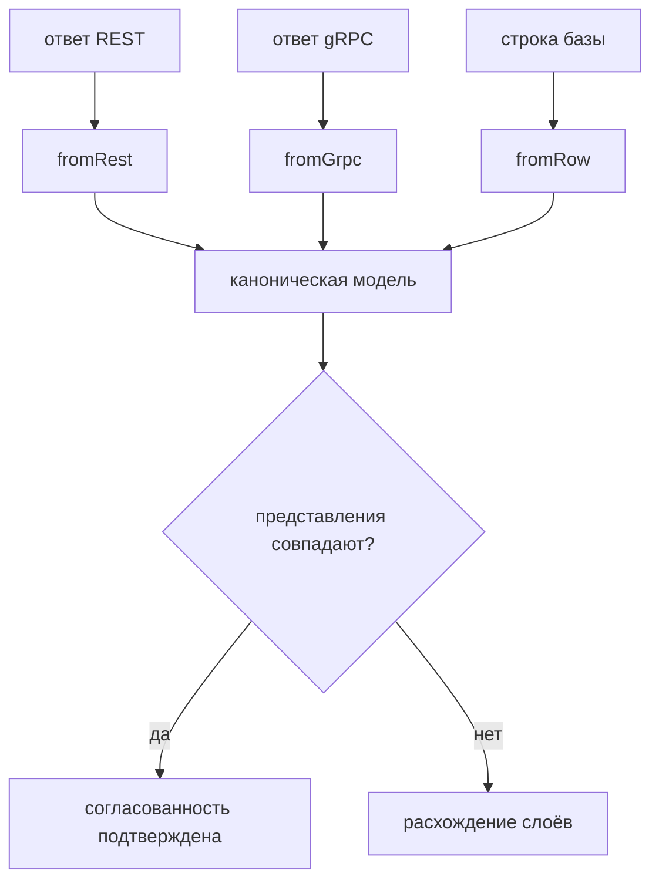

# Межслойные сценарии, каноническая модель и владение данными

## Предпосылки

Перед началом главы читатель должен завершить главу 256, иметь работающие слои интерфейса, REST, gRPC и базы данных и поднятый локально стенд.

## Связь с предыдущей главой

Четыре слоя проверяют систему с четырёх сторон, но каждый по отдельности. Пока это четыре независимых набора: они не спорят друг с другом, потому что не встречаются.

Встреча начинается здесь. Межслойный сценарий задаёт вопрос, на который ни один слой не отвечает сам: **описывают ли все слои одно и то же состояние одинаково**. Ответ на него — не формальность: расхождение между транспортом и хранилищем означает дефект системы, который обычные тесты пропускают.

## Цель главы

Создать межслойный уровень: каноническую модель сравнения, уникальную диагностируемую идентичность тестовых данных, реестр владения с очисткой при отказе и пять сценариев.

## Главный вопрос

> Как сравнивать данные, пришедшие из четырёх разных источников, не превращая сравнение в набор совпадений?

Короткий ответ: привести представления к одной форме на явной границе и связывать слои только идентификатором.

## Что входит в межслойный уровень

* **каноническая модель** — общая форма для сравнения и правила приведения к ней;
* **идентичность данных** — уникальное и диагностируемое название;
* **реестр владения** — регистрация очистки в момент создания и освобождение при любом исходе;
* **контекст сценария** — собранные вместе слои, которые сценарий получает готовыми.

Чего здесь нет: новых транспортов. Уровень ничего не добавляет к тому, что умеют слои, — он их соединяет.



Каждая функция приведения знает особенности своего источника и не знает про остальные. Сравниваются канонические модели целиком, а не выбранные поля.

## Созданная структура

```text
src/
├── scenarios/
│   ├── canonical.ts
│   └── index.ts
├── test-data/
│   ├── identity.ts
│   ├── ownership.ts
│   └── index.ts
├── fixtures/
│   └── cross-layer-fixture.ts
└── tests/
    └── cross-layer/
```

## Каноническая модель и чем она не является

```typescript
export type CanonicalWorkItem = Readonly<{
  id: string;
  title: string;
  status: string;
  priority: string;
  version: number;
  createdAt: string;   // всегда ISO 8601
}>;
```

Она существует ради одного сравнения и ничем больше не является: это не транспортная модель, не модель приложения и не «общий тип проекта». Как только каноническая модель начинает использоваться слоями напрямую, она превращается в скрытую зависимость между ними — и смена контракта одного транспорта ломает другой.

Приведение выполняется тремя функциями — по одной на источник:

```typescript
export function fromRest(item, createdAt): CanonicalWorkItem;
export function fromGrpc(raw: unknown): CanonicalWorkItem;
export function fromRow(raw: unknown): CanonicalWorkItem;
```

Каждая знает особенности своего источника и не знает про остальные.

## Где представления действительно расходятся

Главное расхождение — время:

| Источник | Что отдаёт |
| --- | --- |
| REST | строку ISO 8601 |
| gRPC | строку ISO 8601 |
| PostgreSQL | объект `Date` |

Сравнение напрямую даёт `'2026-09-27T20:06:33.317Z'` против `Date` — проверка падает, а сообщение об ошибке причину не объясняет. Нормализация приводит обе формы к строке:

```typescript
function requireInstant(source: string, field: string, value: unknown): string {
  if (value instanceof Date) {
    if (Number.isNaN(value.getTime())) throw new NormalizationError(source, field, value);

    return value.toISOString();
  }
  // …
}
```

Обратите внимание на сообщение ошибки: оно называет **слой**, поле и полученное значение. Без имени слоя расследование начиналось бы с вопроса «чьё это представление».

Второе расхождение мягче: `count(*)` из базы приходит строкой, поэтому `requireNumber` принимает и строку, и число. Это не снисходительность — это знание о драйвере, вынесенное в одно место.

## Идентичность данных: уникальная и диагностируемая

```typescript
const identity = new TestDataIdentity({
  project: testInfo.project.name,
  workerIndex: testInfo.workerIndex,
  retry: testInfo.retry,
  testId: testInfo.testId
});

identity.next('agreement');   // fp-cross-layer-w0-r0-3f2a1b9c-agreement-1
```

Случайная строка тоже была бы уникальной. Разница в том, что по ней нельзя понять, какой прогон оставил запись на стенде, — а по такому названию видно проект, рабочий процесс, номер повтора и тест.

Признаки идут от общего к частному, поэтому записи одного прогона группируются при сортировке. Локальная последовательность гарантирует, что два вызова в одном тесте не совпадут.

## Реестр владения

```typescript
layers.owned.own(`задача ${created.value.id}`, async () => {
  await layers.rest.remove(created.value.id);
});
```

Три свойства реестра важнее его кода:

1. **Регистрация в момент создания.** Между созданием и концом сценария находится сам сценарий, и он может упасть.
2. **Освобождение в обратном порядке.** Связанные данные удаляются в порядке, обратном созданию, — иначе внешний ключ не даст удалить родителя.
3. **Ошибка очистки не скрывает исходную.** Если упал и сценарий, и очистка, обе попадают в `AggregateError`, и ошибка сценария стоит **первой**.

Последнее свойство проверяется отдельным сценарием:

```typescript
expect((aggregate.errors[0] as Error).message).toBe('исходная ошибка сценария');
expect(aggregate.errors.length).toBe(2);
```

Порядок здесь не косметика. Отчёт показывает первую ошибку как причину падения, и ею должна быть ошибка сценария, а не последствие.

## Контекст сценария собирается фикстурой

Фикстура `layers` — это Composition Root межслойного сценария. Она создаёт клиент REST, пул базы, канал gRPC, идентичность и реестр владения, а сценарий получает всё готовым:

```typescript
test('три слоя описывают одну запись одинаково', async ({ layers }) => {
  const created = await layers.rest.create({ title: layers.identity.next('agreement'), /* … */ });
  const grpcResult = await layers.readGrpc(created.value.id);
  const row = await layers.repository.findById(created.value.id);
  // …
});
```

Сценарий не создаёт ни клиентов, ни пулов, ни каналов — и потому не может забыть их закрыть. Освобождение идёт в обратном порядке: сначала данные, затем канал, пул и страховочная очистка прогона.

## Сценарии

**Согласие трёх слоёв.** Запись создаётся через REST, читается через gRPC и через базу, все три представления приводятся к канонической форме и сравниваются целиком:

```typescript
expect(viaGrpc).toEqual(viaRest);
expect(viaDatabase).toEqual(viaRest);
```

Сравнение целых моделей, а не отдельных полей, — осознанное решение. Поле, которое забыли проверить, — это поле, расхождение в котором никто не заметит.

**Согласованность после изменения.** Переход выполняется через REST, а версия проверяется во всех трёх слоях:

```typescript
expect(viaGrpc.version).toBe(moved.value.version);
expect(viaDatabase.version).toBe(moved.value.version);
```

Версия — общий признак согласованности. Слой, отставший на одно изменение — из-за кеша, реплики или асинхронной обработки, — обнаружится именно здесь.

**Очистка при отказе.** Сценарий создаёт запись, затем освобождает реестр с ошибкой — как при настоящем падении — и проверяет, что запись исчезла:

```typescript
const row = await layers.repository.findById(id);

expect(row).toBe(undefined);
```

Падение контролируемое: тест не валится, но проходит ту же ветку, что и настоящий отказ. Проверить это со стороны API было бы труднее — база отвечает на вопрос «осталась ли строка» прямо.

## Команды и ожидаемый результат

```bash
npm run sut:up
npm run final-project:cross
```

Ожидаемый результат: пять сценариев проходят примерно за полсекунды. После прогона на стенде не остаётся записей с префиксом `fp-`.

## Распространённые мифы

**Миф: каноническая модель — это общий тип проекта.**
Она существует для конкретного сравнения. Общий тип связал бы слои между собой, и смена контракта одного ломала бы другой.

**Миф: если поля совпали по именам, сравнивать можно напрямую.**
Совпадение имён ничего не говорит о представлении. Время в базе — объект, в транспорте — строка.

**Миф: межслойный сценарий надёжнее обычного.**
Он отвечает на другой вопрос и стоит дороже: падение может произойти в любом из четырёх слоёв. Большую часть правил дешевле проверять на ближайшем слое.

**Миф: очистку можно доверить массовому удалению прогона.**
Массовое удаление — страховка. Если полагаться только на неё, данные живут до конца прогона и мешают соседним тестам.

## Частые вопросы

**Почему сравниваются целые модели, а не отдельные поля?**
Поле, которое забыли проверить, — это поле, расхождение в котором никто не заметит.

**Что делать, если слой отстаёт по времени?**
Применить ограниченный опрос к отстающей стороне до сравнения — приём из главы 213. В учебном стенде отставания нет, поэтому сценарии обходятся без него.

**Зачем идентичности признак повтора?**
Повтор создаёт новые данные. Без признака повтора записи первой и второй попытки неразличимы, и разбор падения начинается с вопроса, чья это запись.

**Почему освобождение реестра стоит перед закрытием канала и пула?**
Очистка данных выполняется через клиентов. Закрыв транспорт раньше, мы лишили бы её способа работать.

## Распространённые ошибки

### Ошибка 1. Сравнение сырых ответов

Даёт падения на представлении, а не на содержании: строка против объекта, число против строки.

### Ошибка 2. Каноническая модель в слоях

Превращает средство сравнения в зависимость между транспортами.

### Ошибка 3. Регистрация очистки в конце сценария

Упавший сценарий до неё не дойдёт.

### Ошибка 4. Связь слоёв по названию записи

Название не уникально и может измениться. Единственная надёжная связь — идентификатор.

## Быстрая проверка

1. Чем каноническая модель отличается от общей модели проекта?
2. Какое расхождение представлений даёт учебный стенд и как оно устраняется?
3. Почему сравниваются целые модели, а не выбранные поля?
4. В каком порядке освобождаются ресурсы межслойного сценария и почему?
5. Что стоит первым в `AggregateError` при одновременном падении сценария и очистки?

### Ответы

1. Каноническая модель существует ради конкретного сравнения и живёт столько, сколько это сравнение нужно. Общая модель связала бы слои между собой.
2. Время: REST и gRPC отдают строку ISO, драйвер PostgreSQL — объект `Date`. Нормализация приводит обе формы к строке.
3. Поле, которое забыли проверить, — это поле, расхождение в котором никто не заметит.
4. Сначала данные, затем канал gRPC, пул базы и страховочная очистка прогона: очистка данных выполняется через транспорты, поэтому они должны быть ещё живы.
5. Ошибка сценария: отчёт показывает первую ошибку как причину падения.

## Практика

Добавьте четвёртый межслойный сценарий: создайте запись через интерфейс, получите её идентификатор из адреса страницы и подтвердите её состояние через REST и базу.

Соблюдайте границы: объект страницы не должен знать об API, а сравнение должно идти по канонической модели. Помните ограничение из главы 253 — данные, созданные через интерфейс, принадлежат сессии интерфейса, поэтому их очистку нужно продумать отдельно.

## Краткие итоги

* Каноническая модель существует ради сравнения и не становится общим типом проекта.
* Приведение выполняется по одной функции на источник, а ошибка называет слой и поле.
* Главное расхождение стенда — представление времени: строка против объекта `Date`.
* Идентичность данных уникальна и диагностируема: по названию видно проект, процесс и повтор.
* Очистка регистрируется при создании, выполняется в обратном порядке и не скрывает исходную ошибку.
* Слои связываются только идентификатором записи.

## Переход к следующей главе

Сценарии собраны, данные принадлежат своим владельцам. Осталось сделать результат прогона пригодным для чтения другими людьми: глава 258 добавит структурные журналы, вложения, отчёт и запуск в CI.
