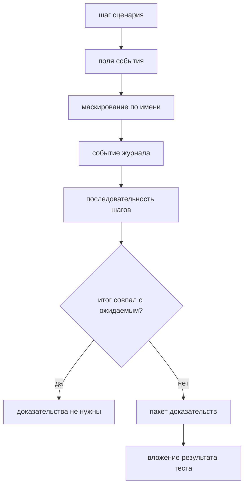

# Диагностика, отчёт и запуск в CI

## Предпосылки

Перед началом главы читатель должен завершить главу 257, иметь четыре работающих слоя и межслойные сценарии.

## Связь с предыдущей главой

Проект умеет проверять систему с четырёх сторон и убирать за собой. Чего он пока не умеет — объяснять падение тому, кто его не запускал.

Зелёный прогон в этом смысле бесполезен: он ничего не сообщает. Ценность диагностики проявляется ровно один раз — когда что-то упало, а человек, читающий отчёт, находится в другом месте и в другое время.

## Цель главы

Собрать диагностический поток: структурные события с маскированием секретов, сохранение цепочки причин, ограниченные вложения, запуск в два процесса и проверяемый сценарий сборки.

## Главный вопрос

> Что должно остаться после упавшего прогона, чтобы причину можно было найти, не воспроизводя его?

Короткий ответ: связывающий идентификатор, последовательность шагов, исходная ошибка со всеми причинами — и ничего секретного.

## Что входит в диагностический слой

* **маскирование** — замена чувствительных значений до записи;
* **события** — уровень, имя, связывающий идентификатор, метка времени, ограниченный набор полей;
* **описание ошибки** — цепочка `cause` целиком, без зацикливания;
* **вложение** — пакет доказательств с ограничением размера;
* **сценарий сборки** — запуск в CI, который проверяется, а не принимается на веру.

Чего в слое нет: решений. Журнал записывает и не глотает ошибку, не меняет итог теста и не решает, что считать успехом.



Маскирование стоит до создания события: секрет не попадает в журнал даже при ошибке в самом журнале. Хук собирает доказательства и не меняет итог.

## Созданная структура

```text
src/
├── diagnostics/
│   ├── redact.ts
│   ├── events.ts
│   ├── describe-error.ts
│   ├── evidence.ts
│   └── index.ts
├── fixtures/
│   └── diagnostics-fixture.ts
├── ci/
│   ├── final-project.yml
│   └── validate-workflow.mjs
└── tests/
    └── diagnostics/
```

## Маскирование выполняется до записи

```typescript
export function redactFields(fields) {
  return Object.freeze(Object.fromEntries(
    Object.entries(fields).map(([key, value]) => [
      key, isSensitive(key) ? REDACTED : value
    ])
  ));
}
```

Два решения в этих строках.

**Проверяется имя поля, а не значение.** Угадывать секрет по виду строки ненадёжно: токен похож на идентификатор, пароль — на обычный текст. Имена полей мы задаём сами, и по ним можно принимать решение уверенно.

**Маскирование идёт до передачи журналу.** Если прятать секрет внутри журнала, значение всё равно попадёт в память процесса журналирования и выйдет наружу при первой же ошибке в нём. Событие создаётся уже безопасным:

```typescript
log.step('вход выполнен', { login: 'educational_tester', authorization: 'Bearer abc' });

expect(JSON.stringify(event).includes('abc')).toBe(false);
```

## Цепочка причин сохраняется целиком

```typescript
const [description] = describeFailure(top);

expect(description.message).toBe('шаг сценария упал');
expect(description.cause.message).toBe('запрос не выполнен');
expect(description.cause.cause.message).toBe('соединение закрыто');
```

Без цепочки в отчёте остаётся верхнее сообщение — «шаг сценария упал», — из которого причина не видна.

`AggregateError` разворачивается в список, и первая ошибка остаётся первой: при одновременном падении сценария и очистки отчёт обязан показать причину, а не последствие.

Разбор защищён от замыкания:

```typescript
const error = new Error('сам себе причина');

error.cause = error;
```

Цепочка обрывается на повторе, но **факт наличия причины сохраняется**. Полное её исчезновение выглядело бы так, будто причины не было вовсе.

## Вложение ограничено по размеру и переживает цикл

```typescript
export function serializeEvidence(value: unknown): string {
  const seen = new WeakSet<object>();
  const text = JSON.stringify(value, (_key, current) => {
    if (typeof current !== 'object' || current === null) return current;
    if (seen.has(current)) return '[циклическая ссылка]';

    seen.add(current);

    return current;
  }, 2);
  // … обрезка по 64 КиБ
}
```

Циклическая ссылка и многомегабайтное тело — обычные явления в диагностических данных, и оба ломают наивный `JSON.stringify`. Причём ломают именно тогда, когда диагностика нужна: при падении.

## Тонкость, о которую легко споткнуться

Хук диагностики срабатывает при **расхождении фактического и ожидаемого итога**:

```typescript
const failed = testInfo.status !== testInfo.expectedStatus;

if (failed) {
  await attachEvidence(testInfo, buildEvidence(/* … */));
}
```

Формулировка не случайна. Тест, помеченный `test.fail()`, падает **ожидаемо**: фактический итог совпадает с ожидаемым, и хук молчит.

Это выяснилось не рассуждением, а запуском. Первая версия сценария контролируемого падения использовала `test.fail()` и ожидала вложения — вложения не появилось, и это оказалось правильным поведением хука, а не дефектом.

Отсюда два следствия. Проверять упаковку доказательств удобнее прямым вызовом — тогда результат виден в `testInfo.attachments`. А сама формулировка условия остаётся верной: собирать доказательства для ожидаемого падения незачем.

## Хук дополняет, но не подменяет

Два ограничения, нарушение которых обесценивает схему:

1. **Хук не отменяет падение.** Исходный итог по-прежнему определяет результат; хук, который «починил» тест, скрыл дефект.
2. **Хук не заменяет шаги.** Контекст, собранный после сценария, показывает состояние в конце. Маршрут дают предметные события, записанные по ходу.

## Связывающий идентификатор

```typescript
correlationId: ['fp', testInfo.project.name, `w${testInfo.workerIndex}`,
                `r${testInfo.retry}`, testInfo.testId.slice(0, 8)].join('-');
```

Он одинаков у всех событий одного теста и различен у разных попыток. По нему записи журнала соединяются с конкретной попыткой конкретного теста — без этого при параллельном запуске события разных процессов перемешаны и неразделимы.

Проверять его стоит **по форме, а не по числам**:

```typescript
expect(log.correlationId).toMatch(/^fp-diagnostics-w\d+-r\d+-[0-9a-f]{8}$/);
```

Первая версия проверки требовала `-w0-` и упала, как только тесты разошлись по двум процессам. Это та же ошибка, о которой предупреждает глава 234: логика теста не должна зависеть от конкретных значений индексов.

## Запуск в два процесса

```bash
npm run final-project:stability
```

Команда запускает автономные наборы в двух рабочих процессах без повторов. Три прогона подряд дают одинаковый результат — это и есть проверка устойчивости из критерия готовности.

Повторы намеренно выключены: они скрыли бы нестабильность, которую проверка должна обнаружить.

## Сценарий сборки проверяется, а не принимается на веру

Файл лежит вне `.github/workflows`, поэтому на GitHub не запускается. Его проверяет отдельный валидатор:

```bash
npm run final-project:ci-check
```

Он требует того, что делает сигнал честным:

| Требование | Почему |
| --- | --- |
| события `push` и `pull_request` | изменение проверяется до слияния и после |
| `permissions: contents: read` | прогону тестов права на запись не нужны |
| `timeout-minutes` | задача не должна висеть бесконечно |
| отсутствие `continue-on-error: true` | иначе упавшая проверка не влияет на итог |
| `npm ci`, а не `npm install` | установка строго по файлу фиксации версий |
| `if: always()` у загрузки артефактов | иначе доказательства не сохранятся после падения |
| `if-no-files-found: error` | тихое отсутствие артефактов хуже их отсутствия |
| закреплённые версии действий | незакреплённая версия делает прогон невоспроизводимым |

Сценарий сборки — такой же код, как тесты, и так же устаревает. Валидатор превращает это из вопроса дисциплины в проверяемое условие.

## Команды и ожидаемый результат

```bash
npm run final-project:diagnostics   # 10 сценариев, стенд не нужен
npm run final-project:stability     # 28 тестов в два процесса, без повторов
npm run final-project:ci-check      # проверка сценария сборки
```

Диагностика проверяется без стенда намеренно: предмет проверки — форма доказательств, а не поведение системы.

## Распространённые мифы

**Миф: маскировать можно внутри журнала.**
Значение уже попало в процесс журналирования. Маскирование выполняется до передачи.

**Миф: чем больше данных во вложении, тем лучше.**
Больше данных — выше риск сохранить секрет и дороже хранение. Пакет ограничен и по содержанию, и по размеру.

**Миф: зелёный прогон в CI означает, что проверки работают.**
Он означает, что команды завершились с нулевым кодом. Шаг с `continue-on-error` и опечатка в пути артефактов дают тот же зелёный цвет.

**Миф: хук диагностики может исправить результат.**
Исходное падение определяет итог. Хук, меняющий его, скрывает дефект.

## Частые вопросы

**Почему диагностика проверяется без стенда?**
Её предмет — форма доказательств. Поднятый стенд добавил бы к проверке внешнюю зависимость, ничего не проверяя дополнительно.

**Зачем ограничение глубины у цепочки причин?**
Цепочка может замкнуться на себя. Ограничение и множество посещённых ошибок защищают от бесконечного разбора.

**Что делать, если секрет всё-таки попал в артефакт?**
Считать его скомпрометированным и отозвать. Удаление артефакта не отменяет того, что он был доступен.

**Почему повторы выключены в проверке устойчивости?**
Повтор скрывает нестабильность. Проверка существует, чтобы её обнаружить.

## Распространённые ошибки

### Ошибка 1. Запись всего контекста целиком

Вместе с полезными полями в журнал уходят токены и строки подключения.

### Ошибка 2. Проверка идентификатора по конкретным числам

Индекс рабочего процесса зависит от расписания запуска и меняется между прогонами.

### Ошибка 3. Журнал, поглощающий ошибку

Проглоченное исключение делает тест зелёным при сломанном сценарии.

### Ошибка 4. Артефакты без `if: always()`

Доказательства не сохраняются именно тогда, когда они нужны.

## Быстрая проверка

1. Почему маскирование выполняется до передачи значений журналу?
2. Что останется от цепочки причин, если ошибка ссылается сама на себя?
3. Почему хук диагностики молчит при `test.fail()`?
4. Как правильно проверять связывающий идентификатор и почему?
5. Зачем валидатор требует `if-no-files-found: error`?

### Ответы

1. Иначе значение попадает в процесс журналирования и выходит наружу при первой же ошибке в нём.
2. Цепочка обрывается на повторе, но факт наличия причины сохраняется: её полное исчезновение выглядело бы так, будто причины не было.
3. `test.fail()` делает падение ожидаемым, фактический итог совпадает с ожидаемым, и расхождения нет.
4. По форме — регулярным выражением. Индексы процесса и повтора зависят от расписания запуска.
5. Тихое отсутствие артефактов даёт зелёную задачу без доказательств, и обнаруживается это при следующем расследовании.

## Практика

Добавьте в пакет доказательств имя окружения и версию приложения, а в валидатор — требование, чтобы сценарий сборки не содержал шагов развёртывания.

Соблюдайте границы: имя окружения несекретно и переносится как есть, а любые учётные данные обязаны остаться замаскированными.

## Краткие итоги

* Маскирование идёт по имени поля и выполняется до записи события.
* Цепочка причин сохраняется целиком; исходная ошибка остаётся первой.
* Вложение ограничено по размеру и переживает циклические ссылки.
* Хук собирает доказательства при расхождении итогов и не меняет результат.
* Связывающий идентификатор проверяется по форме, а не по числам.
* Сценарий сборки проверяется валидатором, а не принимается на веру.

## Переход к следующей главе

Проект собран, наблюдаем и запускается в CI. Осталось ответить на вопрос, ради которого всё строилось: готов ли он. Глава 259 проведёт финальный аудит по критериям главы 250 и соберёт пакет доказательств.
