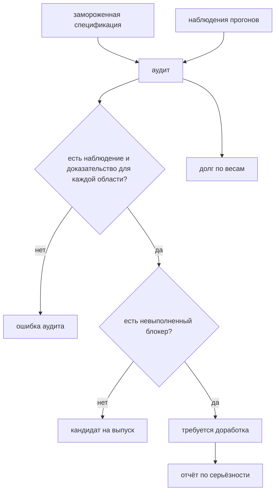

# Финальный аудит и решение о выпуске

## Предпосылки

Перед началом главы читатель должен завершить главу 258, иметь все слои, межслойные сценарии и диагностический поток.

## Связь с предыдущей главой

Проект собран, наблюдаем и запускается в CI. Осталось ответить на вопрос, ради которого глава 250 записывала требования: **готов ли он**.

Вопрос кажется риторическим — прогоны зелёные, команды работают. Но зелёный прогон отвечает на другой вопрос: «прошло ли то, что проверяли». Аудит спрашивает: «проверяли ли то, что обещали».

## Цель главы

Свести замороженную спецификацию требований с фактическими наблюдениями, получить взвешенный итог, честно классифицировать невыполненное и сформировать отчёт о доработке.

## Главный вопрос

> Как принять решение о выпуске так, чтобы его нельзя было подогнать под желаемый результат?

Короткий ответ: заморозить серьёзность требований до прогона, требовать доказательство для каждой области и не позволять сумме мелких нарушений отменять блокирующее.

## Что входит в аудит

* **замороженная спецификация** — области, их серьёзность и вид ожидаемого доказательства;
* **наблюдения** — фактический статус каждой области с подтверждением;
* **взвешивание** — оценка объёма доработки;
* **решение** — кандидат на выпуск или доработка;
* **отчёт** — что именно доделать, в порядке важности.



Долг считается всегда — он нужен для сравнения вариантов доработки. Отменяет выпуск только невыполненный блокер.

## Созданная структура

```text
src/
└── audit/
    ├── specification.ts
    ├── findings.ts
    ├── audit.ts
    └── index.ts
tests/
└── audit/
```

## Серьёзность замораживается до прогона

```typescript
export const SEVERITY_WEIGHT = Object.freeze({
  blocker: 100,
  major: 10,
  minor: 1
});
```

Веса заданы заранее и по результатам прогона не пересматриваются. Иначе аудит превращается в подгонку: неудобное требование тихо становится менее важным, а решение о выпуске — уже принятым до начала проверки.

Каждая область объявляет, **чем** она подтверждается:

```typescript
{
  id: 'RETRY-01',
  title: 'Успешность обязательного набора не зависит от повторов',
  severity: 'blocker',
  evidence: 'npm run final-project:stability'
}
```

Строка доказательства — не украшение. Она превращает «мы это проверяли» в проверяемое утверждение: команду можно выполнить и увидеть результат.

## Аудит не придумывает итог

```typescript
const finding = byId.get(area.id);

if (!finding) {
  throw new AuditError(`Для области ${area.id} нет наблюдения`);
}

if (finding.proof.trim() === '') {
  throw new AuditError(`Область ${area.id} не подтверждена доказательством`);
}
```

Три решения в этих строках.

**Пропущенная область — ошибка аудита, а не молчаливое «наверное, в порядке».** Именно пропуск даёт самые дорогие сюрпризы: требование никто не отменял, но и не проверял.

**Наблюдение без доказательства не засчитывается.** Пустая строка подтверждения — это мнение, а не факт.

**Наблюдение вне спецификации отвергается.** Иначе в отчёт попадает то, о чём не договаривались, и картина перестаёт соответствовать требованиям.

## Взвешивание сравнивает доработку, а не отменяет требования

```typescript
verdict: blockers.length === 0 ? 'RELEASE CANDIDATE' : 'REWORK REQUIRED'
```

Один невыполненный блокер отменяет выпуск **независимо от суммы весов**. Это отдельное правило, и без него взвешивание становится опасным: одиннадцать мелких нарушений набирают меньше баллов, чем один блокер, — и соблазн объявить проект готовым появляется сам собой.

Вес нужен для другого: сравнить варианты доработки и понять, за что браться первым.

```typescript
expect(report.debt).toBe(11);
expect(report.verdict).toBe('RELEASE CANDIDATE');
```

Два невыполненных требования уровня `major` и `minor` дают долг, но не отменяют выпуск. Решение принимает человек — и принимает его, видя цифру, а не впечатление.

## Статус `NOT APPLICABLE` существует не для удобства

Область, неприменимая к выбранному домену, не создаёт долга. Но это статус, который нужно **обосновать доказательством**, как и любой другой:

```typescript
{ id: 'B-01', status: 'NOT APPLICABLE', proof: 'домен не содержит такого поведения' }
```

Без обоснования он становится способом убрать неудобное требование из отчёта.

## Фактический итог этого проекта

Аудит запускается как обычный набор:

```bash
npm run final-project:audit
```

Отчёт:

```text
PASS            ARCH-01   blocker  Направление зависимостей описано, циклы отсутствуют
PASS            CONF-01   blocker  Внешняя конфигурация проверяется во время выполнения
PASS            SEC-01    blocker  Секреты отсутствуют в коде, журналах и вложениях
PASS            ISO-01    major    Данные имеют уникальную идентичность для каждого процесса
PASS            CLEAN-01  blocker  Данные проекта удаляются после успеха и после отказа
PASS            ERR-01    major    Исходная ошибка и ошибки очистки остаются доступными
PASS            DIAG-01   major    Падение создаёт очищенное доказательство
PASS            RETRY-01  blocker  Успешность обязательного набора не зависит от повторов
PASS            PAR-01    major    Обязательный набор проходит в двух рабочих процессах
PASS            CI-01     major    Сценарий сборки проверяем и не подавляет ошибки
FAIL            PORT-01   blocker  Портфель из девяти сценариев закрыт
PASS            DOC-01    minor    Другой инженер воспроизводит настройку и запуск

Долг по весам: 100
Блокеры: PORT-01
Итог: REWORK REQUIRED

Требуется доработка:
  - PORT-01 (blocker): не закрыты UI-01 (изменение состояния через интерфейс),
    XL-01 (подготовка через API → проверка через UI) и XL-02 (действие в UI →
    проверка в PostgreSQL)
```

**Проект не объявлен готовым — и это главный результат главы.**

Одиннадцать областей из двенадцати выполнены, все прогоны зелёные, команды работают. И всё равно `REWORK REQUIRED`, потому что портфель сценариев из главы 250 закрыт не полностью: межслойные сценарии проверяют REST, gRPC и базу, но не затрагивают интерфейс.

Подогнать итог было бы легко — достаточно объявить `PORT-01` неприменимым или понизить его серьёзность. Обе правки заняли бы одну строку, и отчёт стал бы зелёным.

Честный `FAIL` полезнее подогнанного `PASS` ровно по одной причине: он превращается в строку отчёта о доработке, а подгонка превращается в сюрприз у следующего инженера — обычно в тот момент, когда на фреймворк уже положились.

## Отчёт о доработке сортируется по важности

```typescript
[...failed].sort((left, right) =>
  SEVERITY_WEIGHT[right.severity] - SEVERITY_WEIGHT[left.severity] ||
  left.id.localeCompare(right.id)
)
```

Порядок задан детерминированно: сначала серьёзность, при равенстве — идентификатор. Отчёт, меняющий порядок между запусками, нельзя сравнить с предыдущим.

Каждая строка обязана объяснять, **что именно** доделать:

```typescript
for (const item of report.rework) {
  expect(item.length).toBeGreaterThan(40);
}
```

Проверка длины выглядит грубо, но ловит реальную беду: запись вида «`PORT-01`: портфель не закрыт» формально верна и бесполезна.

## Аудит проверяется сам

Двенадцать сценариев проверяют механизм: полноту охвата, отказ при пропущенной области, отказ при наблюдении вне спецификации, порядок доработки, поведение блокера и то, что мелкие нарушения не складываются до блокирующего.

Это не избыточность. Аудит — единственное место проекта, которое решает, выпускать ли остальное; ошибка в нём дороже ошибки в любом отдельном сценарии.

## Границы этого аудита

Что он **не** делает:

* **не проверяет систему** — он сводит наблюдения, а наблюдения получают прогоны;
* **не заменяет чтение отчёта человеком** — он даёт полную картину, решение остаётся за командой;
* **не гарантирует отсутствия дефектов** — зелёный аудит означает, что выполнено обещанное, а не что ошибок нет.

Последняя граница повторяет мысль главы 239 про зелёный конвейер и стоит того, чтобы прозвучать в конце проекта ещё раз.

## Команды и ожидаемый результат

```bash
npm run final-project:typecheck     # типы
npm run final-project:test          # 20 тестов каркаса
npm run final-project:diagnostics   # 10 сценариев диагностики
npm run final-project:audit         # 12 сценариев аудита и отчёт
npm run final-project:stability     # 30 тестов в два процесса
npm run final-project:ci-check      # проверка сценария сборки

npm run sut:up                      # дальше нужен стенд
npm run final-project:api           # 3 сценария REST
npm run final-project:grpc          # 5 сценариев gRPC
npm run final-project:db            # 6 сценариев базы
npm run final-project:cross         # 5 межслойных сценариев
npm run final-project:ui            # 4 сценария интерфейса
```

Отчёт аудита прикладывается к результату теста всегда — он и есть результат этой главы.

## Распространённые мифы

**Миф: зелёные прогоны означают готовность.**
Они означают, что прошло проверенное. Аудит спрашивает, проверено ли обещанное.

**Миф: взвешивание позволяет выпустить проект с блокером, если остальное хорошо.**
Не позволяет. Вес сравнивает варианты доработки, а не отменяет требования.

**Миф: `NOT APPLICABLE` — способ закрыть неудобное требование.**
Он требует обоснования, как и любой другой статус.

**Миф: аудит, объявивший доработку, — провал работы.**
Аудит, объявивший готовность там, где её нет, — вот провал. Честный отчёт о доработке и есть результат.

## Частые вопросы

**Почему аудит — набор тестов, а не скрипт?**
Потому что он сам нуждается в проверке. Скрипт, который никто не проверяет, ошибается молча.

**Кто заполняет наблюдения?**
Инженер, выполнивший прогоны. Файл заполняется по факту, а не по замыслу — это единственное место, где честность нельзя обеспечить кодом.

**Что делать с долгом по весам?**
Сравнивать варианты. Долг в одиннадцать баллов и долг в сто — разные объёмы работы, и планировать их нужно по-разному.

**Можно ли выпустить проект с невыполненным `minor`?**
Да, если команда согласна взять долг осознанно. Отчёт для того и нужен, чтобы решение было осознанным.

## Распространённые ошибки

### Ошибка 1. Пересмотр серьёзности после прогона

Превращает аудит в оформление уже принятого решения.

### Ошибка 2. Наблюдение без доказательства

Мнение, записанное в графу факта.

### Ошибка 3. Молчаливый пропуск области

Требование не отменено и не проверено — худшее из состояний.

### Ошибка 4. Строка доработки без содержания

«Портфель не закрыт» не говорит, какие сценарии писать.

## Быстрая проверка

1. Почему серьёзность областей замораживается до прогона?
2. Что происходит, если для области нет наблюдения?
3. Может ли сумма мелких нарушений отменить выпуск?
4. Зачем статусу `NOT APPLICABLE` доказательство?
5. Почему проект этой книги получил `REWORK REQUIRED`?

### Ответы

1. Иначе неудобное требование понижается в важности по результатам прогона, и аудит оформляет уже принятое решение.
2. Аудит завершается ошибкой: пропуск — худшее состояние, потому что требование не отменено и не проверено.
3. Нет. Вес сравнивает варианты доработки, а отменяет выпуск только невыполненный блокер.
4. Без обоснования он становится способом убрать требование из отчёта.
5. Портфель из девяти сценариев закрыт не полностью: не написаны `UI-01`, `XL-01` и `XL-02`.

## Практика

Закройте отчёт о доработке: напишите три недостающих сценария — изменение состояния через интерфейс, подготовку через API с проверкой через интерфейс и действие в интерфейсе с проверкой в базе.

После этого замените наблюдение `PORT-01` на `PASS` с доказательством и убедитесь, что аудит выдал `RELEASE CANDIDATE`. Помните ограничение главы 253: данные, созданные через интерфейс, принадлежат сессии интерфейса, поэтому их очистку нужно продумать отдельно.

## Краткие итоги

* Спецификация и серьёзность замораживаются до прогона.
* Каждая область требует наблюдения и доказательства; пропуск — ошибка аудита.
* Невыполненный блокер отменяет выпуск независимо от суммы весов.
* Вес нужен для сравнения вариантов доработки, а не для отмены требований.
* Отчёт о доработке отсортирован и объясняет, что именно доделать.
* Честный `FAIL` полезнее подогнанного `PASS`.

## Переход к следующей главе

Финальный проект завершён — и завершён честно: он работает, наблюдаем, воспроизводим и знает о себе, чего ему не хватает.

Это и есть рабочее состояние фреймворка автоматизации. Он никогда не бывает «готов окончательно»: меняется продукт, появляются новые границы, накапливается долг. Ценность даёт не момент завершения, а способность в любой момент ответить, что проверено, чем это подтверждено и что осталось сделать.
