# About the course

## Learning goals

After studying this chapter you will understand:

* why this course exists;
* who it is for;
* why the course starts with JavaScript rather than TypeScript or Playwright;
* why the main goal of the course is understanding mechanisms, not memorizing syntax;
* how the repository is organized;
* how chapters, examples, practice and solutions relate to each other;
* how to use the course materials while learning Automation QA.

This chapter does not teach JavaScript syntax. Its job is to set up the right learning model. Without that model the later chapters will feel like a set of disconnected topics, even though the course is built as a sequential engineering system.

---

## Motivation

Automation QA often starts with tools.

An engineer installs Playwright, opens the documentation, copies the first test, launches the browser and sees a passing result. That is an important stage, but it quickly leads to a problem: tests start to grow, helper functions appear, then fixtures, API clients, database access, retry logic, reports, environment configuration.

At that level, knowing Playwright commands alone is no longer enough.

Questions come up:

* why a value changed in one test and unexpectedly affected another;
* why `this` inside a function points somewhere other than expected;
* why `await` did not stop the whole test process;
* why an object from an API cannot be safely compared with a plain `===`;
* why TypeScript reports an error where the JavaScript code still runs;
* why a generic type in a helper function helps the framework rather than just complicating the code;
* why tests become unstable when asynchrony is handled incorrectly.

All of these questions relate not only to tools. They relate to the language, the runtime, the memory model, the type system and the architecture of the test code.

This course exists so that an Automation QA Engineer understands not only how to write an automated test, but also why the code behaves the way it does.

---

## Theory

### Purpose of the course

The course is about JavaScript, TypeScript and Automation QA.

It is not a syntax reference and not a collection of ready-made recipes. A reference answers the question "how do I write this construct". This course answers more important engineering questions:

* what problem a mechanism solves;
* why it appeared;
* how it works internally;
* what limitations it has;
* how it affects test code;
* what mistakes arise from an incorrect mental model.

The core goal of the course is to build a deep understanding of the language and to teach you how to apply it when developing production-grade test automation.

By production-grade automation we mean not a single test file with a few scenarios, but a full system:

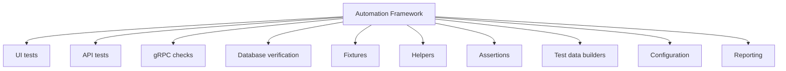

A system like this is not built on a single tool. It is built on a programming language. That is why the course starts from the foundation.

### Target audience

The course is meant for engineers who want to write automation deliberately.

The primary audience:

* Junior Automation QA;
* Middle Automation QA;
* Manual QA moving into automation;
* Backend QA;
* SDET;
* QA Engineers who use Playwright;
* anyone who wants to study JavaScript and TypeScript systematically.

The course does not require deep knowledge of the language. It assumes the reader has already seen JavaScript code, has run simple scripts or automated tests, and can use a terminal and a code editor.

But the course does not assume that the reader understands the internal mechanisms:

* Execution Context;
* Scope;
* Hoisting;
* TDZ;
* Stack;
* Heap;
* References;
* Closure;
* Event Loop;
* Promise;
* Type Erasure;
* Type Inference.

These are exactly the mechanisms that will be worked through step by step.

### Learning philosophy

The main idea of the course:

> Understanding matters more than memorization.

Memorization only helps over a short distance. You can memorize that `const` forbids reassigning a variable. But that is not enough to understand why an object declared with `const` can still be modified.

Shallow knowledge looks like this:

```javascript
const user = {
  name: 'Anna'
};

user.name = 'Maria';
```

If you only remember the phrase "`const` forbids changes", this code looks contradictory. In reality there is no contradiction. `const` forbids reassigning the variable's binding, but it does not make the object in memory immutable.

A more accurate model looks like this:

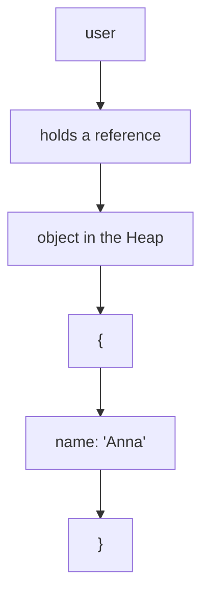

The variable `user` holds a reference to an object. `const` protects the binding between the name `user` and that reference. The object the reference points to stays mutable unless special mechanisms such as `Object.freeze` are used.

This approach is applied throughout the course:

1. First the problem.
2. Then the reason the mechanism exists.
3. Then the internal model.
4. Then the syntax.
5. Then a minimal example.
6. Then a practical example.
7. Then its use in Automation QA.
8. Then common mistakes.
9. Then practice.

### Why JavaScript is studied before TypeScript

TypeScript does not replace JavaScript.

TypeScript extends JavaScript with a type system, but after compilation it is JavaScript code that runs. The runtime does not execute TypeScript types. The runtime executes JavaScript.

A simplified picture looks like this:

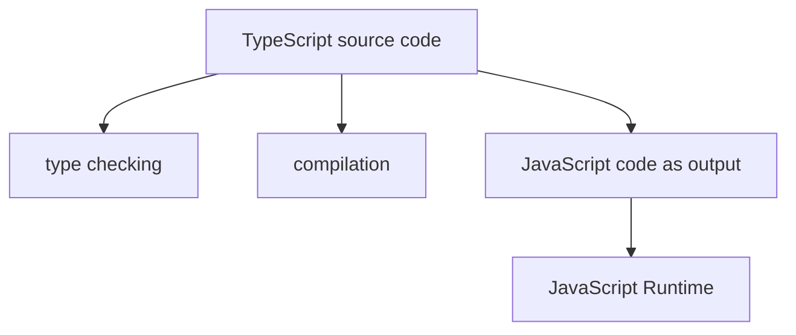

If an engineer does not understand JavaScript, TypeScript starts to feel like a separate, magical environment. That leads to mistakes.

For example, TypeScript can help describe the shape of an object:

```typescript
type User = {
  id: string;
  email: string;
};
```

But at runtime the type `User` disappears. If the API returns an object of the wrong shape, TypeScript by itself will not check the actual JSON at runtime. That requires runtime checks, assertions, validators or contract tests.

That is why the order of the course is essential:

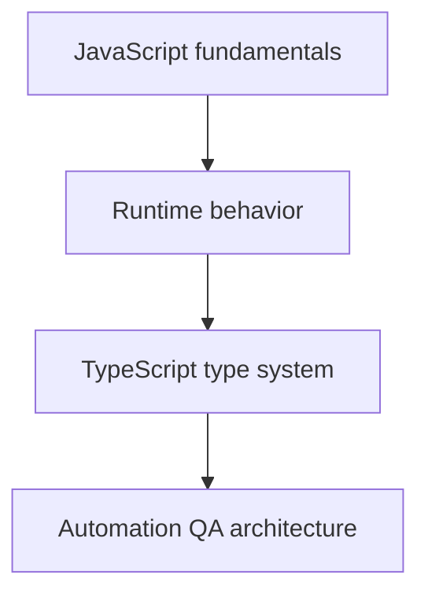

First you need to understand how JavaScript runs. Only after that can you correctly understand what TypeScript checks, what it does not check, and where the boundaries of its responsibility lie.

### Why understanding matters more than memorization

In test automation the code constantly works with a changing environment:

* the browser;
* the network;
* APIs;
* the database;
* queues;
* files;
* configuration;
* parallel test execution.

In such an environment you cannot survive on memorizing individual rules.

You can memorize that people often write `await` before an action in Playwright. But if you do not understand Promises and the Event Loop, it will be hard to explain why a test became flaky.

You can memorize that objects are compared by reference. But if you do not understand the Heap and References, it will be hard to write a correct helper that compares an API response with a database record.

You can memorize that TypeScript helps catch errors. But if you do not understand Type Erasure, it will be hard to explain why a test failed on a real API response even though the compiler was happy.

Understanding gives transferability. If you understand a mechanism, you can apply it in a new situation, even if you have never seen that particular code before.

---

## The internal mechanism of the course

The course is built as a sequential system of dependencies.

Every new topic relies on mechanisms already studied. This matters because JavaScript cannot be understood reliably in fragments. For example, `Closure` cannot be explained well without `Scope` and `Lexical Environment`. `async / await` cannot be explained well without `Promise` and the Event Loop. TypeScript `Narrowing` cannot be understood well without understanding conditions, value types and runtime checks.

The overall dependency of topics looks like this:

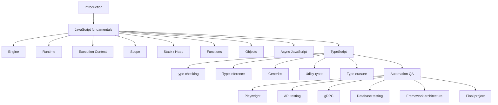

Inside every chapter the material follows the same cycle:

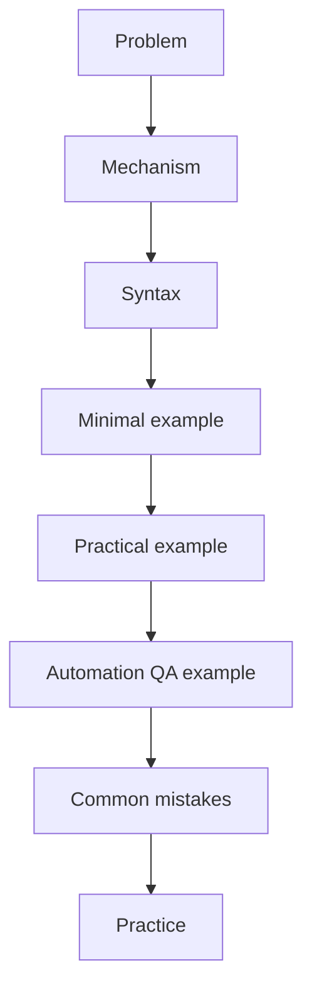

This cycle exists so that knowledge does not stay abstract. If a topic is explained only in theory, it is hard to apply. If a topic is shown only as code, it is easy to copy but hard to transfer to another problem.

The course connects both levels: the mechanism and its application.

---

## Mental model

Picture the course as a framework built in layers.

The bottom layer is JavaScript. It holds the mechanisms of code execution: memory, scopes, functions, objects, asynchrony.

The next layer is TypeScript. It adds a type system but does not cancel out JavaScript. TypeScript helps describe the developer's intent and catch some errors before running the code.

The next layer is Automation QA. Here the language is used for real tasks: open a page, send a request, verify a response, prepare data, compare the state of the system.

The top layer is framework architecture. Here individual pieces of knowledge turn into a system.

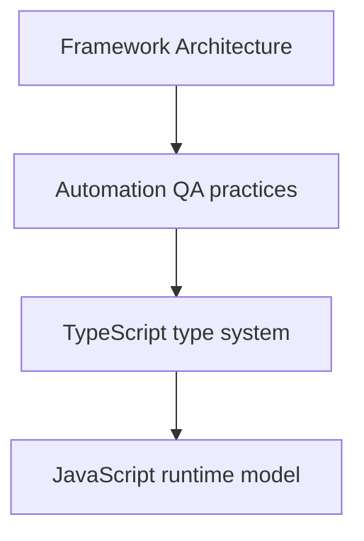

If the bottom layer is weak, the upper layers become unstable. You can write a test that works today but is hard to explain when it occasionally fails. You can create a helper that is convenient in one file but breaks when reused. You can add types that look strict but do not protect the runtime.

That is why the course is built from the bottom up.

---

## Code examples

In this chapter the examples show not the syntax of a particular topic, but the general principle of the course: every piece of code should be understood through its mechanism.

### Example 1. Value and reference

```javascript
const expectedUser = {
  id: 'user-1',
  email: 'qa@example.com'
};

const actualUser = expectedUser;

actualUser.email = 'updated@example.com';

console.log(expectedUser.email);
```

Result:

```text
updated@example.com
```

What happened:

`expectedUser` and `actualUser` point to the same object in the Heap. A change made through one variable is visible through the other because the object is shared.

Internal model:

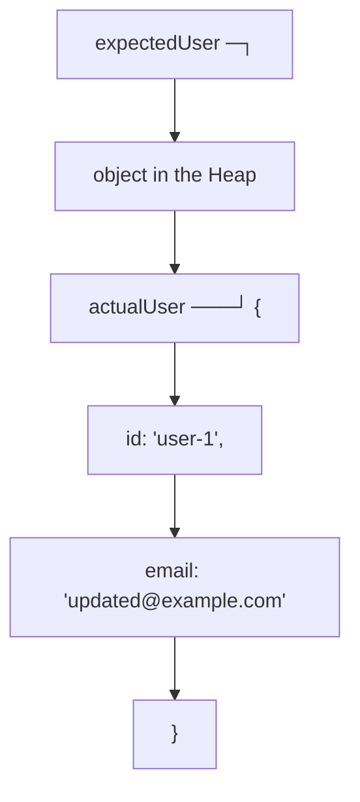

Why this matters for Automation QA:

If a helper mutates a test-data object by reference, another test or another check may receive the already-modified state. This is a common cause of non-obvious errors in test frameworks.

### Example 2. TypeScript does not validate the runtime API response

```typescript
type UserResponse = {
  id: string;
  email: string;
};

async function getUser(): Promise<UserResponse> {
  const response = await fetch('https://example.com/api/users/1');
  return response.json();
}
```

The type `UserResponse` describes the developer's expectation. But if the server returns an object without `email`, TypeScript will not stop execution at runtime. It does not automatically check the actual JSON.

Internal model:

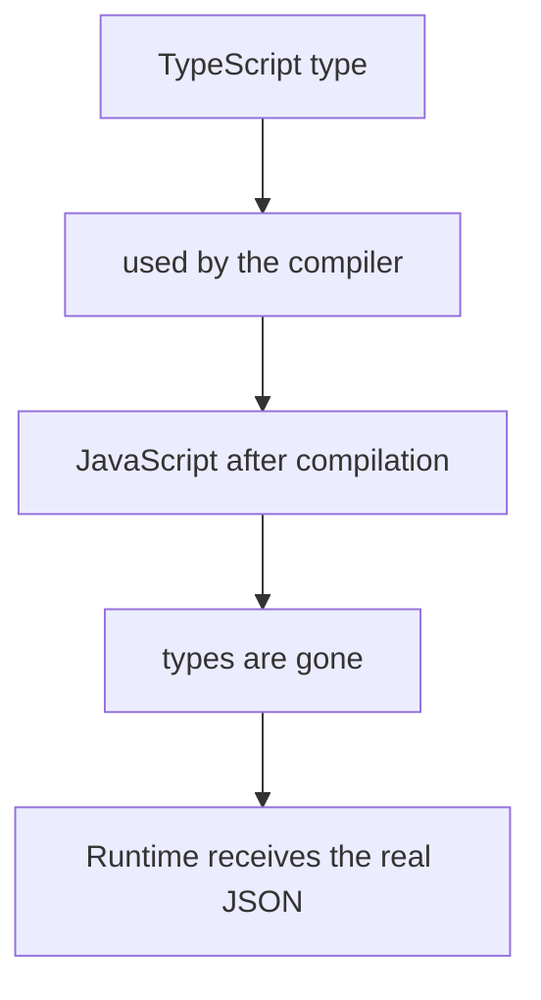

Why this matters for Automation QA:

In API tests it is not enough to describe the response type. You need to check the actual response:

```typescript
const user = await getUser();

expect(user.email).toBeDefined();
```

Later the course covers in detail how to build reliable checks of API responses, how to connect TypeScript types with runtime validation, and why contract testing is not replaced by interfaces alone.

---

## Common mistakes

### Mistake 1. Starting with the tool and skipping the language

The wrong approach:

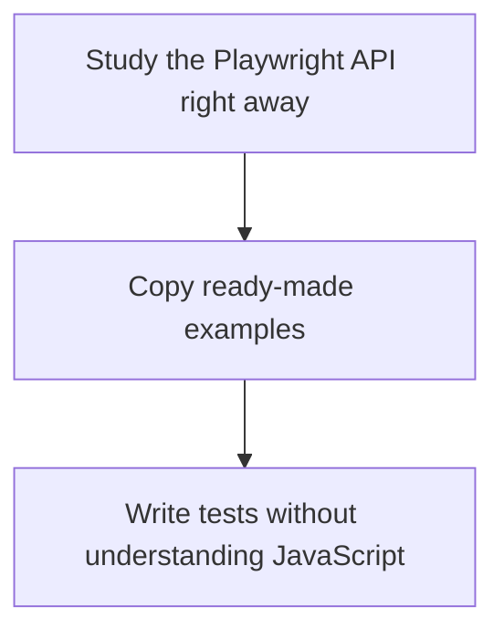

What happened:

The engineer quickly gets first results, but as the project grows they run into errors that cannot be explained by the Playwright documentation alone.

Why it happened:

Playwright uses JavaScript and TypeScript. Asynchrony, objects, functions, modules, errors and types all follow the rules of the language, not separate rules of the test tool.

The corrected approach:

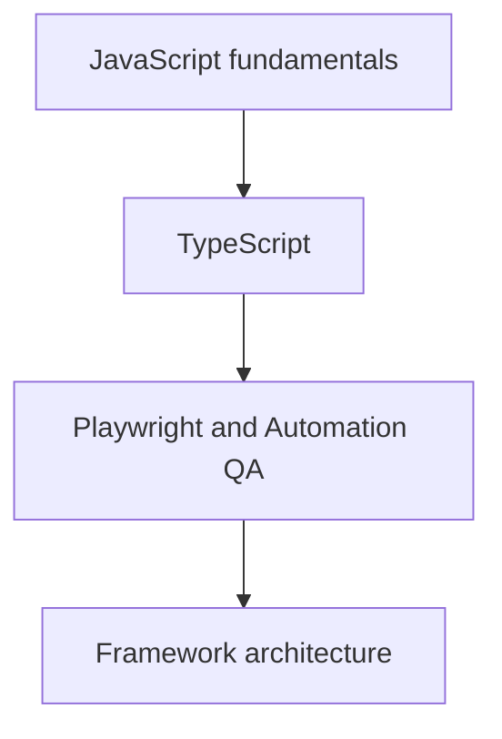

### Mistake 2. Memorizing phrasings instead of the mechanism

The wrong phrasing:

```text
const makes a value immutable.
```

What happened:

This phrasing leads to a wrong expectation: it seems that an object declared with `const` cannot be changed.

Why it happened:

Two different things are confused: the variable binding and the value of the object in the Heap.

The corrected phrasing:

```text
const forbids reassigning the variable's binding.
If the variable holds a reference to an object, the object itself can remain mutable.
```

### Mistake 3. Treating TypeScript as runtime protection

The wrong code:

```typescript
type Order = {
  id: string;
  total: number;
};

const order = await response.json() as Order;

expect(order.total).toBeGreaterThan(0);
```

What happened:

The code tells TypeScript to treat `order` as an object of type `Order`. But this does not check the actual structure of the response.

Why it happened:

`as Order` is a type assertion at the TypeScript checking stage. It does not create runtime validation.

The corrected version:

```typescript
const order = await response.json();

expect(typeof order.id).toBe('string');
expect(typeof order.total).toBe('number');
expect(order.total).toBeGreaterThan(0);
```

Later, checks like these will be moved into dedicated assertions and validation helpers.

---

## Practical use

You should work through this course like an engineering project.

The recommended way to work with a chapter:

1. Read the chapter in full.
2. Reproduce the minimal examples.
3. Explain each example in your own words.
4. Do the practice without looking at the solutions.
5. Compare your result with the solution.
6. Look for gaps in your reasoning, not just in the code.
7. Return to the theory if the mistake comes from a wrong model.

The point is not simply to get the right answer. The point is to understand why it is right.

The repository supports this order:

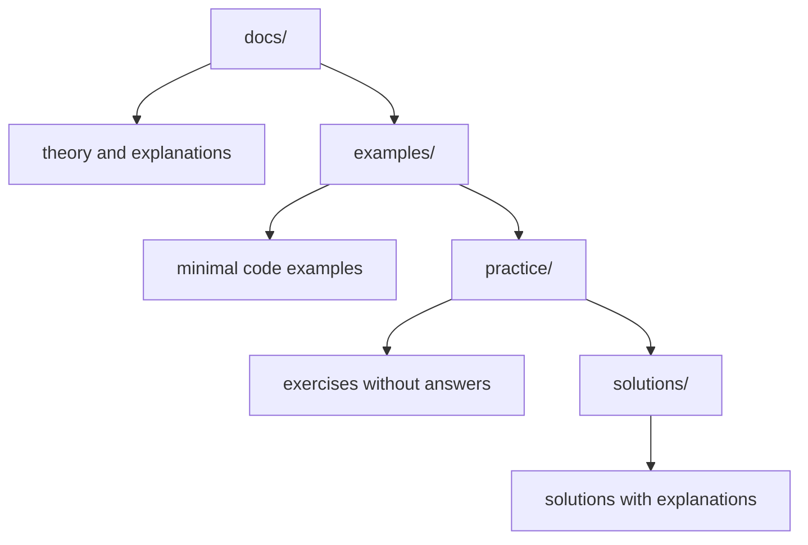

The chapters live in `docs/`. They explain the mechanism and give context.

The examples live in `examples/`. They show individual ideas in code. An example should be minimal and should not mix several new mechanisms at once.

The practice lives in `practice/`. It gathers comprehension questions, code-reading exercises, implementation tasks, bug hunts, QA tasks and mini-projects. The practice contains no answers.

The solutions live in `solutions/`. They are not for copying but for checking your thinking. A good way to use a solution is to compare not only the final code but also the line of reasoning.

---

## Use in Automation QA

Automation QA in this course is not a separate add-on to the language. It is the main context in which the language is applied.

As JavaScript is studied, every important topic will be tied to test automation:

* variables and references — to test data;
* functions — to helper functions;
* objects — to API responses and the Page Object;
* arrays — to lists of elements and data sets;
* Promises — to network requests and browser actions;
* the Event Loop — to the stability of asynchronous tests;
* errors — to diagnosing failures;
* modules — to framework structure;
* TypeScript types — to API clients, fixtures and configuration.

For example, a simple Playwright test looks like using a tool:

```typescript
test('user can open profile page', async ({ page }) => {
  await page.goto('/profile');
  await expect(page.getByRole('heading', { name: 'Profile' })).toBeVisible();
});
```

But inside a test like this the fundamental topics are already present:

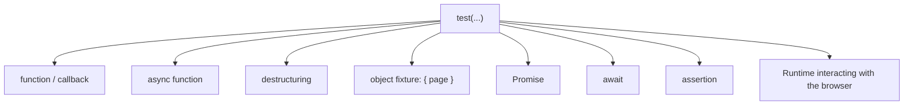

If these topics have not been studied, the test looks like a set of commands. If the topics are clear, the test becomes a readable program with predictable behavior.

The goal of the course is to bring the reader to that second state.

---

## Summary

This course is built as an engineering textbook on JavaScript, TypeScript and Automation QA.

Its goal is not to hand you a set of ready-made templates, but to build an understanding of mechanisms. That is why the course starts with JavaScript: it is JavaScript that runs in the runtime and manages memory, scopes, functions, objects and asynchrony.

TypeScript is studied after JavaScript, because TypeScript adds a type system on top of the language but does not replace the runtime model. To use types correctly you need to understand what happens after compilation.

Automation QA runs through the entire course as the main practical context. Every important topic will be tied to real problems: Playwright, APIs, gRPC, PostgreSQL, fixtures, helpers, assertions, reporting and framework architecture.

The repository separates the materials by purpose:

* `docs/` — the textbook chapters;
* `examples/` — minimal examples;
* `practice/` — exercises without answers;
* `solutions/` — solutions and explanations;
* `playground/` — a place for experiments.

The next chapter explains how to use the course: how to read chapters, how to do the practice, how to work with mistakes and how to build your own learning pace.
