# How to use the course

## Theory

### How to read the chapters

Every chapter of the course is built as a sequential explanation of a mechanism.

You should read it not like a reference where you can jump straight to the command you need, but like a piece of technical reasoning. A chapter usually starts by stating a problem. Then it explains why the mechanism appeared, how it works internally, what it looks like in code and where it is used in Automation QA.

The right way to read:

1. Read the section in full.
2. Stop after each piece of code or diagram.
3. State in your own words what happened.
4. Check whether you can explain not only the result, but the cause of the result.
5. If the explanation does not come, go back to the previous paragraph.

The goal of reading is not to get through the page. The goal is to build a working model.

A working model is a short internal explanation that helps you predict how code behaves. For objects, for example, it might be the model "the variable holds a reference, the object lives separately". For asynchrony it will be a model of queues and running tasks. These topics will be covered in detail in the relevant chapters.

### Why the order of chapters matters

The order of chapters is not decorative.

Every topic relies on the previous ones. If you skip an early mechanism, the next topic may look harder than it really is.

For example, when the course reaches functions, you will already need an understanding of variables and scope. When objects appear, you will need an understanding of values and references. When asynchrony begins, you will need an understanding of functions, errors and the order of code execution.

The dependency can be pictured like this:

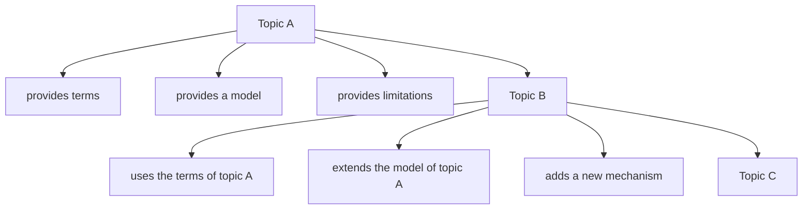

If topic A is skipped, topic B becomes a set of rules without a reason. If topic B is studied superficially, topic C starts to look like magic.

That is why in this course it is not advisable to jump over chapters. It is fine to quickly review a familiar topic, but you should not skip it entirely. Even a familiar topic may contain an internal model that you will need later in QA tasks.

### What this course will not give you

The course does not promise instant results.

It will not give you:

* ready-made answers to every interview question;
* a set of phrases to memorize;
* a universal framework template for any project;
* a replacement for the Playwright, Node.js or TypeScript documentation;
* automatic understanding without your own practice;
* a guarantee that the code will be correct on the first try.

This is important to state explicitly.

Engineering learning requires friction. Sometimes you will have to run an example several times. Sometimes the solution will differ from yours. Sometimes a topic will only become clear after you return to it several chapters later.

That is a normal part of the process. The mistake in learning is not the fact of not understanding. The mistake is moving on without figuring out which model turned out to be wrong.

### How to work with code examples

A code example in the course is not for copying. It is for testing your model.

Work with an example in four steps:

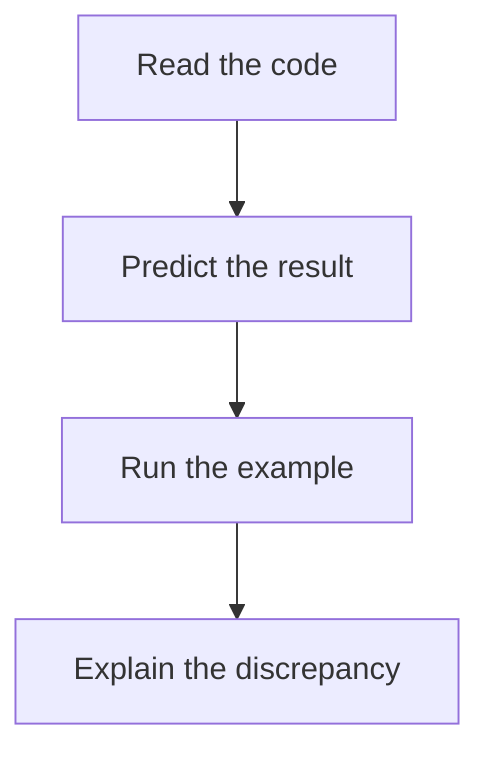

The most important part is the prediction before running.

If you run the code right away, you will see the answer but will not test your own understanding. If you predict the result first, running the code becomes an experiment.

Example:

```javascript
const firstUser = {
  name: 'Anna'
};

const secondUser = firstUser;

secondUser.name = 'Maria';

console.log(firstUser.name);
```

Before running, answer:

1. What will be printed?
2. Do `firstUser` and `secondUser` use the same object or different ones?
3. Which model explains the result?

After running, compare your expectation with the fact. If the expectation matched, it is still useful to explain the cause. If it did not match, find the mistake in the model rather than just memorizing the correct output.

### How to modify examples

A minimal example explains one idea. After running it, it is useful to modify it.

The change should be small:

* rename a variable;
* replace `const` with `let`;
* add a second property to the object;
* print an intermediate value;
* remove one line and see what changes;
* deliberately trigger an error and read the message.

A small change helps you see the boundaries of the mechanism.

A bad approach is to immediately turn a learning example into a large fragment of a real project. Such code introduces too many factors, and it becomes unclear what exactly you are studying.

### How to do the practice

Practice exists to test understanding.

It consists of different types of exercises:

* comprehension questions;
* code analysis;
* writing code;
* bug hunting;
* QA tasks;
* a mini-project.

These types test different skills.

Questions show whether you can explain a topic in words. Code analysis tests your ability to predict how a program behaves. Writing code tests applying the mechanism. Bug hunting trains diagnosis. QA tasks connect the topic to automated tests. The mini-project brings several ideas together into a small system.

The practice should be done without the solutions.

It is fine to go back to the chapter, re-read the theory, run an example again. But you should open the solution only after your own attempt.

### When to read the solutions

Solutions are not there so you can learn the "right answer". They are there so you can compare your thinking.

You should open a solution when three conditions are met:

1. You have already given your own answer.
2. You can explain why you chose it.
3. You have noted the places where you are unsure.

After opening the solution, compare:

* whether the result matched;
* whether the cause matched;
* whether an important mechanism was missed;
* whether there is a simpler way;
* whether there is a QA risk you did not notice.

If your answer differs from the solution, that does not always mean it is wrong. Sometimes there are several correct variants. But the explanation must be rigorous: the code must work, the mechanism must be clear, side effects must be accounted for.

### How to use the playground

`playground/` is a place for experiments.

Its job is to separate learning checks from the text of the chapter and from future project examples. In `playground/` you can create temporary files, run small code fragments, test hypotheses and deliberately break examples.

The workflow may look like this:

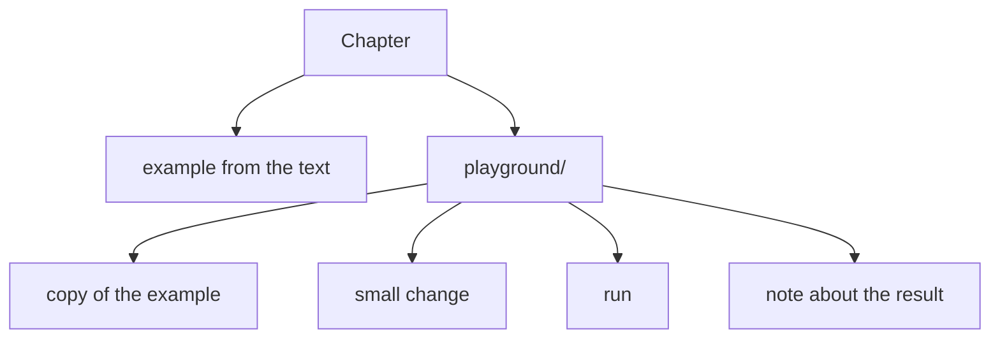

In `playground/` it is useful to test only one hypothesis at a time.

For example:

* what happens if you replace `const` with `let`;
* what happens if you pass an object into a function;
* what happens if you remove `await`;
* what happens if the API response does not contain the expected field;
* what happens if a helper modifies the input object.

Do not turn `playground/` into an archive of the whole course. For lasting conclusions it is better to use personal notes.

### How to keep personal notes

Personal notes should record not the text of the chapter, but the change in your understanding.

An ineffective note:

```text
const cannot be reassigned.
```

A more useful note:

```text
const forbids reassigning the binding.
If the binding holds a reference to an object, the object's properties can change.
QA risk: a helper may modify a shared test-data object.
```

A good note contains:

* a short rule;
* an explanation of the cause;
* a minimal example;
* a common mistake;
* a connection to Automation QA.

A note template:

```text
Topic:

What it is:

Why it exists:

How it works internally:

Minimal example:

Common mistake:

Where it appears in Automation QA:
```

Such a format helps you avoid turning notes into a copy of the book. It forces you to extract the mechanism.

### How to return to difficult topics

You do not always need to understand a difficult topic in one go.

Some mechanisms become clearer after the following chapters. For example, scope is easier to understand after a few examples with functions. Asynchrony is easier to understand after practice with Promises. TypeScript types are easier to grasp once you already have experience with real objects and API responses.

Returning to a topic should be controlled.

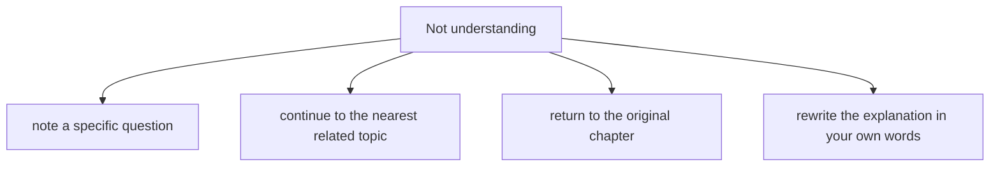

You should not write "I did not understand JavaScript". That is too broad a phrasing.

It is better to write:

```text
I do not understand why modifying an object through one variable is visible through another.
```

Such a question can be tested with an example, a diagram and an exercise. The more precisely the difficulty is stated, the easier it is to close it.

---

## The internal mechanism of learning

Learning in this course can be described as a feedback loop.

First the reader has an expectation. Then they read the explanation and build a model. After that they run code or do a task. The result either confirms the model or reveals a mistake. A mistake is not a problem as long as it is analyzed.

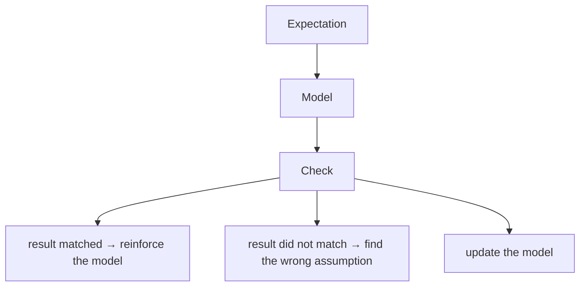

This is how not only learning works. Diagnosing defects in automation works the same way.

For example, a test expected one result and the system returned another. The engineer forms a hypothesis and checks it with logs, a local run, changing the data or a separate request. Then they refine their model of the system.

That is why the practice in the course trains two skills at once:

* understanding JavaScript and TypeScript;
* engineering diagnosis.

The internal mechanism of effective learning consists of three actions:

1. Predict.
2. Check.
3. Explain.

If you skip the prediction, learning turns into observation. If you skip the check, the model may stay wrong. If you skip the explanation, the correct result is not reinforced.

---

## Mental model

Picture learning as debugging your own model.

In ordinary debugging you check the program. In learning you check the way you imagine the program working.

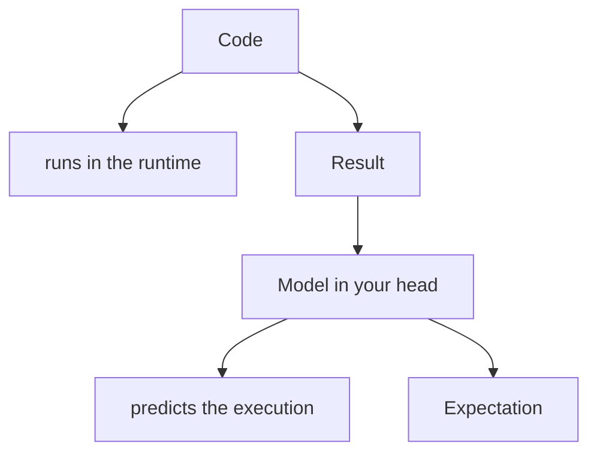

If the result and the expectation match, the model may be correct. If they do not match, you need to look for the discrepancy.

Important: a matching result does not always prove understanding. You can guess. So after each example you should ask:

> Why does it work exactly this way?

If the answer boils down to "because that is how JavaScript is written", the model is still weak. If the answer explains the connection between code, memory, execution order or types, the model becomes a working one.

---

## Code examples

In this chapter the code is used as material for the learning process. The goal of the examples is to show how to test your own understanding.

### Example 1. Predicting before running

First read the code and predict the result.

```javascript
let attemptCount = 1;

function increaseAttemptCount() {
  attemptCount = attemptCount + 1;
}

increaseAttemptCount();
increaseAttemptCount();

console.log(attemptCount);
```

Expected result:

```text
3
```

What happened:

The variable `attemptCount` was created with the value `1`. Each function call increased it by `1`. After two calls the value became `3`.

Why this example is useful:

It is simple, but it demonstrates an important learning technique. Before running you can predict the result, then verify it and explain the order of actions.

The order of execution:

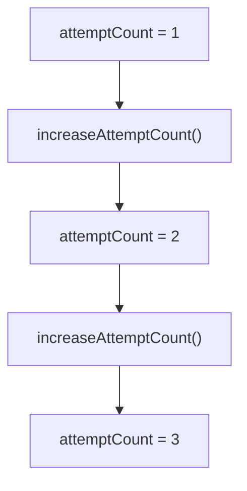

### Example 2. A small change to the example

Now let's change the example so that the function returns a new value.

```javascript
let attemptCount = 1;

function getNextAttemptCount() {
  return attemptCount + 1;
}

const nextAttemptCount = getNextAttemptCount();

console.log(attemptCount);
console.log(nextAttemptCount);
```

Result:

```text
1
2
```

What happened:

The function computed a new value and returned it, but did not change the variable `attemptCount`. So the original value stayed `1`, and `nextAttemptCount` received the result of the computation.

Why this matters:

A small change shows the difference between changing state and computing a new value. In test helper functions this is fundamental: a function may modify the input data, or it may return new data without a side effect.

### Example 3. QA context

Consider a small helper for test data.

```javascript
function buildUserEmail(userName) {
  return `${userName}@example.com`;
}

const email = buildUserEmail('qa');

console.log(email);
```

Result:

```text
qa@example.com
```

This example does not require knowledge of complex mechanisms. But you can work with it correctly:

1. Predict the result.
2. Run the code.
3. Change the input value.
4. Check that the function does not modify external state.
5. Write down where such a function might be used in tests.

In Automation QA a helper like this might be used when preparing a test user. Even a simple example should be connected to a real task, otherwise it stays abstract.

---

## Common mistakes

### Mistake 1. Reading without running the code

The wrong approach:

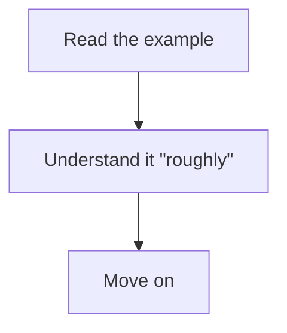

What happened:

The code seems clear until you have to change it or explain it.

Why it happened:

Reading creates a feeling of recognition. Running and modifying the example test real understanding.

The corrected version:

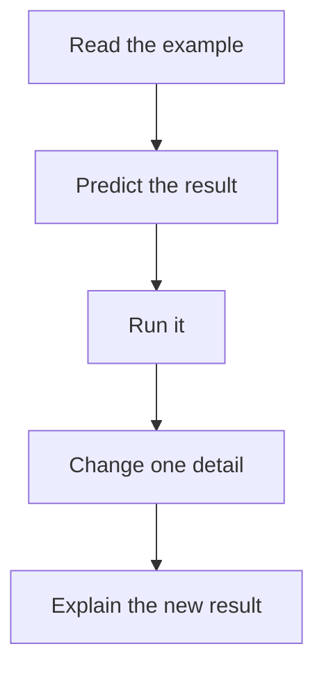

### Mistake 2. Opening solutions too early

The wrong approach:

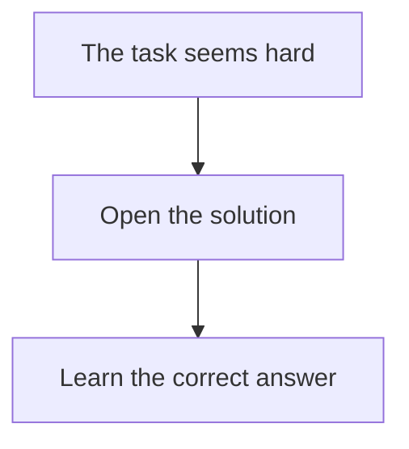

What happened:

The solution replaced independent reasoning.

Why it happened:

The brain received a ready-made answer structure and did not test its own model.

The corrected version:

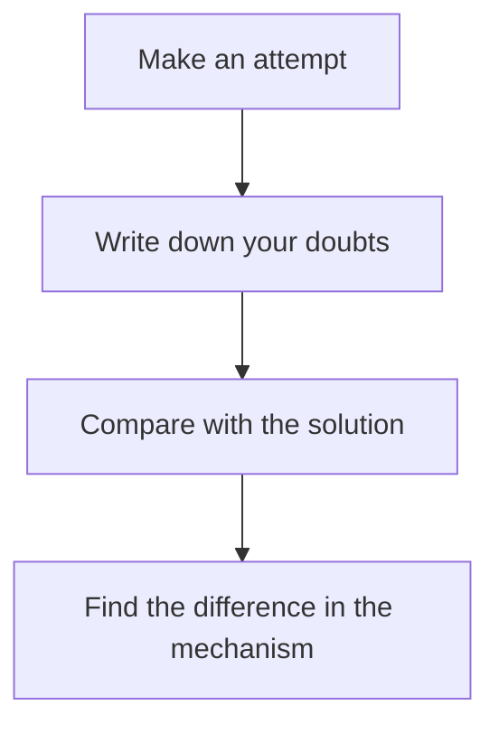

### Mistake 3. Making experiments too large

Wrong code for a learning experiment:

```javascript
function prepareUserAndSendRequestAndCheckDatabase(user, apiClient, database) {
  user.email = `${Date.now()}@example.com`;
  apiClient.createUser(user);
  database.findUserByEmail(user.email);
}
```

What happened:

A single fragment mixes modifying an object, generating data, an API call and working with a database.

Why it happened:

The learning hypothesis was not limited. It is unclear which mechanism is being tested.

The corrected version:

```javascript
function updateUserEmail(user, newEmail) {
  user.email = newEmail;
}
```

Now the example tests one idea: the function modifies the object it received as input.

### Mistake 4. Taking notes as a transcript of the text

The wrong note:

```text
The chapter says that examples should be run and solutions viewed after the practice.
```

What happened:

The note repeats the text but does not help you apply the material.

Why it happened:

The note has no mechanism, no mistake and no personal conclusion.

The corrected version:

```text
Before running an example I should write down the expected result.
If the result differs, I record the wrong assumption.
This is like analyzing a flaky test: expectation, fact, hypothesis, check.
```

### Mistake 5. Skipping the QA connection

The wrong approach:

```text
Learn the topic as JavaScript syntax.
Do not ask where it will show up in automated tests.
```

What happened:

The knowledge stays academic and transfers poorly into real code.

Why it happened:

The topic was not connected to a real Automation QA task.

The corrected approach:

After each chapter, write down one example of application:

```text
Topic: functions
QA use: a helper for creating test data.

Topic: objects
QA use: an API response body.

Topic: Promise
QA use: waiting for a network request or a browser action.
```

---

## Practical use

For every chapter, use the same workflow.

```text
1. Read the learning goals
2. Read the motivation
3. Work through the theory
4. Run the examples
5. Modify the examples
6. Do the practice
7. Compare with the solutions
8. Write down personal conclusions
9. Connect the topic to a QA task
```

This process may seem slow at first. But it reduces the number of returns later. The more precisely the early models are built, the easier it is to study the complex topics.

A minimal format for a personal result after a chapter:

```text
Chapter:

Main idea:

Mechanism:

An example I ran:

A mistake I understood:

QA use:

What to review:
```

If after a chapter you cannot fill in this block, the topic has not been mastered yet. That is not a problem. It is a signal to return to the right place.

For difficult topics it is useful to use spaced repetition:

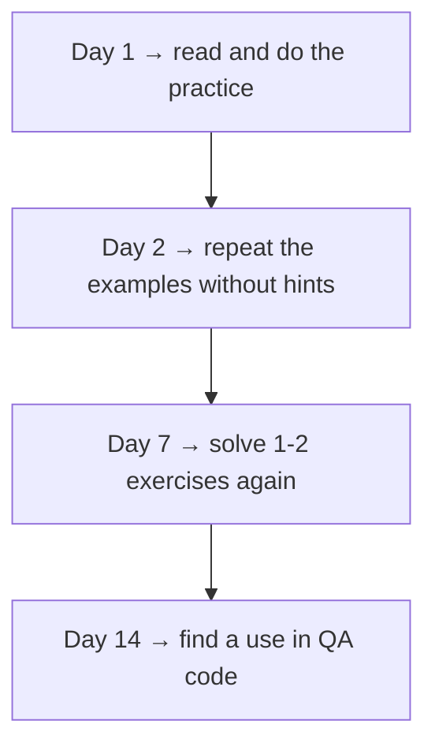

Repetition should be active. Re-reading the text is not enough. You need to predict the result again, write code or explain the mechanism.

---

## Use in Automation QA

An Automation QA Engineer should go through this course with a constant question:

> How will this topic show up in a test framework?

This does not mean every example should be turned into a Playwright test. In the early chapters that would only complicate learning. But every topic should be connected to one practical context.

Examples of connections:

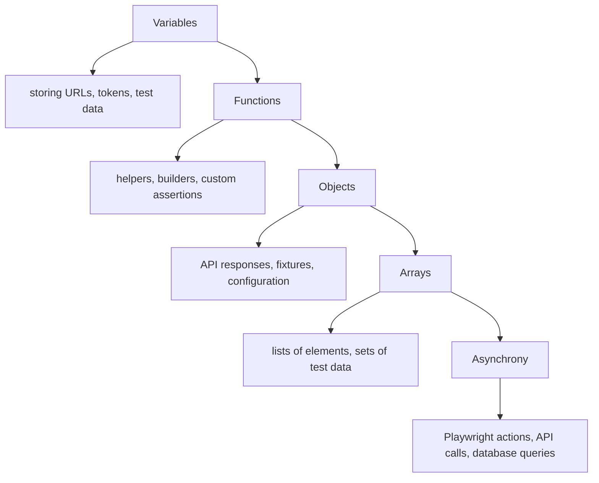

While doing the practice, it is useful to add QA questions:

* where this mechanism might break a test;
* how this topic affects the readability of the framework;
* what helper you could build on this idea;
* which data might change unexpectedly;
* which error would be hard to diagnose without this topic.

For example, if the chapter studies modifying objects, the QA question might be:

```text
Can a helper modify a shared test-data object?
If so, which test will start failing and why?
```

If the chapter studies asynchrony:

```text
Is there an action the test did not wait for?
What exactly does the Promise return?
Where do you need to put await?
```

If the chapter studies TypeScript:

```text
What is checked by the compiler?
What stays unchecked at runtime?
Is an additional check of the API response needed?
```

This approach prepares you for the architecture chapters. When the course moves on to Playwright, APIs, gRPC, PostgreSQL and framework architecture, the language topics will no longer be separate theory. They will become tools for design.

---

## Summary

Effective learning in this course is built on actively testing your understanding.

Reading the chapter is not enough. You need to predict how the code behaves, run the example, modify it, explain the result, do the practice, and only then compare your answer with the solution.

The order of chapters matters, because every new topic uses models built earlier. Skipping early topics creates gaps that later show up in functions, objects, asynchrony, TypeScript and the architecture of automated tests.

`playground/` is used for small experiments. Personal notes are for recording mechanisms, mistakes and QA connections. Difficult topics should be revisited in a targeted way: through a specific question, an example and a re-check.

For an Automation QA Engineer the main principle is this: after each topic you should understand not only the learning example, but also the place of that topic in test code.

---

## What to remember

✓ Chapters should be worked through in order.

✓ Before running an example you should predict the result.

✓ A code example tests a model, it does not just demonstrate syntax.

✓ The practice should be done before reading the solutions.

✓ Solutions are for comparing reasoning, not for copying.

✓ `playground/` is used for small experiments.

✓ Personal notes should record the mechanism, the mistake and the QA use.

✓ Difficult topics should be revisited through a specific question.

✓ Every topic is worth connecting to Automation QA tasks.

---

## Check yourself

1. Why should you not skip chapters that seem familiar?

2. Why predict the result of code before running it?

3. When should you open the file with solutions?

4. What is `playground/` useful for?

5. What should a good personal note contain?

6. Why are large experiments worse than small ones when studying a new mechanism?

7. How do you know a difficult topic needs to be reviewed?

8. What QA question is useful to ask after every chapter?
