# Course structure

## Theory

### The overall architecture of the course

The course is divided into five large parts:

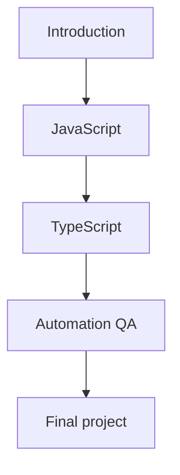

Each part solves a separate task.

The Introduction is responsible for preparing you to learn. It covers the goal of the course, how to work with the materials, the structure of the repository, the working environment and the rules for doing the exercises.

JavaScript is responsible for the foundation of the language. It studies the mechanisms of code execution: values, variables, functions, objects, arrays, modules, errors and asynchrony. Asynchrony is working with operations whose result does not appear immediately; it will be covered in detail in the Async JavaScript section.

TypeScript is responsible for the type system. Types help describe the shape of data and catch some errors before the program runs. TypeScript is studied after JavaScript, because TypeScript code eventually turns into JavaScript.

Automation QA is responsible for applying the language in testing. Here Playwright, API testing, gRPC, PostgreSQL, fixtures, helpers, assertions, reporting and framework architecture appear. Each of these tools is introduced separately and without overloading you with details before the relevant chapter.

The Final project is responsible for assembling the knowledge into a system. It is not a new separate theory, but the application of everything studied earlier.

### Why the course starts with the introduction

The introduction is not a formality.

Before studying the language you need to understand:

* how the course is organized;
* how to do the practice;
* where to run the examples;
* when to read the solutions;
* how to record gaps in understanding;
* how to move through the topics without skipping.

Without this, a reader might start with the JavaScript chapters but treat them like a reference. That approach fits poorly with a course that explains mechanisms.

The introduction sets up a workflow:

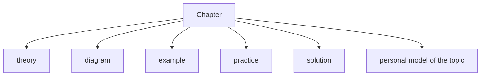

This model will be used in all the following sections.

### Why JavaScript is studied before TypeScript

JavaScript is studied before TypeScript because it is JavaScript that runs in the runtime.

The runtime is the environment in which the program actually runs. For example, Node.js is a runtime for JavaScript outside the browser; Node.js will be covered in the introduction to the working environment.

TypeScript adds type checking but does not cancel out the behavior of JavaScript. If you do not understand values, references, functions, objects and asynchrony, TypeScript types can create a false sense of safety.

A minimal diagram:

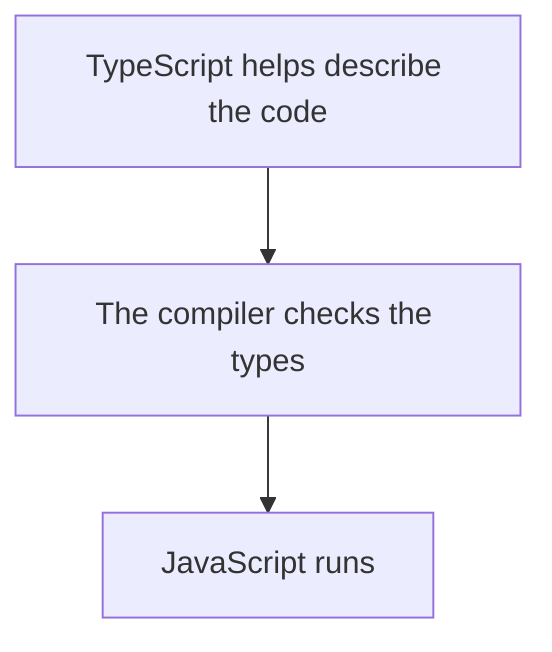

So the course first builds an understanding of the JavaScript mechanisms. Then TypeScript is explained as a layer on top of an already familiar language.

It is important not to dive into TypeScript too early. In this chapter it is enough to remember one idea: TypeScript helps catch some errors before running, but the program runs as JavaScript. The compiler, Type Erasure and the type system will be covered in detail in the TypeScript part.

### Why TypeScript is studied before Playwright and framework architecture

Playwright and the architecture of a test framework require more than just knowledge of JavaScript. In real projects, automated tests are often written in TypeScript.

TypeScript is needed before the architecture chapters, because it helps:

* describe the structure of test data;
* define the contracts of helper functions;
* design API clients;
* describe fixtures;
* reduce the number of errors during refactoring;
* make the framework more readable.

A fixture is a prepared object or state that a test receives before it runs; fixtures will be covered in the Automation QA section.

If you start building a framework before studying TypeScript, some decisions will be held together only by agreements in your head. For example, a helper might expect one kind of object and receive another. TypeScript does not solve every problem, but it helps to describe expectations explicitly.

The sequence looks like this:

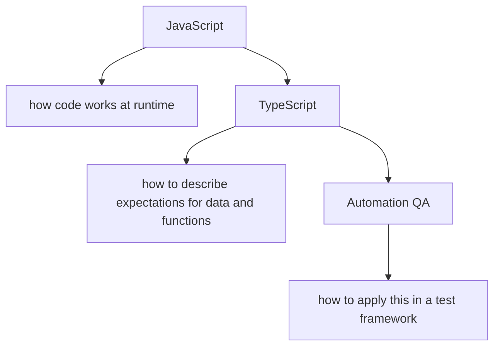

Framework architecture is studied after the language and types, because architecture consists of decisions about boundaries, dependencies and the responsibilities of modules. These decisions cannot be made well if it is unclear how functions, objects, modules, errors and types work.

### How the sections depend on each other

The course has a vertical dependency.

Each following part does not replace the previous one but uses it.

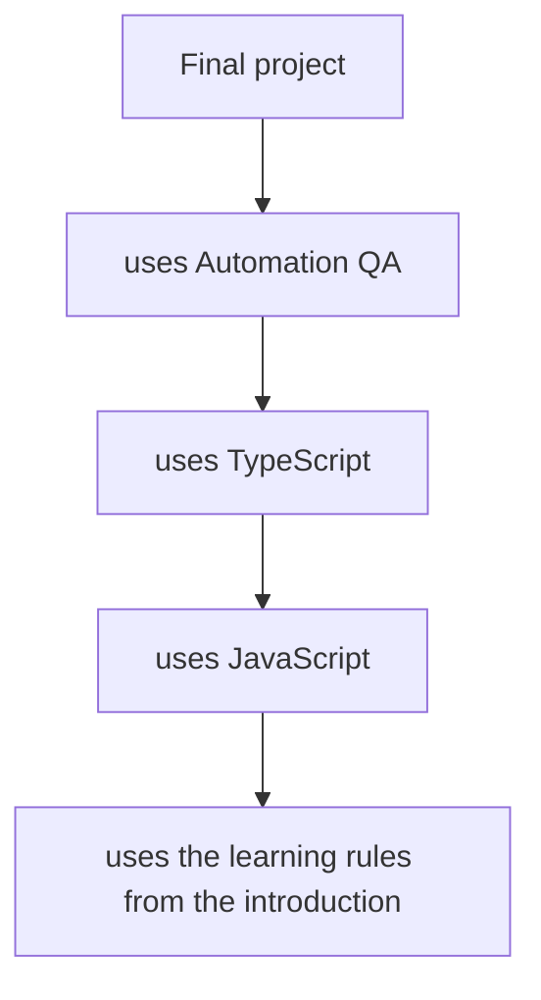

This means that knowledge does not close off after you finish a section. JavaScript keeps being used in TypeScript. TypeScript keeps being used in Automation QA. The practice of working with examples keeps being used in the final project.

For example, when the course reaches the API client, it will need all at once:

* functions to extract repeatable logic;
* objects to describe data;
* asynchrony to work with requests;
* TypeScript types to describe input and output data;
* assertions to check the result.

An assertion is a check of an expected result in a test; assertions will be covered in Automation QA.

None of these topics appears in isolation. An architectural task almost always connects several mechanisms.

### How knowledge accumulates

Knowledge in the course accumulates by the principle of extending the model.

First the reader understands a small mechanism. Then this mechanism becomes part of a larger mechanism. Then several mechanisms combine into a practical task.

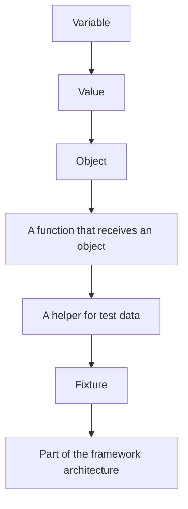

At each level a new responsibility appears. A variable holds a value. An object groups data. A function performs an action. A helper reuses an action in tests. A fixture prepares the state of a test. Framework architecture determines where this should live in the project.

The course is arranged so that the reader sees this chain gradually.

### Why skipping chapters creates gaps

A skipped chapter rarely gets in the way right away.

You can not understand scope and still write a few functions. You can not understand references and still work with objects. You can not understand asynchrony and still copy a test with `await`.

The problem appears later, when the code behaves differently than expected.

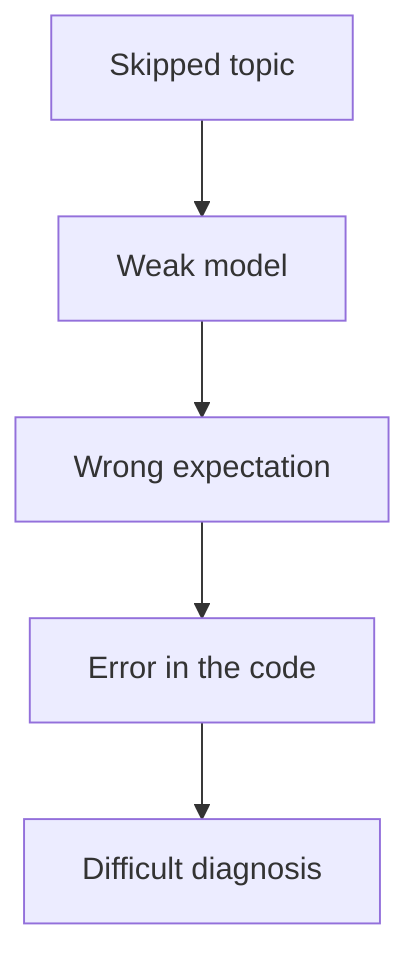

For example, if you skip the References topic, it will be hard to explain why modifying test data in one helper affects another test. If you skip Promises, it will be hard to understand why an action did not wait for a result. If you skip Type Erasure, it will be hard to explain why TypeScript did not check the real API response at runtime.

Type Erasure means the disappearance of TypeScript types after compilation; this topic will be covered in the TypeScript part.

Skipping a chapter creates not just an absence of knowledge. It creates wrong expectations.

### How theory, examples, practice and solutions work together

Each chapter uses four connected layers:

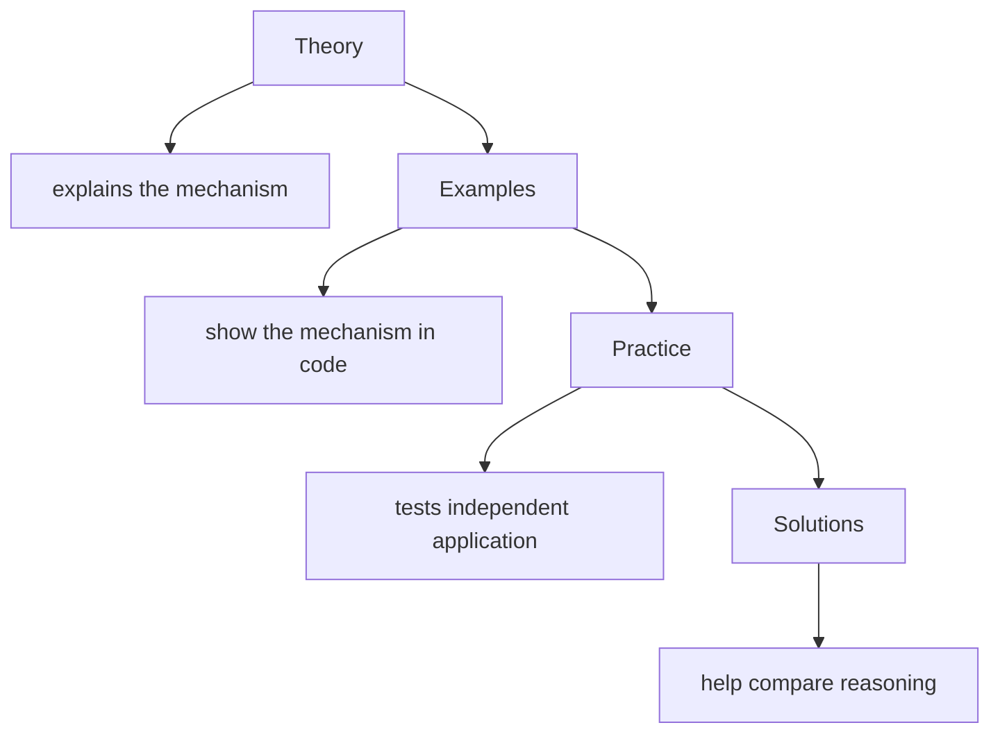

Theory without examples stays abstract. Examples without practice easily create the illusion of understanding. Practice without solutions may leave a mistake unnoticed. Solutions without your own attempt turn into reading a ready-made answer.

So these parts should be used together.

The correct learning route:

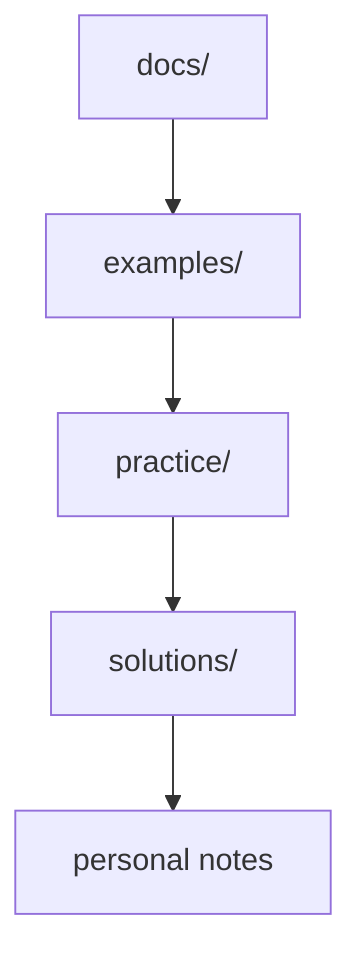

If a chapter does not have a separate file in `examples/`, that does not mean it has no examples. Small examples may be embedded directly in the chapter text. Separate files in `examples/` are needed when an example should run as a standalone fragment.

### How the repository supports learning

The structure of the repository reflects the structure of learning.

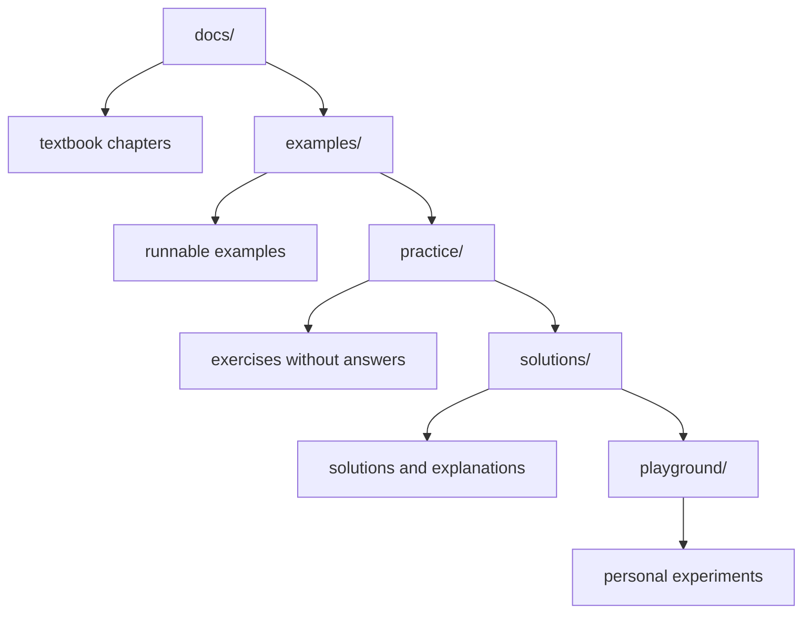

`docs/` is responsible for the sequential explanation.

`examples/` is responsible for demonstrating a specific mechanism in code.

`practice/` is responsible for independently testing understanding.

`solutions/` is responsible for the walkthrough and the comparison of approaches.

`playground/` is responsible for safe experiments that should not be mixed with the main course materials.

Such a structure helps you avoid mixing different tasks. The chapter text does not turn into a draft. The practice contains no answers. The solutions do not get in the way of your own attempt. Experiments do not pollute the learning examples.

### How the final project brings the course together

The final project appears at the end not because it is secondary.

It appears at the end because it requires all the previous layers.

In the final project you will need to make decisions about the framework structure, the API layer, gRPC, the database, helpers, fixtures, assertions, reporting and configuration.

gRPC is a way for services to communicate through strictly described contracts; it will be studied in a dedicated Automation QA section.

PostgreSQL is a relational database whose state is often compared against the system in backend and end-to-end checks; working with it will be covered later.

Reporting is the collection and presentation of test results; reports will be studied in the framework section.

The final project connects the topics like this:

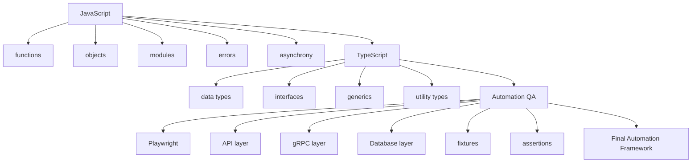

The final project should not be treated as a set of "create a file, paste the code" instructions. Its job is to check whether the reader can explain architectural decisions: why a layer is here, why a helper has this signature, why a check is moved into an assertion, why a type is described separately, why configuration should not be scattered across the tests.

---

## Internal mechanism

The internal mechanism of the course structure is the management of knowledge dependencies.

In code, a dependency means that one module uses another. In learning, a dependency means that one topic uses a model built earlier.

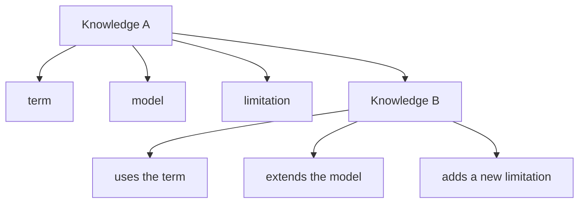

If knowledge A is missing, knowledge B can only be memorized as a rule. But a rule without a mechanism works poorly in a new situation.

For example, you can memorize that "you need to put `await`". But without understanding Promises this rule does not explain what exactly is being awaited. A Promise is an object that represents the result of an operation now or in the future; Promises will be covered in the Async JavaScript section.

The course avoids such gaps. New topics are introduced only when the reader already has a minimal foothold.

This mechanism can be pictured as assembly:

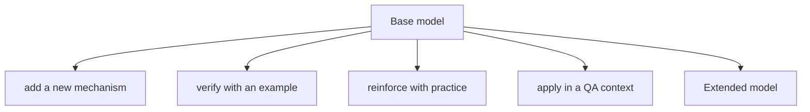

Each chapter extends the model rather than replacing it.

---

## Mental model

Picture the course as building a test framework not in code, but in your understanding.

First you need a foundation. Then load-bearing layers appear. Then applied parts are added. In the end everything connects into a working system.

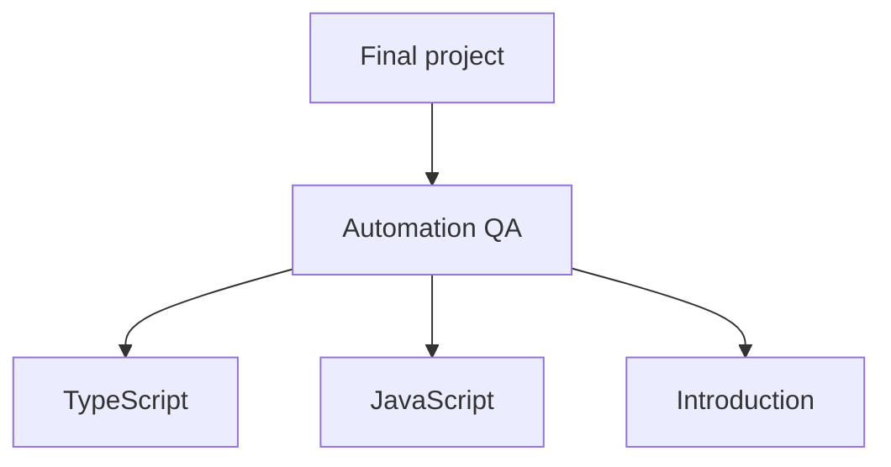

If you remove the bottom layer, the upper layers lose their support.

This does not mean you have to remember every detail perfectly before moving on. But you need to understand the role of a topic and have a working model. If the model is weak, you can strengthen it with practice, repetition and returning to the chapter.

A good sign of readiness to move on:

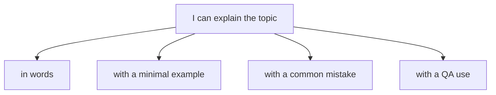

If one of these points is missing, the topic is worth reviewing.

---

## Code examples

In this chapter the code is used not to learn new syntax, but to show how knowledge accumulates.

### Example 1. A small mechanism

```javascript
const baseUrl = 'https://example.com';

function buildProfileUrl(userId) {
  return `${baseUrl}/users/${userId}`;
}

console.log(buildProfileUrl('user-1'));
```

Result:

```text
https://example.com/users/user-1
```

What is used here:

* a variable holds the base URL;
* the function takes a `userId`;
* the string is assembled from several parts;
* the result is returned from the function.

This example is small. It does not require Playwright, TypeScript or architecture. But later this idea can become part of a helper function for API tests.

### Example 2. The same mechanism as part of a QA task

```javascript
function buildUserEndpoint(baseUrl, userId) {
  return `${baseUrl}/users/${userId}`;
}

const endpoint = buildUserEndpoint('https://api.example.com', 'user-1');

console.log(endpoint);
```

Result:

```text
https://api.example.com/users/user-1
```

What changed:

The base URL is now passed in explicitly. The function became less dependent on an external variable. This is useful for tests, because different environments can have different API addresses.

An environment is the run context, for example local, staging or production-like; environment configuration will be covered in Automation QA.

### Example 3. How this example will grow later

At later stages of the course a similar idea can become part of the API layer.

The API layer is the layer of code responsible for working with an HTTP API; it will be covered in the Automation QA section.

You do not need to study it in detail now. It is enough to see the direction of growth:

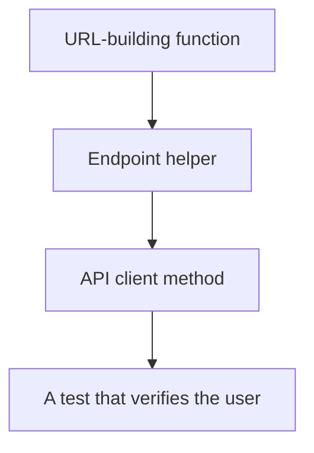

That is how a small mechanism gradually becomes part of the architecture.

---

## Common mistakes

### Mistake 1. Treating the table of contents as a list of independent topics

The wrong approach:

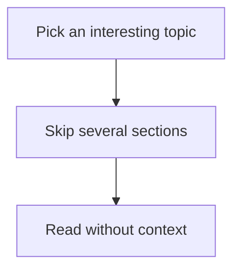

What happened:

The topic is studied without the models that should have been built earlier.

Why it happened:

The table of contents was treated as a menu rather than as a route of dependencies.

The corrected version:

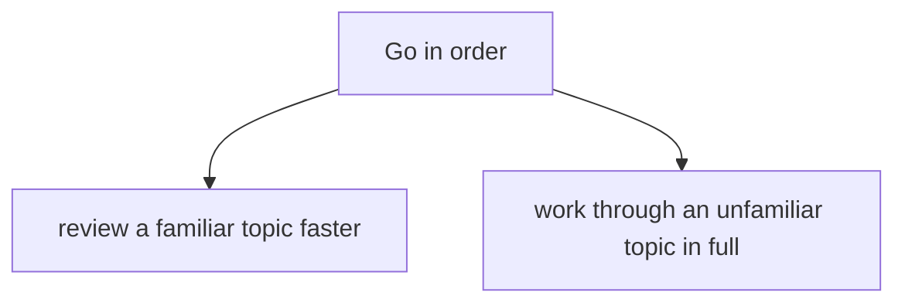

### Mistake 2. Starting framework architecture before the language and types

The wrong approach:

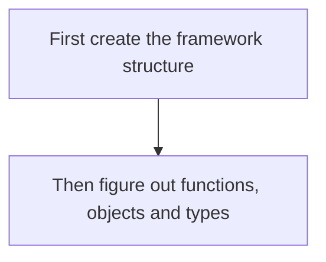

What happened:

Architectural decisions are made without understanding the building blocks.

Why it happened:

The framework is treated as a set of folders rather than as a system of dependencies and responsibilities.

The corrected version:

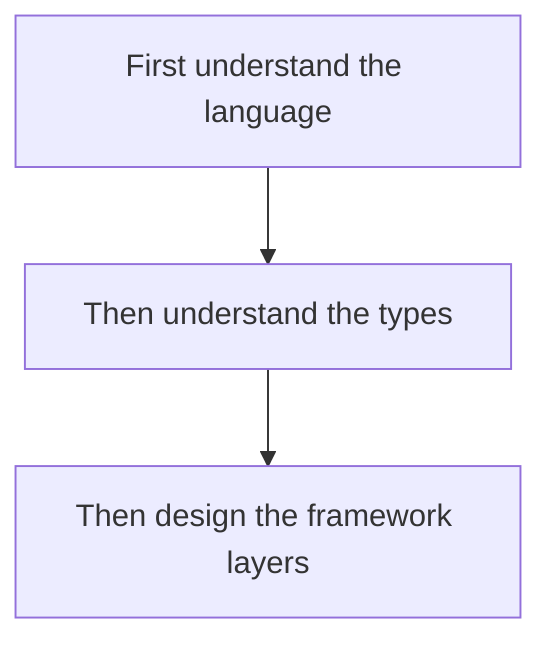

### Mistake 3. Treating TypeScript as a separate replacement for JavaScript

The wrong phrasing:

```text
I will write in TypeScript, so JavaScript can be studied superficially.
```

What happened:

It ignores the fact that TypeScript code runs as JavaScript after compilation.

Why it happened:

TypeScript is treated as a separate runtime, even though it adds type checking on top of JavaScript.

The corrected phrasing:

```text
TypeScript helps describe and check code before running.
The program's behavior at runtime is determined by JavaScript.
```

### Mistake 4. Using solutions as the main learning material

The wrong approach:

```mermaid
flowchart TD
    N1["Read the chapter"]
    N2["Open the solution"]
    N3["Consider the topic learned"]
    N1 --> N2
    N2 --> N3
```

What happened:

The practice stopped testing independent understanding.

Why it happened:

The solution was used before your own attempt.

The corrected version:

```mermaid
flowchart TD
    N1["Practice first"]
    N2["Then the solution"]
    N3["Then compare the reasoning"]
    N1 --> N2
    N2 --> N3
```

### Mistake 5. Not seeing the future role of simple topics

The wrong approach:

```text
Variables and functions are too simple.
I can go through them quickly and skip the exercises.
```

What happened:

Simple topics were not connected to future tasks.

Why it happened:

The reader looks at the topic only as syntax, not as a building block of the framework.

The corrected approach:

After every simple topic, ask:

```text
Where will this mechanism appear in a helper, fixture, assertion or API client?
```

---

## Practical use

Use the course structure as a map.

Before starting a new section it is useful to answer three questions:

1. Which topics should already be clear?
2. Which new mechanisms will appear?
3. Where will they be applied in Automation QA?

For planning you can use a simple table:

```text
Section: JavaScript / Functions

Foundation:
variables, scope, values

New mechanisms:
function declaration, parameters, return

QA use:
helpers, builders, custom assertions
```

You do not need to turn this into a large document. A short note before or after a section is enough.

A useful route through the chapter materials:

```mermaid
flowchart TD
    N1["Table of contents"]
    N2["Chapter"]
    N3["Examples"]
    N4["Exercises"]
    N5["Answers"]
    N6["Playground"]
    N1 --> N2
    N2 --> N3
    N3 --> N4
    N4 --> N5
    N5 --> N6
```

The table of contents shows the order. The chapter gives the explanation. The examples show the code. The exercises test your independence. The answers help you compare your line of thought. The playground lets you test individual hypotheses.

If a difficulty arises in a topic, return not to the start of the course, but to the nearest missing dependency.

Example:

```mermaid
flowchart TD
    N1["Problem: unclear why the helper changed the test data."]
    N2["Nearest dependency: References."]
    N3["Action: review the References chapter and solve 1-2 exercises."]
    N1 --> N2
    N2 --> N3
```

Such an approach saves time and preserves the integrity of your learning.

---

## Use in Automation QA

For an Automation QA Engineer the course structure is especially important, because real automated-test code is almost always at the intersection of several topics.

A single test may use:

* environment configuration;
* a fixture to prepare the browser or data;
* a helper to create a user;
* an API client for a request;
* an assertion for a check;
* TypeScript types to describe the data;
* asynchrony to wait for a result.

The dependency diagram in real test code:

```mermaid
flowchart TD
    N1["Test scenario"]
    N2["fixture"]
    N3["TypeScript type"]
    N4["JavaScript object"]
    N5["API client"]
    N6["async function"]
    N7["Promise"]
    N8["assertion"]
    N9["comparison logic"]
    N10["values and references"]
    N1 --> N2
    N1 --> N3
    N1 --> N4
    N1 --> N5
    N1 --> N6
    N1 --> N7
    N1 --> N8
    N8 --> N9
    N9 --> N10
```

Every line of such a test relies on the previous parts of the course. So the architecture topics cannot be studied in isolation from the language.

When the course reaches Playwright, it will be important to understand that Playwright is not a replacement for the language, but a library for browser automation. A library is ready-made code that provides functions and objects for solving a particular task; Playwright will be studied in the Automation QA section.

When the course reaches API testing, it will be important to understand functions, objects, asynchrony and checks. When database testing appears, you will need data models and result comparison. When framework architecture begins, all the previous topics become building material.

The practical conclusion:

```text
Do not study a tool separately from the language.
Do not design a framework separately from the types.
Do not write checks separately from the data model.
```

---

## Summary

The course is built as a sequential system of dependencies.

The introduction prepares the learning workflow. JavaScript builds an understanding of code execution. TypeScript adds a typing layer on top of JavaScript. Automation QA shows the application of the language and types in real test tasks. The final project brings all of this together into a full automation framework.

The order of topics matters because knowledge accumulates. Simple mechanisms become part of more complex decisions. Variables, functions and objects later turn into helpers, fixtures, API clients and assertions. TypeScript types help describe the boundaries of these parts. The architecture chapters require all the previous layers.

The repository supports this process by separating the materials: `docs/` explains, `examples/` shows, `practice/` tests, `solutions/` walks through, `playground/` lets you experiment.

The next chapter will be about the working environment. It will explain which tools are needed to run code and do the practice, without diving into JavaScript topics too early.

---

## What to remember

✓ The course is a system of dependencies, not a list of independent topics.

✓ The introduction sets up the learning workflow.

✓ JavaScript is studied before TypeScript, because it is JavaScript that runs.

✓ TypeScript is studied before Automation QA architecture, because types help design the boundaries of the code.

✓ Each following part uses the previous parts.

✓ Skipping chapters creates weak models and wrong expectations.

✓ Theory, examples, practice and solutions only work together.

✓ The repository separates materials by purpose.

✓ The final project brings together the language, types and Automation QA.

---

## Check yourself

1. Why does the course start with the introduction rather than straight with JavaScript?

2. Why do you need to study JavaScript before TypeScript?

3. Why is TypeScript useful before designing a test framework?

4. What happens if you skip a chapter with a basic mechanism?

5. How do theory, examples, practice and solutions complement each other?

6. What role does `playground/` play?

7. Why is the final project at the end of the course?

8. How can a simple function later become part of the API layer?

9. What question is worth asking before starting a new section?
