# The working environment

## Theory

### What the working environment is

The working environment is the set of tools and settings you use to write, run and check code.

Within this chapter the environment includes:

* the project folder;
* the code editor;
* the terminal;
* Node.js;
* npm;
* `playground/` for experiments;
* the practice and solution files.

Diagram:

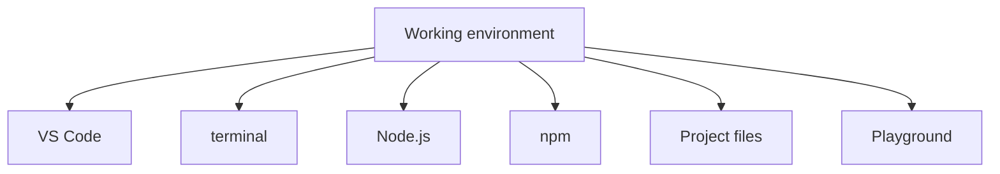

These elements solve different tasks. VS Code is for reading and editing files. The terminal is for running commands. Node.js is for running JavaScript outside the browser. npm is for working with packages. The project folders help separate theory, practice, solutions and experiments.

### Why Node.js is needed

JavaScript can be run in the browser. But this course uses many examples that are more convenient to run locally in files.

Node.js is needed for that.

Node.js is a runtime for JavaScript outside the browser. In this chapter it is enough to understand Node.js exactly this way: it lets you run a `.js` file with a command from the terminal.

The deep internal topics of Node.js, including the runtime, modules and working with packages, will be studied later. A runtime is the environment that actually runs the program; the runtime will be covered in detail in the JavaScript section.

A minimal run diagram:

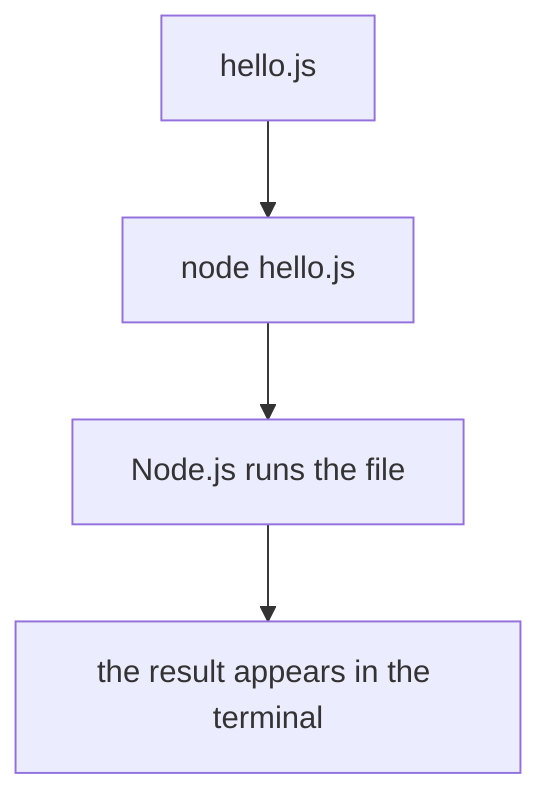

Without Node.js, local JavaScript files will not run the way they are run in the course.

### What npm is

npm is a tool for working with JavaScript packages.

A package is ready-made code you can add to a project. In future sections npm will be used to install tools for TypeScript, Playwright and other tasks.

In this chapter npm is only needed at the level of checking the installation:

```text
npm -v
```

This command shows the npm version.

`package.json` is a file that describes a JavaScript project and its dependencies; it will be studied later. npm scripts are commands written in `package.json`; they too will be covered later, when there is a practical need.

Important: you do not need to install any additional packages for this chapter. It is enough to understand that npm will be used later.

### What VS Code is

VS Code is a code editor.

It is used in the course because:

* it works well with JavaScript and TypeScript;
* it has a built-in terminal;
* it supports extensions;
* it shows syntax highlighting;
* it helps you see the project structure;
* it is convenient for working with Markdown, examples and practice.

TypeScript is an extension of JavaScript with a type system; it will be studied in a separate part of the course later.

A debugger is a tool for stepping through a program and analyzing values while it runs; debugging will be studied later. In this chapter it is enough to know that VS Code supports debugging, but for now we will read errors and run simple files through the terminal.

### Recommended VS Code extensions

The following extensions are useful for this course:

```text
ESLint
Prettier
Error Lens
Markdown All in One
GitLens
Playwright Test for VS Code
```

ESLint helps find potential problems in the code. Detailed ESLint configuration will be studied later.

Prettier formats the code. Formatting is bringing code to a single visual style; the settings will be covered later.

Error Lens shows errors and warnings closer to the line of code. This reduces the distance between the problem and its explanation.

Markdown All in One helps you work with the Markdown files that the course text is made of.

GitLens helps you read the history of changes in Git. Git is a version-control system; working with Git will be covered separately.

Playwright Test for VS Code will be useful in the Automation QA section. Playwright is a library for browser automation; it will be studied later.

Useful to know:

```text
Extensions help you see errors and format code,
but they do not replace understanding the message in the terminal.
```

### The project folder structure

The project is organized so that different types of materials do not mix.

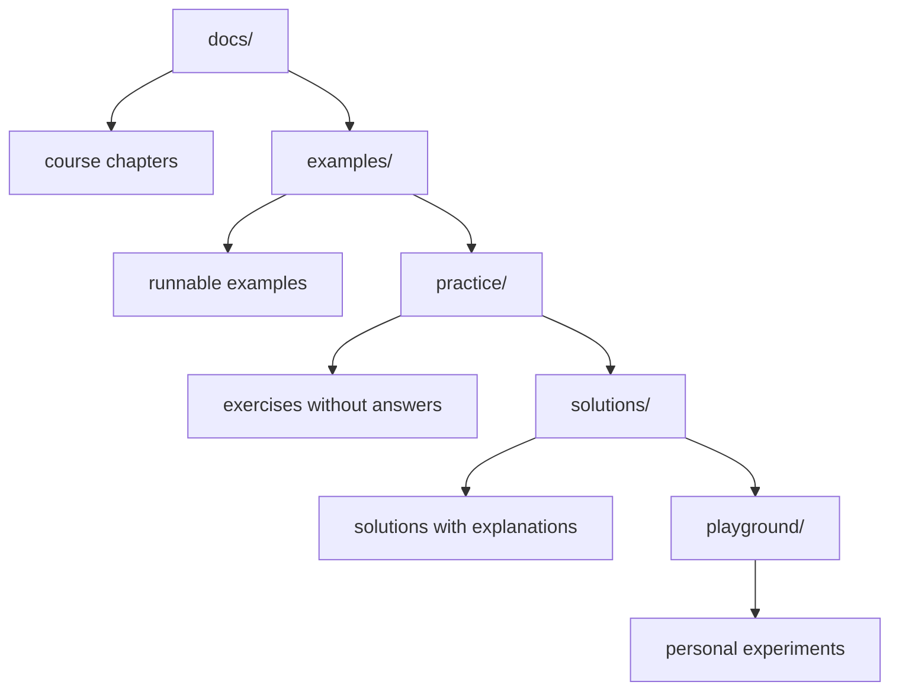

`docs/` should be read in order.

`examples/` should be used to run prepared examples, if they are created for the chapter.

`practice/` should be opened after reading the chapter and done without the solutions.

`solutions/` should be opened after your own attempt.

`playground/` should be used for temporary checks: create a file, change an example, run a command, look at an error.

Important:

```text
Do not store solutions inside practice/.
Do not turn playground/ into the main course folder.
Do not change the repository structure without an explicit reason.
```

### How to use the terminal

The terminal is an interface for entering commands.

In this chapter only basic actions are needed:

* find out the current folder;
* move into a folder;
* look at the contents of a folder;
* run a JavaScript file.

Commands:

```bash
pwd
```

Shows the current folder.

```bash
ls
```

Shows the files and folders inside the current folder.

```bash
cd playground
```

Moves into the `playground/` folder.

```bash
node hello.js
```

Runs the file `hello.js` with Node.js.

The terminal always runs a command relative to the current folder. So before running, it is important to understand where you are.

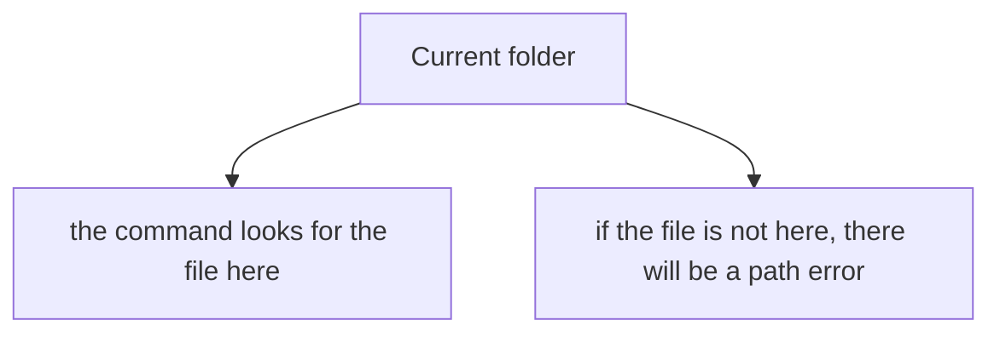

### How to create and run a JavaScript file

The minimal working cycle:

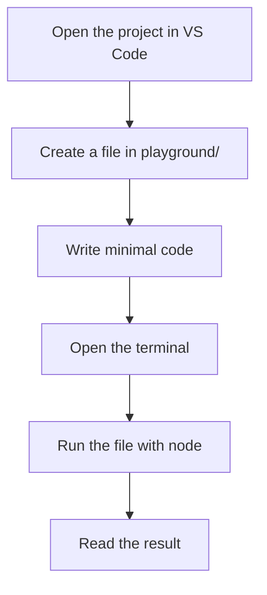

File:

```text
playground/hello.js
```

Code:

```javascript
console.log('Hello from Node.js');
```

In this chapter you do not need to study `console.log` in detail. It is enough to understand that this line prints text to the terminal. Expressions, functions and other JavaScript elements will be studied in the following chapters.

The command to run it from the project root:

```bash
node playground/hello.js
```

Expected output:

```text
Hello from Node.js
```

If you are already inside `playground/`, the command will be different:

```bash
node hello.js
```

The difference is only related to the current folder.

### How to use examples, practice and solutions together

In this chapter it is important to lock in the working sequence at the level of the environment.

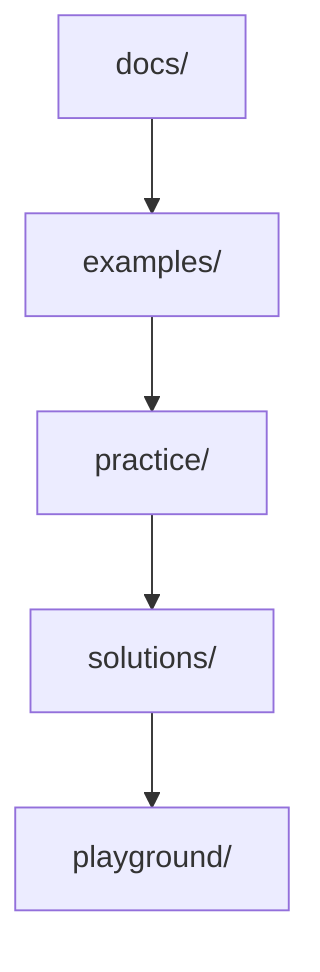

First you read the chapter in `docs/`.

Then you run the examples from `examples/`, if there are any. If there is no separate file, you can temporarily reproduce the embedded example in `playground/`.

Then you do the practice from `practice/`.

After your own attempt you open the solutions from `solutions/`.

`playground/` is used at any stage when you need to test a small hypothesis.

### How to read errors without fear

An error is a message that a tool could not perform an action.

An error message should be read as a technical report, not as a judgment of your actions.

The basic order:

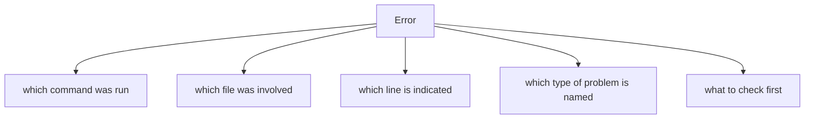

Example:

```text
Error: Cannot find module '/project/playground/hello.js'
```

What this means:

Node.js did not find the file at the given path.

What to check:

* whether the file exists;
* whether the name is spelled correctly;
* whether the command was run from the right folder;
* whether the `.js` extension matches;
* whether there are extra spaces in the file name.

A common mistake:

```text
Looking for the problem in the JavaScript code right away,
when in fact the file was simply run from a different folder.
```

### Basic debugging mindset

Debugging is the process of finding the cause of an error. Detailed debugging tools will be studied later; for now the important thing is to adopt the mindset.

The basic approach:

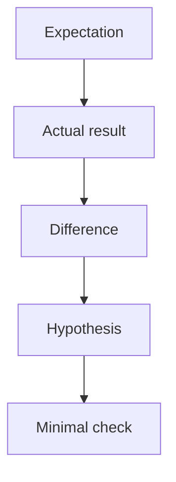

For example:

Expectation:

```text
The command node playground/hello.js will print text.
```

Actual result:

```text
File not found.
```

Hypothesis:

```text
The file was created outside playground/ or the command was run from a different folder.
```

Minimal check:

```bash
ls playground
```

This approach matters for the whole course. An error is worked through not with panic, but with a testable hypothesis.

---

## Internal mechanism

The internal mechanism of running a file can be described without deep detail.

When you enter the command:

```bash
node playground/hello.js
```

a sequence happens:

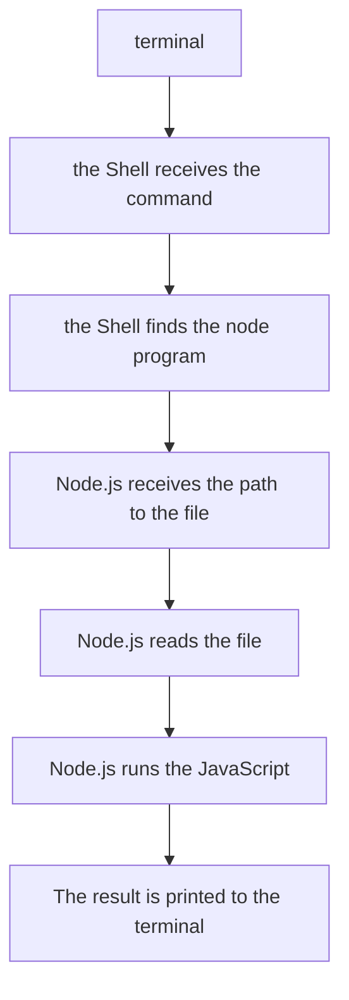

The Shell is a program that receives commands in the terminal and launches other programs; the shell itself is not a topic of the course, but the basic commands will be used constantly.

If something goes wrong, the error appears at one of the stages.

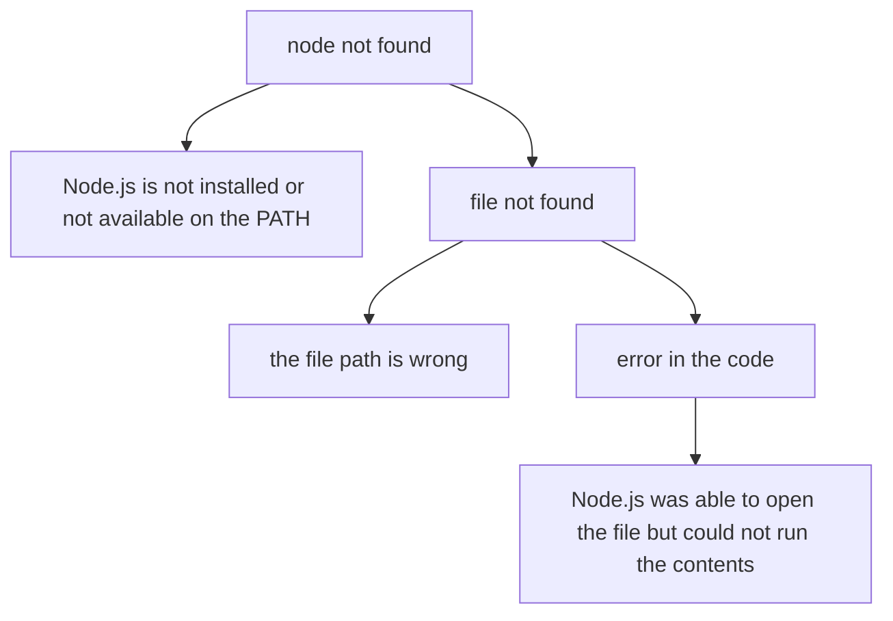

PATH is the list of folders where the system looks for programs; you usually do not need to configure the PATH in this course, but when you get a "command not found" error it is important to know that the problem may be related to it.

This model helps you separate environment problems from code problems.

---

## Mental model

Picture the working environment as a lab bench.

On the bench there are tools, a work area and an observation log.

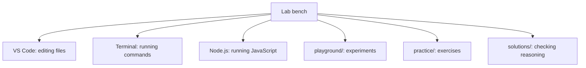

If a tool is out of place, the experiment becomes noisy. If a file is created in the wrong folder, the command will not find it. If the result is not recorded, the error will have to be worked through again.

The working environment should help you ask one question:

```text
What exactly am I checking right now?
```

If the answer is "I am checking whether the file runs", the example should be minimal. If the answer is "I am checking a path error", you should not change the JavaScript code. If the answer is "I am checking the output in the terminal", you should not bring in npm, TypeScript or Playwright.

---

## Code examples

This chapter uses only minimal code to check that a file runs.

### Example 1. The first file

Create a file:

```text
playground/hello.js
```

Add one line:

```javascript
console.log('Hello from playground');
```

Run it from the project root:

```bash
node playground/hello.js
```

Expected result:

```text
Hello from playground
```

What happened:

Node.js opened the file and ran the line that prints text to the terminal.

### Example 2. Running from a different folder

If the terminal is already inside `playground/`, the command changes:

```bash
node hello.js
```

Expected result:

```text
Hello from playground
```

What happened:

The file is looked up relative to the current folder. If the current folder is already `playground/`, the path `playground/hello.js` would mean the nested folder `playground/playground/hello.js`, which may not exist.

### Example 3. A minimal error to read

If you run a non-existent file:

```bash
node playground/missing.js
```

you may see an error like:

```text
Cannot find module
```

What happened:

Node.js did not find the file. This is not a JavaScript syntax error. It is a path or file-name error.

Important:

```text
First determine the type of error.
Then change only what is related to that type of error.
```

---

## Common mistakes

### Mistake 1. Running the command from the wrong folder

The wrong approach:

```bash
node playground/hello.js
```

from a folder that is already `playground/`.

What happened:

The command looks for the file at the path `playground/playground/hello.js`.

Why it happened:

The file path was given without accounting for the current folder.

The corrected version:

```bash
node hello.js
```

or return to the project root and run:

```bash
node playground/hello.js
```

### Mistake 2. Creating a file with the wrong extension

The wrong file:

```text
hello.txt
```

What happened:

The file looks like a text file, not a JavaScript file.

Why it happened:

The file extension does not match the expected format for running a JavaScript example.

The corrected version:

```text
hello.js
```

### Mistake 3. Writing complex code before checking the environment

The wrong approach:

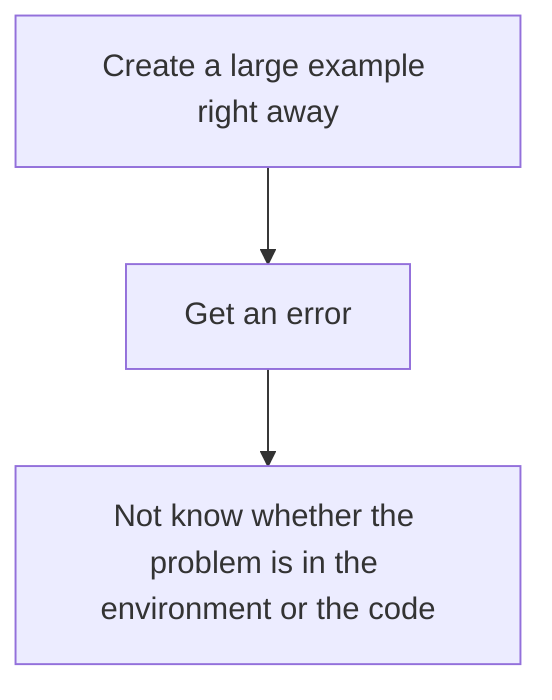

What happened:

Too many factors appeared at once.

Why it happened:

The environment was not verified with a minimal run.

The corrected approach:

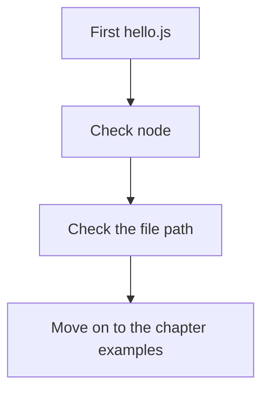

### Mistake 4. Being afraid of error messages

The wrong approach:

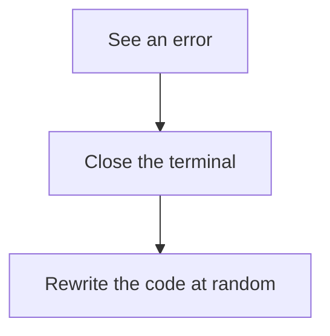

What happened:

The error was not read.

Why it happened:

The message was treated as a breakdown, not as a source of information.

The corrected approach:

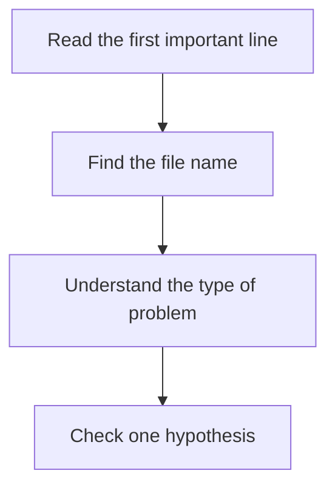

### Mistake 5. Mixing practice and solutions

The wrong approach:

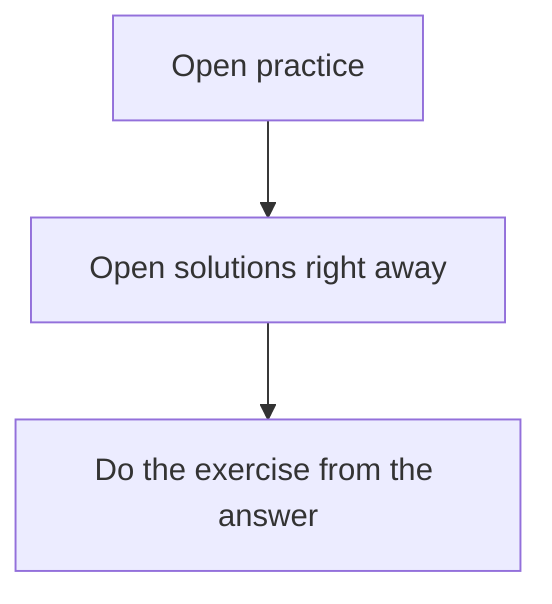

What happened:

The practice stopped testing your independence.

Why it happened:

Files with different purposes were used at the same time.

The corrected approach:

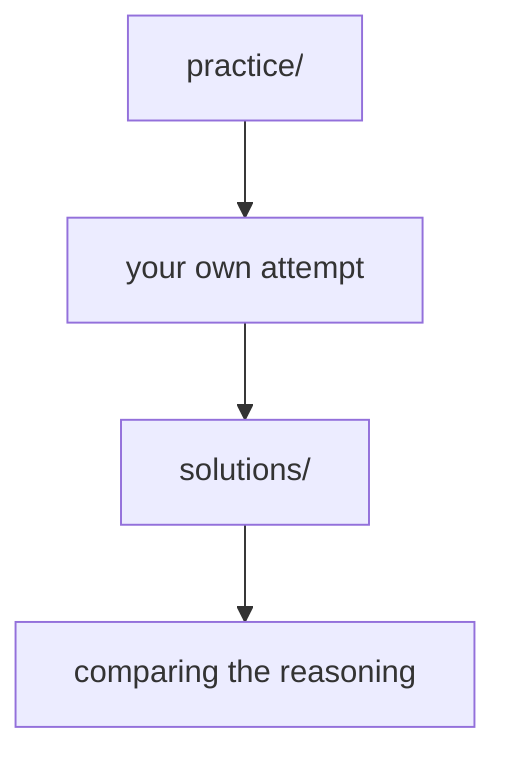

---

## Practical use

Before starting the JavaScript section, check the minimal set.

```text
1. The project root is open in VS Code
2. The terminal is open inside VS Code
3. The command node -v prints a version
4. The command npm -v prints a version
5. The file playground/hello.js is created
6. The command node playground/hello.js prints text
7. The missing.js error is understood as a path error
```

Verification commands:

```bash
node -v
```

```bash
npm -v
```

```bash
pwd
```

```bash
ls
```

The order of work with a new example:

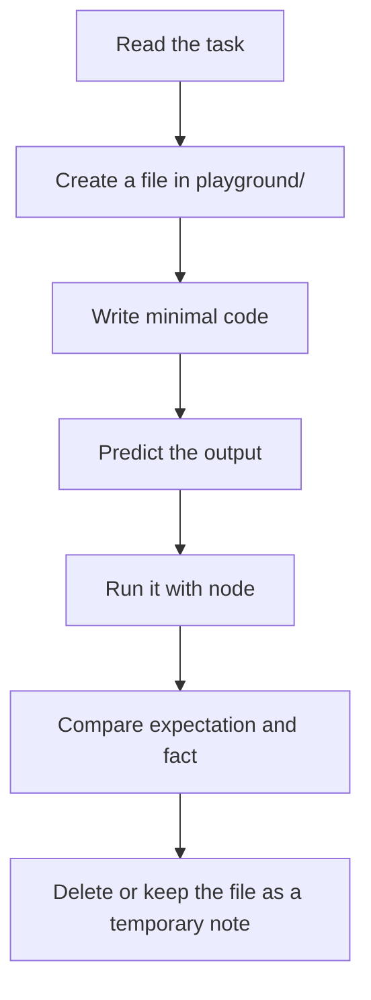

You do not need to save every experiment. `playground/` can be a temporary workspace.

Useful to know:

```text
If a command does not work, first check the current folder.
That is faster than rewriting the code.
```

---

## Use in Automation QA

An Automation QA Engineer constantly works with the environment.

Even a simple automated test depends on:

* the Node.js version;
* installed npm packages;
* the current run folder;
* environment variables;
* configuration;
* browsers and drivers;
* reports and artifacts.

An environment variable is a value passed to the program from outside, for example the address of a test environment; environment configuration will be covered in the Automation QA section.

So the basic skills from this chapter carry directly into real work tasks.

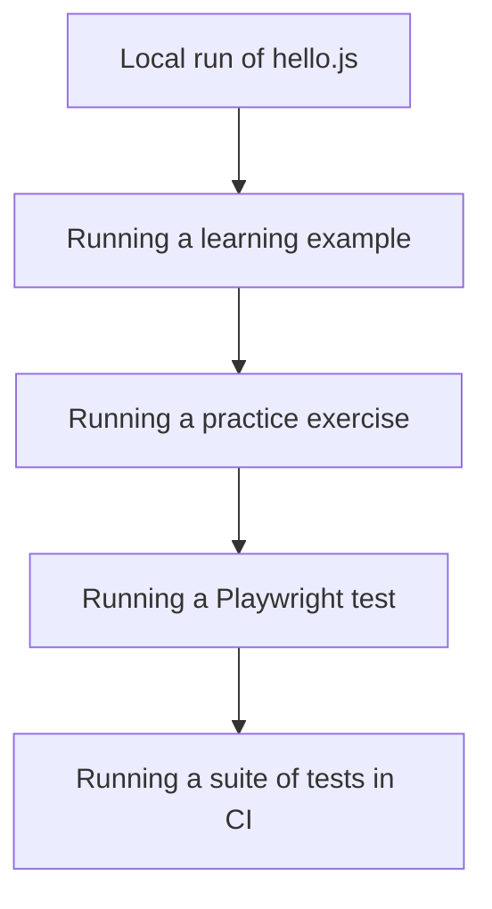

For a QA engineer, three habits are especially important.

The first habit: record the run command. If a test failed, you need to know which command ran it.

The second habit: tell an environment error apart from a test-logic error. If a file is not found, the problem is not in the assertion. If a package is not installed, the problem is not in the Playwright scenario.

The third habit: check a minimal example. Before analyzing a complex test, it is useful to check whether the simplest run works.

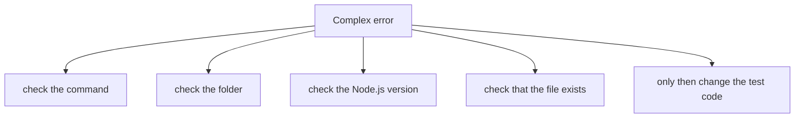

This approach saves time and reduces the number of random changes.

---

## FAQ

### Do I need to study Node.js deeply right now?

No.

In this chapter Node.js is needed as a tool for running JavaScript files. The internal workings of Node.js, the runtime and modules will be studied later.

### Do I need to study npm right now?

No.

For now it is enough to check the `npm -v` command and understand that npm works with packages. `package.json`, npm scripts and dependencies will be covered later.

### Can I use a different editor instead of VS Code?

You can, if it lets you comfortably read Markdown, edit JavaScript files and work with the terminal.

The course uses VS Code because it is widespread, convenient for JavaScript and TypeScript, and well suited to Automation QA.

### Do I need to install Playwright now?

No.

Playwright will be studied later in the Automation QA section. For now the important thing is to prepare the basic run of JavaScript through Node.js.

### What should I do if the `node -v` command does not work?

You need to check whether Node.js is installed and whether the `node` command is available in the terminal.

If the terminal was opened before Node.js was installed, it is worth closing it and opening it again. Sometimes the system updates the available commands only after the terminal is restarted.

### Do I need to delete files from playground?

Not necessarily.

But `playground/` should remain a place for experiments. If there are too many files, it is better to keep only the ones that help you reproduce a topic.

---

## Summary

The working environment should be prepared before starting the JavaScript section.

Node.js lets you run JavaScript files outside the browser. npm is used to work with packages, but in this chapter it is only needed at a basic level. VS Code is used as an editor that combines the project files, the terminal, highlighting and extensions.

The main practical result of the chapter: you should be able to create the file `playground/hello.js`, run it with the command `node playground/hello.js`, see the output in the terminal, and calmly work through a simple path error.

For Automation QA this is a basic skill. Later the same principles will be used when running Playwright tests, API checks, TypeScript code, npm scripts and CI.

The next chapter will begin the JavaScript section and explain what JavaScript is, where it runs, and why one language can work in the browser and in Node.js.

---

## What to remember

✓ The working environment reduces noise while learning code.

✓ Node.js is needed to run JavaScript files outside the browser.

✓ npm is used to work with JavaScript packages.

✓ VS Code is convenient for the course because of the editor, terminal and extensions.

✓ The terminal runs commands relative to the current folder.

✓ `playground/` is meant for small experiments.

✓ An error is a source of information, not a reason to rewrite everything.

✓ You should first check the command, the path and the file, then the code.

✓ An Automation QA Engineer should be able to tell an environment error apart from a test error.

---

## Check yourself

1. Why is Node.js needed in this course?

2. What does the `node -v` command show?

3. Why is npm needed at a basic level?

4. Why is it important to understand the current folder in the terminal?

5. What is `playground/` used for?

6. When should you open `solutions/`?

7. What does the `Cannot find module` error mean when running a file?

8. Why should you not start with large code before checking the environment?

9. Which habits from this chapter are important for Automation QA?
