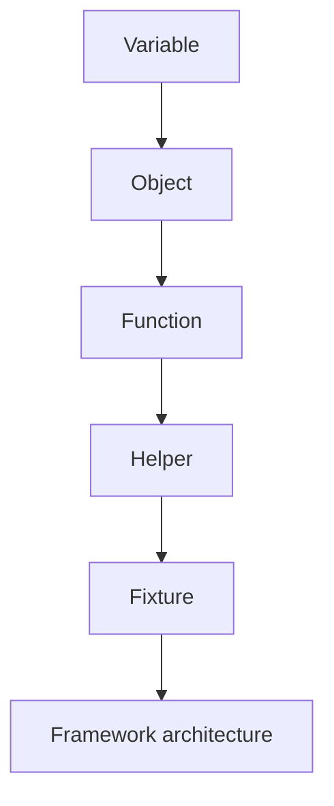

# Practice. Chapter 2. Course structure

## Comprehension check

Answer in your own words.

1. Why is the course divided into Introduction, JavaScript, TypeScript, Automation QA and the final project?
2. Why is JavaScript studied before TypeScript?
3. Why is TypeScript studied before Playwright and framework architecture?
4. What does the phrase "knowledge accumulates" mean?
5. Why can skipping a chapter show up as an error only later?
6. How are `docs/`, `examples/`, `practice/`, `solutions/` and `playground/` connected?
7. Why is the final project at the end of the course?
8. What does the L0 level mean for this chapter?

## Structure analysis

Consider the chain:



Answer:

1. How does each next level use the previous one?
2. What will be unclear in a fixture if you do not understand a function?
3. What will be unclear in a helper if you do not understand an object?

## Code analysis

Read the code.

```javascript
function buildUserEndpoint(baseUrl, userId) {
  return `${baseUrl}/users/${userId}`;
}

const endpoint = buildUserEndpoint('https://api.example.com', 'user-7');

console.log(endpoint);
```

Answer:

1. What will be printed to the console?
2. Which basic JavaScript topics are used here?
3. How can this example grow into part of the API layer?

## Writing code

Write a minimal example of a function that assembles a URL for an order.

Requirements:

* the function should take `baseUrl` and `orderId`;
* the function should return the endpoint string;
* the example should be minimal;
* after the code, write down which part of Automation QA this example might be useful in.

## Bug hunt

Find the flaw in the reasoning.

```text
I want to write Playwright tests faster.
So I will skip JavaScript and TypeScript and come back to them later, if needed.
```

Explain:

1. Which part of the reasoning is wrong?
2. What gaps might appear?
3. What order of study would be more reliable?

## QA tasks

### Task 1

You are designing a future API client.

Write down which knowledge from JavaScript and TypeScript you will need for this task.

### Task 2

Imagine a test uses a fixture, a helper, an API client and an assertion.

Draw a diagram of this test's dependencies on the course topics.

## Mini-project

Create a personal map of the course.

The map should include:

* the five large parts of the course;
* 2-3 key topics in each part;
* one dependency between neighboring parts;
* one QA task that requires knowledge from several parts;
* the place of the final project in the overall structure.

The format is free. You can use a diagram or a table.
