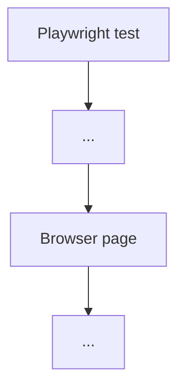

# Practice. Chapter 4. What is JavaScript

## Comprehension check

Answer in your own words.

1. What is JavaScript?
2. Why is ECMAScript needed?
3. How does ECMAScript differ from JavaScript?
4. What does a JavaScript Engine do?
5. What is a Runtime?
6. How does the browser runtime differ from the Node.js runtime?
7. Why can JavaScript run in both the browser and Node.js?
8. Why does TypeScript not replace JavaScript?
9. Why must an Automation QA Engineer distinguish the Node.js context from the browser context?

## Code reading

Read the code.

```javascript
console.log('Has document:', typeof document !== 'undefined');
console.log('Has process:', typeof process !== 'undefined');
```

Answer:

1. What does this code check?
2. What result do you expect when running it in Node.js?
3. What result would logically be expected in the browser runtime?
4. Why does the result depend on the runtime?

## Predict the result. Task 1

Before running the file, predict the output:

```text
examples/01-javascript/chapter-01/01-node-runtime.js
```

Command:

```bash
node examples/01-javascript/chapter-01/01-node-runtime.js
```

Answer:

1. Which line should show the runtime?
2. Why can the Node.js version differ between readers?

## Predict the result. Task 2

Before running the file, predict the output:

```text
examples/01-javascript/chapter-01/03-browser-only-api.js
```

Command:

```bash
node examples/01-javascript/chapter-01/03-browser-only-api.js
```

Answer:

1. Will `document` be available?
2. Why does this example not fail with an error?
3. Which output confirms the difference between runtimes?

## Small coding tasks

### Task 1

Create a file in `playground/`:

```text
playground/runtime-note.js
```

Add code that prints:

```text
JavaScript runs in a runtime
```

Run the file with Node.js.

### Task 2

Create a file:

```text
playground/node-context-check.js
```

Add a safe check for whether `process` is available.

Hint: use `typeof process !== 'undefined'`.

## Debugging tasks

### Task 1

An engineer runs this code in Node.js:

```javascript
console.log(document.title);
```

They get an error:

```text
ReferenceError: document is not defined
```

Answer:

1. Why did the error appear?
2. Is this a JavaScript syntax error or a runtime-context error?
3. How can you safely check for the presence of `document`?

### Task 2

An engineer expects that `process.version` will be available inside code passed to `page.evaluate`.

Answer:

1. Why is the expectation wrong?
2. In which context does the code inside `page.evaluate` run?
3. Where is `process.version` available?

## QA tasks

### Task 1

Explain why a Playwright test can read environment variables in Node.js, but code inside the browser page should not depend directly on `process`.

### Task 2

Draw a diagram:



Show where the Node.js context is, where the browser context is, and which APIs are available in each.

### Task 3

Imagine a test fails with the error:

```text
document is not defined
```

Write the first three diagnostic questions.

## Mini-project

Create a file in `playground/`:

```text
playground/runtime-report.js
```

The file should print a short report:

* whether `process` is available;
* whether `document` is available;
* whether `window` is available;
* which output confirms that the file was run in Node.js.

Before running, write down the expected result. After running, compare the expectation with the fact.
