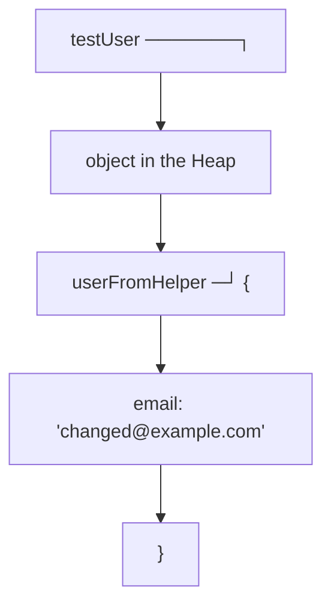

# Solutions. Chapter 0. About the course

## Comprehension check

### 1. Why the course starts with JavaScript

TypeScript and Playwright are built on top of JavaScript.

TypeScript checks types before the program runs, but after compilation it is JavaScript that executes. Playwright provides an API for browser automation, but the tests still use JavaScript functions, objects, Promises, `async / await`, modules and errors.

If you do not understand JavaScript, complex errors in automated tests will look like tool behavior, even though the cause is often in the language.

### 2. What the principle "understanding matters more than memorization" means

Memorization gives you a ready-made phrasing. Understanding gives you a model you can apply in a new situation.

For example, you can memorize that `const` forbids reassignment. But it is important to understand that `const` protects the variable's binding rather than making the object immutable.

### 3. Why TypeScript does not replace runtime checks

TypeScript types exist at the checking and compilation stage. At runtime they do not automatically validate the real data.

If the API returns JSON of the wrong shape, TypeScript will not stop the program by itself. That requires assertions, validators or contract tests.

### 4. How syntax differs from a mechanism

Syntax shows how to write a construct.

A mechanism explains why the construct behaves the way it does: what happens in memory, how a variable is looked up, when a callback runs, why a Promise moves into a particular state.

### 5. Why a QA engineer needs Stack, Heap, References and the Event Loop

These topics directly affect the stability of automated tests.

The Stack helps you understand the order of calls and execution errors. The Heap and References help you understand how objects and test data change. The Event Loop helps you understand asynchrony, Promises and the causes of flaky behavior.

### 6. How the repository directories relate

`docs/` contains the chapters with explanations.

`examples/` contains minimal code examples.

`practice/` contains exercises without answers.

`solutions/` contains solutions, explanations, common mistakes and possible improvements.

### 7. Why solutions should be viewed after an attempt

Solutions are only useful when you already have a hypothesis of your own. If you open the answer right away, you may learn the correct phrasing but never test your own model of understanding.

## Code analysis

The code:

```javascript
const testUser = {
  email: 'qa@example.com'
};

const userFromHelper = testUser;

userFromHelper.email = 'changed@example.com';

console.log(testUser.email);
```

The console will print:

```text
changed@example.com
```

`testUser` and `userFromHelper` point to the same object. The variable `userFromHelper` does not create a copy of the object. It receives the same reference.

The model:



In Automation QA this situation is dangerous if a helper modifies a shared test-data object. One test can prepare data, a second one receives the already-modified object, and the failure looks random.

## Writing code

One possible version:

```javascript
let currentStatus = 'created';
currentStatus = 'paid';

const order = {
  status: 'created'
};

order.status = 'paid';
```

In the first part the variable `currentStatus` is reassigned.

In the second part the variable `order` stays bound to the same object, but a property of the object is changed.

If you try to reassign `order`, there will be an error:

```javascript
const order = {
  status: 'created'
};

order = {
  status: 'paid'
};
```

The reason: `const` forbids reassigning the variable's binding.

## Bug hunt

The wrong part of the reasoning:

```text
If an object is described by a TypeScript type, then the API will definitely return an object of that shape.
```

TypeScript does not control the server and does not validate the real JSON automatically. The type describes an expectation in the code, but the data comes from outside.

Runtime checks are worth adding to the API test:

```typescript
const user = await response.json();

expect(typeof user.id).toBe('string');
expect(typeof user.email).toBe('string');
expect(user.email).toContain('@');
```

Later, checks like these can be extracted into a dedicated validation helper.

## QA task

If a test fails after a shared test-data object is modified, the first things to study are References, Stack and Heap.

Questions for the analysis:

* where the test-data object is created;
* whether it is passed into a helper by reference;
* whether the helper modifies the original object;
* whether the object is reused between tests;
* whether the tests run in parallel;
* whether the data is copied before modification.

You can reduce the risk in several ways:

* do not modify a shared object inside helper functions;
* create a new object based on the old one;
* use factory functions for test data;
* explicitly separate the source data from the data prepared for a specific test;
* add tests for helper functions that check for the absence of side effects.

## Mini-project

An example of a possible plan:

```text
1. Read one chapter per study session.
2. After the chapter, run all the examples locally.
3. Explain each example in writing in 3-5 sentences.
4. Do the practice without the solutions.
5. Open the solutions only after your own attempt.
6. Record mistakes in a separate file: topic, wrong expectation, correct model.
7. After each topic, write down where it appears in Automation QA.
```

Such a plan is useful because it checks not only that you read the chapter, but also your ability to explain the mechanism.

## Common mistakes

### Mistake 1. Copying the answer from the solution

This does not build understanding. It is better to give your own answer first, even if it is incomplete, and then compare it with the solution.

### Mistake 2. Stopping at syntax

If after an exercise you are left only with the knowledge of "how to write it" but no answer to "why it works", the topic needs to be re-read.

### Mistake 3. Not connecting the topic to QA

The course is built for Automation QA. After each topic it is useful to ask: where will this show up in tests, helper functions, fixtures, API clients or framework architecture?

## Possible improvements

After completing the practice you can additionally:

* rewrite the answers a week later and compare the phrasing;
* find a similar example in your own work project;
* make a list of JavaScript topics that currently raise the most questions;
* add a concrete study schedule to your personal plan.
