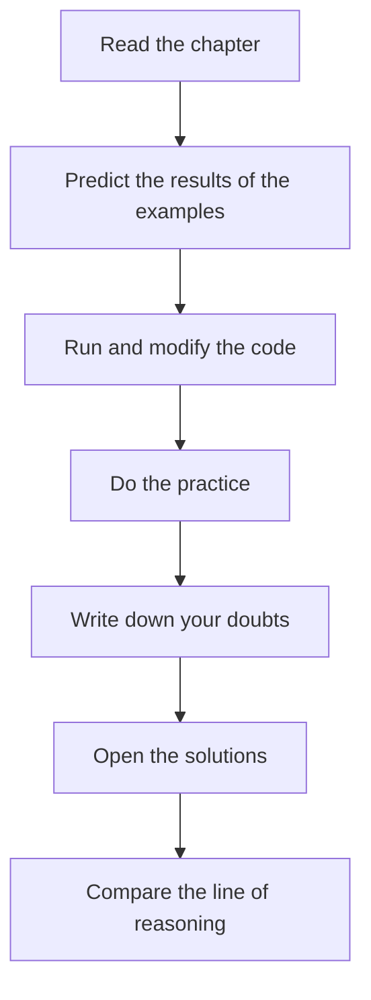

# Solutions. Chapter 1. How to use the course

## Comprehension check

### 1. Why reading without running the examples gives a weak result

Reading creates a feeling of recognition. An example seems clear until you have to run it, change it or explain it.

Running the code tests the model. If the expectation matched the result, the model can be reinforced. If it did not match, you need to find the wrong assumption.

### 2. Why the order of chapters matters

The following topics use models from the previous chapters. If you skip an early topic, a later one may become a set of rules without a reason.

For example, functions are harder to understand without variables, and asynchrony is harder to understand without functions and the order of code execution.

### 3. What to do before running an example

Before running you need to predict the result and write down the expectation.

This turns running into testing a hypothesis. Without a prediction the result is merely observed, but the model is not tested.

### 4. Why solutions are read after an attempt

A solution is only useful when you have your own answer to compare it with.

If you open the solution right away, you may understand the text of the solution but never test how you would have reasoned on your own.

### 5. What `playground/` is used for

`playground/` is used for small experiments:

* running examples;
* testing hypotheses;
* deliberately changing code;
* studying error messages.

### 6. How a note differs from a copy of the chapter

A copy of the chapter repeats the text. A note records your personal model of understanding.

A good note contains the mechanism, a minimal example, a common mistake and a connection to Automation QA.

### 7. How to return to a difficult topic

You need to state a specific question, return to the right section, run a minimal example and rewrite the explanation in your own words.

A broad phrasing like "I did not understand JavaScript" does not help. It is better to be specific: "I do not understand why the function changed an external object".

### 8. Why the connection to test code is needed

The course is aimed at Automation QA. If you do not connect a topic to tests, helper functions, fixtures, API clients and checks, the knowledge will stay academic and transfer poorly into real tasks.

## Code analysis

The code:

```javascript
let retryCount = 0;

function increaseRetryCount() {
  retryCount = retryCount + 1;
}

increaseRetryCount();

console.log(retryCount);
```

The console will print:

```text
1
```

The line that changed the value:

```javascript
retryCount = retryCount + 1;
```

The function was called once, so the value increased from `0` to `1`.

Possible small experiments:

* call the function twice;
* change the initial value to `3`;
* remove the function call;
* add a second `console.log` before the function call.

Each experiment tests one small hypothesis.

## Writing code

One possible version:

```text
Expected result: active will be printed to the console.
```

```javascript
const userStatus = 'active';

console.log(userStatus);
```

Verification in `playground/`:

1. Create a temporary file.
2. Paste the code.
3. Run the file.
4. Compare the actual output with the expected one.
5. Change the value of `userStatus` and run again.

The example tests one idea: a variable holds a value that can be printed to the console.

## Bug hunt

The wrong part of the approach:

```text
If the solution is clear, the topic can be considered learned.
```

The clarity of a ready-made solution does not prove that the reader could have built that solution on their own.

A feeling of clarity often comes from recognizing familiar words and structure. But understanding is tested when you need to predict a result, write code or explain an error without hints.

The corrected process:



## QA tasks

### Task 1

Possible uses of functions:

UI tests:

```text
The function openProfilePage(page) opens the profile page.
```

API tests:

```text
The function createUser(apiClient, userData) sends a request to create a user.
```

Preparing test data:

```text
The function buildUserData() returns an object with test user data.
```

### Task 2

An example of the flaky-test analysis cycle:

Expectation:

```text
The helper should prepare the user data without modifying the shared object.
```

Actual result:

```text
After the helper was called, the shared object changed, and the next test received wrong data.
```

Hypothesis for `playground/`:

```text
Check whether the function modifies the object it received as input.
```

A minimal experiment:

```javascript
const baseUser = {
  email: 'qa@example.com'
};

function updateEmail(user) {
  user.email = 'changed@example.com';
}

updateEmail(baseUser);

console.log(baseUser.email);
```

Conclusion for the notes:

```text
If a helper receives an object and changes its properties, the original object also changes.
QA risk: a shared test-data object may affect other tests.
```

## Mini-project

One possible template:

```text
Chapter:

Main idea:

Mechanism:

Minimal example:

Expected result:

Actual result:

Why the result is what it is:

Common mistake:

QA use:

Question for review:
```

Why this template is useful:

* it forces you to extract the main idea;
* it separates the expectation from the actual result;
* it requires explaining the mechanism;
* it connects the topic to Automation QA;
* it leaves a question for future review.

## Common mistakes

### Mistake 1. Making the template too large

If a note requires too many fields, people stop filling it in. It is better to use a short template that you actually apply after every chapter.

### Mistake 2. Recording only the result

A result without an explanation does not show understanding. You need to record the cause.

### Mistake 3. Not recording the QA use

Without the QA use, a topic stays a separate learning unit. For this course it is important to connect the mechanism to test code.

## Possible improvements

After completing the practice you can:

* create a single file with the note template;
* fill in the template for the first chapter;
* add an "error of the week" section to your notes;
* every few chapters, return to old notes and refine the phrasing.
