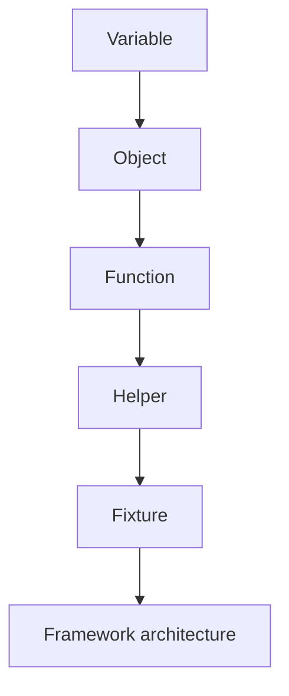
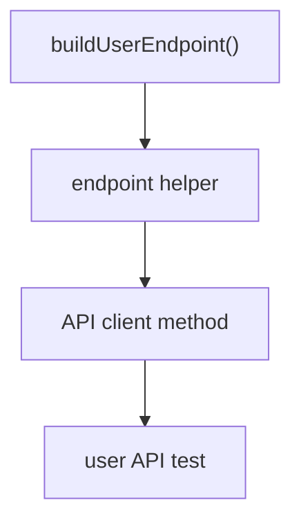
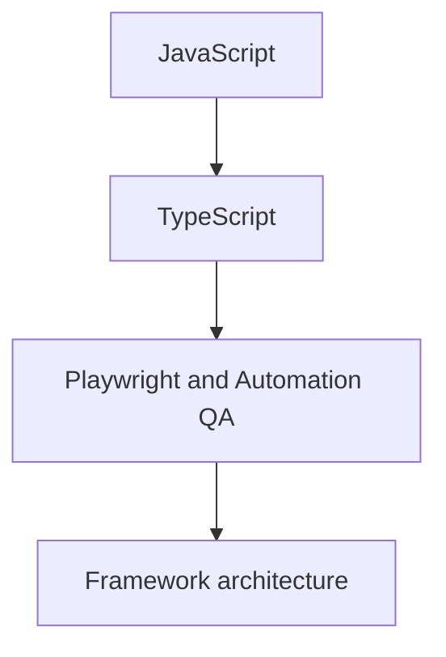
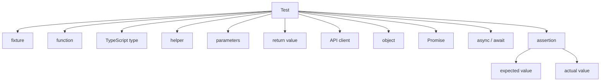
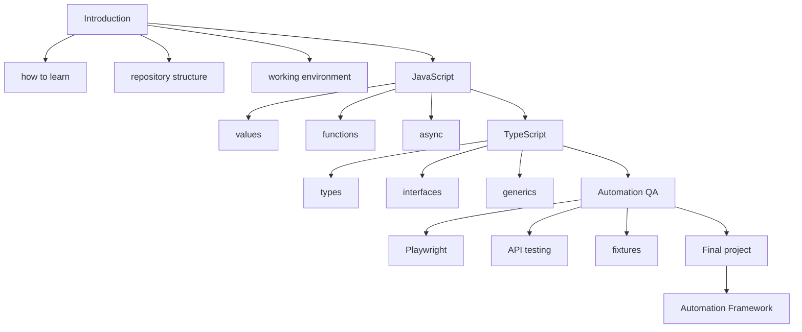

# Solutions. Chapter 2. Course structure

## Comprehension check

### 1. Why the course is divided into parts

Each part is responsible for a separate layer of preparation.

The introduction sets up the workflow. JavaScript explains code execution. TypeScript adds typing. Automation QA applies the language and types to test tasks. The final project assembles everything into a single framework.

### 2. Why JavaScript is studied before TypeScript

TypeScript checks types before running, but it is JavaScript that runs. If you do not understand the JavaScript mechanisms, TypeScript will feel like standalone magic and will not protect you from runtime-behavior errors.

### 3. Why TypeScript is studied before Playwright and architecture

In real Automation QA, code is often written in TypeScript. Types help describe test data, helper functions, API clients, fixtures and configuration. So before the architecture chapters you need to understand how to define and read types.

### 4. What accumulation of knowledge means

A new topic does not replace an old one but uses it. For example, a function uses variables and values, a helper uses functions, a fixture may use helpers, and framework architecture organizes all these elements.

### 5. Why skipping shows up later

While a task is simple, you can copy ready-made templates. But when an error or complexity appears, you need an internal model. If a chapter was skipped, the model is weak, and diagnosis becomes hard.

### 6. How the directories are connected

`docs/` explains the theory.

`examples/` contains runnable examples.

`practice/` tests independent understanding.

`solutions/` helps compare reasoning.

`playground/` is used for experiments.

### 7. Why the final project is at the end

The final project requires all the previous layers: JavaScript, TypeScript, Playwright, API, gRPC, database, helpers, fixtures, assertions, reporting and configuration.

### 8. What L0 means

L0 is the introductory level. At this level the main task is to understand the structure and the rules for moving through the course, not to write complex code.

## Structure analysis

The chain:



An object can be stored in a variable. A function can take an object and return a result. A helper is a function that solves a repeatable task. A fixture may use a helper to prepare state. Framework architecture determines where helpers, fixtures and related modules should live.

If you do not understand a function, a fixture will look like special tool magic, even though internally it uses ordinary functions and objects.

If you do not understand an object, a helper with test data will be hard to analyze: it is unclear which fields it reads, which it modifies and what it returns.

## Code analysis

The code:

```javascript
function buildUserEndpoint(baseUrl, userId) {
  return `${baseUrl}/users/${userId}`;
}

const endpoint = buildUserEndpoint('https://api.example.com', 'user-7');

console.log(endpoint);
```

Result:

```text
https://api.example.com/users/user-7
```

The basic topics used:

* a function;
* parameters;
* a string;
* a return value;
* a variable;
* a function call.

How the example can grow:



## Writing code

One possible version:

```javascript
function buildOrderEndpoint(baseUrl, orderId) {
  return `${baseUrl}/orders/${orderId}`;
}

const endpoint = buildOrderEndpoint('https://api.example.com', 'order-42');

console.log(endpoint);
```

Result:

```text
https://api.example.com/orders/order-42
```

QA use:

Such a helper can be used in API tests to assemble the endpoint before sending a request to fetch an order.

## Bug hunt

The wrong part of the reasoning:

```text
I will skip JavaScript and TypeScript and come back to them later, if needed.
```

Playwright tests use JavaScript and often TypeScript. If you skip the language and types, gaps appear:

* a lack of understanding of asynchrony;
* errors when working with test-data objects;
* a weak understanding of fixtures;
* difficulties with helper functions;
* incorrect use of types;
* problems when designing the framework.

A reliable order:



## QA tasks

### Task 1

For an API client you will need JavaScript knowledge:

* functions;
* objects;
* modules;
* errors;
* Promises;
* async / await.

You will need TypeScript knowledge:

* object types;
* interfaces or type aliases;
* generics;
* utility types;
* narrowing;
* type guards.

These topics are needed to describe input data, API responses, errors and the client's methods.

### Task 2

One possible version of the diagram:



The diagram shows that the test code uses several layers of the course at once.

## Mini-project

One possible version of the map:



A QA task that requires several parts:

```text
Create an API client for a user,
describe the response type,
write a helper to prepare the data,
use the client in a test,
check the result with an assertion.
```

Such a task requires JavaScript functions, objects, asynchrony, TypeScript types and Automation QA approaches.

## Common mistakes

### Mistake 1. Making the map too detailed

The course map should help you see the dependencies. If it turns into a full copy of the table of contents, it is hard to use.

### Mistake 2. Not showing the connections between parts

Simply listing the sections is not enough. It is important to show how one part prepares you for the next.

### Mistake 3. Skipping the QA task

The course is aimed at Automation QA. A personal map should show how topics turn into test tasks.

## Possible improvements

After completing the practice you can:

* add the course map to your personal notes;
* return to it after each large section;
* mark topics that need reviewing;
* add real work tasks connected to the mechanisms you have studied.
