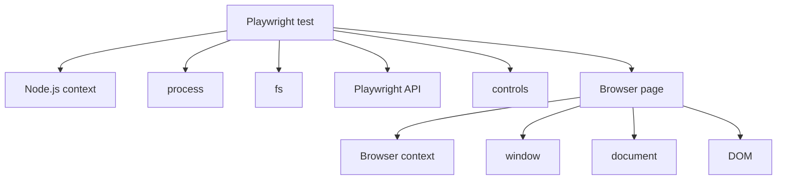

# Solutions. Chapter 4. What is JavaScript

## Comprehension check

### 1. What is JavaScript

Answer:

JavaScript is a programming language. It defines the rules for writing and running program code.

Explanation:

It is important not to mix up the language with the environment. JavaScript itself describes the core behavior of a program, while the runtime adds the available APIs.

A common mistake:

Assuming that everything available in the browser is part of JavaScript.

Connection to Automation QA:

In automated tests you need to understand where the language ends and the API of a tool or environment begins.

### 2. Why ECMAScript is needed

Answer:

ECMAScript is needed as the standard for the language.

Explanation:

The standard describes the expected behavior of the language core so that different engines can run JavaScript consistently.

A common mistake:

Treating ECMAScript as a separate tool that needs to be run.

### 3. ECMAScript and JavaScript

Answer:

ECMAScript is the standard. JavaScript is the practical use of the language in engines and runtimes.

Explanation:

ECMAScript does not describe `document` or `process`. Those capabilities are added by the browser runtime and the Node.js runtime.

A common mistake:

Looking for browser APIs in the ECMAScript core.

### 4. JavaScript Engine

Answer:

A JavaScript Engine runs JavaScript code.

Explanation:

The engine reads the code, prepares it and runs it. The details of parsing and compilation will be studied in the next chapter.

A common mistake:

Mixing up the engine and the runtime.

### 5. Runtime

Answer:

A runtime is an execution environment that includes the engine and additional APIs.

Explanation:

It is the runtime that determines whether `document`, `window`, `process`, `fs` and other APIs are available.

A common mistake:

Thinking that if the language is the same, the environment is always the same.

### 6. Browser runtime and Node.js runtime

Answer:

The browser runtime runs JavaScript inside the browser and provides browser APIs. The Node.js runtime runs JavaScript outside the browser and provides Node.js APIs.

Explanation:

The browser runtime has `document`. The Node.js runtime has `process`. These are different environments around the language.

Connection to Automation QA:

Playwright connects both worlds: the test runs in Node.js, while the page lives in the browser.

### 7. Why JavaScript works in the browser and in Node.js

Answer:

Because JavaScript can be run by different engines inside different runtimes.

Explanation:

The core of the language is described by ECMAScript. The engine runs the language. The runtime adds the environment.

### 8. Why TypeScript does not replace JavaScript

Answer:

TypeScript adds types and checking before running, but after compilation it is JavaScript that runs.

Explanation:

The runtime runs JavaScript, not TypeScript types. So the JavaScript fundamentals remain required.

A common mistake:

Expecting TypeScript to fix a misunderstanding of the runtime.

### 9. Why contexts matter for a QA engineer

Answer:

Because the test code and the page code can run in different runtimes.

Explanation:

The Node.js context has Node.js APIs. The browser context has browser APIs. An error often arises from trying to use an API in the wrong context.

## Code reading

The code:

```javascript
console.log('Has document:', typeof document !== 'undefined');
console.log('Has process:', typeof process !== 'undefined');
```

Answer:

The code checks whether the names `document` and `process` are available.

Expected result in Node.js:

```text
Has document: false
Has process: true
```

Expected logic in the browser runtime:

```text
Has document: true
Has process: false
```

Explanation:

`document` belongs to the browser API. `process` belongs to the Node.js API. So the result depends on the runtime.

A common mistake:

Thinking that `typeof` checks the "language", when it actually checks whether a name is available in the environment.

Connection to Automation QA:

A check like this helps you understand where the code runs: in the Node.js context or the browser context.

## Predict the result. Task 1

File:

```text
examples/01-javascript/chapter-01/01-node-runtime.js
```

Expected output:

```text
Runtime: Node.js
Node.js version: <your Node.js version>
```

Explanation:

The first line is fixed. The second line depends on the installed Node.js version, so it can differ between readers.

A common mistake:

Expecting the Node.js version to be the same for everyone.

Connection to Automation QA:

The Node.js version can affect running tools and tests, so it is useful to be able to check it.

## Predict the result. Task 2

File:

```text
examples/01-javascript/chapter-01/03-browser-only-api.js
```

Expected output:

```text
document is available: false
This file is running in Node.js, so document is not available here.
```

Explanation:

The file is run with Node.js. Node.js has no `document` browser API. The example does not fail because it uses a safe `typeof document !== 'undefined'` check rather than a direct access to `document.title`.

A common mistake:

Writing a direct access to `document` in a Node.js file.

Connection to Automation QA:

This kind of error often arises when an engineer forgets where the Playwright test code runs.

## Small coding tasks

### Task 1

File:

```text
playground/runtime-note.js
```

Code:

```javascript
console.log('JavaScript runs in a runtime');
```

Run:

```bash
node playground/runtime-note.js
```

Explanation:

The code is minimal and is only needed to check that the file runs.

A common mistake:

Creating the file outside `playground/` and running the command with the wrong path.

### Task 2

File:

```text
playground/node-context-check.js
```

Code:

```javascript
console.log('process is available:', typeof process !== 'undefined');
```

Expected output in Node.js:

```text
process is available: true
```

Explanation:

`process` is available in the Node.js runtime.

Connection to Automation QA:

In tests the Node.js context is often used to read configuration and environment variables.

## Debugging tasks

### Task 1

Code:

```javascript
console.log(document.title);
```

Error:

```text
ReferenceError: document is not defined
```

Answer:

The error appeared because the code was run in Node.js, where there is no `document`.

This is a runtime-context error, not a JavaScript syntax error.

Safe check:

```javascript
console.log(typeof document !== 'undefined');
```

Explanation:

A direct access to a non-existent name causes an error. `typeof` lets you check availability safely.

A common mistake:

Fixing the syntax when the cause is the wrong runtime.

### Task 2

Answer:

The expectation is wrong because the code inside `page.evaluate` runs in the browser context.

`process.version` is available in the Node.js context, where the test file runs.

Explanation:

Playwright hands execution over into the page. There, browser APIs are available, but ordinary Node.js APIs are not.

A common mistake:

Thinking that `page.evaluate` runs in the same environment as the test file.

Connection to Automation QA:

This distinction is important when diagnosing Playwright tests.

## QA tasks

### Task 1

Answer:

A Playwright test can read environment variables because it runs in the Node.js context. Code inside the browser page should not depend directly on `process`, because it runs in the browser context.

Explanation:

The test code controls the browser from the outside. The page runs its own JavaScript inside the browser.

A common mistake:

Passing expectations that belong to Node.js into the browser context.

### Task 2

A possible diagram:



Explanation:

The diagram separates the test code from the page code. This helps you understand where the different APIs are available.

### Task 3

The first questions:

1. Where did the code run: the Node.js context or the browser context?
2. Was there a direct access to `document` from the test file?
3. Should this code be run inside the page through a Playwright mechanism?

Explanation:

The error `document is not defined` almost always requires checking the execution context.

## Mini-project

File:

```text
playground/runtime-report.js
```

A possible implementation:

```javascript
console.log('process:', typeof process !== 'undefined');
console.log('document:', typeof document !== 'undefined');
console.log('window:', typeof window !== 'undefined');
console.log('Runtime looks like Node.js:', typeof process !== 'undefined');
```

Expected output in Node.js:

```text
process: true
document: false
window: false
Runtime looks like Node.js: true
```

Explanation:

`process` is available in Node.js. `document` and `window` belong to the browser runtime and are not available in an ordinary Node.js file.

A common mistake:

Expecting `window` to be available just because the code is written in JavaScript.

Connection to Automation QA:

Such a report helps you quickly check which environment your diagnostic code runs in.

## Possible improvements

After completing the practice you can:

* run all the files from `examples/01-javascript/chapter-01/`;
* create your own runtime report in `playground/`;
* write down in your personal notes the difference between language, engine and runtime;
* add an example of the `document is not defined` error and its explanation.
