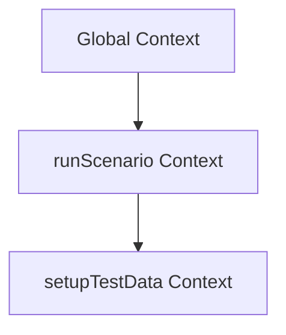

# Практика. Глава 6. Execution Context

## Концептуальные вопросы

Ответьте своими словами.

1. Что такое Execution Context?
2. Почему JavaScript не может выполнять код без Execution Context?
3. Что делает engine во время creation phase?
4. Что делает engine во время execution phase?
5. Чем Global Execution Context отличается от Function Execution Context?
6. Когда создается Function Execution Context?
7. Почему один вызов функции создает один context?
8. Почему Function Context исчезает после завершения вызова?
9. Чем Execution Context отличается от runtime?
10. Почему Call Stack логически изучается после Execution Context?

## Чтение кода

Прочитайте код.

```javascript
showMessage();

function showMessage() {
  console.log('Ready');
}
```

Ответьте:

1. Почему вызов функции возможен до строки объявления?
2. На каком этапе engine регистрирует `showMessage`?
3. Когда создается Function Execution Context для `showMessage`?

## Предскажите поведение engine

Перед запуском файла предскажите вывод:

```text
examples/01-javascript/chapter-03/02-function-context.js
```

Ответьте:

1. Какая строка выводится первой?
2. В какой момент создается Function Execution Context?
3. Что произойдет после завершения функции?

## Определите фазу выполнения

Для каждого действия укажите фазу: creation phase или execution phase.

1. Engine регистрирует function declaration.
2. Engine выполняет `console.log`.
3. Engine регистрирует имя переменной.
4. Engine вызывает функцию.
5. Engine присваивает значение переменной.
6. Engine создает Function Execution Context при вызове.

## Задачи на отладку

### Задача 1

Инженер считает, что функция создается только тогда, когда execution доходит до строки `function`.

Объясните, почему это неверная модель для function declaration.

### Задача 2

Файл:

```text
examples/01-javascript/chapter-03/06-common-mistake.js
```

Перед запуском ответьте:

1. Почему первая строка не приводит к ошибке отсутствующего имени?
2. Почему значение до assignment отличается от значения после assignment?
3. Какой будущей теме связан этот пример?

## QA-сценарии

### Сценарий 1

Playwright-тест вызывает helper `createUserData()` два раза.

Ответьте:

1. Сколько Function Execution Context создается для helper?
2. Почему каждый вызов нужно мыслить как отдельное выполнение?
3. Как это помогает отлаживать helpers?

### Сценарий 2

Fixture вызывает helper, helper вызывает utility, utility падает с runtime error.

Нарисуйте ASCII-схему contexts и объясните, как это связано со stack trace.

### Сценарий 3

Page Object method падает внутри теста.

Ответьте:

1. Где создается Function Execution Context?
2. Почему ошибка может быть внутри метода, хотя тест вызвал только одну строку?

## Мини-проект

Создайте файл:

```text
playground/context-simulation.js
```

В файле должно быть:

* один top-level вывод;
* одна функция `setupTestData`;
* одна функция `runScenario`;
* `runScenario` должна вызвать `setupTestData`;
* после кода напишите текстовую схему creation phase и execution phase.

Цель мини-проекта — не сложный код, а ментальная симуляция:


