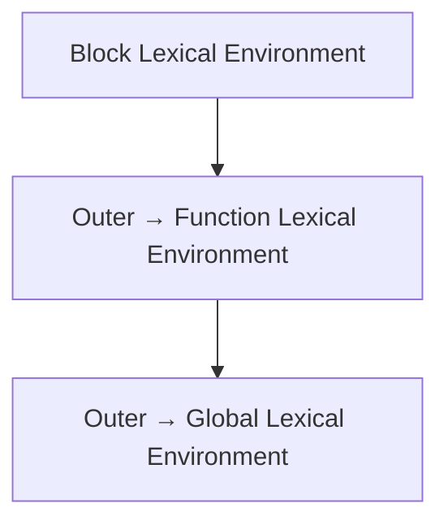

# Практика. Глава 11. Lexical Environment

## Концептуальные вопросы

Ответьте своими словами.

1. Почему Scope нужен внутренний механизм?
2. Что такое Lexical Environment?
3. Что такое Environment Record?
4. Что такое Outer Environment Reference?
5. Как Lexical Environment связан со Scope?
6. Как Lexical Environment связан с Execution Context?
7. Как Lexical Environment связан с Variables?
8. Как Lexical Environment связан с Memory?
9. Как Lexical Environment связан с Call Stack?
10. Почему Scope Chain можно представить как linked Lexical Environments?
11. Почему Lexical Environment не нужно воспринимать как обычный object?
12. Как эта глава подготавливает Hoisting?

## Определите Lexical Environments

Для кода ниже выпишите:

* Global Lexical Environment;
* Function Lexical Environment;
* Block Lexical Environment;
* Environment Record каждого environment;
* Outer Environment Reference каждого environment.

```javascript
const baseUrl = 'https://example.com';

function testLogin() {
  const userName = 'qa-user';

  if (true) {
    const expectedStatus = 'active';

    console.log(baseUrl);
    console.log(userName);
    console.log(expectedStatus);
  }
}
```

## Предскажите поиск идентификатора

Для каждого identifier укажите lookup path.

### Задача 1

```javascript
const baseUrl = 'https://example.com';

function printUrl() {
  const path = '/login';

  console.log(baseUrl + path);
}
```

Identifiers:

```text
baseUrl
path
```

### Задача 2

```javascript
const status = 'global';

function printStatus() {
  const status = 'local';

  console.log(status);
}
```

Identifier:

```text
status inside printStatus
```

### Задача 3

```javascript
const testName = 'checkout';

if (true) {
  const message = 'Running ' + testName;

  console.log(message);
}
```

Identifiers:

```text
message
testName
```

## Предскажите вывод перед запуском

Перед запуском предскажите вывод.

### Задача 1

```javascript
const baseUrl = 'https://example.com';

function printProfileUrl() {
  const path = '/profile';

  console.log(baseUrl + path);
}

printProfileUrl();
```

### Задача 2

```javascript
const status = 'outer';

function printStatus() {
  const status = 'inner';

  console.log(status);
}

printStatus();
console.log(status);
```

## Задачи на отладку

### Задача 1

Инженер пытается прочитать `path` outside function:

```javascript
function printUrl() {
  const path = '/login';
}

printUrl();

// console.log(path);
```

Объясните ошибку через Lexical Environment.

### Задача 2

Инженер думает, что Call Stack объясняет, почему helper видит `baseUrl`.

```javascript
const baseUrl = 'https://example.com';

function helper() {
  console.log(baseUrl);
}

helper();
```

Объясните, почему нужна Lexical Environment model.

### Задача 3

Инженер видит shadowing:

```javascript
const status = 'global';

function checkStatus() {
  const status = 'local';

  console.log(status);
}
```

Объясните lookup через Environment Record.

## QA-задачи

### Сценарий 1

Helper имеет identifiers:

```text
requestBody
normalizedEmail
responseStatus
```

Нарисуйте Function Lexical Environment helper и объясните, почему эти identifiers isolated.

### Сценарий 2

Nested helper читает global `baseUrl` и local `path`.

Нарисуйте lookup для обоих identifiers.

### Сценарий 3

Playwright stack trace показывает падение внутри helper.

Ответьте:

1. Что показывает stack trace?
2. Что показывает Lexical Environment model?
3. Почему для debugging нужны оба слоя?

## Мини-проект

Создайте файл:

```text
playground/lexical-environment-flow.js
```

В нем должно быть:

* global `baseUrl`;
* function `testLogin`;
* внутри function `userName`;
* внутри function block `if (true)`;
* внутри block `loginUrl`;
* `loginUrl` должен использовать `baseUrl` и `userName`;
* вывод `loginUrl`.

После кода нарисуйте:



И подпишите Environment Record каждого level.
