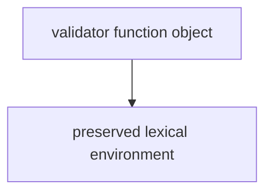

# Практика: Closures

## Проверка понимания

1. Объясните своими словами, почему функция может читать переменную из outer function после того, как outer function завершилась.

2. Что сохраняет Closure: копию значения или доступ к lexical environment?

3. Почему captured variable не становится global variable?

4. Чем Scope отличается от Closure?

5. Почему два разных вызова одной factory function могут создать независимые closures?

6. Что происходит с Execution Context outer function после `return`?

7. Что может сохраниться после завершения outer function, если returned function все еще использует outer variables?

8. Почему важно не объяснять Closure как "магическую память функции"?

---

## Анализ кода

### Задание 1

Прочитайте код и определите, где появляется Closure.

```javascript
function createReader() {
  const value = 'saved';

  return function readValue() {
    return value;
  };
}

const reader = createReader();

console.log(reader());
```

Ответьте:

* какая функция является inner function;
* какая переменная captured;
* почему `value` доступна при вызове `reader()`.

---

### Задание 2

Прочитайте код.

```javascript
function createValidator(expectedRole) {
  return function validateUser(user) {
    return user.role === expectedRole;
  };
}

const validateAdmin = createValidator('admin');

console.log(validateAdmin({ role: 'admin' }));
```

Ответьте:

* что хранит `validateAdmin`;
* откуда `validateUser` берет `expectedRole`;
* какой результат будет выведен.

---

## Предскажите результат выполнения кода

### Задание 3

Не запускайте код. Сначала предскажите вывод.

```javascript
function createCounter() {
  let count = 0;

  return function increment() {
    count = count + 1;
    return count;
  };
}

const counter = createCounter();

console.log(counter());
console.log(counter());
console.log(counter());
```

---

### Задание 4

Не запускайте код. Сначала предскажите вывод.

```javascript
function createCounter(start) {
  let count = start;

  return function increment() {
    count = count + 1;
    return count;
  };
}

const first = createCounter(0);
const second = createCounter(10);

console.log(first());
console.log(second());
console.log(first());
console.log(second());
```

---

## Ожидаемое время жизни vs Фактическое время жизни

### Задание 5

Для кода ниже заполните две модели:

* expected lifetime, если не учитывать Closure;
* actual lifetime с учетом Closure.

```javascript
function createTokenReader() {
  const token = 'qa-token';

  return function readToken() {
    return token;
  };
}

const readToken = createTokenReader();
console.log(readToken());
```

Опишите:

* когда создается `token`;
* когда outer function завершается;
* почему `token` все еще доступен;
* что именно сохраняется.

---

## Поиск Closure

### Задание 6

В каких примерах есть Closure?

Пример A:

```javascript
function getStatus() {
  const status = 200;
  return status;
}
```

Пример B:

```javascript
function createStatusReader() {
  const status = 200;

  return function readStatus() {
    return status;
  };
}
```

Пример C:

```javascript
const status = 200;

function readStatus() {
  return status;
}
```

Для каждого примера объясните, есть ли Closure и почему.

---

## Отладка

### Задание 7

Код должен создавать независимые validators, но сейчас результат зависит от общего изменяемого значения.

```javascript
let expectedStatus = 200;

function validateStatus(actualStatus) {
  return actualStatus === expectedStatus;
}

const validateOk = validateStatus;

expectedStatus = 201;

console.log(validateOk(200));
```

Исправьте код через factory function, чтобы validator для `200` не зависел от последующего изменения другого значения.

---

### Задание 8

Код выводит не тот результат, который ожидает читатель.

```javascript
function createMessage(prefix) {
  return function buildMessage(text) {
    return text;
  };
}

const buildApiMessage = createMessage('API');

console.log(buildApiMessage('Request failed'));
```

Ожидаемый результат:

```text
API: Request failed
```

Исправьте код и объясните, какую переменную должна использовать inner function.

---

## QA-задачи

### Задание 9

Напишите factory function `createStatusValidator(expectedStatus)`.

Она должна возвращать функцию, которая принимает `response` и возвращает `true`, если:

```javascript
response.status === expectedStatus
```

Проверьте работу на двух response objects:

* `{ status: 200 }`
* `{ status: 404 }`

---

### Задание 10

Напишите helper creator `createUrlBuilder(baseUrl)`.

Он должен возвращать функцию `buildUrl(path)`, которая соединяет сохраненный `baseUrl` и входящий `path`.

Пример использования:

```javascript
const buildApiUrl = createUrlBuilder('https://api.example.test');

console.log(buildApiUrl('/users'));
console.log(buildApiUrl('/orders'));
```

---

### Задание 11

Напишите factory function `createRoleValidator(expectedRole)`.

Returned function должна принимать `user` object и возвращать `true`, если `user.role` совпадает с сохраненным `expectedRole`.

Создайте два validators:

* `validateAdmin`;
* `validateGuest`.

Проверьте их на нескольких user objects.

---

## Мини-проект

### Задание 12

Создайте небольшой набор QA helpers на Closures.

Требования:

1. Создайте `createResponseValidator(expectedStatus)`.
2. Returned function должна принимать `response`.
3. Она должна проверять status.
4. Создайте `createHeaderValidator(headerName)`.
5. Returned function должна принимать `headers`.
6. Она должна проверять, что header существует.
7. Создайте два status validators: для `200` и `201`.
8. Создайте один header validator: для `'x-request-id'`.
9. Проверьте helpers на нескольких объектах.
10. Нарисуйте рядом с кодом ASCII-схему:



Дополнительно объясните:

* какие значения captured;
* какие значения приходят как arguments;
* почему helpers независимы друг от друга.
