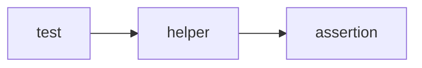
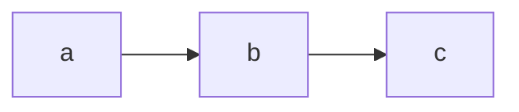

# Практика: Call Stack

## Концептуальные вопросы

1. Зачем JavaScript нужен Call Stack?
2. Что происходит с Call Stack при вызове функции?
3. Что происходит с Call Stack, когда функция завершается?
4. Почему после `c()` JavaScript возвращается в `b()`?
5. Что означает правило: выполняется верхний Execution Context?

## Чтение кода

```javascript
function c() {
  console.log('c');
}

function b() {
  c();
  console.log('b');
}

function a() {
  b();
  console.log('a');
}

a();
```

Нарисуйте Call Stack в момент, когда выполняется `c()`.

## Предскажите результат выполнения

```javascript
function c() {
  console.log('enter c');
  console.log('leave c');
}

function b() {
  console.log('enter b');
  c();
  console.log('leave b');
}

function a() {
  console.log('enter a');
  b();
  console.log('leave a');
}

a();
```

Сначала запишите вывод без запуска.

## Отладка

Есть stack trace:

```text
Error: Failure inside c
    at c
    at b
    at a
```

Где возникла ошибка? Какие функции привели выполнение к этому месту?

## QA-аналогия

Сравните:



и:



Что в этой аналогии соответствует верхнему Execution Context?

## Мини-сценарий

Напишите `a()`, `b()`, `c()` так, чтобы каждая функция печатала:

* `enter <name>`;
* вызов следующей функции, если она есть;
* `leave <name>`.

После кода нарисуйте порядок помещения в Call Stack и снятия из Call Stack для всех функций.
