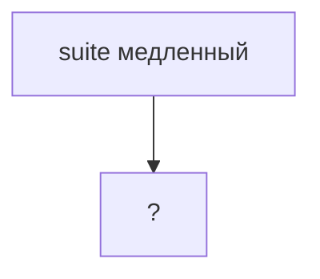

# Практика: Performance

## Концептуальные вопросы

1. Почему optimization без measurement считается догадкой?
2. Почему читаемость кода обычно важнее микровыгоды?
3. Что означает bottleneck в программе?
4. Почему повторные API-запросы могут замедлять тестовый suite?
5. Почему после optimization нужно измерить результат снова?

## Чтение кода

Какая работа выполняется повторно?

```javascript
const testRuns = [
  { id: 'R-1', durationMs: 300 },
  { id: 'R-2', durationMs: 700 },
];

function getTotalDuration(runs) {
  return runs.reduce((total, run) => total + run.durationMs, 0);
}

console.log(getTotalDuration(testRuns));
console.log(getTotalDuration(testRuns) / testRuns.length);
```

## Предскажите поведение

Что выведет код?

```javascript
const tests = [
  { id: 'T-1', durationMs: 200 },
  { id: 'T-2', durationMs: 1200 },
  { id: 'T-3', durationMs: 900 },
];

const slowTests = tests.filter((test) => test.durationMs > 1000);

console.log(slowTests.map((test) => test.id));
```

## Задание на отладку

Найдите проблему в подходе:

```javascript
function optimizeSlowTest(test) {
  test.timeout = 60000;

  return test;
}
```

Почему увеличение timeout не является доказанным performance-исправлением?

## Задание Automation QA

Опишите, как исследовать медленный Playwright suite:



Добавьте шаги:

* измерить длительность тестов;
* найти самые медленные сценарии;
* проверить повторные login/API/setup действия;
* убрать лишнюю работу;
* сравнить результат.

## Мини-проект

Спроектируйте функцию `createPerformanceReport(testResults)`.

Она должна вернуть объект:

```javascript
{
  totalDurationMs: 0,
  slowTests: [],
  averageDurationMs: 0
}
```

Условие: slow test — это тест с `durationMs > 1000`.

Объясните, какой bottleneck может появиться в этой задаче и почему повторные вычисления опасны без measurement.
