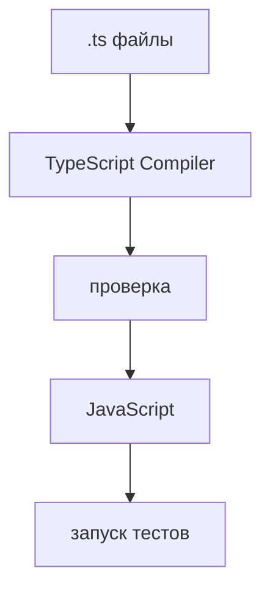

# Практика: TypeScript Compiler

## Концептуальные вопросы

1. Какую роль выполняет TypeScript Compiler до запуска программы?
2. Почему компилятор TypeScript не является JavaScript runtime?
3. Что означает фраза "TypeScript генерирует JavaScript"?
4. Почему ранняя проверка особенно полезна в Automation QA framework?
5. Какие ошибки компилятор TypeScript может показать раньше запуска тестов?

## Чтение кода

Что должен заметить TypeScript Compiler?

```typescript
const retryCount: number = 'three';

console.log(retryCount);
```

## Предскажите результат проверки

Будет ли компилятор TypeScript считать этот код согласованным?

```typescript
const projectName: string = 'checkout tests';
const testCount: number = 12;

console.log(`${projectName}: ${testCount}`);
```

## Задание на отладку

Найдите проблему в коде.

```typescript
const timeoutMs: number = '5000';
const baseUrl: string = 'https://api.example.test';

console.log(baseUrl, timeoutMs);
```

Объясните, почему компилятор TypeScript должен остановить такую ошибку до runtime.

## Задание Automation QA

В проекте есть настройка количества повторов:

```typescript
const retries: number = '2';
```

Объясните:

* почему это опасно для test runner;
* почему компилятор TypeScript может помочь раньше запуска;
* почему тесты все равно остаются нужны.

## Мини-проект

Опишите маленькую схему TypeScript workflow для QA-проекта:



Под каждым шагом напишите одну фразу: что происходит и какую ошибку можно поймать.
