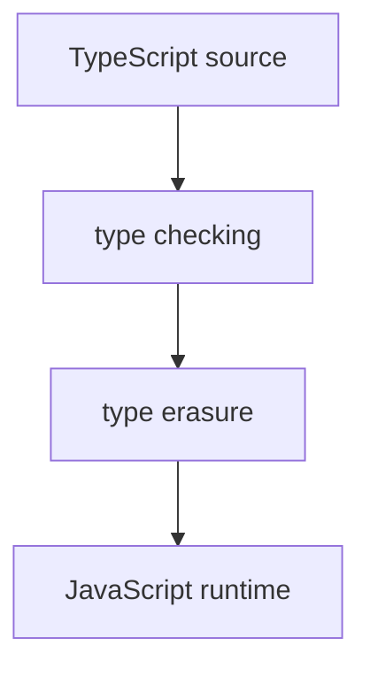

# Практика: Type Erasure

## Концептуальные вопросы

1. Что такое Type Erasure?
2. Почему TypeScript-типы удаляются после компиляции?
3. Почему JavaScript runtime не видит TypeScript-типы?
4. Почему Type Erasure важен для понимания ограничений TypeScript?
5. Почему runtime-проверка остается нужна для внешних данных?

## Чтение кода

Какая часть исчезнет после компиляции?

```typescript
const baseUrl: string = 'https://api.example.test';
const timeoutMs: number = 5000;
```

## Предскажите результат

Как примерно будет выглядеть JavaScript output?

```typescript
const reportName: string = 'smoke-report';

console.log(reportName);
```

## Задание на отладку

Почему TypeScript не защитит runtime от такого response без дополнительной проверки?

```typescript
function readStatus(status: string) {
  return status.toUpperCase();
}

const response = JSON.parse('{"status": 200}');

console.log(readStatus(response.status));
```

## Задание Automation QA

API test ожидает, что response содержит строковый `status`.

Объясните:

* что TypeScript может проверить в коде теста;
* что TypeScript не может знать о реальном response;
* почему assertion все равно нужен.

## Мини-проект

Нарисуйте цепочку:



Добавьте под каждым шагом пример из Automation QA.
