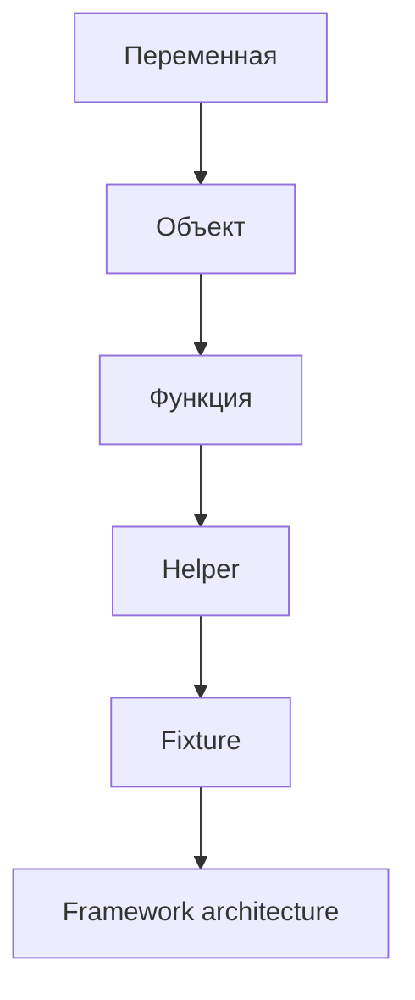
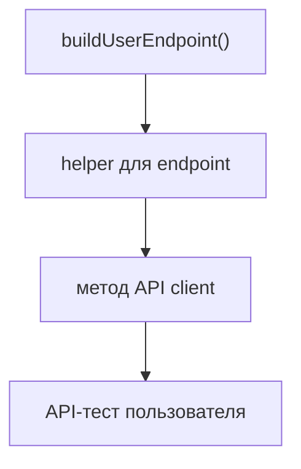
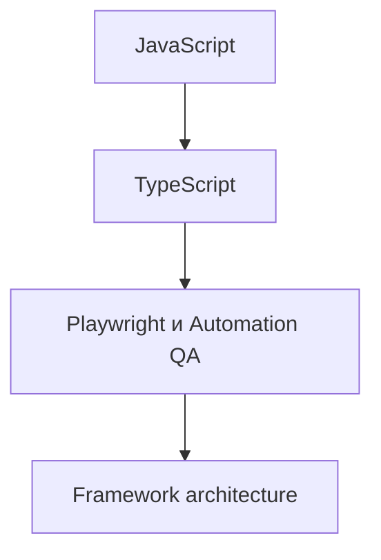
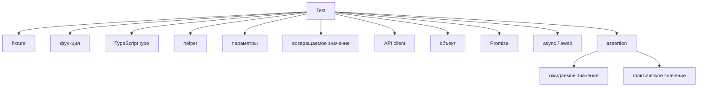
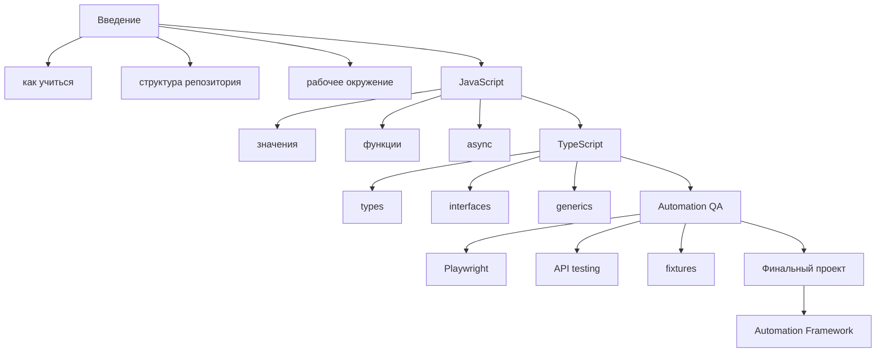

# Решения. Глава 2. Структура курса

## Проверка понимания

### 1. Почему курс разделен на части

Каждая часть отвечает за отдельный слой подготовки.

Введение задает рабочий процесс. JavaScript объясняет выполнение кода. TypeScript добавляет типизацию. Automation QA применяет язык и типы к тестовым задачам. Финальный проект собирает все в единый framework.

### 2. Почему JavaScript изучается до TypeScript

TypeScript проверяет типы до запуска, но выполняется JavaScript. Если не понимать JavaScript-механизмы, TypeScript будет восприниматься как самостоятельная магия и не защитит от ошибок runtime-поведения.

### 3. Почему TypeScript изучается до Playwright и architecture

В реальном Automation QA код часто пишется на TypeScript. Типы помогают описывать тестовые данные, helper-функции, API clients, fixtures и configuration. Поэтому перед архитектурными главами нужно понимать, как задавать и читать типы.

### 4. Что означает накопление знаний

Новая тема не заменяет старую, а использует ее. Например, функция использует переменные и значения, helper использует функции, fixture может использовать helpers, framework architecture организует все эти элементы.

### 5. Почему пропуск проявляется позже

Пока задача простая, можно копировать готовые шаблоны. Но при ошибке или усложнении проекта нужна внутренняя модель. Если глава была пропущена, модель слабая, и диагностика становится трудной.

### 6. Как связаны директории

`docs/` объясняет теорию.

`examples/` содержит запускаемые примеры.

`practice/` проверяет самостоятельное понимание.

`solutions/` помогает сравнить рассуждение.

`playground/` используется для экспериментов.

### 7. Почему финальный проект в конце

Финальный проект требует всех предыдущих слоев: JavaScript, TypeScript, Playwright, API, gRPC, database, helpers, fixtures, assertions, reporting и configuration.

### 8. Что означает L0

L0 — вводный уровень. На этом уровне главная задача — понять структуру и правила движения по курсу, а не писать сложный код.

## Анализ структуры

Цепочка:



Объект может храниться в переменной. Функция может принимать объект и возвращать результат. Helper является функцией, которая решает повторяемую задачу. Fixture может использовать helper для подготовки состояния. Framework architecture определяет, где должны находиться helpers, fixtures и связанные модули.

Если не понимать функцию, fixture будет выглядеть как специальная магия инструмента, хотя внутри он использует обычные функции и объекты.

Если не понимать объект, helper с тестовыми данными будет трудно анализировать: непонятно, какие поля он читает, какие изменяет и что возвращает.

## Анализ кода

Код:

```javascript
function buildUserEndpoint(baseUrl, userId) {
  return `${baseUrl}/users/${userId}`;
}

const endpoint = buildUserEndpoint('https://api.example.com', 'user-7');

console.log(endpoint);
```

Результат:

```text
https://api.example.com/users/user-7
```

Используются базовые темы:

* функция;
* параметры;
* строка;
* возвращаемое значение;
* переменная;
* вызов функции.

Как пример может вырасти:



## Написание кода

Один из возможных вариантов:

```javascript
function buildOrderEndpoint(baseUrl, orderId) {
  return `${baseUrl}/orders/${orderId}`;
}

const endpoint = buildOrderEndpoint('https://api.example.com', 'order-42');

console.log(endpoint);
```

Результат:

```text
https://api.example.com/orders/order-42
```

QA-применение:

Такой helper может использоваться в API-тестах для сборки endpoint перед отправкой запроса на получение заказа.

## Поиск ошибок

Неверная часть рассуждения:

```text
Пропущу JavaScript и TypeScript, а к ним вернусь позже, если понадобится.
```

Playwright-тесты используют JavaScript и часто TypeScript. Если пропустить язык и типы, появятся пробелы:

* непонимание асинхронности;
* ошибки при работе с объектами тестовых данных;
* слабое понимание fixtures;
* трудности с helper-функциями;
* неправильное использование типов;
* проблемы при проектировании framework.

Надежный порядок:



## QA-задачи

### Задача 1

Для API client понадобятся знания JavaScript:

* функции;
* объекты;
* модули;
* ошибки;
* Promise;
* async / await.

Понадобятся знания TypeScript:

* object types;
* interfaces или type aliases;
* generics;
* utility types;
* narrowing;
* type guards.

Эти темы нужны, чтобы описывать входные данные, ответы API, ошибки и методы клиента.

### Задача 2

Один из возможных вариантов схемы:



Схема показывает, что тестовый код использует несколько слоев курса одновременно.

## Мини-проект

Один из возможных вариантов карты:



QA-задача, которая требует нескольких частей:

```text
Создать API client для пользователя,
описать тип ответа,
написать helper для подготовки данных,
использовать client в тесте,
проверить результат assertion.
```

Такая задача требует JavaScript-функций, объектов, асинхронности, TypeScript-типов и Automation QA-подходов.

## Типичные ошибки

### Ошибка 1. Делать карту слишком подробной

Карта курса должна помогать видеть зависимости. Если она превращается в полную копию оглавления, ее трудно использовать.

### Ошибка 2. Не указывать связи между частями

Просто перечислить разделы недостаточно. Важно показать, как одна часть готовит к следующей.

### Ошибка 3. Пропустить QA-задачу

Курс ориентирован на Automation QA. Личная карта должна показывать, как темы превращаются в тестовые задачи.

## Возможные улучшения

После выполнения практики можно:

* добавить карту курса в личные заметки;
* возвращаться к ней после каждого крупного раздела;
* отмечать темы, которые требуют повторения;
* добавлять реальные рабочие задачи, связанные с изученными механизмами.
