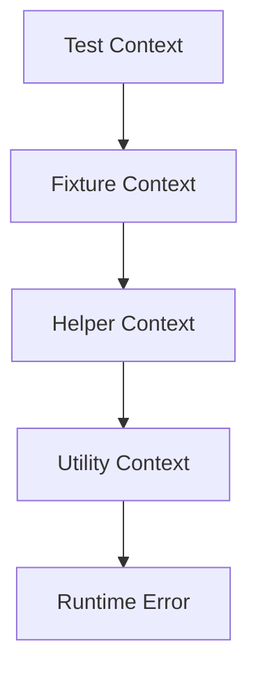
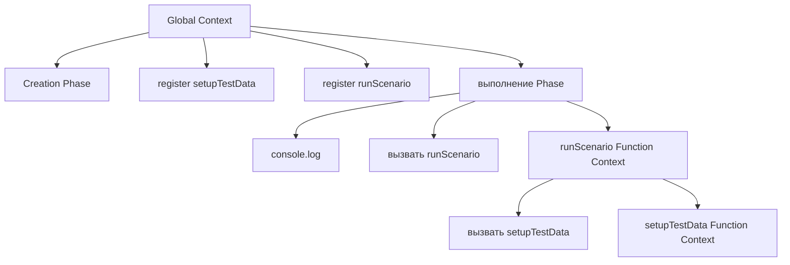

# Решения. Глава 6. Execution Context

## Концептуальные вопросы

### 1. Что такое Execution Context

Ответ:

Execution Context — внутренняя рабочая среда, которую engine создает для выполнения кода.

Объяснение:

Engine не выполняет код в пустоте. Ему нужно место, где зарегистрированы имена, подготовлены функции и хранится состояние текущего выполнения.

Распространённая ошибка:

Считать Execution Context просто другим названием для файла.

Связь с Automation QA:

Тестовый файл, helper и fixture выполняются в contexts. Это помогает понимать, где возникла ошибка.

### 2. Почему JavaScript не выполняется без Execution Context

Ответ:

Потому что engine должен знать, какие имена существуют, какие функции доступны и где происходит текущее выполнение.

Объяснение:

Без context строка вроде `showMessage()` не имела бы внутренней среды, в которой можно найти `showMessage`.

Распространённая ошибка:

Объяснять выполнение только порядком строк.

Связь с Automation QA:

Такая ошибка мешает понимать, почему helper может быть зарегистрирован до выполнения тестового сценария.

### 3. Creation phase

Ответ:

Во время creation phase engine регистрирует объявления функций и переменных на высоком уровне и готовит внутренние записи для выполнения.

Объяснение:

Пользовательские действия еще не выполняются. Engine готовит комнату.

Распространённая ошибка:

Думать, что `console.log` может выполниться во время creation phase.

Связь с Automation QA:

Если лог теста не появился, возможно execution phase еще не началась или код остановился раньше.

### 4. Execution phase

Ответ:

Во время execution phase engine выполняет инструкции, присваивает значения, вызывает функции и обращается к runtime API.

Объяснение:

Это этап, на котором появляются видимые действия программы.

Связь с Automation QA:

Логи теста появляются во время execution phase, а не во время creation phase.

### 5. Global и Function Execution Context

Ответ:

Global Execution Context создается для верхнего уровня запуска. Function Execution Context создается при вызове функции.

Объяснение:

Функция может быть зарегистрирована заранее, но ее отдельный context появляется только при вызове.

Распространённая ошибка:

Считать, что объявление функции сразу создает Function Context.

Связь с Automation QA:

Метод Page Object не получает Function Context при объявлении класса или объекта; context появляется при вызове метода в тесте.

### 6. Когда создается Function Execution Context

Ответ:

При вызове функции.

Объяснение:

Один function declaration может быть вызван много раз. Каждый вызов создает новый Function Execution Context.

Распространённая ошибка:

Думать, что у функции есть один постоянный context на все вызовы.

Связь с Automation QA:

Повторный вызов fixture helper нужно анализировать как новое выполнение.

### 7. Почему один вызов создает один context

Ответ:

Каждый вызов является отдельным выполнением функции со своим временным состоянием.

Объяснение:

Даже если код функции тот же, конкретный запуск функции отдельный.

Связь с Automation QA:

Два вызова helper в двух тестах нужно мыслить как два отдельных выполнения.

### 8. Почему Function Context исчезает

Ответ:

После завершения функции ее временная рабочая среда больше не нужна.

Объяснение:

Engine освобождает активное выполнение функции. Подробная модель памяти будет изучаться позже.

Распространённая ошибка:

Считать временное состояние вызова постоянным.

Связь с Automation QA:

Это помогает понимать, почему временные данные внутри helper не должны жить после завершения helper-вызова без явного сохранения.

### 9. Execution Context и runtime

Ответ:

Execution Context — внутренняя среда выполнения кода. Runtime — окружение, которое предоставляет API вроде `console` и `process`.

Объяснение:

Код выполняется внутри context, но видимый вывод появляется через runtime API.

Распространённая ошибка:

Считать `console` частью Execution Context.

Связь с Automation QA:

В Node.js-тестах context выполняет код, а runtime предоставляет API для логов, переменных окружения и интеграций.

### 10. Почему Call Stack после Execution Context

Ответ:

Потому что сначала нужно понять, что такое contexts, а затем изучать, как engine управляет несколькими активными contexts.

Объяснение:

Call Stack объясняет порядок активных вызовов и contexts.

Распространённая ошибка:

Пытаться объяснять порядок вложенных вызовов без понимания самих contexts.

Связь с Automation QA:

Stack trace в тестах станет понятнее после связи Execution Context и Call Stack.

## Чтение кода

Код:

```javascript
showMessage();

function showMessage() {
  console.log('Ready');
}
```

Ответ:

Вызов возможен, потому что function declaration регистрируется во время creation phase.

`showMessage` регистрируется до execution phase.

Function Execution Context для `showMessage` создается при вызове `showMessage()`.

Объяснение:

Registration и call — разные события. Регистрация происходит до выполнения строк. Вызов происходит во время execution phase.

Распространённая ошибка:

Говорить, что функция "создалась" только на строке объявления.

Связь с Automation QA:

Это помогает понимать, почему helpers можно объявлять ниже теста в некоторых стилях кода, хотя в проектах часто предпочитают более читаемый порядок.

## Предскажите поведение engine

Файл:

```text
examples/01-javascript/chapter-03/02-function-context.js
```

Ожидаемый вывод:

```text
Global context: before function call
Function context: running printMessage
Global context: after function call
```

Function Execution Context создается в момент вызова `printMessage()`.

После завершения функции этот Function Context исчезает, и выполнение продолжается в Global Execution Context.

Объяснение:

Global Context выполняет top-level строки. Вызов функции временно переносит выполнение в новый Function Context.

Распространённая ошибка:

Думать, что Function Context существует все время после объявления функции.

Связь с Automation QA:

Так читаются helpers: объявление helper не равно выполнению helper в тесте.

## Определите фазу выполнения

Ответ:

1. Engine регистрирует function declaration — creation phase.
2. Engine выполняет `console.log` — execution phase.
3. Engine регистрирует имя переменной — creation phase.
4. Engine вызывает функцию — execution phase.
5. Engine присваивает значение переменной — execution phase.
6. Engine создает Function Execution Context при вызове — execution phase вызывает создание нового context, внутри которого затем идет creation phase.

Объяснение:

Creation phase готовит имена. Execution phase выполняет действия.

Распространённая ошибка:

Отнести присваивание значения к creation phase.

Связь с Automation QA:

Это помогает отличать подготовку тестового файла от фактической подготовки test data во время выполнения.

## Задачи на отладку

### Задача 1

Ответ:

Для function declaration engine регистрирует функцию во время creation phase. Поэтому функция может быть доступна до строки объявления.

Объяснение:

Execution до строки объявления не нужен для самой регистрации declaration.

Распространённая ошибка:

Смешивать function declaration с другими способами создания функций. Они будут изучаться позже.

Связь с Automation QA:

В тестовых проектах разные стили объявления helpers могут вести себя по-разному, поэтому важно не переносить правило function declaration на все случаи.

### Задача 2

Файл:

```text
examples/01-javascript/chapter-03/06-common-mistake.js
```

Ответ:

Первая строка не приводит к ошибке отсутствующего имени, потому что имя `status` зарегистрировано до execution phase.

Значение до assignment отличается от значения после assignment, потому что assignment выполняется во время execution phase.

Этот пример связан с будущими темами Variables и Hoisting.

Объяснение:

Engine сначала регистрирует имя, потом выполняет строки. Детали `var` будут разобраны позже.

Распространённая ошибка:

Делать общий вывод для `let` и `const` по примеру с `var`. Это разные механизмы, они будут изучаться отдельно.

Связь с Automation QA:

Неверное понимание регистрации имен приводит к ошибкам в helpers и конфигурационных файлах.

## QA-сценарии

### Сценарий 1

Ответ:

Если helper `createUserData()` вызывается два раза, создается два Function Execution Context.

Каждый вызов нужно мыслить как отдельное выполнение, потому что у каждого вызова свой lifecycle.

Объяснение:

Одна функция может иметь много отдельных запусков.

Распространённая ошибка:

Считать, что один helper имеет один общий context на все вызовы.

Связь с Automation QA:

Это помогает отлаживать helpers, которые используются в нескольких тестах.

### Сценарий 2

Возможная схема:



Объяснение:

Stack trace показывает путь вызовов, связанный с активными function contexts. Подробно Call Stack будет в следующей главе.

Распространённая ошибка:

Читать только последнюю строку ошибки и игнорировать путь вызовов.

Связь с Automation QA:

В сложном фреймворке ошибка часто находится не в тесте, а в helper или utility.

### Сценарий 3

Ответ:

Function Execution Context создается при вызове метода Page Object.

Ошибка может быть внутри метода, потому что одна строка теста запускает выполнение целого блока кода внутри Page Object.

Объяснение:

Вызов метода — это function call. У него появляется свой execution context.

Распространённая ошибка:

Считать, что если в тесте упала одна строка, проблема обязательно находится прямо в тестовом файле.

Связь с Automation QA:

Page Object скрывает детали взаимодействия со страницей, поэтому важно читать stack trace.

## Мини-проект

Один из возможных вариантов:

```javascript
console.log('Global context: file started');

function setupTestData() {
  console.log('setupTestData context: prepare data');
}

function runScenario() {
  console.log('runScenario context: start');
  setupTestData();
  console.log('runScenario context: finish');
}

runScenario();
```

Ожидаемая схема:



Объяснение:

Сначала создается Global Execution Context. В нем регистрируются функции. Во время execution вызывается `runScenario`, затем внутри него вызывается `setupTestData`.

Распространённая ошибка:

Рисовать Function Context для `setupTestData` уже на этапе объявления функции. Он создается только при вызове.

Связь с Automation QA:

Это модель типичного теста: сценарий вызывает подготовку данных через helper.

## Возможные улучшения

После выполнения практики можно:

* нарисовать contexts для собственного Playwright helper;
* взять один stack trace и отметить, какие функции в нем создавали contexts;
* повторить примеры после главы про Call Stack;
* сравнить поведение function declaration с function expression после изучения функций.
