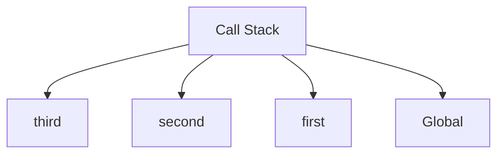
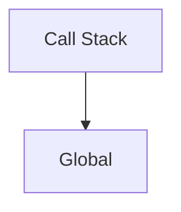
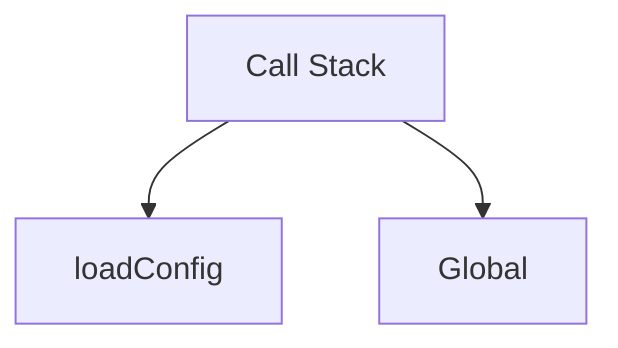
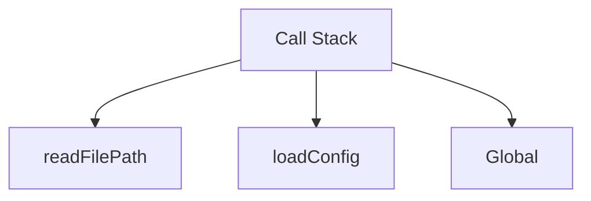
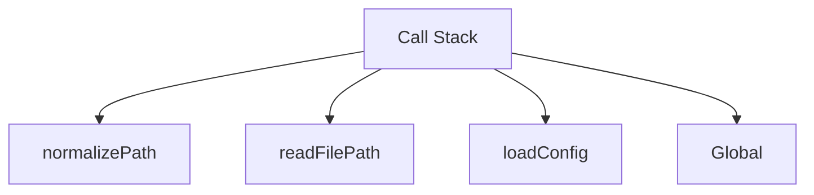
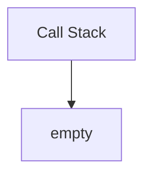
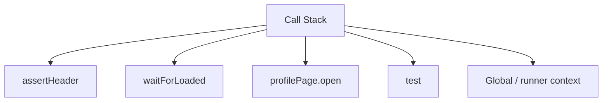
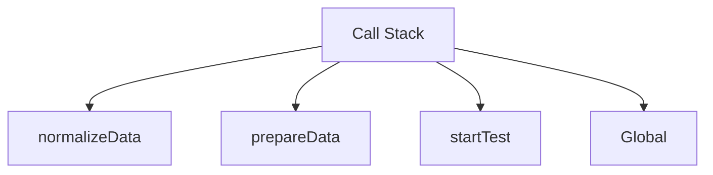

# Решения. Глава 7. Call Stack

## Концептуальные вопросы

### 1. Что такое Call Stack

Ответ:

Call Stack — структура, которая хранит активные Execution Contexts и определяет, какой context выполняется сейчас.

Объяснение:

Execution Context описывает рабочую среду. Call Stack управляет порядком таких сред.

Распространённая ошибка:

Считать Call Stack самим Execution Context.

Связь с Automation QA:

Stack traces в тестах отражают цепочку вызовов, связанную с Call Stack.

### 2. Почему Call Stack нужен после Execution Context

Ответ:

Потому что во время nested function calls активных contexts может быть несколько, и engine должен знать, какой выполнять сейчас и куда вернуться.

Объяснение:

Без Call Stack engine не смог бы корректно вернуться из inner function в outer function.

Распространённая ошибка:

Объяснять возврат из функции только порядком строк.

Связь с Automation QA:

Это помогает понимать цепочки test → fixture → helper → utility.

### 3. Push

Ответ:

Push — добавление нового Execution Context на верх Call Stack.

Объяснение:

Function call создает Function Execution Context и помещает его сверху.

Распространённая ошибка:

Думать, что push происходит при объявлении функции.

Связь с Automation QA:

Метод Page Object попадает в stack при вызове, а не при объявлении класса или объекта.

### 4. Pop

Ответ:

Pop — снятие верхнего Execution Context со stack после завершения функции.

Объяснение:

После pop активным становится предыдущий context.

Распространённая ошибка:

Считать, что завершенная функция продолжает занимать верх stack.

Связь с Automation QA:

Это помогает понимать, почему после helper выполнение возвращается в тест.

### 5. Last in — first out

Ответ:

Последний добавленный context завершается первым.

Объяснение:

Если `first` вызвал `second`, а `second` вызвал `third`, сначала завершается `third`, затем `second`, затем `first`.

Распространённая ошибка:

Ожидать завершение функций в порядке вызова.

### 6. Как engine возвращается

Ответ:

После pop текущего context верхним становится предыдущий context. Engine продолжает выполнение там, где был сделан вызов.

Объяснение:

Call Stack сохраняет цепочку возврата.

Связь с Automation QA:

После выполнения helper тест продолжает выполнение со следующего шага.

### 7. Empty stack

Ответ:

Call Stack становится empty, когда завершен Global Execution Context.

Объяснение:

Для синхронной программы это означает, что выполнять больше нечего.

Распространённая ошибка:

Переносить сюда async-поведение. Оно будет изучаться позже.

### 8. Stack trace

Ответ:

Stack trace — текстовая цепочка вызовов, которая привела к ошибке.

Объяснение:

Он помогает понять не только место ошибки, но и путь до нее.

Связь с Automation QA:

В Playwright stack trace помогает найти, упал тест, Page Object, fixture или helper.

### 9. Stack overflow

Ответ:

Stack overflow — ситуация, когда активных вызовов стало слишком много и stack больше не может расти.

Объяснение:

Частая причина — рекурсия без корректной остановки.

Распространённая ошибка:

Путать stack overflow со stack trace.

### 10. Почему не Event Loop

Ответ:

Сначала нужно понять синхронный Call Stack. Event Loop объясняет асинхронное возвращение работы в stack и будет изучаться позже.

Объяснение:

Без базовой модели stack async будет выглядеть магией.

## Предскажите Call Stack

Файл:

```text
examples/01-javascript/chapter-04/02-nested-calls.js
```

Ожидаемый вывод:

```text
first start
second start
third
second finish
first finish
```

Максимальное состояние Call Stack:



Порядок pop:

```text
pop third
pop second
pop first
pop Global
```

Объяснение:

Каждый nested call добавляет context сверху. Завершение идет в обратном порядке.

Распространённая ошибка:

Ожидать `first finish` до выполнения `third`.

Связь с Automation QA:

Так же читаются вложенные вызовы helper-функций в тестовом фреймворке.

## Нарисуйте stack вручную

После старта:



После `loadConfig`:



После `readFilePath`:



После `normalizePath`:



После завершения `normalizePath`:


После завершения всех функций:



Объяснение:

Stack растет при вызовах и уменьшается при завершениях.

Распространённая ошибка:

Снимать нижний context раньше верхнего.

Связь с Automation QA:

Это ровно та модель, которая нужна для чтения stack trace.

## Задачи на отладку

### Задача 1

Ответ:

Ошибка возникла в `buildUserData`.

`buildUserData` была вызвана из `createUser`.

Цепочка началась с `testScenario`.

Объяснение:

Файл намеренно выбрасывает ошибку в глубокой функции. Stack trace показывает путь вызовов.

Распространённая ошибка:

Читать только сообщение `Invalid user data` и не смотреть цепочку.

Связь с Automation QA:

В тестах ошибка может проявиться в utility, но начаться из неверного test setup.

### Задача 2

Ответ:

Нужно прочитать всю цепочку, потому что utility мог получить неверные данные от вызывающий код.

Объяснение:

Stack trace помогает понять не только где упало, но и кто вызвал проблемный код.

Распространённая ошибка:

Исправлять нижний helper, хотя ошибка вызвана неправильным аргументом из fixture.

Связь с Automation QA:

Это снижает риск чинить не тот слой framework.

## QA-сценарии

### Сценарий 1

Call Stack в момент `assertHeader`:



Объяснение:

Каждый вызов метода или функции добавляет context.

Распространённая ошибка:

Думать, что в stack будет только строка теста.

Связь с Automation QA:

Page Object скрывает несколько внутренних вызовов за одной строкой теста.

### Сценарий 2

Ответ:

Если fixture вызывает `createUser`, а `createUser` вызывает `buildUserData`, ошибка в `buildUserData` может остановить подготовку до первого шага теста.

Схема:


Объяснение:

Тест еще не начал основной сценарий, потому что stack находится в цепочке подготовки.

Распространённая ошибка:

Искать проблему в первом step теста, хотя ошибка произошла в fixture.

Связь с Automation QA:

Это частый сценарий падений setup-кода.

### Сценарий 3

Ответ:

Если helper вызывается два раза подряд, его Function Execution Context попадет в Call Stack два раза.

Обычно эти contexts не существуют одновременно, если вызовы последовательные: первый context завершится и будет снят, затем появится второй.

Объяснение:

Один вызов — один context.

Распространённая ошибка:

Считать, что второй вызов переиспользует тот же context.

Связь с Automation QA:

Так проще анализировать повторные вызовы builders и helpers.

## Мини-проект

Один из возможных вариантов:

```javascript
function startTest() {
  console.log('startTest start');
  prepareData();
  console.log('startTest finish');
}

function prepareData() {
  console.log('prepareData start');
  normalizeData();
  console.log('prepareData finish');
}

function normalizeData() {
  console.log('normalizeData start');
  console.log('normalizeData finish');
}

startTest();
```

Полный lifecycle:

```text
push Global
push startTest
push prepareData
push normalizeData
pop normalizeData
pop prepareData
pop startTest
pop Global
```

Максимальный stack:



Объяснение:

`startTest` вызывает `prepareData`, а `prepareData` вызывает `normalizeData`. Поэтому stack растет до `normalizeData`, а затем уменьшается в обратном порядке.

Распространённая ошибка:

Рисовать pop в том же порядке, что push.

Связь с Automation QA:

Это модель типичного тестового сценария: test → data preparation → normalization.

## Возможные улучшения

После выполнения практики можно:

* взять реальный stack trace из тестового проекта и нарисовать его как Call Stack;
* добавить в заметки правило last in — first out;
* повторить эту главу перед изучением recursion;
* вернуться к примерам после главы про Scope.
