# Решения. Глава 8. Memory

## Концептуальные вопросы

### 1. Почему любой программе нужна memory

Ответ:

Memory нужна, чтобы программа могла сохранять информацию между шагами выполнения.

Объяснение:

Если значение появилось на одной строке и используется на следующей, engine должен где-то сохранить эту информацию.

Распространённая ошибка:

Думать, что JavaScript просто перечитывает предыдущие строки.

Связь с Automation QA:

Test data, tokens, URLs и expected значения должны сохраняться между шагами теста.

### 2. Что такое value

Ответ:

Value — конкретная информация, с которой работает программа.

Объяснение:

`'passed'`, `2`, `true` можно сохранить, прочитать, вывести или использовать в вычислении.

Распространённая ошибка:

Путать value с identifier.

Связь с Automation QA:

Expected status `'active'` или browser name `'chromium'` являются значения, которые тест использует в проверках и настройках.

### 3. Что такое identifier

Ответ:

Identifier — имя, через которое программа обращается к сохраненной информации.

Объяснение:

В `const status = 'ready'` identifier — `status`, а value — `'ready'`.

Распространённая ошибка:

Считать, что identifier и value являются одним объектом мышления.

Связь с Automation QA:

В тестах `baseUrl`, `userName`, `expectedStatus` — identifiers для доступа к сохраненным значения.

### 4. Почему identifier и value нельзя считать одним и тем же

Ответ:

Identifier — имя, value — данные. Одно имя может использоваться для чтения текущей сохраненной информации.

Объяснение:

Если `status` обновлен с `'created'` на `'finished'`, identifier остался тем же, но читаемое value изменилось.

Распространённая ошибка:

Ожидать старое значение только потому, что identifier не изменился.

Связь с Automation QA:

Это помогает искать ошибки, когда `baseUrl` или `token` были обновлены раньше, чем использованы в тесте.

### 5. Store value

Ответ:

Store value означает сохранить информацию так, чтобы программа могла использовать ее позже.

Объяснение:

После `const browserName = 'chromium'` программа может прочитать `browserName` в следующих строках.

Распространённая ошибка:

Думать, что сохранение происходит только в момент вывода.

Связь с Automation QA:

Fixture сохраняет подготовленные данные, которые тест читает позже.

### 6. Read value

Ответ:

Read value означает получить сохраненную информацию по identifier и использовать ее в текущей операции.

Объяснение:

В `console.log(browserName)` engine должен найти текущее value для `browserName`.

Распространённая ошибка:

Не отличать чтение от хранения.

Связь с Automation QA:

Assertion читает actual и expected значения перед сравнением.

### 7. Update value

Ответ:

Update value означает изменить сохраненную информацию, которую программа прочитает позже.

Объяснение:

После `status = 'finished'` следующее чтение `status` даст `'finished'`.

Распространённая ошибка:

Ожидать, что старое value продолжит читаться после update.

Связь с Automation QA:

Неправильный update config value может привести к запуску теста против неверного окружения.

### 8. Temporary и long-lived information

Ответ:

Temporary information нужна на короткий момент вычисления. Long-lived information нужна нескольким последующим шагам.

Объяснение:

Результат `'qa' + '-user'` может быть временным до сохранения, а `userName` может использоваться дальше.

Распространённая ошибка:

Считать, что каждое промежуточное значение живет так же долго, как сохраненное.

Связь с Automation QA:

Собранный URL может быть temporary, а `baseUrl` часто является long-lived configuration data.

### 9. Memory и Execution Context

Ответ:

Execution Context является средой выполнения, а memory хранит информацию, нужную этому выполнению.

Объяснение:

Function Execution Context может иметь информацию, которая нужна конкретному вызову функции.

Распространённая ошибка:

Считать, что Execution Context — это только порядок строк.

Связь с Automation QA:

Helper function при вызове работает со своей информацией: подготовленными строками, статусами, промежуточными результатами.

### 10. Memory и Call Stack

Ответ:

Call Stack показывает активный Execution Context, а memory показывает информацию, с которой этот context работает.

Объяснение:

Engine выполняет верхний context и читает или обновляет информацию, нужную этому context.

Распространённая ошибка:

Ожидать, что Call Stack сам хранит все значения программы.

Связь с Automation QA:

Stack trace показывает путь вызовов, а memory model помогает понять, какие значения были сохранены или обновлены на этом пути.

### 11. Почему не Stack & Heap

Ответ:

Эта глава строит базовую концепцию хранения информации. Stack & Heap — более конкретная модель памяти, которая будет изучаться позже.

Объяснение:

Если начать со Stack & Heap слишком рано, читатель будет запоминать термины без понимания, зачем программе память.

Распространённая ошибка:

Пытаться объяснить каждое value через Stack & Heap до изучения типов и references.

Связь с Automation QA:

Для debugging тестов сначала достаточно понимать store, read и update.

### 12. Почему не Garbage Collector

Ответ:

Garbage Collector — механизм автоматического освобождения памяти, но сначала нужно понять, зачем данные вообще хранятся и когда становятся ненужными.

Объяснение:

Эта глава рассматривает removing information только на высоком уровне.

Распространённая ошибка:

Объяснять lifetime данных через Garbage Collector до понимания Execution Context и memory.

Связь с Automation QA:

В обычном debugging тестов важнее понять, какое значение было сохранено и прочитано, чем знать момент очистки памяти.

## Определите сохраненные значения

### Фрагмент 1

Ответ:

```text
Identifier: testStatus
Value: "passed"
```

Объяснение:

`testStatus` — имя для доступа к сохраненной информации, `'passed'` — value.

Распространённая ошибка:

Записать `console.log` как stored value.

Связь с Automation QA:

Так хранится expected test status.

### Фрагмент 2

Ответ:

```text
Identifier: browserName
Value: "chromium"

Identifier: retryCount
Value: 2
```

Объяснение:

Обе строки создают named access к значения, которые читаются позже.

Распространённая ошибка:

Считать, что `console.log` создает новые значения.

Связь с Automation QA:

Browser name и retry count часто встречаются в test configuration.

### Фрагмент 3

Ответ:

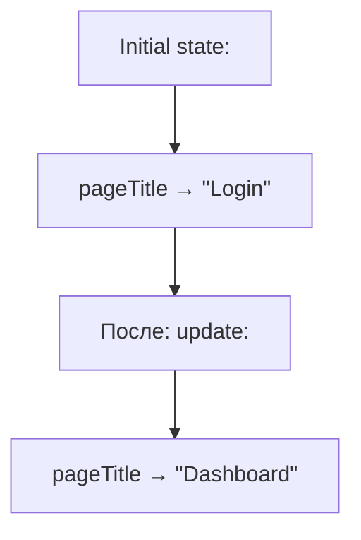

Объяснение:

Identifier остался тем же, но сохраненная информация изменилась.

Распространённая ошибка:

Ожидать, что `pageTitle` хранит оба значения одновременно.

Связь с Automation QA:

Page title может измениться после navigation, и тест должен читать актуальное значение.

## Предскажите вывод перед запуском

### Задача 1

Ответ:

```text
created
finished
```

Memory временная шкала:

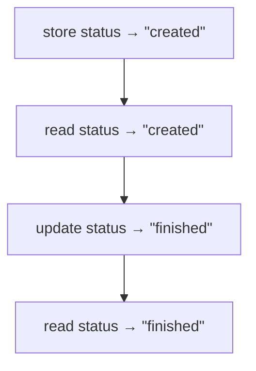

Объяснение:

Второй вывод получает обновленное value.

Распространённая ошибка:

Ожидать два раза `created`.

Связь с Automation QA:

Так часто проявляются ошибки в test состояние, когда status меняется между steps.

### Задача 2

Ответ:

```text
qa-user
```

Memory временная шкала:

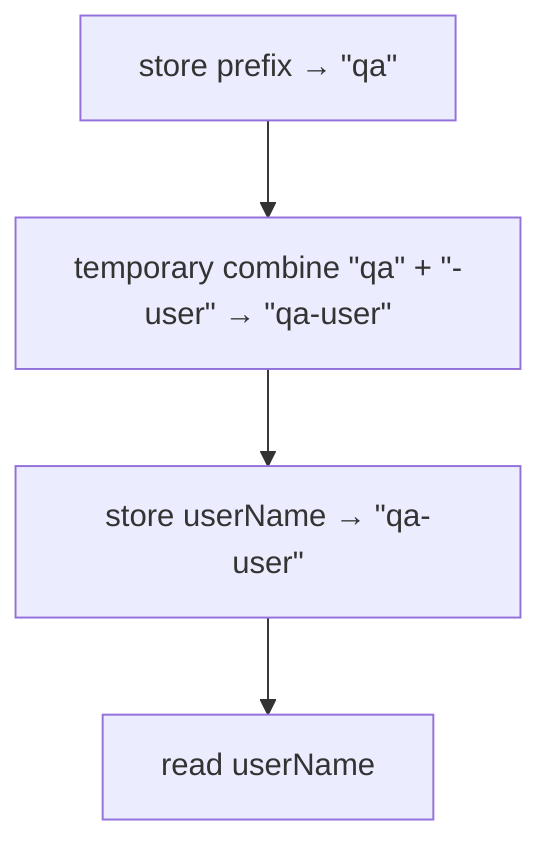

Объяснение:

Промежуточный результат используется для сохранения final value.

Распространённая ошибка:

Не выделить temporary result.

Связь с Automation QA:

Так builders могут собирать test usernames.

### Задача 3

Ответ:

```text
staging
staging
```

Memory временная шкала:

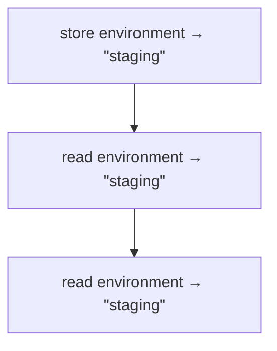

Объяснение:

Value не обновлялось, поэтому оба чтения получают одно и то же.

Распространённая ошибка:

Думать, что после первого чтения value исчезает.

Связь с Automation QA:

Config значения часто читаются много раз в рамках одного запуска.

## Предскажите состояние памяти

Ответ:

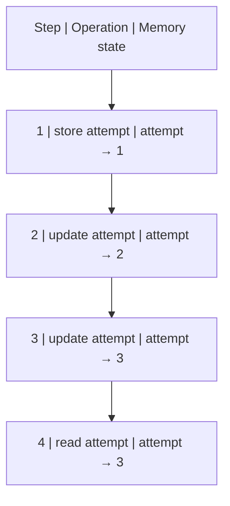

Вывод:

```text
3
```

Объяснение:

Каждый update меняет текущее значение, доступное для следующего read.

Распространённая ошибка:

Думать, что все значения `1`, `2`, `3` одинаково доступны через один identifier.

Связь с Automation QA:

Retry counters и attempt numbers часто обновляются, поэтому важно читать актуальное состояние.

## Чтение кода

Ответ:

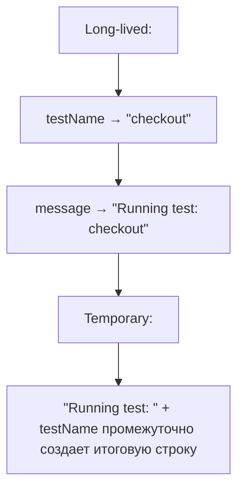

Объяснение:

`testName` читается при создании `message` и позже выводится. `message` сохраняет итоговую строку. Само соединение строк является временным шагом.

Распространённая ошибка:

Считать `message` temporary только потому, что он создан через выражение.

Связь с Automation QA:

В отчетах тестов message может быть сохраненным значением, а сборка строки — временной операцией.

## Небольшие задачи на код

### Задача 1

Один из вариантов:

```javascript
const browserName = 'chromium';

console.log(browserName);
console.log(browserName);
```

Объяснение:

`browserName` сохраняется один раз и читается два раза.

Распространённая ошибка:

Создавать два разных identifiers вместо повторного read.

Связь с Automation QA:

Browser name может использоваться в нескольких местах setup-кода.

### Задача 2

Один из вариантов:

```javascript
let status = 'new';

status = 'done';

console.log(status);
```

Объяснение:

Первый шаг сохраняет начальное value, второй обновляет его, третий читает итоговое состояние.

Распространённая ошибка:

Ожидать вывод `new`.

Связь с Automation QA:

Test status или setup status часто обновляется по мере выполнения сценария.

## Задачи на отладку

### Задача 1

Ответ:

Инженер не учел update.

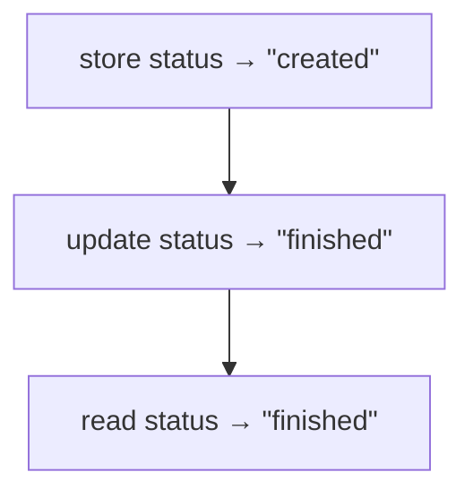

Объяснение:

`console.log` читает текущее сохраненное value, а не первое value, которое когда-либо было связано с identifier.

Распространённая ошибка:

Читать код только сверху и запоминать первое присваивание.

Связь с Automation QA:

Так можно ошибиться при анализе статуса сущности в API-тесте.

### Задача 2

Ответ:

Нужно искать строку update, потому что read только показывает текущее состояние.

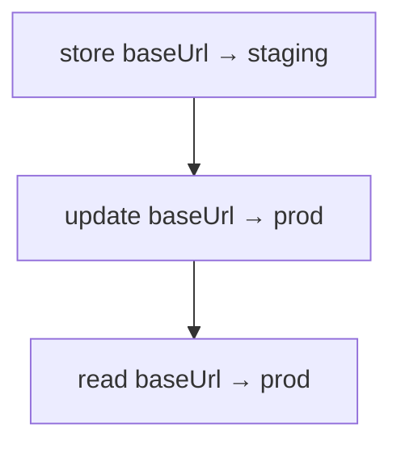

Объяснение:

Ошибка могла появиться раньше, чем неправильный URL был использован.

Распространённая ошибка:

Искать проблему только в строке `console.log` или `page.goto`.

Связь с Automation QA:

В Playwright неправильный `baseUrl` часто проявляется в navigation step, но причина может быть в configuration setup.

## QA-задачи

### Сценарий 1

Ответ:

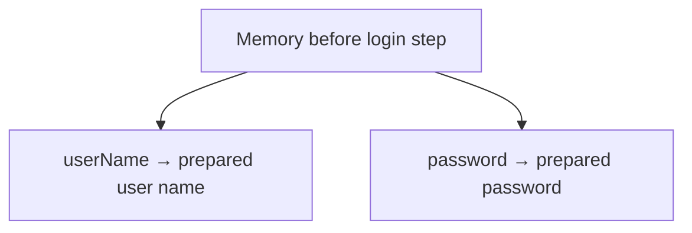

Объяснение:

Login step должен прочитать оба значения, подготовленные раньше.

Распространённая ошибка:

Думать о login step отдельно от preparation step.

Связь с Automation QA:

Так устроены тесты, где данные создаются перед UI-действиями.

### Сценарий 2

Ответ:

Ошибка могла появиться:

* в fixture, где `baseUrl` был сохранен;
* в helper, где `baseUrl` был прочитан;
* в промежуточном update, если значение было изменено;
* в сборке итогового URL.

Stack trace показывает цепочку вызовов, но не заменяет анализ memory состояние.

Таблица:

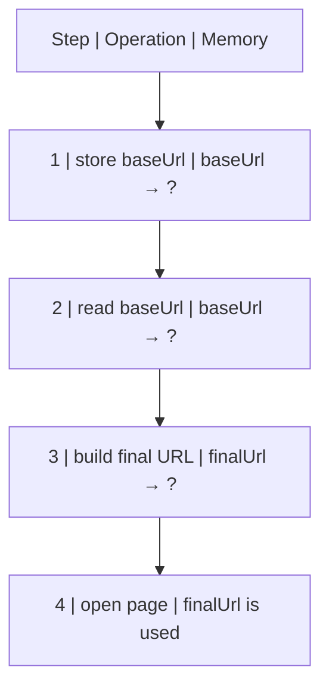

Объяснение:

Чтобы найти причину, нужно понять, где неправильное value появилось впервые.

Распространённая ошибка:

Исправлять Playwright action, хотя ошибка в сохраненном config value.

Связь с Automation QA:

Это типичный debugging flow для `page.goto`, API base URLs и test environments.

### Сценарий 3

Ответ:

До сравнения должны быть доступны:

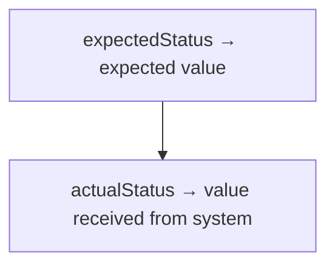

Объяснение:

Assertion не может сравнить значения, если они не были получены или сохранены до проверки.

Распространённая ошибка:

Считать assertion магическим действием, которое само знает expected и actual.

Связь с Automation QA:

Любая проверка API, UI или DB опирается на значения, подготовленные или полученные раньше.

## Мини-проект

Один из вариантов:

```javascript
const baseUrl = 'https://example.com';
const path = '/login';
const loginUrl = baseUrl + path;

console.log(loginUrl);

let status = 'created';

status = 'ready';

console.log(status);
```

Временная шкала:

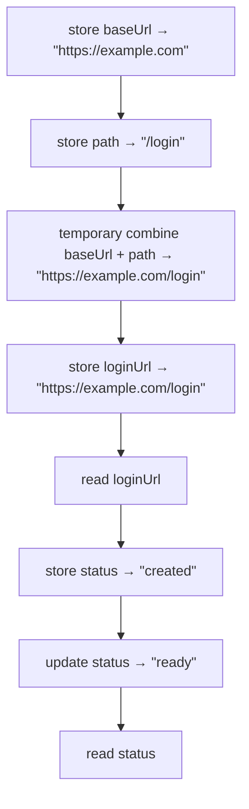

Объяснение:

`baseUrl` и `path` являются сохраненными значения. Соединение строк создает temporary result. `loginUrl` сохраняет итоговый URL. `status` сначала имеет одно value, затем обновляется.

Распространённая ошибка:

Не отличить temporary combine от сохраненного `loginUrl`.

Связь с Automation QA:

Мини-проект повторяет типичную структуру UI/API-теста: base URL, path, final URL, status подготовки.

## Возможные улучшения

После выполнения практики можно:

* добавить рядом с каждым примером таблицу `identifier → current value`;
* взять реальный Playwright-тест и выписать все stored значения;
* отметить строки, где происходит update test состояние;
* вернуться к этой практике перед главой про Variables.
