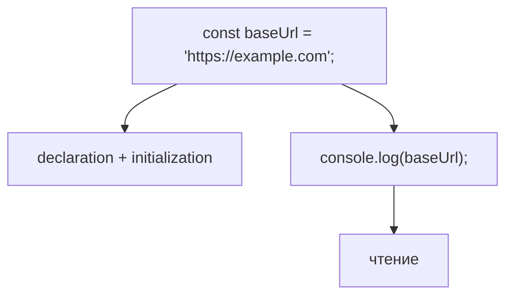
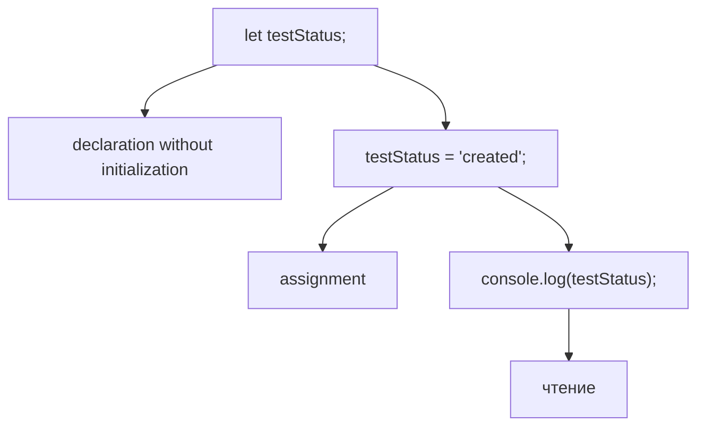
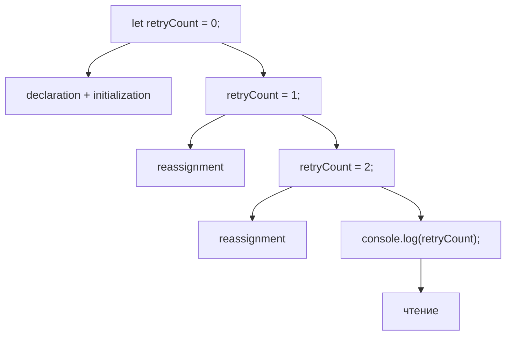
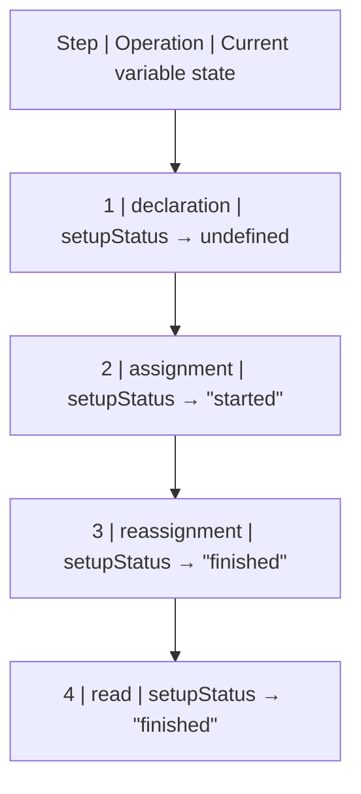
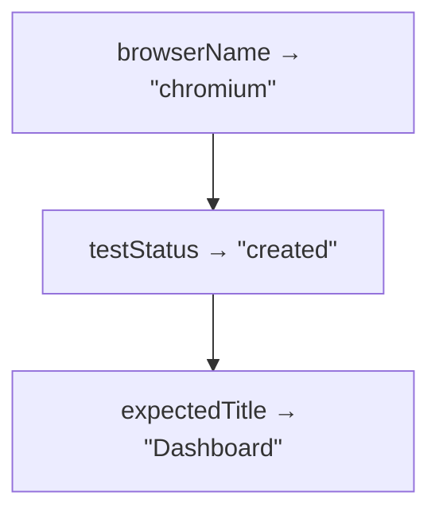
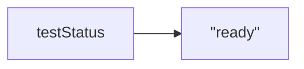
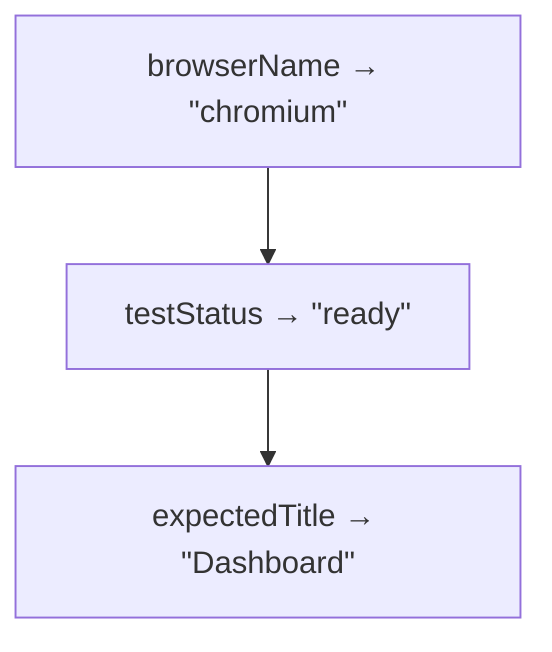
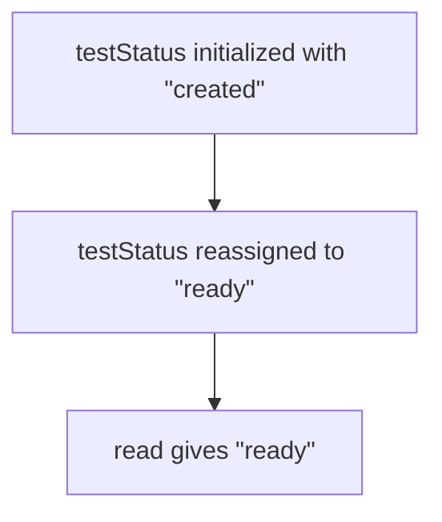
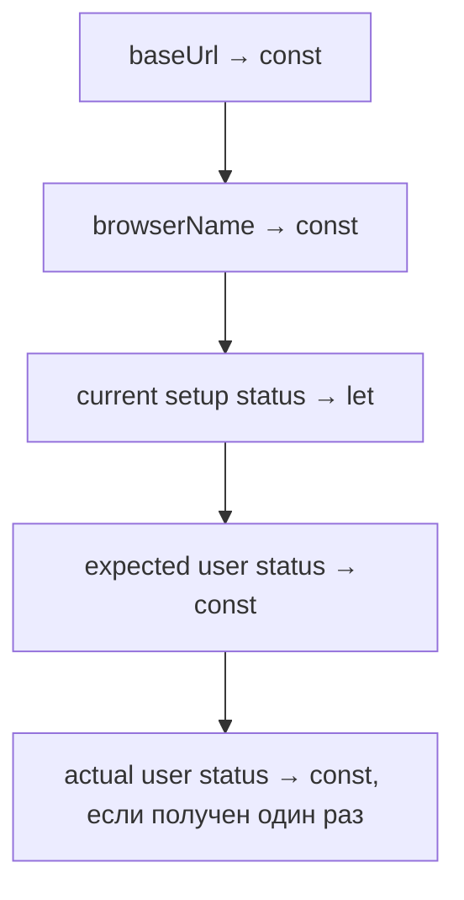
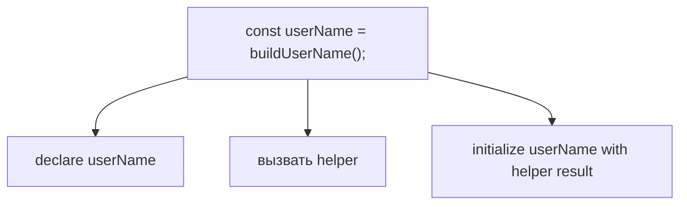

# Решения. Глава 9. Variables

## Концептуальные вопросы

### 1. Почему variables существуют

Ответ:

Variables существуют, чтобы программист мог работать с сохраненной информацией через понятные имена.

Объяснение:

Memory хранит information, но код должен обращаться к ней читаемо. Identifier дает named access.

Распространённая ошибка:

Думать, что variable нужна только для сокращения записи.

Связь с Automation QA:

В тестах variables дают имена configuration, test data, expected и actual значения.

### 2. Почему variable не коробка

Ответ:

Variable лучше понимать как named access к stored information, а не как физическую коробку.

Объяснение:

Модель коробки мешает понять reassignment, `const`, references и будущие темы про objects.

Распространённая ошибка:

Считать, что value физически лежит "внутри variable".

Связь с Automation QA:

При debugging важно понимать, что `baseUrl` — имя доступа к текущей сохраненной информации.

### 3. Identifier

Ответ:

Identifier — имя, которое используется в коде для доступа к информации.

Объяснение:

В `const browserName = 'chromium'` identifier — `browserName`.

Распространённая ошибка:

Путать identifier с value.

Связь с Automation QA:

Хорошие identifiers вроде `expectedStatus` и `actualStatus` делают assertions читаемыми.

### 4. Declaration

Ответ:

Declaration регистрирует identifier.

Объяснение:

`let testStatus;` сообщает engine, что имя `testStatus` существует.

Распространённая ошибка:

Считать declaration записью meaningful value.

Связь с Automation QA:

Declaration без initialization может использоваться для значения, которое появится позже в setup.

### 5. Initialization

Ответ:

Initialization дает initial value при declaration.

Объяснение:

`const baseUrl = 'https://example.com'` одновременно объявляет `baseUrl` и дает ему initial value.

Распространённая ошибка:

Не отличать initialization от later assignment.

Связь с Automation QA:

Большинство stable test data лучше initialized сразу через `const`.

### 6. Assignment

Ответ:

Assignment записывает value в уже существующий named access.

Объяснение:

После `let testStatus;` строка `testStatus = 'created';` является assignment.

Распространённая ошибка:

Называть любое `=` initialization.

Связь с Automation QA:

Fixture может объявить status заранее и assignment-ить его после шага подготовки.

### 7. Reassignment

Ответ:

Reassignment — новое assignment для variable, у которой уже было value.

Объяснение:

`testStatus = 'ready'` после `testStatus = 'created'` заменяет current value.

Распространённая ошибка:

Ожидать, что read вернет старое value.

Связь с Automation QA:

Status сущности в тесте часто меняется: `created → active`.

### 8. Declaration vs assignment

Ответ:

Declaration регистрирует имя. Assignment записывает значение.

Объяснение:

Это разные операции engine: сначала имя должно существовать, затем с ним можно связать value.

Распространённая ошибка:

Считать `let status;` и `status = 'ready';` одинаковыми действиями.

Связь с Automation QA:

При чтении setup-кода важно видеть, где имя создано, а где оно получило данные.

### 9. Declaration without initialization

Ответ:

Это объявление identifier без initial meaningful value.

Объяснение:

`let testStatus;` регистрирует имя, но programmer value еще не предоставлен. Reading дает `undefined`.

Распространённая ошибка:

Ожидать пустую строку или `null`.

Связь с Automation QA:

Если helper возвращает `undefined`, причина может быть в том, что variable была declared, но не получила value.

### 10. Почему `const` initialized сразу

Ответ:

Потому что `const` запрещает reassignment. Если не дать value сразу, его нельзя будет записать позже.

Объяснение:

`const` должен получить initial value в declaration.

Распространённая ошибка:

Писать `const userName;` и планировать assignment позже.

Связь с Automation QA:

Stable test data через `const` должна быть известна в момент объявления.

### 11. Когда уместен `let`

Ответ:

`let` уместен, когда value должно измениться.

Объяснение:

Если status, counter или temporary состояние меняется, `let` честно сообщает о reassignment.

Распространённая ошибка:

Использовать `let` везде по привычке.

Связь с Automation QA:

`let retryCount` или `let setupStatus` читаются как значения, которые будут обновляться.

### 12. Почему `var` не modern default

Ответ:

`var` имеет исторические особенности, а современный код обычно лучше выражает намерение через `const` и `let`.

Объяснение:

`const` показывает отсутствие reassignment, `let` показывает возможность reassignment.

Распространённая ошибка:

Считать `var`, `let`, `const` полными синонимами.

Связь с Automation QA:

В новых Playwright-проектах `const` и `let` улучшают читаемость test code.

## Определите declaration / initialization / assignment

### Фрагмент 1

Ответ:



Объяснение:

`baseUrl` registered и сразу получает initial value.

Распространённая ошибка:

Называть `console.log` assignment.

Связь с Automation QA:

Так обычно хранят stable configuration.

### Фрагмент 2

Ответ:



Объяснение:

Declaration и assignment находятся на разных строках.

Распространённая ошибка:

Считать первую строку initialization.

Связь с Automation QA:

Так может выглядеть setup, где value появляется после отдельного шага.

### Фрагмент 3

Ответ:



Объяснение:

После initial value каждое новое assignment является reassignment.

Распространённая ошибка:

Ожидать, что все прошлые значения читаются через `retryCount`.

Связь с Automation QA:

Retry counters в тестах работают по такой модели.

## Предскажите вывод перед запуском

### Задача 1

Ответ:

```text
undefined
```

Объяснение:

`let testStatus;` declared identifier без programmer-provided value.

Распространённая ошибка:

Ожидать ошибку или пустую строку.

Связь с Automation QA:

`undefined` часто показывает, что test data не была initialized.

### Задача 2

Ответ:

```text
ready
```

Объяснение:

`testStatus` initialized как `'created'`, затем reassignment-ится на `'ready'`.

Распространённая ошибка:

Ожидать `created`.

Связь с Automation QA:

Status после setup может отличаться от initial status.

### Задача 3

Ответ:

```text
https://example.com/login
```

Объяснение:

`baseUrl` и `path` initialized, затем их значения используются для initialization `loginUrl`.

Распространённая ошибка:

Не заметить, что `loginUrl` хранит результат выражения.

Связь с Automation QA:

Так часто собирается URL для `page.goto` или API request.

## Предскажите состояние переменной

Ответ:



Вывод:

```text
finished
```

Объяснение:

Read получает current value после последнего reassignment.

Распространённая ошибка:

Записать `started` как итоговое значение.

Связь с Automation QA:

Setup status в fixture может меняться до того, как тест начнет основной сценарий.

## Чтение кода

Ответ:

Identifiers:

```text
browserName
testStatus
expectedTitle
```

Initialized сразу:



Переназначение:



Values в конце:



Объяснение:

Только `testStatus` меняется после initialization.

Распространённая ошибка:

Считать `expectedTitle` изменяемым только потому, что он выводится позже.

Связь с Automation QA:

Так можно анализировать readable test setup перед assertions.

## Задачи на отладку

### Задача 1

Ответ:

Инженер не учел reassignment.



Объяснение:

`console.log` читает current value.

Распространённая ошибка:

Запомнить первое value и игнорировать дальнейшие assignments.

Связь с Automation QA:

При падении проверки нужно смотреть все updates test состояние до assertion.

### Задача 2

Ответ:

`const` должен быть initialized в момент declaration.

Объяснение:

Later assignment для `const` невозможен, потому что `const` запрещает reassignment.

Распространённая ошибка:

Использовать `const` как `let`, но "более строго".

Связь с Automation QA:

Если value появится только после async setup или helper call, нужно объявлять `const` там, где value уже доступно, или использовать другой дизайн.

### Задача 3

Ответ:

Лучше `const`, потому что `baseUrl` не меняется.

Объяснение:

`let` сообщает читателю, что reassignment возможен и ожидаем.

Распространённая ошибка:

Использовать `let` по умолчанию.

Связь с Automation QA:

Configuration значения должны выглядеть стабильными, если тест не должен их менять.

## QA-задачи

### Сценарий 1

Ответ:



Объяснение:

Configuration и expected значения обычно не reassignment-ятся. Setup status меняется по ходу подготовки. Actual status может быть `const`, если он получен один раз и дальше только читается.

Распространённая ошибка:

Использовать `let` для всего test data.

Связь с Automation QA:

Хороший выбор keyword делает тестовый сценарий легче читать.

### Сценарий 2

Ответ:

Для `userName` происходит declaration + initialization.



Объяснение:

Результат helper получает readable name.

Распространённая ошибка:

Считать, что `userName` initialized до вызова helper.

Связь с Automation QA:

Так test data builders передают результаты в тест.

### Сценарий 3

Ответ:

Лучше `let`.

```javascript
let status = 'created';

status = 'active';
```

Объяснение:

Status должен измениться, значит reassignment является частью сценария.

Распространённая ошибка:

Использовать `const` и потом пытаться изменить status.

Связь с Automation QA:

Lifecycle сущностей в API/UI тестах часто требует явного изменения status.

## Мини-проект

Один из вариантов:

```javascript
const baseUrl = 'https://example.com';
const browserName = 'chromium';
let testStatus = 'created';

testStatus = 'ready';

const expectedStatus = 'ready';
const actualStatus = testStatus;

console.log(baseUrl);
console.log(browserName);
console.log(testStatus);
console.log(expectedStatus);
console.log(actualStatus);
```

Таблица:

```text
Identifier     | Keyword | Initial value           | Reassignment? | Why this keyword?
baseUrl        | const   | "https://example.com"   | no            | configuration is stable
browserName    | const   | "chromium"              | no            | configuration is stable
testStatus     | let     | "created"               | yes           | status changes
expectedStatus | const   | "ready"                 | no            | expected value is stable
actualStatus   | const   | current testStatus      | no            | captured once for comparison
```

Объяснение:

`const` используется там, где named access не должен reassignment-иться. `let` используется для changing состояние.

Распространённая ошибка:

Использовать `let` для `baseUrl`, `browserName`, `expectedStatus` и `actualStatus` без причины.

Связь с Automation QA:

Мини-проект повторяет структуру реального теста: configuration, changing setup состояние, expected и actual значения.

## Возможные улучшения

После выполнения практики можно:

* пройти по своему Playwright-тесту и заменить лишние `let` на `const`;
* выписать все reassignment в одном тесте;
* проверить, помогают ли identifiers понять сценарий без комментариев;
* вернуться к этой главе перед изучением Scope.
