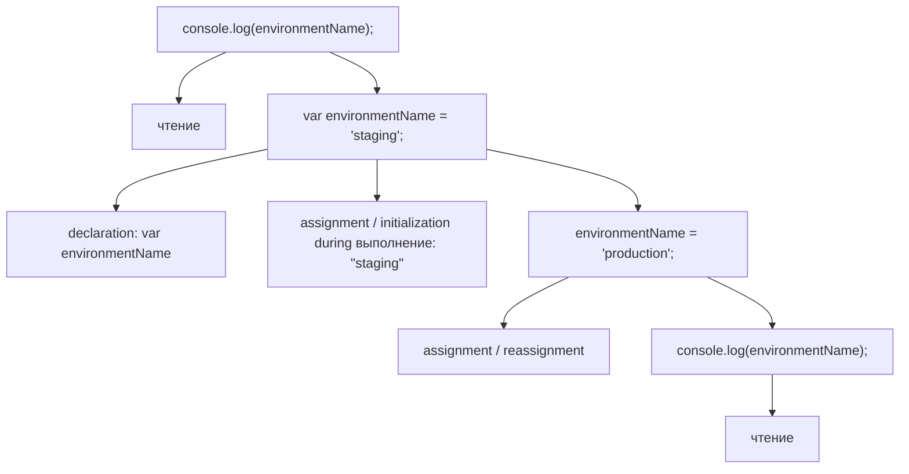
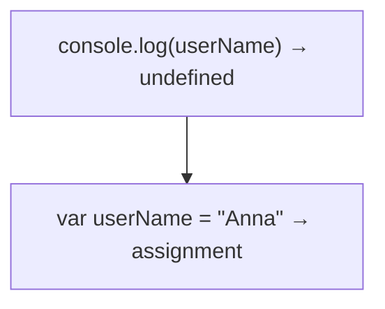
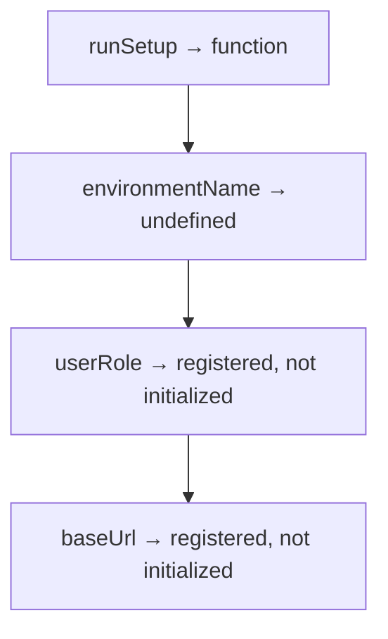
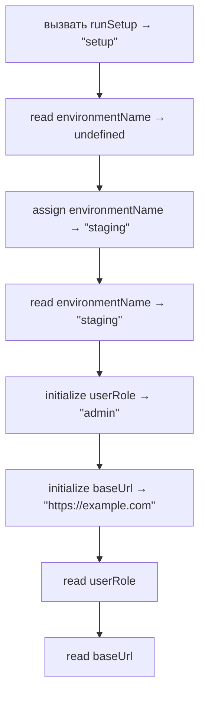

# Решения. Глава 12. Hoisting

## Концептуальные вопросы

### 1. Почему Hoisting существует

Ответ:

Hoisting существует как observable result того, что engine prepares declarations during Creation Phase.

Объяснение:

Execution начинается не сразу. Сначала engine prepares Lexical Environment and Environment Records.

Распространённая ошибка:

Думать, что Hoisting — отдельный механизм переноса строк.

Связь с Automation QA:

Это помогает читать old helpers and framework code without myths.

### 2. Почему code does not move upward

Ответ:

Source code сохраняет исходный порядок. Engine только подготавливает declaration records до выполнения.

Объяснение:

Execution Phase runs lines in source order.

Распространённая ошибка:

Рисовать переписанный source file as if engine changed it.

Связь с Automation QA:

При debugging старого JS важно анализировать preparation, not imaginary rewritten code.

### 3. Creation Phase

Ответ:

During Creation Phase engine creates Execution Context, prepares Lexical Environment and registers declarations.

Объяснение:

Это происходит до начала выполнения строк кода.

Распространённая ошибка:

Считать, что все identifiers появляются только тогда, когда выполнение доходит до их строк.

Связь с Automation QA:

Explains why function declarations in old test framework can be used early.

### 4. Execution Phase

Ответ:

Во время Execution Phase engine выполняет source code в исходном порядке.

Объяснение:

Reads, assignments and calls happen as execution reaches corresponding lines.

Распространённая ошибка:

Смешивать preparation with actual assignment.

Связь с Automation QA:

Helps debug why config variable is `undefined` before assignment line.

### 5. Function declaration registration

Ответ:

Function declaration registered as callable binding during Creation Phase.

Объяснение:

That is why it can be called before its source line.

Распространённая ошибка:

Думать, что тело функции переместилось вверх.

Связь с Automation QA:

Старые framework helpers часто используют объявления до их физического расположения.

### 6. var registration

Ответ:

`var` identifier registered with `undefined` during Creation Phase.

Объяснение:

Assignment happens later during Execution Phase.

Распространённая ошибка:

Expecting assigned value before assignment line.

Связь с Automation QA:

Old Node.js helpers may print `undefined` for config variables.

### 7. let registration

Ответ:

Identifier, объявленный через `let`, регистрируется во время Creation Phase, но не инициализируется так, как `var`.

Объяснение:

Доступ до initialization ограничен; TDZ объясняет это в следующей главе.

Распространённая ошибка:

Говорить `let is not hoisted` и пропускать важную часть модели.

Связь с Automation QA:

Современный test code активно использует `let` и `const`; понимание timing предотвращает неверные объяснения ошибок.

### 8. const registration

Ответ:

`const` identifier registered during Creation Phase and initialized when execution reaches declaration line.

Объяснение:

`const` also must receive value at declaration.

Распространённая ошибка:

Expecting `const` to behave like `var`.

Связь с Automation QA:

Stable test data with `const` is safe after declaration, not before.

### 9. Declaration vs initialization

Ответ:

Declaration registers identifier. Initialization gives first meaningful value.

Объяснение:

Hoisting mostly concerns declaration preparation, not moving initialization upward.

Распространённая ошибка:

Treating `var a = 5` as one preparation step with value `5`.

Связь с Automation QA:

Отладка setup-значений требует понимать, выполнилось ли присваивание.

### 10. Почему `var a = 5` does not expose `5` before line

Ответ:

Creation Phase prepares `a` with `undefined`; assignment `a = 5` happens only during Execution Phase.

Объяснение:

Значение `5` не присваивается, пока выполнение не дойдёт до исходной строки.

Распространённая ошибка:

Думать, что вся инструкция поднимается.

Связь с Automation QA:

Old helper variables can exist but still have no configured value yet.

### 11. Почему TDZ next

Ответ:

TDZ explains why `let` and `const` are registered but cannot be accessed before initialization.

Объяснение:

Hoisting даёт модель подготовки; TDZ объясняет ограничения доступа.

Распространённая ошибка:

Trying to solve all `let`/`const` поведение in Hoisting chapter.

Связь с Automation QA:

Helps read modern Playwright code errors accurately.

### 12. Hoisting and Lexical Environment

Ответ:

Hoisting is related to how declarations affect Environment Records during Creation Phase.

Объяснение:

Lexical Environment provides the place where identifier records are prepared.

Распространённая ошибка:

Explaining Hoisting without Environment Records.

Связь с Automation QA:

Good mental model prevents false debugging stories in JS/TS test projects.

## Предскажите вывод

### Задача 1

Ответ:

```text
ready
```

Объяснение:

Function declaration registered as callable before Execution Phase.

Распространённая ошибка:

Expect ReferenceError because function appears later.

Связь с Automation QA:

Legacy setup helpers may work this way.

### Задача 2

Ответ:

```text
undefined
Anna
```

Объяснение:

Creation Phase registers `userName` with `undefined`; assignment happens later.

Распространённая ошибка:

Expect `Anna` in first вывод.

Связь с Automation QA:

Explains old config helper поведение.

### Задача 3

Ответ:

```text
undefined
ready
```

Объяснение:

`testStatus` starts as `undefined`, then assignment to `'created'`, then reassignment to `'ready'`.

Распространённая ошибка:

Ignore reassignment to ready.

Связь с Automation QA:

Status variables in setup can change before assertion.

### Задача 4

Ответ:

With first line commented:

```text
https://example.com
```

If uncommented, access before initialization fails. The next chapter explains this as TDZ.

Объяснение:

`const` is initialized only when execution reaches declaration line.

Распространённая ошибка:

Expect `undefined` like `var`.

Связь с Automation QA:

Modern config constants are safe only after declaration.

## Определите Creation Phase

Ответ:

```text
Identifier | Declaration kind      | Creation Phase state
runTest    | function declaration  | registered as callable function
userName   | var                   | registered with undefined
userRole   | let                   | registered, not initialized
baseUrl    | const                 | registered, not initialized
```

Объяснение:

Creation Phase prepares records before execution starts.

Распространённая ошибка:

Put assigned значения `Anna`, `admin`, URL into Creation Phase for all declarations.

Связь с Automation QA:

This table is a practical way to read old JavaScript setup files.

## Определите declaration vs initialization

Ответ:



Объяснение:

Declaration part affects Creation Phase; assignments run during Execution Phase.

Распространённая ошибка:

Treat full `var environmentName = 'staging'` as Creation Phase value.

Связь с Automation QA:

Useful for debugging env variables in legacy test helpers.

## Задачи на отладку

### Задача 1

Ответ:

Engine did not rewrite source code. It registered `userName` during Creation Phase.

Объяснение:

Execution still runs `console.log` before assignment line, so it reads prepared `undefined`.

Распространённая ошибка:

Draw `var userName` line above `console.log` as changed source.

Связь с Automation QA:

Avoids wrong explanations in code reviews.

### Задача 2

Ответ:

Creation Phase:


Execution Phase:



Объяснение:

Assigned value does not exist at first read.

Распространённая ошибка:

Confuse declaration preparation with assignment.

Связь с Automation QA:

Same pattern can hide bugs in old setup code.

### Задача 3

Ответ:

Точнее говорить так: `let` и `const` регистрируются во время Creation Phase, но не инициализируются до строки объявления.

Объяснение:

Доступ до initialization ограничен TDZ.

Распространённая ошибка:

Сказать "not hoisted" и не объяснить, почему engine уже знает identifier.

Связь с Automation QA:

Ошибки современного JavaScript становятся проще для объяснения.

## QA-задачи

### Сценарий 1

Ответ:

It works because `setupTest` function declaration is registered as callable during Creation Phase.

Объяснение:

Execution can call it before source line.

Распространённая ошибка:

Think framework rewrites helper order.

Связь с Automation QA:

Common in legacy framework files.

### Сценарий 2

Ответ:

Ожидаемый вывод:

```text
undefined
```

Объяснение:

`configName` registered with `undefined`; assignment to `'local'` happens after first read.

Распространённая ошибка:

Expect `local`.

Связь с Automation QA:

Useful for debugging old Node.js helper configuration.

### Сценарий 3

Ответ:

1. In new code, do not intentionally rely on Hoisting for readability.
2. Declaring helpers before usage makes execution easier to read.
3. Hoisting still matters for reading existing JavaScript and debugging старых helper-файлов.

Объяснение:

Understanding a mechanism is not the same as using it as style.

Распространённая ошибка:

Use Hoisting tricks to show language knowledge.

Связь с Automation QA:

Test code should optimize for clear scenario reading.

## Мини-проект

Один из вариантов:

```javascript
runSetup();

console.log(environmentName);

var environmentName = 'staging';

console.log(environmentName);

let userRole = 'admin';
const baseUrl = 'https://example.com';

console.log(userRole);
console.log(baseUrl);

function runSetup() {
  console.log('setup');
}
```

Creation Phase:



Execution Phase:



Объяснение:

The вывод follows prepared records and original source order.

Распространённая ошибка:

Move all declarations to top mentally and assign значения too early.

Связь с Automation QA:

This mirrors old setup files with mixed function declarations, `var`, `let`, and `const`.

## Возможные улучшения

После выполнения практики можно:

* взять один old helper file and mark Creation Phase records;
* заменить confusing `var` usage in new code with `let` / `const`;
* rewrite examples so code order is easier to read;
* return to this chapter before Temporal Dead Zone.
