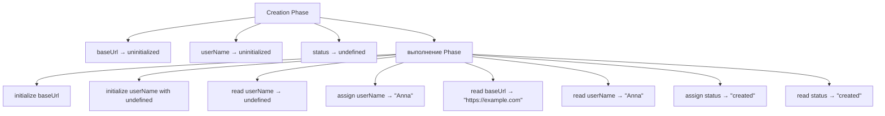

# Решения. Глава 13. Temporal Dead Zone

## Концептуальные вопросы

### 1. Что такое TDZ

Ответ:

Temporal Dead Zone — период от начала scope до initialization `let` или `const`, когда identifier registered, но access forbidden.

Объяснение:

Engine уже знает identifier, но он еще not initialized.

Распространённая ошибка:

Считать TDZ физическим местом в памяти.

Связь с Automation QA:

Помогает читать ReferenceError in helper files.

### 2. Почему TDZ существует

Ответ:

TDZ prevents reading `let` and `const` before meaningful initialization.

Объяснение:

Instead of silently returning `undefined`, code fails loudly.

Распространённая ошибка:

Считать TDZ случайной странностью `let`.

Связь с Automation QA:

Ошибки declaration order в тестах становятся заметнее.

### 3. Почему не "not hoisted"

Ответ:

`let` and `const` are registered during Creation Phase, but not initialized.

Объяснение:

Они hoisted in the sense of registration, but access is forbidden before initialization.

Распространённая ошибка:

Объяснять поведение отсутствием registration.

Связь с Automation QA:

Точная формулировка помогает в code review and debugging.

### 4. Registration

Ответ:

Registration — создание identifier record in Environment Record.

Объяснение:

This happens during Creation Phase.

Распространённая ошибка:

Путать registration with initialization.

Связь с Automation QA:

Explains why engine can report identifier name in TDZ error.

### 5. Initialization

Ответ:

Initialization — момент, когда identifier получает first usable value.

Объяснение:

Для `let user;`, initialization happens when declaration line executes, with value `undefined`.

Распространённая ошибка:

Думать, что initialization always means non-undefined value.

Связь с Automation QA:

Helps understand unset helper variables.

### 6. When TDZ begins

Ответ:

TDZ begins when scope starts and identifier is registered uninitialized.

Объяснение:

For block `let/const`, TDZ begins when block scope is entered.

Распространённая ошибка:

Считать TDZ начинающейся только на line before declaration.

Связь с Automation QA:

Block-level assertion data follows this rule.

### 7. When TDZ ends

Ответ:

TDZ ends when execution reaches declaration line and initialization happens.

Объяснение:

After initialization, access becomes allowed.

Распространённая ошибка:

Считать, что TDZ ends only after assigning non-empty value.

Связь с Automation QA:

`let value;` is readable after declaration, even if value is `undefined`.

### 8. TDZ for let

Ответ:

`let` is registered during Creation Phase, remains uninitialized during TDZ, and initializes at declaration line.

Объяснение:

`let user;` initializes with `undefined`; `let user = 'Anna'` initializes with `'Anna'`.

Распространённая ошибка:

Expect `let` to behave like `var`.

Связь с Automation QA:

Useful for setup variables that receive value later.

### 9. TDZ for const

Ответ:

`const` is registered during Creation Phase and initialized at declaration line with required value.

Объяснение:

`const` cannot be declared without initialization.

Распространённая ошибка:

Attempt to declare `const` first and assign later.

Связь с Automation QA:

Stable configuration should be declared before use.

### 10. Почему var behaves differently

Ответ:

`var` is initialized with `undefined` during Creation Phase.

Объяснение:

So it can be read before assignment line.

Распространённая ошибка:

Thinking `var` is safer because it does not throw.

Связь с Automation QA:

`undefined` can hide declaration order bugs in old tests.

### 11. ReferenceError before initialization

Ответ:

Это ошибка access to registered but uninitialized identifier.

Объяснение:

Engine knows the identifier but refuses access while it is in TDZ.

Распространённая ошибка:

Thinking identifier is missing.

Связь с Automation QA:

Error message tells you to check declaration order.

### 12. TDZ ReferenceError vs missing identifier

Ответ:

TDZ ReferenceError: identifier exists but is uninitialized. Missing identifier: lookup cannot find identifier.

Объяснение:

Оба случая могут дать ReferenceError, но состояния отличаются.

Распространённая ошибка:

Debug both cases the same way.

Связь с Automation QA:

TDZ suggests reorder declarations; missing identifier suggests wrong name/import/scope.

## Определите TDZ

### Фрагмент 1

Ответ:

TDZ starts at beginning of scope and ends at `let userName = 'Anna';`.

Объяснение:

After declaration line, `userName` initialized and readable.

Распространённая ошибка:

Say `userName` does not exist before declaration.

Связь с Automation QA:

Same pattern happens in helper-local variables.

### Фрагмент 2

Ответ:

TDZ for `status` starts when block is entered and ends at `const status = 'active';`.

Объяснение:

Block scope controls TDZ for block-level `const`.

Распространённая ошибка:

Start TDZ at global scope вместо block scope.

Связь с Automation QA:

Useful for block-scoped assertion значения.

### Фрагмент 3

Ответ:

TDZ starts at scope beginning and ends at `let retryCount;`.

Объяснение:

Declaration without assigned value still initializes with `undefined`.

Распространённая ошибка:

Think TDZ continues because no meaningful value assigned.

Связь с Automation QA:

Retry counters can be declared first and assigned later.

## Предскажите вывод

### Задача 1

Ответ:

```text
undefined
Anna
```

Объяснение:

`let userName;` ends TDZ and initializes with `undefined`; later assignment gives `'Anna'`.

Распространённая ошибка:

Expect ReferenceError after `let userName;`.

Связь с Automation QA:

Setup variables can be intentionally initialized before later assignment.

### Задача 2

Ответ:

```text
undefined
created
```

Объяснение:

`var status` initialized with `undefined` during Creation Phase; assignment happens later.

Распространённая ошибка:

Expect ReferenceError like `let`.

Связь с Automation QA:

Legacy code can silently continue with `undefined`.

### Задача 3

Ответ:

With first line commented:

```text
https://example.com
```

If uncommented:

```text
ReferenceError before initialization
```

Объяснение:

`const baseUrl` is in TDZ before declaration line.

Распространённая ошибка:

Expect undefined.

Связь с Automation QA:

Config constants must be declared before building derived URLs.

## Определите identifier состояние

Ответ:

```text
Line | Identifier | State
1    | userName   | registered, uninitialized, TDZ
3    | userName   | initialized, readable
4    | role       | initialized, readable after line
5    | status     | was undefined before line, assigned "created" on line
7    | userName   | readable
8    | role       | readable
9    | status     | readable
```

Объяснение:

Creation Phase подготавливает все записи, но состояния отличаются.

Распространённая ошибка:

Mark `userName` as missing before line 3.

Связь с Automation QA:

State table helps debug ReferenceError in setup code.

## Задачи на отладку

### Задача 1

Ответ:

Engine knows `baseUrl`; it is registered in Environment Record. Error means access happened before initialization.

Объяснение:

TDZ ReferenceError is about состояние, not absence.

Распространённая ошибка:

Search for misspelling only, ignoring declaration order.

Связь с Automation QA:

In helper files, check whether derived constants are declared before dependencies.

### Задача 2

Ответ:

Ошибка: `loginUrl` reads `baseUrl` while `baseUrl` is in TDZ.

Исправленный вариант:

```javascript
const baseUrl = 'https://example.com';
const loginUrl = baseUrl + '/login';
```

Объяснение:

Dependency must be initialized before derived value.

Распространённая ошибка:

Think `const baseUrl` will be available because it appears later in file.

Связь с Automation QA:

Распространённая ошибка в Playwright URL builders.

### Задача 3

Ответ:

Точнее:

```text
let and const are registered during Creation Phase,
but access before initialization is forbidden.
```

Объяснение:

This preserves Hoisting model and explains TDZ.

Распространённая ошибка:

Use shortcut that contradicts Lexical Environment model.

Связь с Automation QA:

Precise language improves team debugging and mentoring.

## QA-задачи

### Сценарий 1

Ответ:

Helper падает because `loginUrl` tries to read `baseUrl` before `baseUrl` initialization.

Исправленный вариант:

```javascript
const baseUrl = 'https://example.com';
const loginUrl = baseUrl + '/login';
```

Объяснение:

`baseUrl` is registered but in TDZ until declaration line executes.

Распространённая ошибка:

Blame string concatenation вместо declaration order.

Связь с Automation QA:

URL builders should declare base config before derived URLs.

### Сценарий 2

Ответ:

Вывод:

```text
undefined
```

This can hide a bug because test continues with missing expected value.

Объяснение:

`var` is readable before assignment.

Распространённая ошибка:

Treat undefined as valid expected status.

Связь с Automation QA:

Modern tests prefer `const` to fail earlier on ordering mistakes.

### Сценарий 3

Ответ:

TDZ makes reads before initialization fail loudly. This helps find declaration order mistakes вместо silently using `undefined`.

Объяснение:

`const` also communicates that value should not be reassigned.

Распространённая ошибка:

Use `var` to avoid ReferenceError, hiding real issue.

Связь с Automation QA:

Fail-fast поведение is valuable in Playwright setup and helpers.

## Мини-проект

Один из вариантов:

```javascript
const baseUrl = 'https://example.com';
let userName;

console.log(userName);

userName = 'Anna';

console.log(baseUrl);
console.log(userName);

var status = 'created';

console.log(status);
```

Временная шкала:



Объяснение:

`baseUrl` и `userName` находятся в TDZ до своих строк объявления, но все чтения в этом проекте происходят после initialization.

Распространённая ошибка:

Put `console.log(baseUrl)` before `const baseUrl`.

Связь с Automation QA:

This mirrors test setup: config first, mutable setup value second, status after action.

## Возможные улучшения

После выполнения практики можно:

* inspect helper files for derived constants before dependencies;
* replace `var` with `let` / `const` in new code where appropriate;
* add declaration-order checklist to code review;
* revisit Hoisting and Lexical Environment if TDZ feels mysterious.
