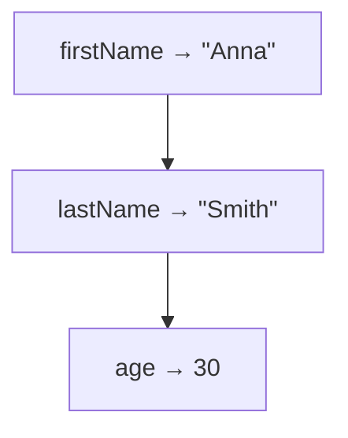
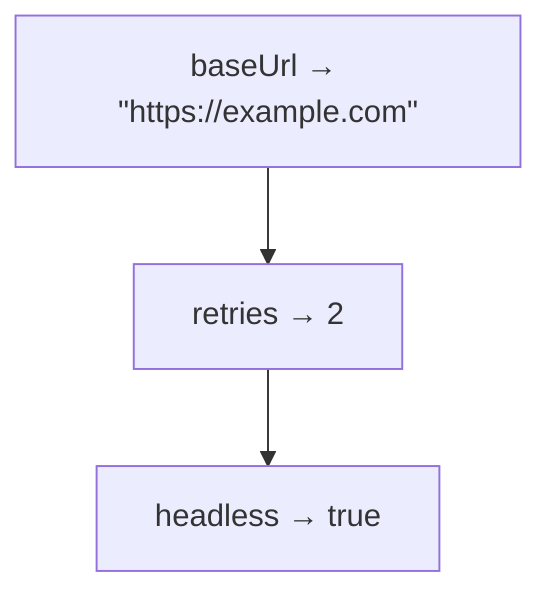
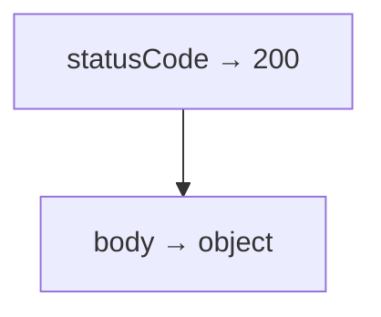
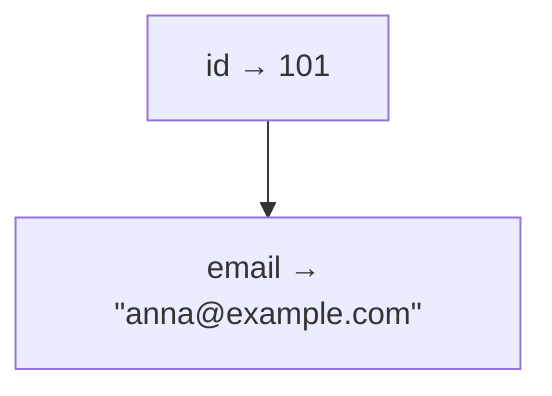

# Решения. Глава 15. Object Type

## Концептуальные вопросы

### 1. Почему primitive значения sometimes become insufficient

Ответ:

Primitive значения become insufficient when several значения describe one entity and should be managed together.

Объяснение:

`'Anna'`, `'Smith'`, `30` and `true` are useful separately, but in many programs they belong to one user. Object makes this relationship explicit.

Распространённая ошибка:

Keep related значения in separate variables and rely on reader's memory.

Связь с Automation QA:

API responses, test data and expected results usually describe entities, not isolated значения.

### 2. Какую проблему решает Object Type

Ответ:

Object Type allows JavaScript to represent grouped information as one value.

Объяснение:

Instead of many unrelated primitive значения, object can express one user, one config, one response, one test result.

Распространённая ошибка:

Think object is only syntax convenience.

Связь с Automation QA:

Objects make expected and actual structures visible in tests.

### 3. Object groups related information

Ответ:

Это означает, что несколько свойств относятся к одной концептуальной сущности.

Объяснение:

In `user`, properties like `firstName`, `lastName` and `age` describe the same user.

Распространённая ошибка:

Group значения that are not conceptually related.

Связь с Automation QA:

Good test data objects reflect real domain entities: user, order, session, config.

### 4. Что такое property

Ответ:

Property is one named piece of information inside object.

Объяснение:

It consists of property name and property value.

Распространённая ошибка:

Call every property a variable.

Связь с Automation QA:

Assertions often check object properties from API responses.

### 5. Property name vs property value

Ответ:

Property name is the name used to access information. Property value is the actual value under that name.

Объяснение:

In `firstName: 'Anna'`, `firstName` is property name, `'Anna'` is property value.

Распространённая ошибка:

Compare property names вместо значения or use wrong property name.

Связь с Automation QA:

Wrong property name in test leads to `undefined` and failed checks.

### 6. `user` and `firstName`

Ответ:

`user` is variable identifier. `firstName` is property name inside object.

Объяснение:

`user` gives access to whole object value. `firstName` names one piece of information inside that object.

Распространённая ошибка:

Treat object property names as standalone variables.

Связь с Automation QA:

In assertions, `response.user.email` is a chain of object property reads, not separate variables.

### 7. Reading existing property

Ответ:

Engine finds property name inside object and returns the corresponding property value.

Объяснение:

Для `user.firstName`, engine reads object `user`, then reads property `firstName`.

Распространённая ошибка:

Think reading one property reads or copies the entire object.

Связь с Automation QA:

Most API checks read specific поля from a response object.

### 8. Reading missing property

Ответ:

At this level, reading missing property returns `undefined`.

Объяснение:

If object has no property with requested name, there is no value under that property name.

Распространённая ошибка:

Assume object is broken or that JavaScript will guess a similar property name.

Связь с Automation QA:

`undefined` in a test often means a typo or unexpected response structure.

### 9. Updating property

Ответ:

Updating property changes value under an existing property name.

Объяснение:

`user.age = 31` keeps property name `age`, but property value becomes `31`.

Распространённая ошибка:

Confuse property update with identifier reassignment.

Связь с Automation QA:

Tests often update test data before sending it to API or helpers.

### 10. Adding property

Ответ:

Adding property puts new named information into object.

Объяснение:

If `role` did not exist, `user.role = 'admin'` expands object shape.

Распространённая ошибка:

Add properties in many distant lines and make expected shape hard to see.

Связь с Automation QA:

Explicit object shapes make test data easier to review.

### 11. Deleting property

Ответ:

At a high level, deleting property removes it from object.

Объяснение:

After `delete user.temporaryCode`, reading `user.temporaryCode` returns `undefined`.

Распространённая ошибка:

Explain deletion through Garbage Collector too early.

Связь с Automation QA:

Tests may remove temporary поля before comparing sanitized objects.

### 12. Nested object

Ответ:

Nested object is useful when grouped information contains smaller groups.

Объяснение:

User may contain `profile`, `status`, `settings`. Each group has its own properties.

Распространённая ошибка:

Flatten everything into one large object with unclear property names.

Связь с Automation QA:

API responses often contain nested objects.

### 13. `const` and object properties

Ответ:

`const` prevents reassignment of identifier, but object properties can still be updated.

Объяснение:

`const user = {}` protects `user` as identifier. It does not freeze object shape. References explain the internal reason later.

Распространённая ошибка:

Think `const` makes object immutable.

Связь с Automation QA:

Playwright and test code often use `const` for objects whose properties may still be prepared or adjusted.

### 14. Arrays and functions

Ответ:

Arrays and functions are object значения, but they have special поведение and need dedicated chapters.

Объяснение:

Эта глава фокусируется на обычном object как сгруппированной информации.

Распространённая ошибка:

Mix objects, arrays and functions before understanding properties.

Связь с Automation QA:

Tests use arrays for lists and functions for helpers, but object shape is the base for reading structured data.

## Определите properties

### Задача 1

Ответ:

Object name: `user`.

Свойства:



Сгруппированная информация:

```text
Basic information about one user.
```

Объяснение:

All properties describe the same user entity.

Распространённая ошибка:

Call `firstName`, `lastName`, `age` separate variables.

Связь с Automation QA:

This shape can be used as expected user profile.

### Задача 2

Ответ:

Object name: `config`.

Свойства:



Сгруппированная информация:

```text
Runtime or test execution configuration.
```

Объяснение:

Эти значения относятся к одному configuration object.

Распространённая ошибка:

Spread configuration across unrelated variables.

Связь с Automation QA:

Test frameworks commonly use configuration objects.

### Задача 3

Ответ:

Object name: `response`.

Свойства:



Nested `body` properties:



Сгруппированная информация:

```text
Response metadata and response body.
```

Объяснение:

`body` is nested grouped information inside response.

Распространённая ошибка:

Miss nested structure and try to read `response.email`.

Связь с Automation QA:

API tests often distinguish response status and response body.

## Read object значения

Ответ:

Вывод:

```text
Anna
Smith
admin
true
```

Объяснение:

`user.profile.firstName` reads `user`, then `profile`, then `firstName`. The other lines follow the same nested property reading model.

Распространённая ошибка:

Try to read `user.firstName`, although `firstName` is inside `profile`.

Связь с Automation QA:

Nested API response assertions require correct property path.

## Предскажите вывод перед запуском

### Задача 1

Ответ:

```text
Anna
31
admin
```

Объяснение:

`age` is updated from `30` to `31`. `role` is added as new property.

Распространённая ошибка:

Think `const user` prevents `user.age = 31`.

Связь с Automation QA:

Test data objects may be updated before assertion or request.

### Задача 2

Ответ:

```text
Anna
undefined
```

Объяснение:

`temporaryCode` is removed from object. Reading a missing property returns `undefined` at this level.

Распространённая ошибка:

Expect deleted property to keep old value.

Связь с Automation QA:

After sanitizing response objects, removed поля should not be used in assertions.

### Задача 3

Ответ:

```text
Anna
undefined
```

Объяснение:

Object has property `firstName`, not `firstname`. Property names are case-sensitive.

Распространённая ошибка:

Miss case difference in property names.

Связь с Automation QA:

API поле names are exact. `userId`, `userid` and `userID` are different names.

## Чтение кода

Ответ:

1. `expectedUser` represents one expected user entity.
2. Identity properties: `id`, `profile.firstName`, `profile.lastName`.
3. State properties: `status.role`, `status.isActive`, `status.deletedAt`.
4. Nested objects: `profile` and `status`.
5. Primitive значения: `101`, `'Anna'`, `'Smith'`, `'admin'`, `true`, `null`.

Объяснение:

The object groups expected user data and separates profile information from status information.

Распространённая ошибка:

Treat nested structure as flat and expect `expectedUser.firstName`.

Связь с Automation QA:

Expected response objects often have nested domain groups.

## Небольшие задачи на код

### Задача 1

Ответ:

```javascript
const user = {
  firstName: 'Anna',
  lastName: 'Smith',
  age: 30,
  isActive: true,
};

console.log(user);
```

Объяснение:

All значения describe one user, so object is the natural grouping.

Распространённая ошибка:

Create four separate variables.

Связь с Automation QA:

This can become expected profile data in a UI or API test.

### Задача 2

Ответ:

```javascript
const config = {
  baseUrl: 'https://example.com',
  retries: 2,
  headless: true,
};

console.log(config.baseUrl);
console.log(config.retries);
console.log(config.headless);
```

Объяснение:

Each property is read by object name plus property name.

Распространённая ошибка:

Try to read `baseUrl` without `config`.

Связь с Automation QA:

Configuration objects are common in test runners.

### Задача 3

Ответ:

```javascript
const order = {
  id: 5001,
  status: 'created',
  total: 1200,
};

order.status = 'paid';

console.log(order);
```

Объяснение:

`status` remains same property name, but property value changes.

Распространённая ошибка:

Create `newStatus` вместо updating object when the entity состояние changes.

Связь с Automation QA:

Tests often model order lifecycle through status changes.

### Задача 4

Ответ:

```javascript
const testResult = {
  name: 'login test',
  status: 'passed',
};

testResult.durationMs = 350;

console.log(testResult);
```

Объяснение:

`durationMs` is additional information about the same test result.

Распространённая ошибка:

Add unrelated information to object.

Связь с Automation QA:

Reports often use objects with test name, status and duration.

## Задачи на отладку

### Задача 1

Ответ:

The code uses `firstname`, but object has `firstName`.

Правильный вариант:

```javascript
const user = {
  firstName: 'Anna',
};

console.log(user.firstName);
```

Объяснение:

Property names are exact and case-sensitive.

Распространённая ошибка:

Assume JavaScript will match similar names.

Связь с Automation QA:

Field name typos are common in API and fixture debugging.

### Задача 2

Ответ:

Assertion fails because actual object has `userRole`, not `role`.

Объяснение:

Reading `actualUser.role` returns `undefined`.

Распространённая ошибка:

Look only at value `'admin'` and ignore property name mismatch.

Связь с Automation QA:

Expected and actual object structures must match, not only значения.

### Задача 3

Ответ:

Вывод:

```text
undefined
```

Объяснение:

`temporaryToken` was removed by `delete`. After that, object no longer has this property.

Распространённая ошибка:

Use a property after removing it.

Связь с Automation QA:

Sanitized request or response objects should be checked after поле removal.

### Задача 4

Ответ:

The shape is hard to read because object starts empty and properties are added later.

Clearer variant:

```javascript
const user = {
  firstName: 'Anna',
  lastName: 'Smith',
  age: 30,
  isActive: true,
};
```

Объяснение:

Reader sees full grouped information immediately.

Распространённая ошибка:

Build expected data gradually without reason.

Связь с Automation QA:

Expected objects in tests should be easy to inspect during review.

## QA-задачи

### Сценарий 1. API response

Ответ:

```javascript
const expectedUser = {
  id: 101,
  email: 'anna@example.com',
  role: 'admin',
  active: true,
};
```

Объяснение:

Property names match API response поля, and значения match expected primitives.

Распространённая ошибка:

Rename `active` to `isActive` in expected object when API actually returns `active`.

Связь с Automation QA:

API contract checks require exact поле names.

### Сценарий 2. Expected vs actual structure

Ответ:

Mismatch:

```text
expectedUser.role
actualUser.userRole
```

Объяснение:

Both objects contain value `'admin'`, but under different property names.

Распространённая ошибка:

Compare only visible значения and ignore object shape.

Связь с Automation QA:

Structural mismatch often means API contract changed or expected data is outdated.

### Сценарий 3. Configuration object

Ответ:

```javascript
const browserConfig = {
  baseUrl: 'https://example.com',
  headless: true,
  viewportWidth: 1280,
  viewportHeight: 720,
};
```

Объяснение:

Эти настройки относятся к одной browser configuration и должны передаваться или читаться вместе.

Распространённая ошибка:

Keep related configuration значения as separate variables across a file.

Связь с Automation QA:

Framework configuration is easier to maintain when related settings are grouped.

### Сценарий 4. User profile object

Ответ:

```javascript
const expectedProfile = {
  firstName: 'Anna',
  lastName: 'Smith',
  role: 'Admin',
  isActive: true,
};
```

Объяснение:

Property names describe UI поля in code-friendly form. `isActive` represents "Active: Yes" as Boolean.

Распространённая ошибка:

Store everything как строки exactly as UI text and lose semantic meaning.

Связь с Automation QA:

Expected profile object can be compared with parsed UI значения.

## Мини-проект

Возможное решение:

```javascript
const userProfile = {
  identity: {
    id: 101,
    firstName: 'Anna',
    lastName: 'Smith',
    email: 'anna@example.com',
  },
  status: {
    role: 'admin',
    isActive: true,
    deletedAt: null,
  },
  settings: {
    theme: 'dark',
    emailNotifications: true,
  },
};

console.log(userProfile);
console.log(userProfile.identity.firstName);
console.log(userProfile.status.role);
console.log(userProfile.settings.emailNotifications);

userProfile.status.isActive = false;
userProfile.status.lastLoginAt = '2026-06-25';
delete userProfile.settings.theme;

console.log(userProfile);
```

Разбор:

```text
Object name: userProfile

Grouped information:
Identity, status and settings of one user profile.

Nested objects:
identity, status, settings.

Updated properties:
status.isActive.

Added properties:
status.lastLoginAt.

Removed properties:
settings.theme.
```

Объяснение:

The object is organized by meaning: identity data, status data and settings data are separate nested groups inside one user profile.

Распространённая ошибка:

Create one flat object with many unrelated-looking property names.

Связь с Automation QA:

This shape is close to real API response or expected user fixture in Playwright tests.
