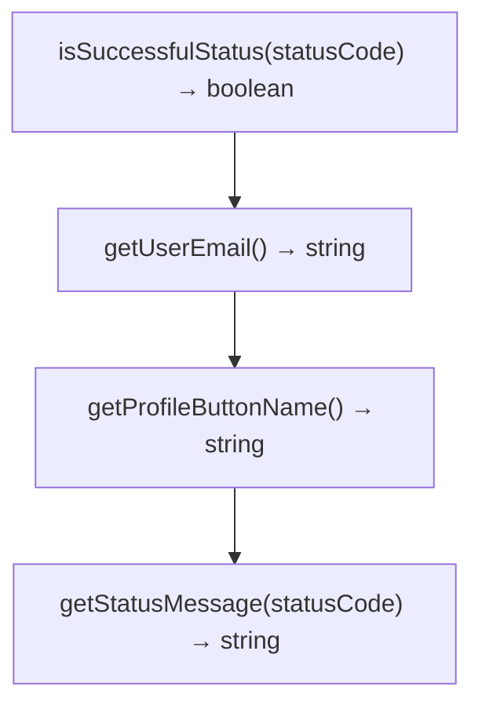

# Решения. Глава 28. Return

## Концептуальные вопросы

### 1. Зачем существует return

Ответ:

`return` нужен, чтобы функция отправила результат вызывающему коду.

Объяснение:

Без `return` функция может выполнить действия, но вызывающий код не получает явный результат.

Распространённая ошибка:

Думать, что вычисленное выражение автоматически выходит из функции.

Связь с Automation QA:

Validators должны возвращать boolean, чтобы тест мог использовать результат.

### 2. Возвращаемое значение

Ответ:

Возвращаемое значение - это значение, которое получает вызывающий код после вызова функции.

Объяснение:

В `return statusCode === 200` return value будет `true` или `false`.

Распространённая ошибка:

Путать return value с тем, что напечатано в консоль.

Связь с Automation QA:

Возвращаемое значение можно сохранить в переменную `passed`.

### 3. Как функция отправляет данные вызывающий код

Ответ:

Через `return`.

Объяснение:

`return` пересекает границу функции и передает значение в место вызова.

Распространённая ошибка:

Использовать `console.log()` вместо `return`.

Связь с Automation QA:

Helper API должен отдавать данные, если вызывающий код должен их проверить.

### 4. Что происходит после return

Ответ:

Выполнение функции немедленно останавливается.

Объяснение:

Код после выполненного `return` не запускается.

Распространённая ошибка:

Писать важную логику после `return`.

Связь с Automation QA:

Cleanup или logging после `return` внутри той же функции может не выполниться.

### 5. Нет explicit return

Ответ:

Caller получает `undefined`.

Объяснение:

Если функция дошла до конца без `return`, результат вызова - `undefined`.

Распространённая ошибка:

Ожидать, что функция вернет последнее выражение.

Связь с Automation QA:

Validator без `return` может вернуть `undefined` вместо boolean.

### 6. console.log vs return

Ответ:

`console.log()` печатает значение. `return` отправляет значение вызывающий код.

Объяснение:

Печать видна человеку, return value доступен программе.

Распространённая ошибка:

Считать вывод в консоль результатом функции.

Связь с Automation QA:

Тесту нужен return value, а не только сообщение в логе.

### 7. Implicit undefined

Ответ:

Implicit `undefined` - это результат функции без explicit return.

Объяснение:

JavaScript возвращает `undefined`, если функция ничего явно не вернула.

Распространённая ошибка:

Думать, что функция "ничего не возвращает" в смысле отсутствия значения.

Связь с Automation QA:

Так появляются неочевидные `undefined` в helper results.

### 8. Одна инструкция return

Ответ:

Это функция с одним `return`.

Объяснение:

Один clear return подходит для простых transformations.

Распространённая ошибка:

Делать лишние условия там, где достаточно одного выражения.

Связь с Automation QA:

`isSuccessfulStatus` часто может быть простой boolean transformation.

### 9. Multiple return paths

Ответ:

Это несколько возможных путей выхода из функции.

Объяснение:

Условие выбирает, какой `return` выполнится.

Распространённая ошибка:

Сделать paths неочевидными.

Связь с Automation QA:

Message helper может возвращать разные сообщения для разных statuses.

### 10. Читаемость

Ответ:

Return paths должны быть читаемыми, чтобы вызывающий код понимал возможные результаты.

Объяснение:

Скрытые и запутанные returns усложняют отладку.

Распространённая ошибка:

Писать слишком много коротких returns без структуры.

Связь с Automation QA:

Понятные helpers ускоряют анализ падений тестов.

### 11. Transformations of data

Ответ:

Функция может принимать вход и возвращать вывод.

Объяснение:

`statusCode → isSuccessfulStatus → boolean`.

Распространённая ошибка:

Видеть функцию только как набор команд.

Связь с Automation QA:

Многие helpers преобразуют response data в проверяемые значения.

## Определите return значения

### Задача 1

Ответ:

Explicit return есть.

Возвращаемое значение: `true`.

Caller получает `true` в `result`.

Объяснение:

`200 === 200` дает `true`, и `return` отправляет это значение.

Распространённая ошибка:

Считать, что вызывающий код получает само выражение, а не его результат.

Связь с Automation QA:

Boolean validator возвращает результат проверки.

### Задача 2

Ответ:

Explicit return отсутствует.

Функция печатает `200`.

Caller получает `undefined`.

Объяснение:

`console.log()` не является `return`.

Распространённая ошибка:

Путать печать и возвращение.

Связь с Automation QA:

Лог не заменяет return value для assertion.

### Задача 3

Ответ:

Explicit return есть.

При `500` return value: `'Not OK'`.

Caller получает `'Not OK'` в `message`.

Объяснение:

Первое условие false, поэтому выполняется второй `return`.

Распространённая ошибка:

Ожидать, что оба return выполнятся.

Связь с Automation QA:

Helper возвращает диагностическое сообщение.

## console.log() vs return

### Задача 1

Ответ:

Функция печатает `true`, но `result` получает `undefined`.

Объяснение:

Внутри нет `return`.

Распространённая ошибка:

Считать, что напечатанное значение сохраняется в `result`.

Связь с Automation QA:

Такой helper нельзя использовать как boolean validator.

### Задача 2

Ответ:

Функция возвращает `true`, и `result` получает `true`.

Объяснение:

`return` отправляет значение вызывающий код.

Распространённая ошибка:

Добавлять `console.log` вместо использования return value.

Связь с Automation QA:

Такой helper можно использовать в проверке.

## Предскажите вывод перед запуском

### Задача 1

Ответ:

```text
true
```

Объяснение:

Функция возвращает результат сравнения.

Распространённая ошибка:

Ожидать строку вместо boolean.

Связь с Automation QA:

Validator возвращает boolean.

### Задача 2

Ответ:

```text
200
undefined
```

Объяснение:

Сначала `logStatus` печатает `200`. Затем внешний `console.log` печатает return value функции, то есть `undefined`.

Распространённая ошибка:

Ожидать только `200`.

Связь с Automation QA:

Показывает, почему логирование не заменяет return.

### Задача 3

Ответ:

```text
Not OK
```

Объяснение:

`statusCode === 200` false, поэтому выполняется второй return.

Распространённая ошибка:

Думать, что функция всегда возвращает первый return.

Связь с Automation QA:

Разные statuses дают разные messages.

### Задача 4

Ответ:

```text
first
```

Объяснение:

После первого `return` функция завершилась.

Распространённая ошибка:

Ожидать `second`.

Связь с Automation QA:

Код после return не выполнится.

## Задачи на отладку

### Задача 1

Ответ:

`result` получает `undefined`, потому что нет `return`.

Исправление:

```javascript
function isSuccessfulStatus(statusCode) {
  return statusCode === 200;
}
```

Объяснение:

Выражение вычисляется, но не выходит из функции.

Распространённая ошибка:

Забыть `return` перед выражением.

Связь с Automation QA:

Validator без return не дает usable result.

### Задача 2

Ответ:

`Done` не выводится, потому что находится после `return`.

Исправление:

```javascript
function validateStatus(statusCode) {
  console.log('Done');
  return statusCode === 200;
}
```

Объяснение:

`return` завершает функцию немедленно.

Распространённая ошибка:

Писать важный код после return.

Связь с Automation QA:

Логи после return не помогут в диагностике, потому что не выполнятся.

### Задача 3

Ответ:

Функция печатает результат, но не возвращает его.

Исправление:

```javascript
function isSuccessfulStatus(statusCode) {
  return statusCode === 200;
}
```

Объяснение:

Caller может использовать только return value.

Распространённая ошибка:

Путать human-visible вывод и program-visible result.

Связь с Automation QA:

Assertion должен получать boolean.

### Задача 4

Ответ:

Много коротких return paths могут быть трудны для чтения, если условия растут.

Объяснение:

Читатель должен быстро понимать, какой result возможен.

Распространённая ошибка:

Считать любую компактную форму лучшей.

Связь с Automation QA:

Diagnostic helpers должны быть очевидными.

## QA-задачи

### Сценарий 1

Ответ:

```javascript
function isSuccessfulStatus(actualStatus, expectedStatus) {
  return actualStatus === expectedStatus;
}

const passed = isSuccessfulStatus(200, 200);
console.log(passed);
```

Объяснение:

Функция возвращает boolean result.

Распространённая ошибка:

Использовать `console.log` внутри validator вместо `return`.

Связь с Automation QA:

Такой validator можно использовать в assertion.

### Сценарий 2

Ответ:

```javascript
function getStatusMessage(statusCode) {
  if (statusCode === 200) {
    return 'Status is successful';
  }

  return 'Status is not successful';
}
```

Объяснение:

Функция имеет два readable return paths.

Распространённая ошибка:

Поставить код после первого return и ожидать выполнение.

Связь с Automation QA:

Message helper помогает в отчетах.

### Сценарий 3

Ответ:

```javascript
function printUserEmail() {
  console.log('anna@example.com');
}

function getUserEmail() {
  return 'anna@example.com';
}

const printed = printUserEmail();
const returned = getUserEmail();

console.log('printed:', printed);
console.log('returned:', returned);
```

Объяснение:

`printUserEmail` печатает email и возвращает `undefined`. `getUserEmail` возвращает email вызывающий код.

Распространённая ошибка:

Ожидать, что printed содержит email.

Связь с Automation QA:

Test data helpers должны возвращать данные, если вызывающий код должен их использовать.

### Сценарий 4

Ответ:



Объяснение:

Имя helper должно подсказывать return value.

Распространённая ошибка:

Создать helper, который только печатает данные.

Связь с Automation QA:

Readable helper APIs легче использовать в тестах.

## Мини-проект

Возможное решение:

```javascript
function isSuccessfulStatus(actualStatus, expectedStatus) {
  return actualStatus === expectedStatus;
}

function getStatusMessage(statusCode) {
  if (statusCode === 200) {
    return 'Status is successful';
  }

  return 'Status is not successful';
}

function getUserEmail() {
  return 'anna@example.com';
}

function printUserEmail() {
  console.log('anna@example.com');
}

const passed = isSuccessfulStatus(200, 200);
const message = getStatusMessage(200);
const email = getUserEmail();
const printedEmail = printUserEmail();

console.log('passed:', passed);
console.log('message:', message);
console.log('email:', email);
console.log('printedEmail:', printedEmail);
```

Отчет:

```text
Function           | Input          | Возвращаемое значение             | QA-смысл
------------------ | -------------- | ------------------------ | ------------------------
isSuccessfulStatus | actual/expected | boolean                  | assertion helper
getStatusMessage   | statusCode      | status message           | reporting helper
getUserEmail       | none            | user email               | test data helper
printUserEmail     | none            | undefined                | logging only
```

Объяснение:

Проект показывает разницу между helper, который возвращает данные, и helper, который только печатает.

Распространённая ошибка:

Использовать print helper там, где нужен data helper.

Связь с Automation QA:

Хорошие helper APIs явно показывают, что возвращается вызывающий код.
