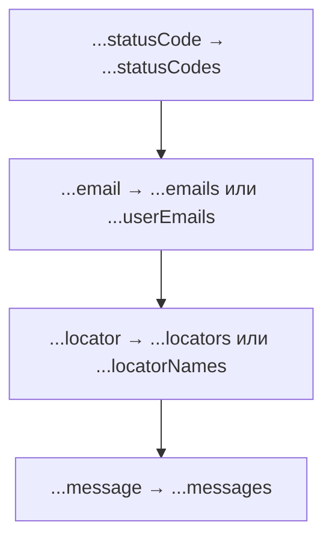

# Решения. Глава 29. Rest Parameters

## Концептуальные вопросы

### 1. Зачем существуют Rest Parameters

Ответ:

Rest Parameters нужны, чтобы функция могла принять неизвестное количество arguments.

Объяснение:

Обычные parameters подходят, когда количество входs известно. Rest parameter собирает remaining arguments в array.

Распространённая ошибка:

Использовать rest везде, даже когда входs fixed.

Связь с Automation QA:

Helper может принять любое количество status codes или log messages.

### 2. Неизвестное количество arguments

Ответ:

Это ситуация, когда вызывающий код может передать один, несколько или ноль значения.

Объяснение:

Функция не может заранее иметь отдельный parameter для каждого будущего argument.

Распространённая ошибка:

Создавать много parameters вроде `status1`, `status2`, `status3`.

Связь с Automation QA:

Набор проверяемых значений может меняться от теста к тесту.

### 3. Синтаксис `...statusCodes`

Ответ:

Это rest parameter с именем `statusCodes`.

Объяснение:

Три точки в parameter list означают сбор remaining arguments.

Распространённая ошибка:

Объяснять это через Spread.

Связь с Automation QA:

`...statusCodes` показывает, что helper принимает collection.

### 4. Что собирает rest parameter

Ответ:

Он собирает remaining arguments.

Объяснение:

Если перед ним есть normal parameters, они получают свои positions, а rest собирает остаток.

Распространённая ошибка:

Думать, что rest собирает все arguments всегда.

Связь с Automation QA:

`expectedStatus` может быть обычным parameter, а actual statuses - rest array.

### 5. Почему array

Ответ:

Потому что нужно одно значение, которое хранит много collected значения.

Объяснение:

Array - естественная форма для collection.

Распространённая ошибка:

Ожидать строку или отдельные variables.

Связь с Automation QA:

Collected test data удобно хранить как array.

### 6. Что внутри rest array

Ответ:

Внутри находятся collected arguments в порядке передачи.

Объяснение:

`collect(200, 201)` дает `[200, 201]`.

Распространённая ошибка:

Ожидать object или named значения.

Связь с Automation QA:

Порядок значения в проверках может быть важен.

### 7. Ноль arguments

Ответ:

Rest array будет пустым: `[]`.

Объяснение:

Rest parameter всегда получает array.

Распространённая ошибка:

Ожидать `undefined`.

Связь с Automation QA:

Flexible helper должен корректно читать empty collection.

### 8. Почему последний

Ответ:

Потому что rest parameter собирает все оставшиеся arguments.

Объяснение:

Если после него есть parameter, непонятно, что должно остаться для этого parameter.

Распространённая ошибка:

Писать `(...items, last)`.

Связь с Automation QA:

Helper signature должна быть предсказуемой.

### 9. Когда обычные parameters лучше

Ответ:

Когда количество входs известно и имеет ясный смысл.

Объяснение:

`compareStatus(actualStatus, expectedStatus)` читается лучше, чем `compareStatus(...statuses)`.

Распространённая ошибка:

Делать API helper слишком гибким.

Связь с Automation QA:

Четкие helper signatures упрощают tests.

### 10. Имя во множественном числе

Ответ:

Rest parameter хранит collection, поэтому имя должно это показывать.

Объяснение:

`statusCodes` понятнее, чем `statusCode`.

Распространённая ошибка:

Назвать array singular name.

Связь с Automation QA:

Хорошие имена уменьшают путаницу.

### 11. Почему не смешивать Rest и Spread

Ответ:

Потому что эта глава объясняет только сбор incoming arguments.

Объяснение:

Spread имеет другое направление и будет изучаться отдельно.

Распространённая ошибка:

Запомнить "три точки" без понимания направления.

Связь с Automation QA:

Четкая модель предотвращает ошибки в helper calls.

## Определите collected arguments

### Задача 1

Ответ:

Обычных parameters нет.

Rest parameter: `statusCodes`.

Rest array: `[200, 201, 204]`.

Объяснение:

Все arguments собираются rest parameter.

Распространённая ошибка:

Ожидать только первый value.

Связь с Automation QA:

Validator может собрать все statuses.

### Задача 2

Ответ:

Normal parameter: `expectedStatus`.

Rest parameter: `actualStatuses`.

`expectedStatus = 200`.

`actualStatuses = [200, 201, 204]`.

Объяснение:

Первый argument идет в normal parameter, остальные - в rest array.

Распространённая ошибка:

Включить первый argument в rest array.

Связь с Automation QA:

Один expected status и много actual statuses.

### Задача 3

Ответ:

Normal parameter: `firstMessage`.

Rest parameter: `otherMessages`.

`firstMessage = 'start'`.

`otherMessages = ['validate', 'finish']`.

Объяснение:

Rest собирает значения после первого argument.

Распространённая ошибка:

Думать, что rest всегда собирает абсолютно все значения.

Связь с Automation QA:

Logger может выделить первое сообщение и собрать остальные.

## What is inside the rest array?

### Задача 1

Ответ:

```text
[]
```

Объяснение:

Arguments не переданы, rest array пустой.

Распространённая ошибка:

Ожидать `undefined`.

Связь с Automation QA:

Empty test data collection должна быть понятной.

### Задача 2

Ответ:

```text
['a']
```

Объяснение:

Один argument собирается в array из одного элемента.

Распространённая ошибка:

Ожидать просто `'a'`.

Связь с Automation QA:

Даже один collected value находится внутри array.

### Задача 3

Ответ:

```text
['b', 'c']
```

Объяснение:

`firstValue` получает `'a'`, rest собирает remaining arguments.

Распространённая ошибка:

Включить `'a'` в rest array.

Связь с Automation QA:

Known value и remaining значения часто имеют разный смысл.

## Предскажите вывод перед запуском

### Задача 1

Ответ:

```text
[ 200, 201 ]
```

Объяснение:

Rest parameter собирает оба arguments.

Распространённая ошибка:

Ожидать два отдельных вывода.

Связь с Automation QA:

Statuses collected as array.

### Задача 2

Ответ:

```text
[]
```

Объяснение:

Rest parameter получает empty array.

Распространённая ошибка:

Ожидать `undefined`.

Связь с Automation QA:

No statuses means empty collection.

### Задача 3

Ответ:

```text
200
[ 200, 201 ]
```

Объяснение:

Первый argument идет в `expectedStatus`, остальные - в `actualStatuses`.

Распространённая ошибка:

Ожидать `[200, 200, 201]`.

Связь с Automation QA:

Expected отдельно, actual значения collection отдельно.

### Задача 4

Ответ:

```text
start
[]
```

Объяснение:

Первый argument получает `firstMessage`, remaining arguments отсутствуют.

Распространённая ошибка:

Ожидать, что rest array содержит `'start'`.

Связь с Automation QA:

Logger может получить first message без дополнительных messages.

## Задачи на отладку

### Задача 1

Ответ:

Rest parameter не последний.

Исправление:

```javascript
function validateStatuses(expectedStatus, ...actualStatuses) {}
```

Объяснение:

Rest должен собрать все remaining arguments, поэтому после него parameters быть не должно.

Распространённая ошибка:

Ставить rest там, где хочется визуально.

Связь с Automation QA:

Helper signature должна быть валидной.

### Задача 2

Ответ:

`statusCode` выглядит как одно значение, но rest parameter хранит array.

Исправление:

```javascript
function collectStatuses(...statusCodes) {
  console.log(statusCodes);
}
```

Объяснение:

Collection лучше называть во множественном числе.

Распространённая ошибка:

Использовать singular name для array.

Связь с Automation QA:

Читаемость helper зависит от имен.

### Задача 3

Ответ:

Здесь входs fixed: actual и expected.

Лучше:

```javascript
function compareStatus(actualStatus, expectedStatus) {
  console.log(actualStatus === expectedStatus);
}
```

Объяснение:

Rest нужен для неизвестного количества значения.

Распространённая ошибка:

Использовать rest ради гибкости без причины.

Связь с Automation QA:

Явные actual/expected улучшают диагностику.

### Задача 4

Ответ:

Объяснение описывает Spread, а не Rest.

Объяснение:

Rest собирает arguments в array. Spread будет изучаться позже.

Распространённая ошибка:

Смешивать направление трех точек.

Связь с Automation QA:

Правильная модель важна при чтении helper APIs.

## QA-задачи

### Сценарий 1

Ответ:

```javascript
function validateStatuses(expectedStatus, ...actualStatuses) {
  console.log('Expected:', expectedStatus);
  console.log('Actual:', actualStatuses);
}

validateStatuses(200, 200, 201, 204);
```

Объяснение:

`expectedStatus` получает первый argument, rest собирает остальные.

Распространённая ошибка:

Поставить rest parameter первым.

Связь с Automation QA:

Один expected value и много observed значения.

### Сценарий 2

Ответ:

```javascript
function logMessages(...messages) {
  console.log(messages);
}

logMessages('start');
logMessages('start', 'validate');
logMessages('start', 'validate', 'finish');
```

Объяснение:

Rest parameter собирает любое количество messages.

Распространённая ошибка:

Ожидать строку вместо array.

Связь с Automation QA:

Flexible logging helper.

### Сценарий 3

Ответ:

```javascript
function collectUserEmails(...userEmails) {
  return userEmails;
}

const emails = collectUserEmails('a@example.com', 'b@example.com', 'c@example.com');
console.log(emails);
```

Объяснение:

Rest parameter собирает emails в array и функция возвращает этот array.

Распространённая ошибка:

Путать collection с одним email.

Связь с Automation QA:

Collecting test data.

### Сценарий 4

Ответ:



Объяснение:

Rest parameter хранит collection.

Распространённая ошибка:

Оставить singular names.

Связь с Automation QA:

Имена показывают, что helper принимает много значения.

## Мини-проект

Возможное решение:

```javascript
function validateStatuses(expectedStatus, ...actualStatuses) {
  console.log('Expected:', expectedStatus);
  console.log('Actual:', actualStatuses);
}

function logMessages(...messages) {
  console.log('Messages:', messages);
}

function collectUserEmails(...userEmails) {
  return userEmails;
}

function collectLocatorNames(...locatorNames) {
  return locatorNames;
}

validateStatuses(200, 200, 201, 204);
logMessages('start', 'validate', 'finish');
const emails = collectUserEmails('a@example.com', 'b@example.com');
const locators = collectLocatorNames('profile button', 'save button');

console.log(emails);
console.log(locators);
```

Отчет:

```text
Function            | Normal parameters | Rest parameter | Collected values              | QA meaning
------------------- | ----------------- | -------------- | ----------------------------- | ----------------
validateStatuses    | expectedStatus    | actualStatuses | 200, 201, 204                 | status validator
logMessages         | none              | messages       | start, validate, finish       | logging helper
collectUserEmails   | none              | userEmails     | a@example.com, b@example.com  | test data helper
collectLocatorNames | none              | locatorNames   | profile button, save button   | UI helper
```

Объяснение:

Каждый rest parameter собирает incoming arguments в array.

Распространённая ошибка:

Считать collected значения отдельными variables, а не array.

Связь с Automation QA:

Мини-проект показывает flexible helper APIs без Spread.
