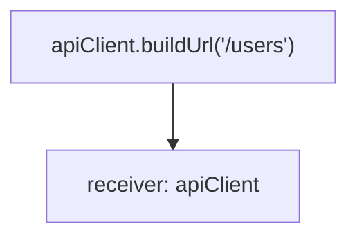
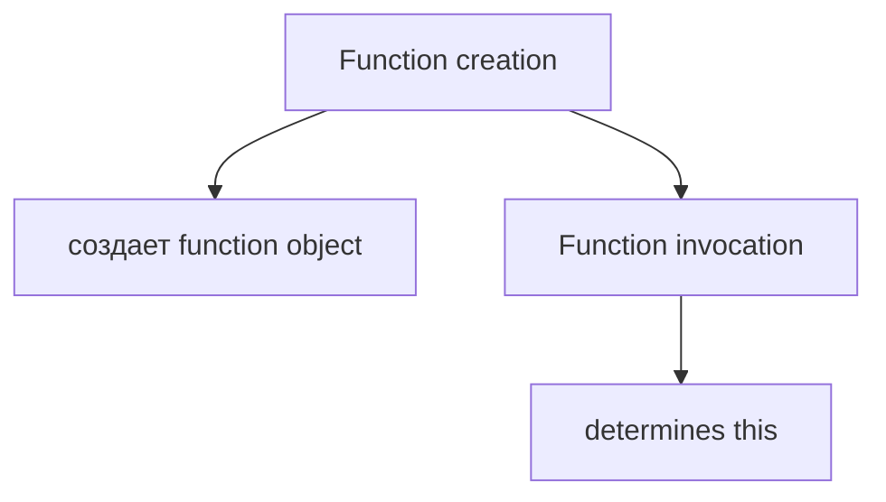
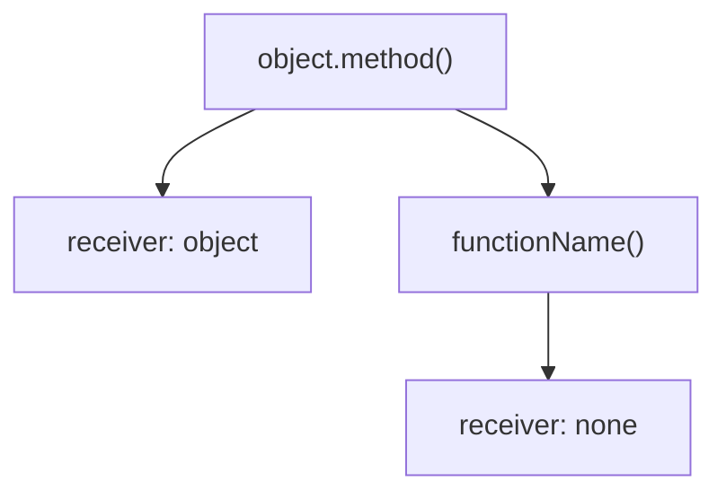
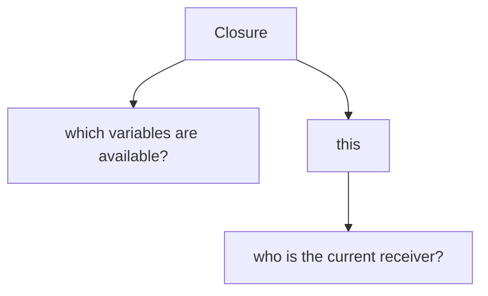
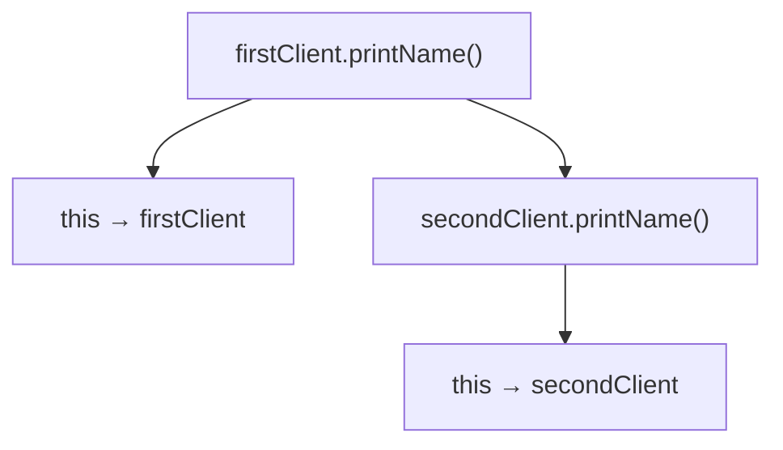
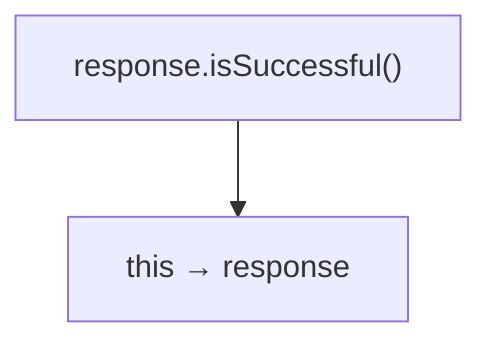
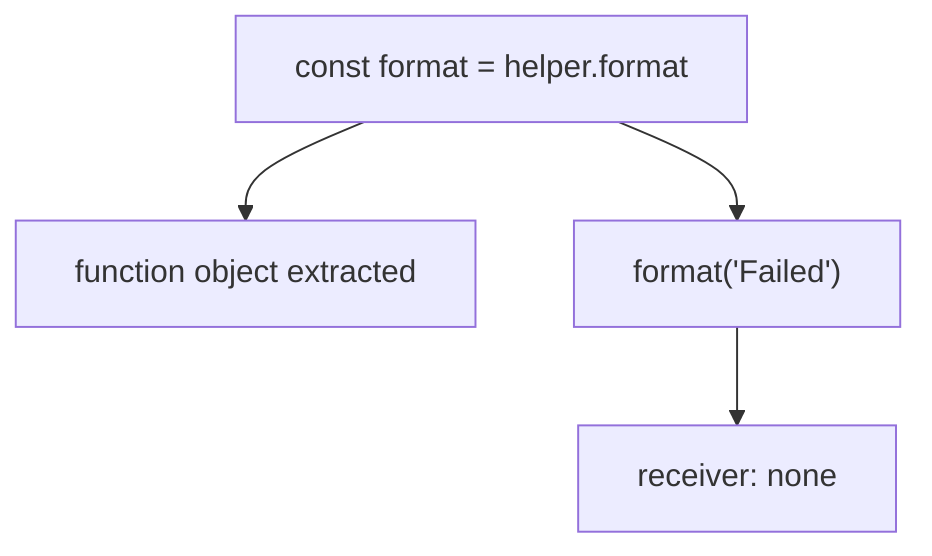
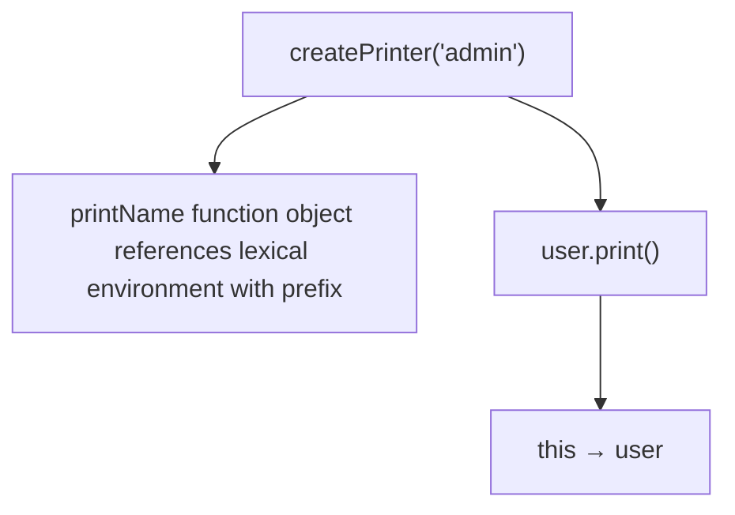
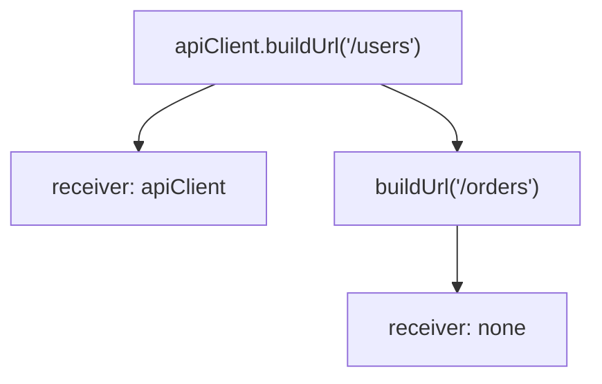
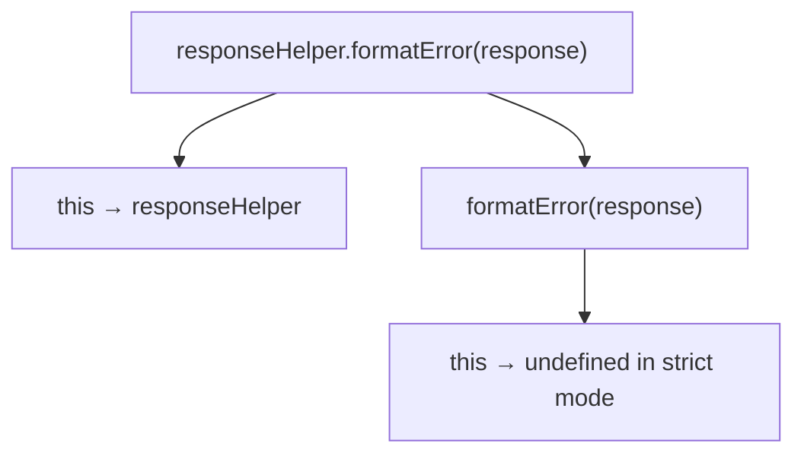

# Решения: this

## Проверка понимания

### 1. Зачем существует this?

Ответ: `this` нужен, чтобы функция могла работать с current объект выполнения, то есть с object, для которого она вызвана.

Объяснение: один function object может быть method разных objects. `this` позволяет function body обращаться к объект выполнения текущего вызова.

Распространённая ошибка: считать, что `this` навсегда привязан к object, где функция была создана.

Связь с Automation QA: Page Object methods и API client methods часто используют `this.page`, `this.baseUrl`, `this.expectedStatus`.

---

### 2. Что такое execution объект выполнения?

Ответ: execution объект выполнения - это object, для которого выполняется function call.

Объяснение:



Распространённая ошибка: путать объект выполнения с function object.

Связь с Automation QA: если `apiClient.buildUrl()` вызывается как method, `this` внутри method указывает на `apiClient`.

---

### 3. Когда определяется this?

Ответ: `this` определяется при invocation.

Объяснение:



Распространённая ошибка: искать `this` по месту объявления функции.

Связь с Automation QA: method может сломаться, если передать ее как отдельную функцию и потерять объект выполнения.

---

### 4. Почему this не ищется через Scope Chain?

Ответ: `this` связан с current function invocation, а не с ordinary identifier lookup.

Объяснение: обычные identifiers ищутся через Lexical Environment. `this` определяется формой вызова.

Распространённая ошибка: думать, что `this` работает как variable из Closure.

Связь с Automation QA: это помогает различать configuration, captured через Closure, и состояние object, доступный через `this`.

---

### 5. Чем method invocation отличается от global invocation?

Ответ: method invocation имеет объект выполнения, global invocation вызывается без object объект выполнения.

Объяснение:



Распространённая ошибка: ожидать, что standalone call сохранит объект выполнения от прежнего object.

Связь с Automation QA: detached Page Object methods часто теряют `this`.

---

### 6. Что такое detached function?

Ответ: detached function - это function object, взятый из object property и вызванный отдельно.

Объяснение:

```javascript
const method = object.method;
method();
```

Для обычной модели вызова из этой главы здесь нет object объект выполнения: вызов идет как `method()`, а не как `object.method()`.

Распространённая ошибка: думать, что переменная `method` помнит object, из которого функция была взята.

Связь с Automation QA: это частая причина ошибок в helper objects и page objects.

---

### 7. Почему Arrow Function нельзя считать простой заменой method?

Ответ: Arrow Function имеет особое поведение `this` и не получает объект выполнения так же, как обычная function.

Объяснение: `object.arrowMethod()` выглядит как method call, но arrow не определяет `this` через этот вызов.

Распространённая ошибка: механически заменять `function () {}` на `() => {}` внутри object methods.

Связь с Automation QA: object methods с `this.page` или `this.baseUrl` лучше писать обычной function, пока не изучена полная механика lexical `this`.

---

### 8. Чем Closure отличается от this?

Ответ:



Объяснение: Closure связана с Lexical Environment, где function object был создан. `this` связан с тем, как function object был вызван.

Распространённая ошибка: объяснять `this` через Scope Chain.

Связь с Automation QA: helper factory может использовать Closure для expected status, а method может использовать `this.baseUrl` для current client.

---

## Анализ кода

### Задание 1

Ответ:

```text
Anna
```

Форма invocation:

```text
user.printName()
```

Receiver: `user`.

Объяснение: function object вызывается как property object `user`, поэтому внутри function `this -> user`.

Распространённая ошибка: говорить, что `this` указывает на function `printName`.

Связь с Automation QA: так же читаются методы page objects: `loginPage.open()` означает `this -> loginPage`.

---

### Задание 2

Ответ:

```text
first
second
```

Используется один function object, но два разных invocation.

Объяснение:



Распространённая ошибка: думать, что функция навсегда привязана к `firstClient`, потому что была взята из `firstClient.printName`.

Связь с Automation QA: один method implementation может работать для разных client objects, если объект выполнения выбран правильно.

---

## Предскажите результат выполнения кода

### Задание 3

Ответ:

```text
undefined
```

Объяснение: в strict mode standalone function call не имеет объект выполнения, поэтому `this` равен `undefined`.

Распространённая ошибка: ожидать global object.

Связь с Automation QA: современные проекты обычно работают в режимах, где лучше не зависеть от non-strict global `this`.

---

### Задание 4

Ответ:

```text
true
```

Объяснение:



`this.status` равен `200`.

Распространённая ошибка: читать `this.status` как неизвестную variable, а не как property объект выполнения.

Связь с Automation QA: такой pattern может использоваться в response helper objects.

---

### Задание 5

Ответ: код приводит к `TypeError`.

Объяснение:



В strict mode `this` равен `undefined`, поэтому `this.prefix` вызывает ошибку.

Распространённая ошибка: думать, что `format` помнит `helper`.

Связь с Automation QA: это типичная ошибка при передаче methods из helper objects.

---

## Closure vs this

### Задание 6

Ответ:

```text
admin: Anna
```

`prefix` берется через Closure.

`this.name` берется из объект выполнения текущего вызова.

Объяснение:



Closure отвечает:

```text
Which variables are available?
```

`this` отвечает:

```text
Who is the current receiver?
```

Распространённая ошибка: думать, что `this.name` тоже берется из Closure.

Связь с Automation QA: factory может captured expected label, а объект выполнения может быть конкретным page object или client object.

---

## Определите объект выполнения

### Задание 7

Ответ:



Объяснение: в обычной модели `object.method()` первый вызов имеет объект выполнения `apiClient`. Второй вызов идет через standalone variable, поэтому объект выполнения не выбирается как object method объект выполнения.

Распространённая ошибка: считать, что `buildUrl` хранит объект выполнения вместе с function object.

Связь с Automation QA: если method API client извлечь в переменную, `this.baseUrl` может стать недоступным.

---

## Отладка

### Задание 8

Решение:

```javascript
'use strict';

const logger = {
  prefix: 'API',
  log: function (message) {
    console.log(this.prefix + ': ' + message);
  }
};

logger.log('Request failed');
```

Результат:

```text
API: Request failed
```

Объяснение: для обычного method call `logger.log()` объект выполнения выбирается из формы вызова, поэтому внутри method `this -> logger`.

Распространённая ошибка: делать `const log = logger.log` и ожидать, что объект выполнения сохранится.

Связь с Automation QA: logging helpers и assertion helpers часто ломаются при detached methods.

Возможное улучшение: после изучения `bind()` можно будет создавать function с заранее выбранным объект выполнения.

---

### Задание 9

Решение:

```javascript
const user = {
  name: 'Anna',
  getName: function () {
    return this.name;
  }
};

console.log(user.getName());
```

Результат:

```text
Anna
```

Объяснение: обычная function получает `this` из method invocation `user.getName()`.

Распространённая ошибка: считать Arrow Function полной заменой method syntax.

Связь с Automation QA: methods с `this.page`, `this.baseUrl`, `this.expectedStatus` не стоит механически писать как arrows.

---

## QA-задачи

### Задание 10

Решение:

```javascript
const apiClient = {
  baseUrl: 'https://api.example.test',
  buildUrl: function (path) {
    return this.baseUrl + path;
  },
  validateStatus: function (response) {
    return response.status === 200;
  }
};

console.log(apiClient.buildUrl('/users'));
console.log(apiClient.validateStatus({ status: 200 }));
```

Результат:

```text
https://api.example.test/users
true
```

Объяснение: `buildUrl` вызывается как method, поэтому `this.baseUrl` читает property `apiClient.baseUrl`.

Распространённая ошибка: извлечь `buildUrl` в переменную и потерять объект выполнения.

Связь с Automation QA: API clients часто хранят base URL и methods рядом.

---

### Задание 11

Решение:

```javascript
const assertions = {
  expectedStatus: 200,
  statusIsExpected: function (response) {
    return response.status === this.expectedStatus;
  }
};

console.log(assertions.statusIsExpected({ status: 200 }));
console.log(assertions.statusIsExpected({ status: 500 }));
```

Результат:

```text
true
false
```

Объяснение: объект выполнения в обоих вызовах - `assertions`.

Распространённая ошибка: писать Arrow Function и ожидать method объект выполнения.

Связь с Automation QA: assertion helper objects могут хранить expected configuration.

---

## Мини-проект

### Задание 12

Решение:

```javascript
'use strict';

const responseHelper = {
  expectedStatus: 200,
  serviceName: 'users-api',
  isExpectedStatus: function (response) {
    return response.status === this.expectedStatus;
  },
  formatError: function (response) {
    return this.serviceName +
      ': expected ' +
      this.expectedStatus +
      ', received ' +
      response.status;
  }
};

const response = {
  status: 500
};

console.log(responseHelper.isExpectedStatus(response));
console.log(responseHelper.formatError(response));

const formatError = responseHelper.formatError;

try {
  console.log(formatError(response));
} catch (error) {
  console.log(error.name + ': receiver is lost');
}

console.log(responseHelper.formatError(response));
```

Возможный вывод:

```text
false
users-api: expected 200, received 500
TypeError: receiver is lost
users-api: expected 200, received 500
```

Схема:



Объяснение: `responseHelper.formatError()` имеет объект выполнения. `formatError()` после извлечения вызывается как standalone function.

Распространённая ошибка: думать, что переменная `formatError` хранит не только function object, но и объект выполнения.

Связь с Automation QA: это помогает понимать ошибки в Page Object methods, API client helpers и assertion helpers.

Возможное улучшение: после главы `bind()` можно будет сохранить объект выполнения заранее.
