# Решения: call()

## Проверка понимания

### 1. Зачем существует call()?

Ответ: `call()` нужен, чтобы вызвать function object и вручную выбрать объект выполнения для `this`.

Объяснение: ordinary invocation выбирает объект выполнения из формы вызова. `call()` позволяет передать объект выполнения явно первым argument.

Распространённая ошибка: думать, что `call()` создает новую функцию.

Связь с Automation QA: `call()` помогает явно выбирать config object для reusable validators; detached helper methods - только один из случаев, где это полезно.

---

### 2. Кто выбирает объект выполнения при ordinary invocation?

Ответ: JavaScript выбирает объект выполнения по ordinary invocation form, изученной в главе про `this`.

Объяснение:

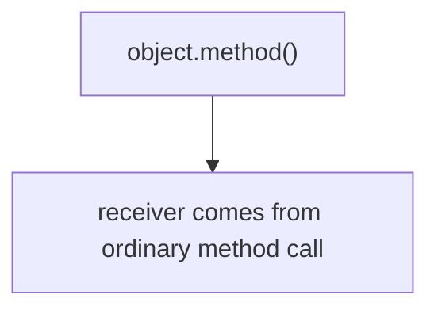

Распространённая ошибка: считать это универсальным правилом для всех форм вызова.

Связь с Automation QA: page object methods обычно вызываются как `pageObject.method()`.

---

### 3. Кто выбирает объект выполнения при call()?

Ответ: разработчик.

Объяснение:

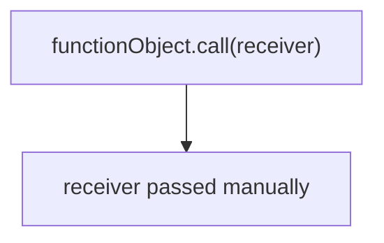

Распространённая ошибка: ждать, что объект выполнения будет взят из object, где function была создана.

Связь с Automation QA: можно вызвать общий validator с разными config objects.

---

### 4. Что означает первый argument в call()?

Ответ: первый argument становится `this` внутри вызываемой function.

Объяснение:

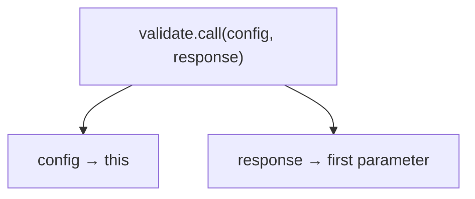

Распространённая ошибка: передать обычный function argument первым и случайно сделать его объект выполнения.

Связь с Automation QA: особенно важно не путать config object и response object.

---

### 5. Куда попадают arguments после объект выполнения?

Ответ: они передаются в parameters вызываемой function по позиции.

Объяснение:

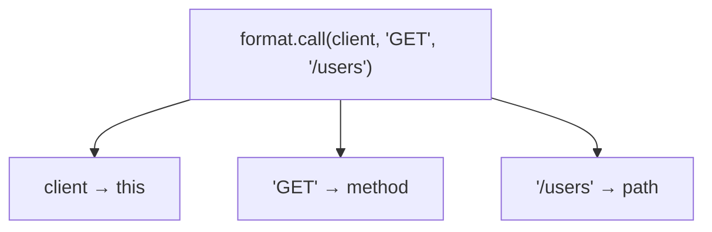

Распространённая ошибка: думать, что все arguments `call()` становятся parameters.

Связь с Automation QA: так можно передавать response, path, method и другие test data.

---

### 6. Почему call() не привязывает объект выполнения навсегда?

Ответ: `call()` выбирает объект выполнения только для одного invocation.

Объяснение: следующий вызов той же function может быть ordinary invocation, another `call()` или standalone call.

Распространённая ошибка: вызвать `fn.call(object)` один раз и ожидать, что `fn()` дальше будет использовать тот же object.

Связь с Automation QA: если нужен устойчиво привязанный helper, следующая тема `bind()` будет важнее.

---

### 7. Чем call() отличается от object.method()?

Ответ: в ordinary `object.method()` объект выполнения выбирается из формы вызова. В `call()` объект выполнения передается явно.

Объяснение:

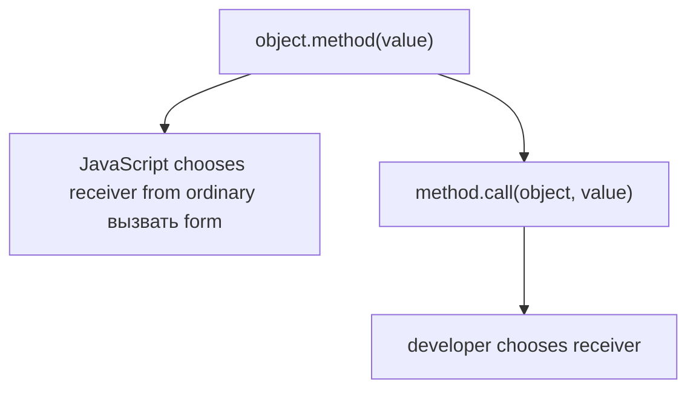

Распространённая ошибка: заменять все method calls на `call()` без причины.

Связь с Automation QA: обычный method call часто лучше читается в page objects и API clients.

---

### 8. Почему apply() продолжает тему call()?

Ответ: `apply()` тоже связан с ручным выбором объект выполнения, но передает arguments другой формой.

Объяснение: `call()` передает arguments по одному. `apply()` будет изучаться дальше и покажет, что делать, если arguments уже собраны в collection.

Распространённая ошибка: пытаться подробно объяснить `apply()` до понимания `call()`.

Связь с Automation QA: массивы test data часто возникают в automation code, поэтому `apply()` будет естественным продолжением.

---

## Анализ кода

### Задание 1

Ответ:

```text
users-api
```

Receiver выбирает разработчик через `call(service)`.

`this` становится `service`.

Объяснение:

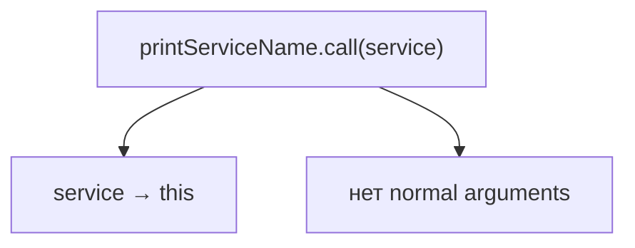

Распространённая ошибка: думать, что `service` станет parameter. У функции нет parameters, а `service` становится `this`.

Связь с Automation QA: похожим образом можно вызывать shared helper с конкретным config object.

---

### Задание 2

Ответ:

```text
https://api.example.test/users
```

`this` становится `apiClient`.

`path` получает `'/users'`.

Объяснение:

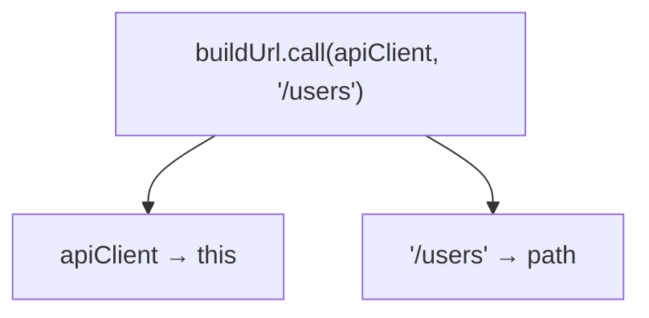

Распространённая ошибка: забыть, что normal arguments начинаются после объект выполнения.

Связь с Automation QA: это типичный URL builder для API tests.

---

## Перепишите ordinary invocation через call()

### Задание 3

Решение:

```javascript
apiClient.buildUrl.call(apiClient, '/orders');
```

Объяснение: function object находится в `apiClient.buildUrl`, а объект выполнения передается первым argument в `call()`.

Распространённая ошибка: написать `apiClient.buildUrl.call('/orders')`, сделав `'/orders'` объект выполнения.

Связь с Automation QA: такой rewrite полезен для понимания, но в реальном коде `apiClient.buildUrl('/orders')` обычно читается лучше.

---

### Задание 4

Решение:

```javascript
assertions.statusMatches.call(assertions, response);
```

Объяснение:

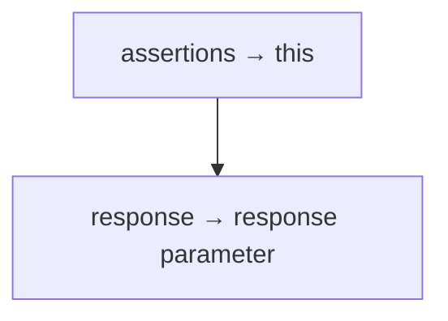

Распространённая ошибка: поменять местами `assertions` и `response`.

Связь с Automation QA: assertion helper получает config через `this`, а проверяемый response как обычный argument.

---

## Предскажите результат выполнения кода

### Задание 5

Ответ:

```text
200
201
```

Объяснение: каждый `call()` выбирает объект выполнения для одного invocation.

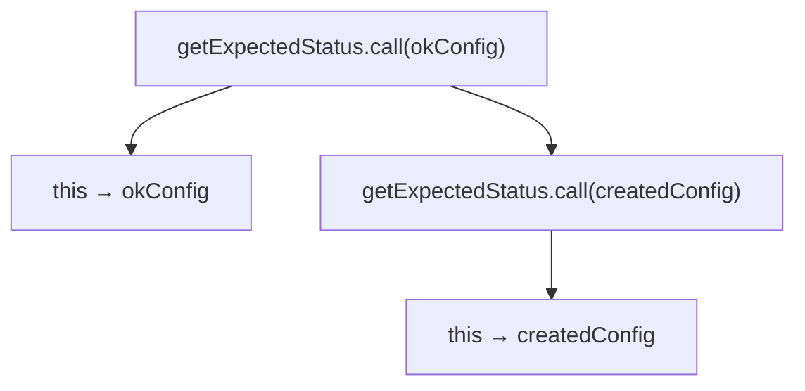

Распространённая ошибка: думать, что первый `call()` навсегда меняет function.

Связь с Automation QA: один helper можно вызывать с разными expected configs.

---

### Задание 6

Ответ:

```text
POST https://api.example.test/orders
```

Объяснение:

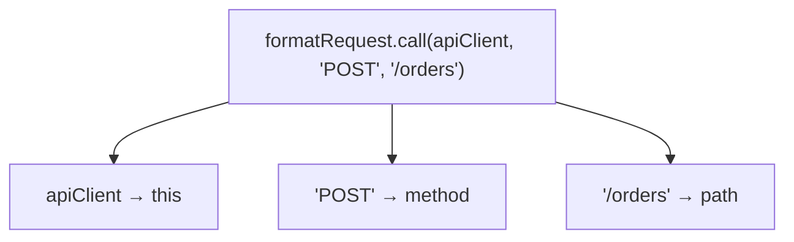

Распространённая ошибка: забыть, что объект выполнения не передается в `method`.

Связь с Automation QA: request formatters могут использовать client configuration через `this`.

---

### Задание 7

Ответ:

```text
true
```

Объяснение:

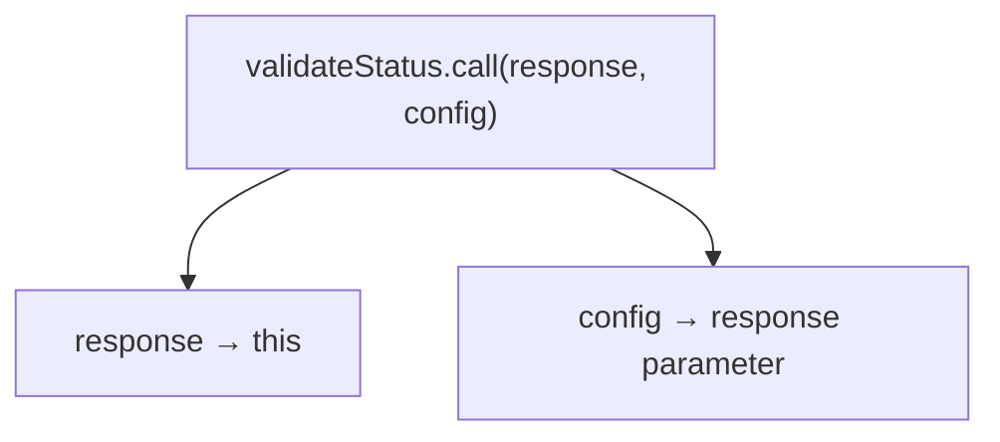

Внутри:

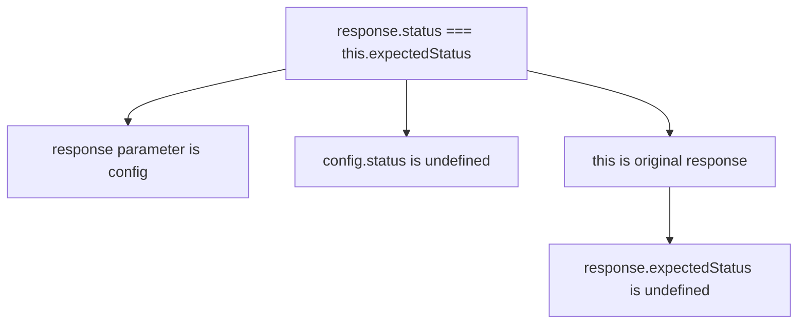

Обе стороны сравнения становятся `undefined`, поэтому результат неожиданно оказывается `true`.

Именно поэтому код опасен: wrong objects are in the wrong roles, но проверка случайно проходит.

Правильный вариант:

```javascript
console.log(validateStatus.call(config, response));
```

Результат corrected version:

```text
true
```

Распространённая ошибка: поменять объект выполнения и data argument местами.

Связь с Automation QA: в тестах такая ошибка может дать ложноположительный результат, если object shapes случайно совпали.

---

## Кто выбирает объект выполнения?

### Задание 8

Ответ:

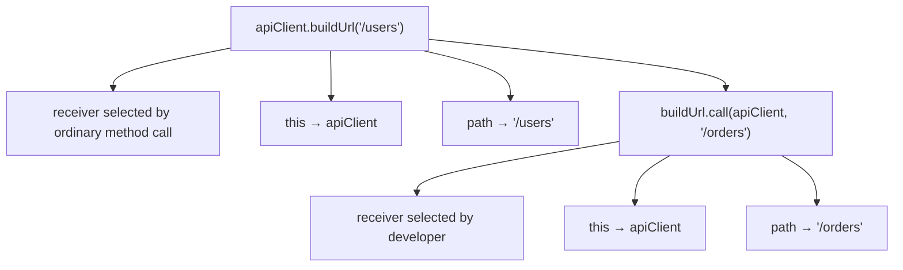

Объяснение: первый вызов использует ordinary invocation. Второй вызов использует manual объект выполнения selection.

Распространённая ошибка: не различать механизм выбора объект выполнения, если результат одинаковый.

Связь с Automation QA: понимание разницы важно при явном выборе config object и при отладке detached methods.

---

## Отладка

### Задание 9

Решение:

```javascript
function buildUrl(path) {
  return this.baseUrl + path;
}

const apiClient = {
  baseUrl: 'https://api.example.test'
};

console.log(buildUrl.call(apiClient, '/users'));
```

Результат:

```text
https://api.example.test/users
```

Объяснение: `apiClient` должен быть объект выполнения, а `'/users'` должен быть normal argument.

Распространённая ошибка: забыть первый объект выполнения argument.

Связь с Automation QA: это частая ошибка в reusable API helper functions.

---

### Задание 10

Решение:

```javascript
function validateStatus(response) {
  return response.status === this.expectedStatus;
}

const config = {
  expectedStatus: 200
};

const response = {
  status: 200
};

console.log(validateStatus.call(config, response));
```

Результат:

```text
true
```

Объяснение:

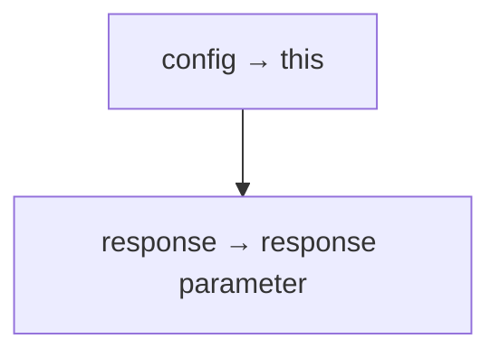

Распространённая ошибка: ставить data object на место объект выполнения.

Связь с Automation QA: config и actual response должны играть разные роли.

---

## QA-задачи

### Задание 11

Решение:

```javascript
function statusMatches(response) {
  return response.status === this.expectedStatus;
}

const okConfig = {
  expectedStatus: 200
};

const createdConfig = {
  expectedStatus: 201
};

const response = {
  status: 200
};

console.log(statusMatches.call(okConfig, response));
console.log(statusMatches.call(createdConfig, response));
```

Результат:

```text
true
false
```

Объяснение: один function object вызывается с двумя объект выполненияs.

Распространённая ошибка: создавать две одинаковые functions вместо одной reusable function.

Связь с Automation QA: удобно для shared assertion helpers.

---

### Задание 12

Решение:

```javascript
function buildApiUrl(path) {
  return this.baseUrl + path;
}

const usersApi = {
  baseUrl: 'https://users.example.test'
};

const ordersApi = {
  baseUrl: 'https://orders.example.test'
};

console.log(buildApiUrl.call(usersApi, '/list'));
console.log(buildApiUrl.call(ordersApi, '/list'));
```

Результат:

```text
https://users.example.test/list
https://orders.example.test/list
```

Объяснение: `call()` выбирает different объект выполнения for each invocation.

Распространённая ошибка: ожидать, что function remembers previous объект выполнения.

Связь с Automation QA: один URL builder может работать с разными API configs.

---

## Мини-проект

### Задание 13

Решение:

```javascript
function formatRequest(method, path) {
  return method + ' ' + this.baseUrl + path;
}

function statusMatches(response) {
  return response.status === this.expectedStatus;
}

const usersApiConfig = {
  baseUrl: 'https://users.example.test'
};

const ordersApiConfig = {
  baseUrl: 'https://orders.example.test'
};

const okAssertionConfig = {
  expectedStatus: 200
};

const response = {
  status: 200
};

console.log(formatRequest.call(usersApiConfig, 'GET', '/users'));
console.log(formatRequest.call(ordersApiConfig, 'POST', '/orders'));
console.log(statusMatches.call(okAssertionConfig, response));
```

Результат:

```text
GET https://users.example.test/users
POST https://orders.example.test/orders
true
```

Схема:

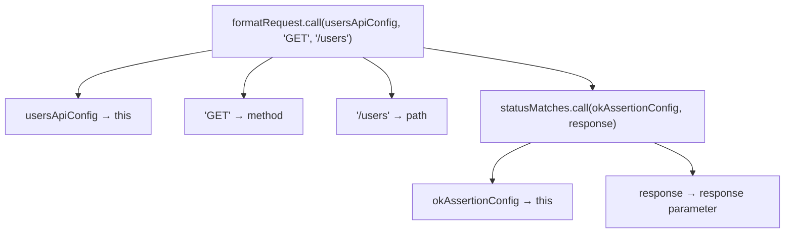

Объяснение: `call()` подходит, потому что function поведение общий, а объект выполнения configuration меняется.

Где обычный вызов метода читается лучше:

```javascript
usersApiConfig.formatRequest('/users');
```

если function действительно является частью object API.

Почему `call()` не сохраняет объект выполнения навсегда: каждый invocation выбирает объект выполнения отдельно.

Распространённая ошибка: использовать `call()` там, где обычный object method сделал бы код проще.

Связь с Automation QA: pattern полезен для понимания shared validators, но в framework architecture часто лучше выбирать более читаемую структуру helpers.

Возможное улучшение: после главы `apply()` можно будет передавать список arguments из array-like структуры.
