# Решения: apply()

## Проверка понимания

### 1. Зачем существует apply()?

Ответ: `apply()` нужен, чтобы вызвать function object с явно выбранным объект выполнения и передать normal arguments как array или array-like ordered argument list.

Объяснение: `call()` удобен, когда arguments уже отдельные. `apply()` удобен, когда arguments уже собраны в array или array-like collection.

Распространённая ошибка: думать, что `apply()` решает новую проблему объект выполнения.

Связь с Automation QA: test data часто приходит в виде подготовленного array значений.

---

### 2. Какую проблему решает apply()?

Ответ: проблему передачи arguments.

Объяснение: объект выполнения selection у `call()` и `apply()` одинаковый: первый argument становится `this`. Отличается второй argument: у `apply()` это array или array-like ordered argument list.

Распространённая ошибка: объяснять `apply()` как другой способ определить `this`.

Связь с Automation QA: config object остается объект выполнения, а request/response data могут лежать в array.

---

### 3. Что общего у call() и apply()?

Ответ: оба вызывают function immediately и позволяют явно выбрать объект выполнения первым argument.

Объяснение:

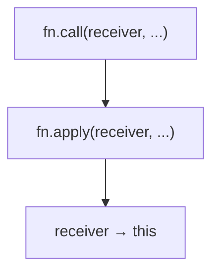

Распространённая ошибка: думать, что `apply()` сохраняет объект выполнения навсегда.

Связь с Automation QA: оба механизма полезны для understanding helpers with explicit config объект выполнения.

---

### 4. Чем отличается передача arguments?

Ответ:

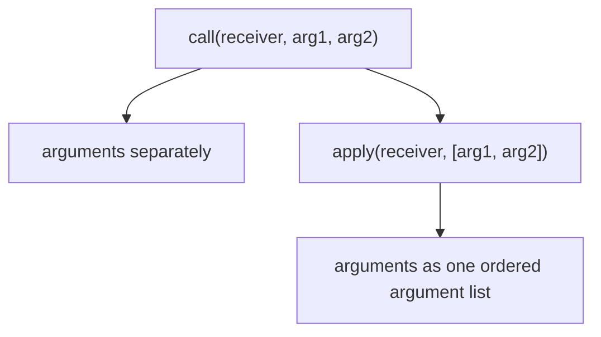

Объяснение: `apply()` берет значения из array или array-like list по positions и передает их parameters.

Распространённая ошибка: передать array в `call()` и ожидать, что он автоматически разложится по parameters.

Связь с Automation QA: array test data лучше подходит для `apply()`.

---

### 5. Что становится this?

Ответ: первый argument `apply()`.

Объяснение:

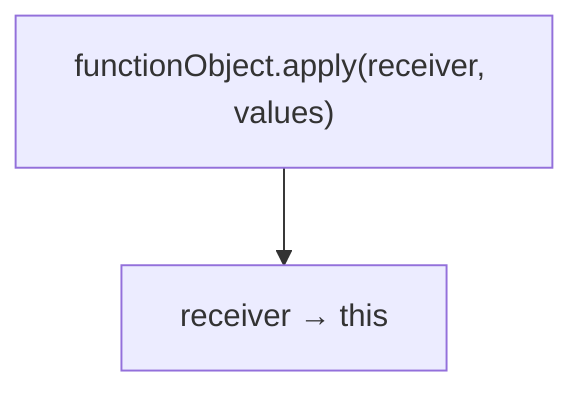

Распространённая ошибка: считать, что second argument влияет на `this`.

Связь с Automation QA: assertion config object обычно становится объект выполнения.

---

### 6. Как значения из array попадают в parameters?

Ответ: по позиции.

Объяснение:

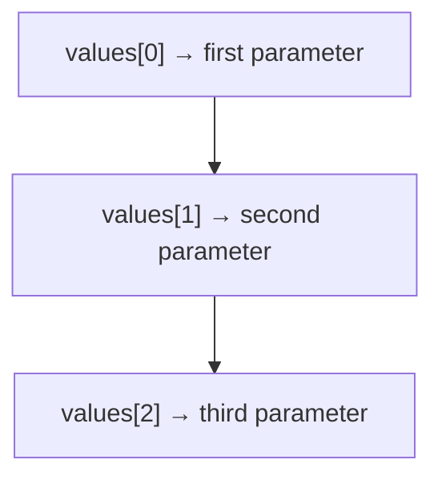

Распространённая ошибка: думать, что весь array попадает в первый parameter.

Связь с Automation QA: порядок test data в array должен соответствовать function signature.

---

### 7. Что такое array-like collection?

Ответ: на высоком уровне это object-like value с indexed значения и `length`.

Объяснение: `apply()` может работать с array-like ordered argument lists. Подробности `arguments` object internals будут изучаться позже.

Распространённая ошибка: углубляться в internals раньше времени.

Связь с Automation QA: некоторые tools и APIs возвращают array-like значения.

---

### 8. Когда apply() удобнее call()?

Ответ: когда arguments уже собраны в array или array-like collection.

Объяснение:

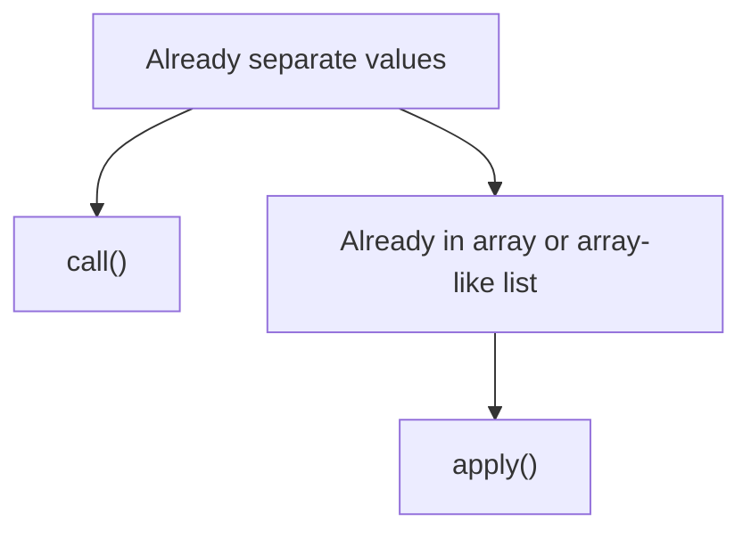

Распространённая ошибка: использовать `apply()` везде механически.

Связь с Automation QA: data-driven tests часто подготавливают набор значения заранее.

---

## Анализ кода

### Задание 1

Ответ:

```text
GET https://api.example.test/users
```

Сопоставление:

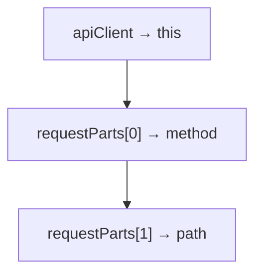

Объяснение: первый argument `apply()` выбирает объект выполнения. Второй argument содержит значения для parameters.

Распространённая ошибка: считать, что `requestParts` целиком станет `method`.

Связь с Automation QA: request parts часто хранятся в подготовленном наборе test data.

---

### Задание 2

Ответ:

Receiver одинаковый: `apiClient`.

Результат одинаковый:

```text
https://api.example.test/users
```

Отличается форма передачи arguments:

```text
call(apiClient, '/users')
apply(apiClient, ['/users'])
```

Объяснение: объект выполнения handling одинаковый. Argument passing разный.

Распространённая ошибка: думать, что `apply()` отличается прежде всего объект выполнения поведение.

Связь с Automation QA: выбирайте форму по тому, как уже представлены test data.

---

## Предскажите результат выполнения кода

### Задание 3

Ответ:

```text
users-api: 200 /users
```

Объяснение:

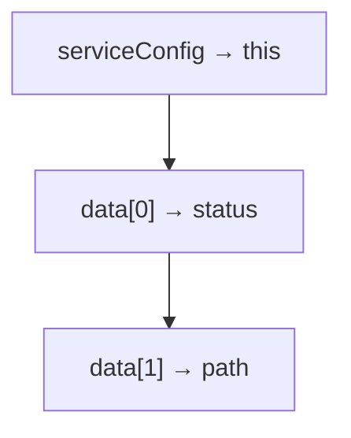

Распространённая ошибка: перепутать объект выполнения и `data`.

Связь с Automation QA: service config отделен от response data.

---

### Задание 4

Ответ:

```text
true
```

Объяснение:

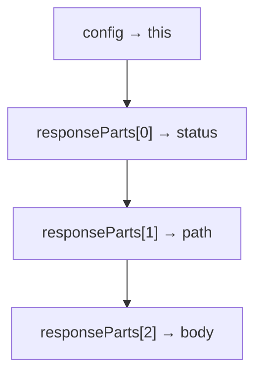

Все условия возвращают `true`.

Распространённая ошибка: нарушить порядок значения в `responseParts`.

Связь с Automation QA: порядок данных в data provider должен совпадать с signature helper.

---

### Задание 5

Ответ: код приведет к ошибке.

Объяснение: второй argument `apply()` должен быть array или array-like ordered argument list. Строка `'/users'` передана как обычное primitive value, а не как array для arguments.

Исправленный вариант:

```javascript
console.log(buildUrl.apply(apiClient, ['/users']));
```

Распространённая ошибка: использовать `apply()` как `call()`.

Связь с Automation QA: если argument один, его все равно нужно положить в array или array-like list.

---

## call vs apply

### Задание 6

Решение:

```javascript
formatRequest.apply(apiClient, ['POST', '/orders', '{"id":1}']);
```

Объяснение:

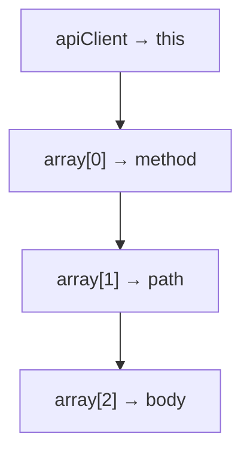

Распространённая ошибка: написать `apply(apiClient, 'POST', '/orders', body)`.

Связь с Automation QA: useful when request data already exists as array.

---

### Задание 7

Решение:

```javascript
validateResponse.call(config, 200, '/users', '{"name":"Anna"}');
```

Объяснение: `call()` принимает arguments отдельно.

Распространённая ошибка: передать array в `call()` вторым argument и ожидать автоматический mapping.

Связь с Automation QA: если значения уже распакованы, `call()` может быть читаемее.

---

## Отладка

### Задание 8

Решение:

```javascript
function buildUrl(path) {
  return this.baseUrl + path;
}

const apiClient = {
  baseUrl: 'https://api.example.test'
};

console.log(buildUrl.apply(apiClient, ['/users']));
```

Результат:

```text
https://api.example.test/users
```

Объяснение: `'/users'` должен быть inside argument list.

Распространённая ошибка: забыть, что second argument of `apply()` is array or array-like ordered argument list.

Связь с Automation QA: даже один value в data-driven helper должен быть передан в expected shape.

---

### Задание 9

Решение:

```javascript
function validateStatus(response) {
  return response.status === this.expectedStatus;
}

const config = {
  expectedStatus: 200
};

const response = {
  status: 200
};

console.log(validateStatus.apply(config, [response]));
```

Результат:

```text
true
```

Объяснение:

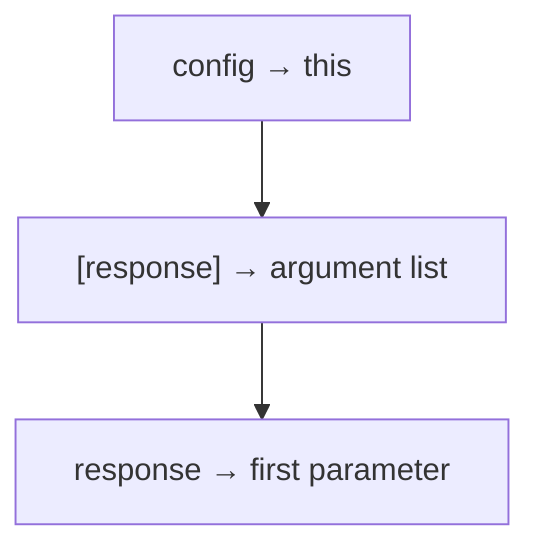

Распространённая ошибка: поставить array with data на место объект выполнения.

Связь с Automation QA: config object и actual data должны занимать разные позиции.

---

## QA-задачи

### Задание 10

Решение:

```javascript
function validateResponse(status, path, body) {
  return status === this.expectedStatus &&
    path === this.expectedPath &&
    body !== '';
}

const config = {
  expectedStatus: 200,
  expectedPath: '/users'
};

const responseParts = [200, '/users', '{"name":"Anna"}'];

console.log(validateResponse.apply(config, responseParts));
```

Результат:

```text
true
```

Объяснение: объект выполнения содержит expected значения, array содержит actual значения.

Распространённая ошибка: хранить expected и actual значения в одном object без явного разделения ролей.

Связь с Automation QA: это типичная структура reusable API validator.

---

### Задание 11

Решение:

```javascript
function formatRequest(method, path, body) {
  return method + ' ' + this.baseUrl + path + ' ' + body;
}

const usersApi = {
  baseUrl: 'https://users.example.test'
};

const ordersApi = {
  baseUrl: 'https://orders.example.test'
};

const createUserRequest = ['POST', '/users', '{"name":"Anna"}'];
const createOrderRequest = ['POST', '/orders', '{"id":1}'];

console.log(formatRequest.apply(usersApi, createUserRequest));
console.log(formatRequest.apply(ordersApi, createOrderRequest));
```

Результат:

```text
POST https://users.example.test/users {"name":"Anna"}
POST https://orders.example.test/orders {"id":1}
```

Объяснение: same function, different объект выполнения and different arrays with arguments.

Распространённая ошибка: использовать один config для разных services.

Связь с Automation QA: request builders часто получают service config и prepared request data.

---

## Мини-проект

### Задание 12

Решение:

```javascript
function buildRequest(method, path, body) {
  return method + ' ' + this.baseUrl + path + ' ' + body;
}

function validateRequest(status, path, body) {
  return status === this.expectedStatus &&
    path === this.expectedPath &&
    body !== '';
}

const apiConfig = {
  baseUrl: 'https://api.example.test'
};

const assertionConfig = {
  expectedStatus: 200,
  expectedPath: '/users'
};

const requestParts = ['POST', '/users', '{"name":"Anna"}'];
const responseParts = [200, '/users', '{"name":"Anna"}'];

console.log(buildRequest.apply(apiConfig, requestParts));
console.log(validateRequest.apply(assertionConfig, responseParts));
```

Результат:

```text
POST https://api.example.test/users {"name":"Anna"}
true
```

Сопоставление:

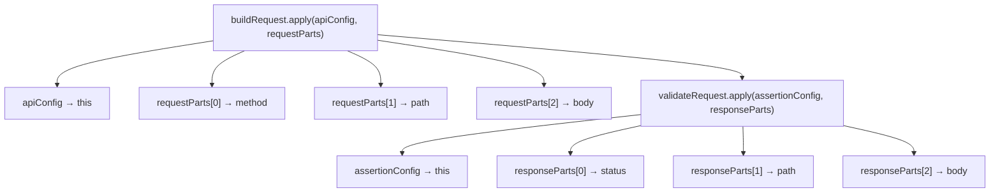

Почему `apply()` удобен: arguments уже представлены arrays.

Где `call()` был бы читаемее: если `method`, `path`, `body` уже лежат в отдельных variables.

Почему объект выполнения handling не отличается от `call()`: первый argument в обоих methods становится `this`.

Распространённая ошибка: воспринимать `apply()` как механизм объект выполнения, а не как механизм передачи ordered argument list.

Связь с Automation QA: mini-project показывает request builder и validator, работающие с configuration objects и test data arrays.

Возможное улучшение: следующая глава `bind()` покажет, как создать reusable function с заранее выбранным объект выполнения.
