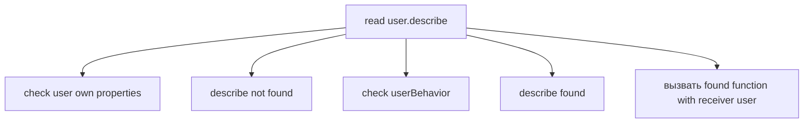
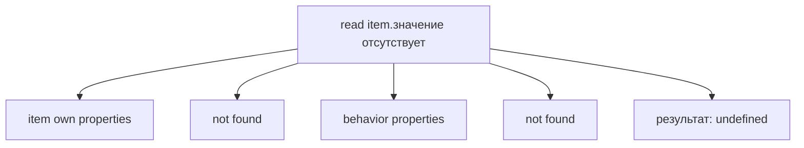

# Решения: Prototype

## 1. Концептуальные вопросы

### 1.1 Why is общее поведение useful?

**Ответ:** общее поведение позволяет хранить один общий method вместо множества одинаковых copies.

**Объяснение:** если 100 objects use same поведение, удобнее изменить поведение в одном месте.

**Распространённая ошибка:** думать только об экономии памяти. Важнее maintainability and consistency.

**Связь с Automation QA:** Page Objects, API clients and validators часто имеют разные data, но одинаковые actions.

### 1.2 Почему duplicated methods become a maintenance problem?

**Ответ:** каждый duplicated method must be updated separately.

**Объяснение:** если logic changes, one missed copy can create inconsistent поведение.

**Распространённая ошибка:** считать duplication harmless because code still runs.

**Связь с Automation QA:** одинаковые validators in tests can diverge and produce flaky or misleading results.

### 1.3 Что такое prototype object?

**Ответ:** prototype object is an object used as shared source of properties.

**Объяснение:** when property is missing on object, JavaScript can look in its prototype.

**Распространённая ошибка:** define prototype primarily as class or inheritance mechanism.

**Связь с Automation QA:** shared framework поведение can be modeled as shared object.

### 1.4 Чем own property отличается от inherited property?

**Ответ:** own property is stored directly on object; inherited property is found through prototype lookup.

**Объяснение:** inherited property is available to object but not copied into it.

**Распространённая ошибка:** think lookup copies property into object.

**Связь с Automation QA:** Page Object may have own locator data and inherited shared actions.

### 1.5 Где JavaScript ищет property сначала?

**Ответ:** inside object itself, among own properties.

**Объяснение:** own properties have priority in lookup.

**Распространённая ошибка:** expect prototype method to override own method automatically.

**Связь с Automation QA:** local test object settings can override shared defaults.

### 1.6 Что происходит, если property не найдена directly on object?

**Ответ:** JavaScript checks prototype.

**Объяснение:** this is prototype lookup. If property is not found there either, result can become `undefined` in this one-level model.

**Распространённая ошибка:** assume missing property immediately becomes `undefined`.

**Связь с Automation QA:** a helper may use a shared method even if the method is not visible directly in object literal.

### 1.7 Почему Prototype не стоит объяснять primarily as inheritance?

**Ответ:** because the first practical problem is sharing поведение, not class hierarchy.

**Объяснение:** inheritance is a later architectural layer. Prototype begins with property lookup and общее поведение.

**Распространённая ошибка:** start from classes and lose the mechanism.

**Связь с Automation QA:** framework code is easier to understand when общее поведение is separated from object-specific data.

### 1.8 Почему per-object состояние обычно должен быть own property?

**Ответ:** потому что per-object состояние относится к конкретному объекту.

**Объяснение:** prototype общий. Если положить туда изменяемые user-specific данные, принадлежность станет неясной.

**Распространённая ошибка:** store `currentUser`, `lastResponse` or `lastAction` in shared объект поведения.

**Связь с Automation QA:** shared mutable состояние is a common cause of flaky tests.

### 1.9 Что возвращает `Object.getPrototypeOf(object)`?

**Ответ:** it returns prototype object linked to `object`.

**Объяснение:** this lets you inspect the shared объект поведения.

**Распространённая ошибка:** expect it to return object's own properties.

**Связь с Automation QA:** useful for debugging framework objects and unexpected shared methods.

### 1.10 Почему `__proto__` не нужен для основной model?

**Ответ:** because the core idea can be understood through object, prototype and lookup.

**Объяснение:** `__proto__` is a detail of accessing prototype relation, not the reason Prototype exists.

**Распространённая ошибка:** start learning from `__proto__` and miss общее поведение.

**Связь с Automation QA:** practical debugging benefits more from understanding lookup than from memorizing special access forms.

---

## 2. Identify own property

### 2.1

**Ответ:**

* Own properties of `user`: `name`, `role`.
* `describe` находится in `userBehavior`.
* `describe` is not copied into `user`.

**Объяснение:** `Object.setPrototypeOf(user, userBehavior)` connects user to prototype object. Lookup can find `describe`, but property remains on prototype.

**Распространённая ошибка:** think inherited method becomes own method after first use.

**Связь с Automation QA:** Page Object instance can use shared methods without storing each method directly.

### 2.2

**Ответ:**

* Own data: `baseUrl`.
* Shared поведение: `describeRequest(endpoint)`.
* Prototype for `apiClient`: `apiBehavior`.

**Объяснение:** `baseUrl` differs per client. `describeRequest` can be reused.

**Распространённая ошибка:** put `baseUrl` into shared объект поведения and accidentally share environment состояние.

**Связь с Automation QA:** API clients usually have own configuration and shared request helpers.

---

## 3. Identify inherited property

### 3.1

**Ответ:**

* `name` is own.
* `describePage` is inherited.
* `loginPage.describePage()` reads `loginPage.name` through `this`.

**Объяснение:** method location and объект выполнения are different concepts. Method is found in prototype; объект выполнения is `loginPage` during ordinary invocation.

**Распространённая ошибка:** think `this` becomes `pageBehavior` because method is stored there.

**Связь с Automation QA:** shared Page Object action can operate on each concrete page instance.

### 3.2

**Ответ:**

* `testRun.status` is `'local'`.
* Own `status` is read first.
* It is not a Prototype Chain question because lookup stops at the object after finding own property.

**Объяснение:** own properties have priority over prototype properties.

**Распространённая ошибка:** expect prototype value to override own value.

**Связь с Automation QA:** test-specific config can override shared defaults.

---

## 4. Property lookup

### 4.1

**Ответ:**



**Объяснение:** `describe` is inherited through prototype lookup, but `this` inside ordinary call is `user`.

**Распространённая ошибка:** separate lookup from invocation poorly and assume `this` points to prototype.

**Связь с Automation QA:** shared validator methods can read instance-specific expected/actual значения.

### 4.2

**Ответ:**



**Объяснение:** in this one-level model there is no matching own or prototype property.

**Распространённая ошибка:** expect JavaScript to throw on every missing property. Simple property read returns `undefined`.

**Связь с Automation QA:** missing optional поля in response objects often produce `undefined`; assertions must account for that.

---

## 5. Предскажите результат выполнения

### 5.1

**Ответ:**

```text
Anna:admin
true
```

**Объяснение:** `describe` is found in prototype. `this` is `user`, so method reads `user.name` and `user.role`. `Object.getPrototypeOf(user)` returns `поведение`.

**Распространённая ошибка:** expect `this.name` to be `undefined` because `поведение` has no `name`.

**Связь с Automation QA:** общее поведение reads concrete client or page data through объект выполнения.

### 5.2

**Ответ:**

```text
own status
```

**Объяснение:** own property `status` exists on `object`, so lookup does not need prototype `status`.

**Распространённая ошибка:** assume prototype value has higher priority.

**Связь с Automation QA:** local runtime status can override shared default status.

### 5.3

**Ответ:**

```text
true
Kate
```

**Объяснение:** both objects find the same `describe` function object in the same prototype. During `secondUser.describe()`, объект выполнения is `secondUser`, so `this.name` is `'Kate'`.

**Распространённая ошибка:** think each object gets its own method copy.

**Связь с Automation QA:** many Page Objects can use same shared action function with different page-specific data.

---

## 6. Задания на отладку

### 6.1

**Ответ:** вывод is:

```text
local method
```

**Объяснение:** `user` has own `describe`. Lookup finds own property first and stops before prototype.

**Распространённая ошибка:** expect prototype method to win over own property.

**Связь с Automation QA:** page-specific method can override shared framework поведение if it is defined directly on object.

**Возможное улучшение:** remove own `describe` if общее поведение should be used.

### 6.2

**Ответ:**

```text
login
none
```

**Объяснение:** `setAction` is found in prototype. During `user.setAction('login')`, `this` is `user`. Assignment `this.lastAction = action` creates or updates own property on `user`, while `поведение.lastAction` remains `'none'`.

**Распространённая ошибка:** think assignment inside prototype method always changes prototype object.

**Связь с Automation QA:** shared methods can update instance-specific состояние if объект выполнения is the concrete object.

**Возможное улучшение:** инициализировать `lastAction` как own property на `user`, чтобы принадлежность была явной.

### 6.3

**Ответ:**

```javascript
const behavior = {
  describe() {
    return `${this.name} [${this.role}]`;
  }
};
```

**Объяснение:** `name` and `role` without `this` are variable lookups, not property reads from объект выполнения. Shared method should read data from current объект выполнения.

**Распространённая ошибка:** forget that shared method does not automatically receive object поля as variables.

**Связь с Automation QA:** shared helper methods must read instance/client/page data through explicit объект выполнения or parameters.

**Возможное улучшение:** keep shared method small and name поля clearly.

---

## 7. QA-задачи

### 7.1

**Ответ:**

```javascript
const apiClientBehavior = {
  describeRequest(endpoint) {
    return `${this.baseUrl}${endpoint}`;
  }
};

const stagingClient = {
  baseUrl: 'https://staging.example.test'
};

const productionClient = {
  baseUrl: 'https://api.example.test'
};

Object.setPrototypeOf(stagingClient, apiClientBehavior);
Object.setPrototypeOf(productionClient, apiClientBehavior);

console.log(stagingClient.describeRequest('/users'));
console.log(productionClient.describeRequest('/users'));
```

**Объяснение:** `baseUrl` is own per client. `describeRequest` is общее поведение.

**Распространённая ошибка:** duplicate `describeRequest` in every client.

**Связь с Automation QA:** this model fits API clients for different environments.

**Возможное улучшение:** later classes or factory functions can create these objects more ergonomically.

### 7.2

**Ответ:**

```javascript
const pageBehavior = {
  describePage() {
    return `Page: ${this.name}`;
  }
};

const loginPage = {
  name: 'LoginPage'
};

const profilePage = {
  name: 'ProfilePage'
};

Object.setPrototypeOf(loginPage, pageBehavior);
Object.setPrototypeOf(profilePage, pageBehavior);

console.log(loginPage.describePage());
console.log(profilePage.describePage());
console.log(loginPage.describePage === profilePage.describePage);
```

**Объяснение:** both pages use same method from `pageBehavior`.

**Распространённая ошибка:** store all page-specific locators in prototype вместо on each page object.

**Связь с Automation QA:** Page Objects share actions but keep page-specific состояние.

**Возможное улучшение:** use a clearer object creation pattern after learning classes.

### 7.3

**Ответ:** Prototype model explains how общее поведение can be available to many objects.

**Объяснение:** even if production code uses classes, the underlying mental model still involves objects, shared methods and lookup.

**Распространённая ошибка:** think classes remove the need to understand prototypes.

**Связь с Automation QA:** debugging Page Object methods often requires knowing where method comes from.

**Возможное улучшение:** revisit this answer after Classes chapter.

### 7.4

**Ответ:**

Own properties:

```text
baseUrl
token
timeout
clientName
```

Shared поведение:

```text
buildUrl()
describeRequest()
validateStatus()
formatError()
```

**Объяснение:** configuration differs between clients; request поведение can be reused.

**Распространённая ошибка:** put environment-specific состояние in shared объект поведения.

**Связь с Automation QA:** prevents tests for staging and production from accidentally sharing mutable data.

**Возможное улучшение:** use immutable config objects for environment-specific data.

---

## 8. Мини-проект

**Ответ:**

```javascript
const validatorBehavior = {
  describeExpectation() {
    return `Expected: ${this.expected}`;
  },
  describeActual() {
    return `Actual: ${this.actual}`;
  }
};

const statusValidator = {
  expected: 200,
  actual: 201
};

const roleValidator = {
  expected: 'admin',
  actual: 'viewer'
};

Object.setPrototypeOf(statusValidator, validatorBehavior);
Object.setPrototypeOf(roleValidator, validatorBehavior);

console.log(statusValidator.describeExpectation());
console.log(statusValidator.describeActual());

console.log(roleValidator.describeExpectation());
console.log(roleValidator.describeActual());

console.log(Object.getPrototypeOf(statusValidator) === validatorBehavior);
console.log(Object.getPrototypeOf(roleValidator) === validatorBehavior);
```

Возможный вывод:

```text
Expected: 200
Actual: 201
Expected: admin
Actual: viewer
true
true
```

**Объяснение:** `expected` and `actual` are own properties because they differ per validator. `describeExpectation()` and `describeActual()` are shared because formatting logic is the same.

**Распространённая ошибка:** duplicate both methods in every validator object.

**Связь с Automation QA:** validators in a test framework often share reporting поведение while keeping expected/actual значения per assertion.

**Возможное улучшение:** add more shared methods later, for example `describeMismatch()`, after learning more object patterns.
