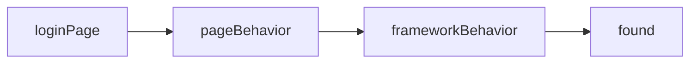
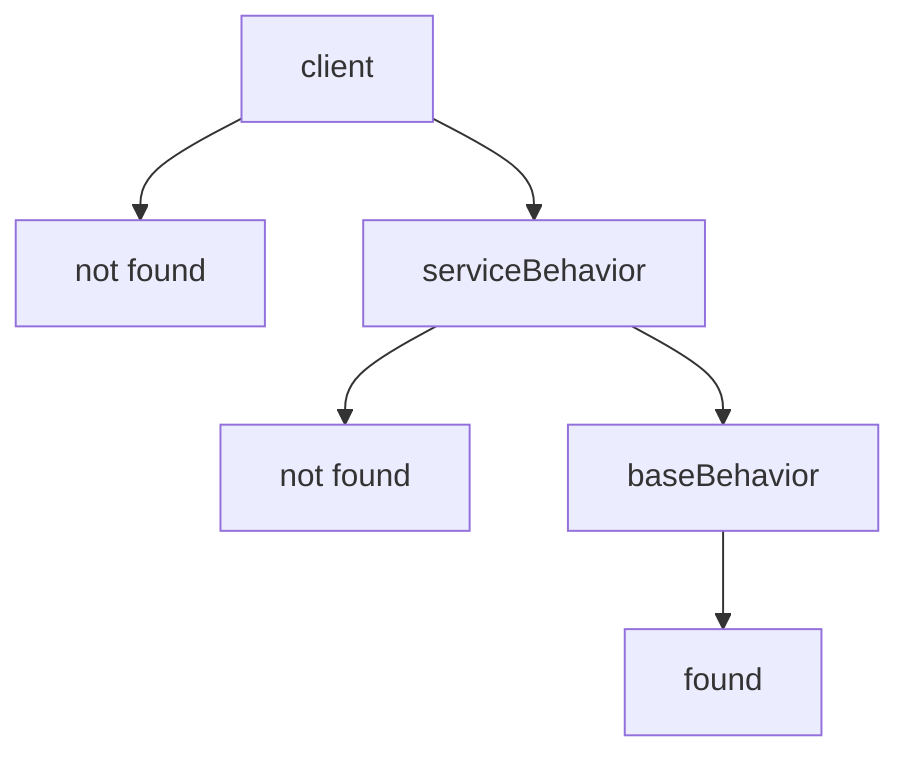
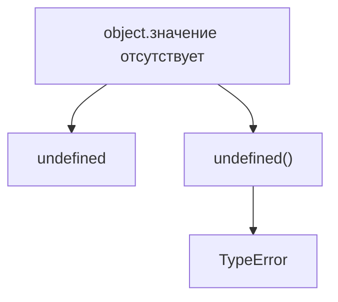
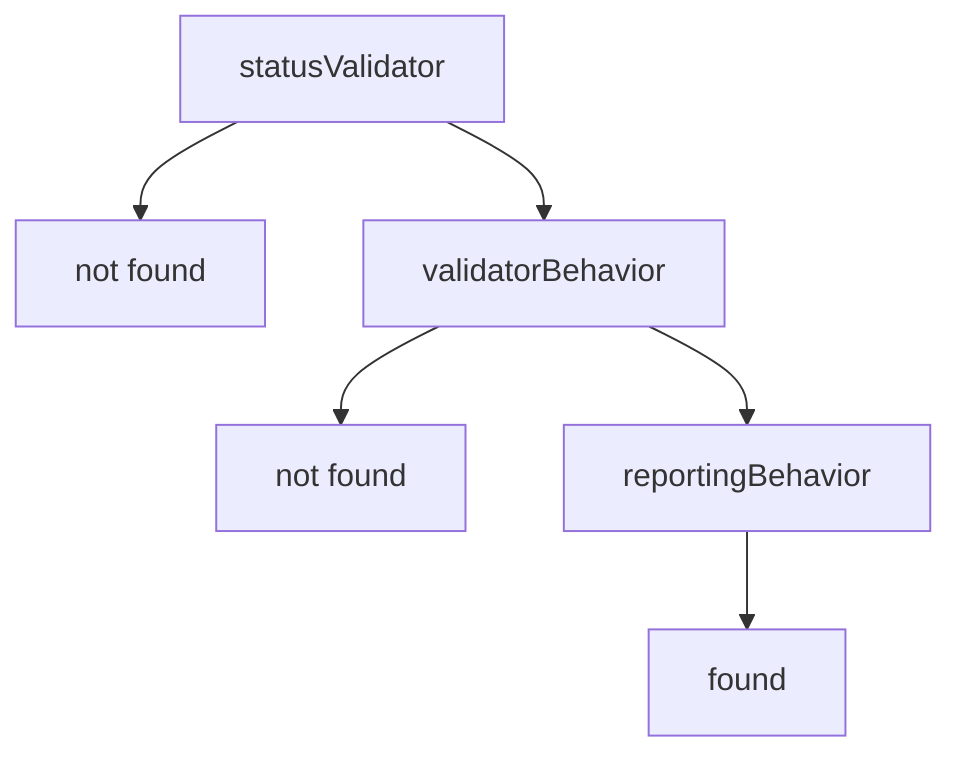

# Решения: Prototype Chain

## 1. Концептуальные вопросы

### 1.1 What problem does Prototype Chain solve?

**Ответ:** it answers where JavaScript continues searching if property is not found on object or first prototype.

**Объяснение:** lookup can repeat through several prototype levels.

**Распространённая ошибка:** think JavaScript checks only one prototype.

**Связь с Automation QA:** framework helpers may find methods through several общее поведение layers.

### 1.2 Why is Prototype Chain a lookup algorithm, not an inheritance hierarchy?

**Ответ:** because it describes the order of property search.

**Объяснение:** design inheritance is an architectural topic. Prototype Chain here is about "where does lookup go next?"

**Распространённая ошибка:** start from class hierarchy and miss actual property lookup.

**Связь с Automation QA:** debugging Page Objects requires knowing where method was found, not drawing class diagrams first.

### 1.3 Where does property lookup start?

**Ответ:** on the current object.

**Объяснение:** own properties have first priority.

**Распространённая ошибка:** expect prototype property to be checked first.

**Связь с Automation QA:** test-specific object data can override shared defaults.

### 1.4 What happens when property is found on current object?

**Ответ:** lookup stops and JavaScript uses that property.

**Объяснение:** closer property wins.

**Распространённая ошибка:** think JavaScript still checks farther prototypes and сравнивает значения.

**Связь с Automation QA:** local helper method can override общее поведение.

### 1.5 What happens when property is not found on current object?

**Ответ:** JavaScript moves to the next prototype.

**Объяснение:** this step repeats until property is found or chain ends.

**Распространённая ошибка:** expect immediate `undefined` after current object miss.

**Связь с Automation QA:** API client methods can come from service-level or framework-level поведение.

### 1.6 Why does JavaScript stop searching?

**Ответ:** because property is found or chain reaches its end.

**Объяснение:** lookup has both a success stop and a final stop.

**Распространённая ошибка:** think JavaScript searches unrelated objects.

**Связь с Automation QA:** only linked framework layers participate in lookup.

### 1.7 What is shadowing?

**Ответ:** shadowing is when closer property hides farther property with same name.

**Объяснение:** own `status` wins over prototype `status`.

**Распространённая ошибка:** think the farther property is removed.

**Связь с Automation QA:** local environment config may shadow shared default config.

### 1.8 Why does own property win over inherited property?

**Ответ:** because lookup starts on current object and stops when found.

**Объяснение:** inherited property is checked only if own property is missing.

**Распространённая ошибка:** expect inherited defaults to override local значения.

**Связь с Automation QA:** test-specific значения should naturally override framework defaults.

### 1.9 What role does `Object.prototype` play?

**Ответ:** it is near the end of many ordinary object chains.

**Объяснение:** if property is not found earlier, lookup can reach `Object.prototype`.

**Распространённая ошибка:** begin learning chain from `Object.prototype` вместо lookup problem.

**Связь с Automation QA:** understanding it helps explain why ordinary objects share some base поведение.

### 1.10 Why can deep chains hurt readability?

**Ответ:** because it becomes harder to know where property was found.

**Объяснение:** every extra level adds a lookup place to inspect.

**Распространённая ошибка:** treat deeper chain as more advanced design.

**Связь с Automation QA:** deep helper chains can make failed assertions harder to debug.

---

## 2. Identify lookup order

### 2.1

**Ответ:**

`loginPage.name`:


`loginPage.describePage`:


`loginPage.formatError`:



`loginPage.missingProperty`:


**Объяснение:** lookup starts from current object and continues through linked prototypes.

**Распространённая ошибка:** skip `pageBehavior` and jump straight to `frameworkBehavior`.

**Связь с Automation QA:** this is exactly how layered Page Object поведение can be debugged.

### 2.2

**Ответ:** `client.format` is found in `baseBehavior`.

**Объяснение:**



**Распространённая ошибка:** think empty `serviceBehavior` stops lookup.

**Связь с Automation QA:** intermediate framework layers can be empty for some methods and still pass lookup upward.

---

## 3. Identify own vs inherited property

### 3.1

**Ответ:**

* Own property: `testRun.status`.
* Inherited property: `describeStatus`.
* Winning `status`: own `'local'`.

**Объяснение:** `describeStatus` is found in prototype, but `this.status` starts lookup from объект выполнения `testRun`, so own `status` wins.

**Распространённая ошибка:** expect `this.status` to read from `поведение`.

**Связь с Automation QA:** shared validator methods read concrete assertion состояние from объект выполнения.

### 3.2

**Ответ:**

* `validator.name`: own.
* `validator.isValid`: inherited from `validatorBehavior`.
* `validator.formatFailure`: inherited through `validatorBehavior` from `reportingBehavior`.

**Объяснение:** lookup may continue past first prototype.

**Распространённая ошибка:** classify all callable methods as own methods.

**Связь с Automation QA:** validators can have own data and shared validation/reporting поведение.

---

## 4. Предскажите результат выполнения

### 4.1

**Ответ:**

```text
first
```

**Объяснение:** `object` has no `value`, so lookup goes to `first`. `first.value` exists, so lookup stops before `second`.

**Распространённая ошибка:** expect `'second'` because it is farther in chain.

**Связь с Automation QA:** nearest config layer wins over base defaults.

### 4.2

**Ответ:**

```text
page
```

**Объяснение:** `describe` is found in `pageBehavior`, so `frameworkBehavior.describe` is shadowed.

**Распространённая ошибка:** think framework-level поведение always wins.

**Связь с Automation QA:** page-specific поведение can override generic framework поведение.

### 4.3

**Ответ:**

```text
local
```

**Объяснение:** method is found in prototype, but ordinary invocation объект выполнения is `object`; `this.name` reads from `object`.

**Распространённая ошибка:** confuse method location with объект выполнения.

**Связь с Automation QA:** shared methods act on concrete Page Object or API client instance.

---

## 5. Задания на отладку

### 5.1

**Ответ:** вывод is:

```text
admin
```

**Объяснение:** own `role` exists on `user`, so lookup stops before `sharedBehavior.role`.

**Распространённая ошибка:** expect prototype defaults to override local data.

**Связь с Automation QA:** local test data should usually have priority over shared defaults.

### 5.2

**Ответ:**

```javascript
const frameworkBehavior = {
  formatError() {
    return `${this.name}: error`;
  }
};
```

**Объяснение:** `name` without `this` is variable lookup, not property lookup on объект выполнения. The shared method should read from current объект выполнения.

**Распространённая ошибка:** assume object properties automatically become local variables.

**Связь с Automation QA:** shared framework methods must use объект выполнения data explicitly.

### 5.3

**Ответ:** `object.missing` lookup returns `undefined`; then code tries to call `undefined` as a function.

**Объяснение:**



**Распространённая ошибка:** think missing property read itself always throws.

**Связь с Automation QA:** errors often happen one step after lookup, when missing helper is invoked.

---

## 6. QA-задачи

### 6.1

**Ответ:**

```javascript
const frameworkBehavior = {
  formatError() {
    return `${this.name}: error`;
  }
};

const pageBehavior = {
  describePage() {
    return `Page: ${this.name}`;
  }
};

const loginPage = {
  name: 'LoginPage'
};

Object.setPrototypeOf(pageBehavior, frameworkBehavior);
Object.setPrototypeOf(loginPage, pageBehavior);

console.log(loginPage.describePage());
console.log(loginPage.formatError());
```

**Объяснение:** `describePage` is found in first prototype. `formatError` is found in second prototype.

**Распространённая ошибка:** duplicate `formatError` on every page object.

**Связь с Automation QA:** shared reporting поведение can be reused by all Page Objects.

### 6.2

**Ответ:**

```javascript
const frameworkBehavior = {
  describeRequest(endpoint) {
    return `${this.serviceName}: ${this.baseUrl}${endpoint}`;
  }
};

const serviceBehavior = {
  buildEndpoint(id) {
    return `/users/${id}`;
  }
};

const usersClient = {
  serviceName: 'users',
  baseUrl: 'https://api.example.test'
};

Object.setPrototypeOf(serviceBehavior, frameworkBehavior);
Object.setPrototypeOf(usersClient, serviceBehavior);

const endpoint = usersClient.buildEndpoint('42');

console.log(usersClient.describeRequest(endpoint));
```

**Объяснение:** own data lives on `usersClient`; service поведение is one level up; generic framework поведение is another level up.

**Распространённая ошибка:** put `baseUrl` into общее поведение and accidentally share environment состояние.

**Связь с Automation QA:** API client layers often separate config, service actions and framework helpers.

### 6.3

**Ответ:** deep chains make it harder to find method source and understand override rules.

**Объяснение:** each level can contain property with same name.

**Распространённая ошибка:** think more levels means better reuse.

**Связь с Automation QA:** deep Page Object inheritance-style structures often make test failures harder to diagnose.

### 6.4

**Ответ:** JavaScript stops when property is found or when the chain ends.

**Объяснение:** lookup has deterministic stopping rules.

**Распространённая ошибка:** think lookup searches all objects in memory.

**Связь с Automation QA:** only linked helper layers participate in method lookup.

---

## 7. Мини-проект

**Ответ:**

```javascript
const reportingBehavior = {
  formatFailure() {
    return `${this.name}: expected ${this.expected}, actual ${this.actual}`;
  }
};

const validatorBehavior = {
  isValid() {
    return this.expected === this.actual;
  }
};

const statusValidator = {
  name: 'StatusValidator',
  expected: 200,
  actual: 201
};

const roleValidator = {
  name: 'RoleValidator',
  expected: 'admin',
  actual: 'viewer'
};

Object.setPrototypeOf(validatorBehavior, reportingBehavior);
Object.setPrototypeOf(statusValidator, validatorBehavior);
Object.setPrototypeOf(roleValidator, validatorBehavior);

console.log(statusValidator.isValid());
console.log(statusValidator.formatFailure());

console.log(roleValidator.isValid());
console.log(roleValidator.formatFailure());
```

Возможный вывод:

```text
false
StatusValidator: expected 200, actual 201
false
RoleValidator: expected admin, actual viewer
```

Lookup for `statusValidator.formatFailure`:



**Объяснение:** validation and reporting поведение are separated into two shared layers.

**Распространённая ошибка:** expect `formatFailure` to be found in `validatorBehavior`.

**Связь с Automation QA:** assertion frameworks often separate validation logic from reporting/error formatting.

**Возможное улучшение:** keep the chain shallow and document where общее поведение lives.
